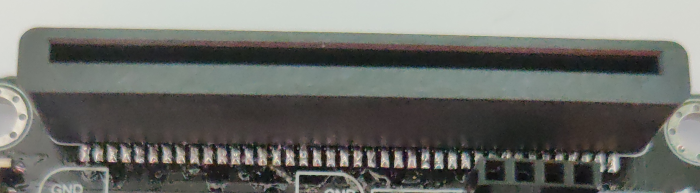
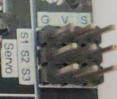
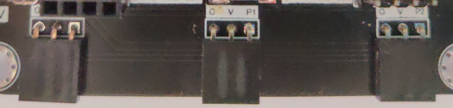

# Detail Hardware Description

## Mirco:bit edge connecter

Provide the socket for the Micro:bit to install. Follow the instruction icon right about that to install the Micro:bit to the expansion board.

## Power port(USB, Battery, DC) & Switch

Provide three different type of methods to power on the expansion board and Mirco:bit. User can either choose common 5V USB power, or two different port which connect to 3.7V ~ 6V battery box. 

## OLED Module

The expansion board have the reserved space to place a SSD1306 0.96 inch OLED screen. User can use the I2C connection port to output the visual element on that module.

## Wireless Module

The Wireless Module provide the Core function of the expansion board. Though different modules install on the socket, Mirco:bit gain the correspond connectivity ability. User may install ESP32, ESP8266, Bluetooth to implement various application project, make use of the IoT resource.

## ESP Servo port

When installed the ESP32 module, it provide extra 3 servo control port to connect the Servo motor. Compatible with general GVS 180/360 Servo motor (SG90/SG90S)

## Micro:bit lead out Pins

The Lead Out from the Mirco:bit I/O pins, provide great expansion feature for the Mirco:bit , user can connect up to 13 different sensor/actuator at the same time. Each independent GVS socket make the connection become more connivance. 

## Buzzer & Switch

The IoT Bit built-in a Passive Buzzer on the board, which connected to P0. Using the program can generate different tone of sound. With the switch, it can have manual control to the audio.

## QuickAccess GVS connecter

To some GVS sensor which provide the Quick Insert Pin, it can use on the QuickAccess GVS connecter. It do not need to use the cable to connect the sensor, simplify the product in the application.

## Distance Sensor port

On the IoT Bit, a port is reserved for the HC-SR04 Distance Sensor. Whether use multi separate cable to connect two data pin, user can use a 4 pin connection cable to join the sensor and Mirco:bit. The two data pins in this port is p14 and p15 respectively.

## Motor port

Beside the 3pin single direction DC motor, IoT Bit is compatible with the 4pin bi-direction dc motor. User can use a 4pin connection cable to control the 4pin motor.
The two data pins in this port is p12 and p13 respectively. 

