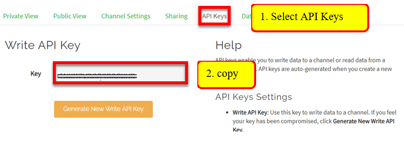
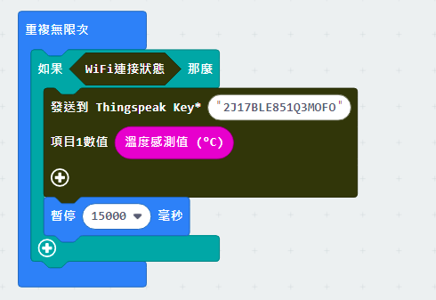
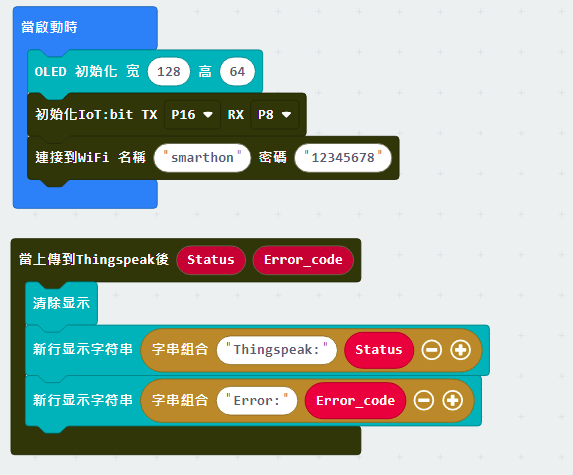

# 章節1: 上載數據到ThingSpeak

ThingSpeak是一個IoT平台供使用者收集及整理實時數據。通過設定不同的頻道，能夠對不同類別的數據進行統計及用現覺方式顯示，方便進行分析數據，提取資訊。

ThingSpeak支援多種不同的裝置及平台，例如電腦、智能電話、以及IoT:bit。當在項目中使用IoT:bit時，Micro:bit就可以輕易地把取得的數據(如溫度、濕度、亮度、嘈音、雨水、距離等)上載到ThingSpeak，讓使用者或他人都能夠遙距監控裝置所在環境的情況。
 

## ThingSpeak設定

<H3>目標:</H3> 我們需要先建立一個頻道及取得頻道的密鑰

第一步驟

前往[https://thingspeak.com/](https://thingspeak.com/)， 註冊一個帳號用來登入。 

第二步驟

登入後，選擇頻道->我的頻道->建立新頻道。 

第三步驟

分別輸入頻道名稱，資料"類別"，然後儲存。 
例如: 
名稱:智能家居 
Field1: 溫度 

第四步驟

看到ThingSpeak提供一個圖表用來表示溫度。  

第五步驟

切換到 'API Keys' ， 取得用於輸入資料的密鑰，記下 

## 編程(Makecode)

第一步驟

在上載數據到ThingSpeak前，需要先連接上Wi-Fi。 

第二步驟

在設定ThingSpeak上載時，需要注意每次上載需間隔15秒。 

* 添加一個如果..否則的條件式用以檢查是否已連上Wi-Fi
* 然後在ThingSpeak上載的區塊那密鑰填入剛才記下的ThingSpeak密鑰
* 之後選擇需要上載的數值，放進對應的域
* 添加一個15秒的等待

第三步驟

如需知道上載的情況，能夠使用 'ThingSpeak上載事件處理器' 取得回傳的結果。配合上OLED顯示屏就能夠輕鬆知悉上載成功或是錯誤狀態。 

* 事前先初始化OLED顯示屏(128x64像素)
* 在事件處理器中用OLED顯示出回傳的狀態或錯誤碼
* 為了正常顯示，需要在每次顯示前清除之前的畫面
 

完整答案 

MakeCode: [https://makecode.microbit.org/_Dgh5iF8C52Ha](https://makecode.microbit.org/_Dgh5iF8C52Ha) 

你可以在以下網頁下載HEX檔案: 
<iframe src="https://makecode.microbit.org/#pub:_Dgh5iF8C52Ha" width="100%" height="500" frameborder="0"></iframe>

## 結果

在連接上網絡後，程式就會開始自動上載數據到ThingSpeak。

在每一次的上傳完成後，都會在OLED上顯示狀態及錯誤碼。 
在正常的情況，狀態會是 `OK` 及錯誤碼 `0` 。 

如果無法成功上載數據，狀態將會顯示為 `FAIL`，以及有不同的錯誤碼。 
* 若錯誤碼為`400`，為輸入了錯誤的密鑰。
* 若錯誤碼為`-28674`，為沒有網絡連接。

成功上載後，在ThingSpeak頻道上的圖表會更新

