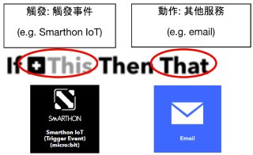
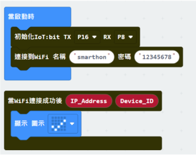
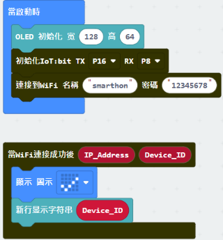
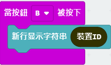
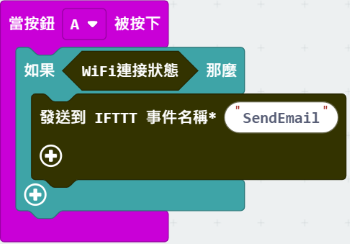
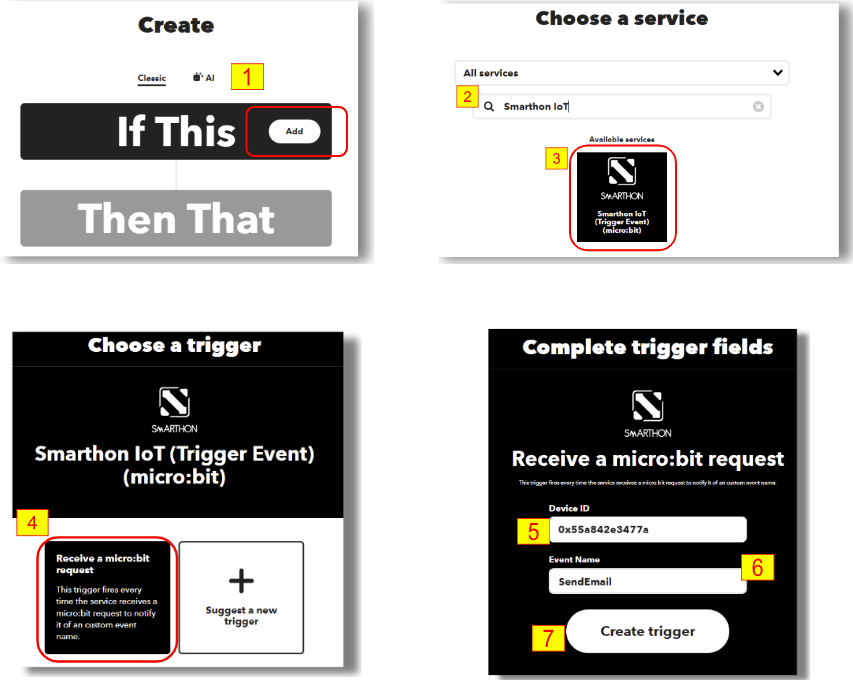
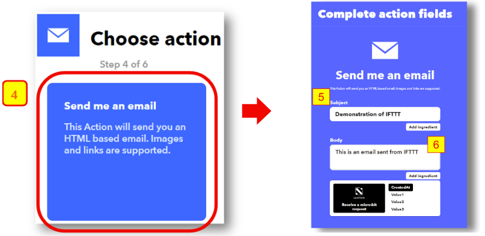

# 章節2: 利用IFTTT傳送電郵

IFTTT平台提供一個整合的地方讓裝置和服務連結在一起，像Twitter、Dropbox、 電郵、Google助理等。使用者只需要用基本的編程邏輯 '如果...否則' ， 即可通過平台提供的API，在適當的時候使用各種服務。

在IFTTT裡，使用時需要先建立一個 'Applet' ，在裡面連接上指定的服務API。例如，選擇 'Webhooks' 來接收micro:bit的訊息來作為觸發器，選擇 '電郵' 作為需要運行的服務。透過IFTTT平台這一幫助，就能夠讓Micro:bit做到發送電郵到指定郵箱的行為，而不需要擔心受限於Micro:bit的擴展而難以做到的事。 

在這章節，你將會學習到如何讓Micro:bit完成webhooks的觸發，以及如何在IFTTT上佈置服務。 

## 編程(Makecode)

第一步驟:連接Wi-Fi 

在使用互聯網控制功能之前，需要先確保已連接上網絡  

第二步驟:取得ID 

『當Wifi連接後』 是一個事件處理器.當連接上Wi-Fi後，這個處理器會把取得的`IP地址`及`裝置的ID`都以變量的形式提供。因此可以利用這來取得裝置的ID來進行互聯網控制。 

* 初始化OLED顯示屏
* 在`當Wifi連接後` 裡添加`顯示字符串`，並把ID放進去

 

\*如你害怕忘記了ID，亦可以在互聯網控制那分頁取得`裝置ID`，並按需要在某時候顯示出來

第三步驟: 發送請求到IFTTT 

當我們需要發送指令IFTTT時, 先確認`WiFi連接狀態`, 再按A按鈕將數據發送至IFTTT。在`發送IFTTT 事件名稱 \*`區塊中輸入觸發Trigger事件的事件名稱(例如:SendEmail) 
 

* `發送IFTTT 事件名稱`: 設定了在觸發Trigger事件中的事件名稱(例如:SendEmail)
* `數值1-3`: 如果有需要上載數值到IFTTT，可以在這一拼上傳

第四步驟: 確認IFTTT上載情況 

如果想知道上載到IFTTT的情況，可以使用 `當上傳到IFTTT後` 事件處理器來監測，使用OLED來顯示結果會是一種好方法。 

* 放置`當上傳到IFTTT後` 
* 把`顯示字符串`拖放到`當上傳到IFTTT後`來把Status及錯誤碼顯示出來 

完整答案 

MakeCode: [https://makecode.microbit.org/_ED81FTbhF16m](https://makecode.microbit.org/_ED81FTbhF16m) 

你可以在以下網頁下載HEX檔案: 
<iframe src="https://makecode.microbit.org/_ED81FTbhF16m" width="100%" height="500" frameborder="0"></iframe>

## IFTTT配置

<H3>目標:</H3>
配置Applet小程式

第一步驟 

前往 [http://www.ifttt.com](http://www.ifttt.com)， 註冊一個帳號以登入 

第二步驟 

到右上角的菜單，點擊Create->Applet 

第三步驟 

* 選擇“This”
* 從選單中選擇“Smarthon IoT”。
* 輸入設備ID, 例如: 0x55a842e3477a (見編程部份第一步得到Device ID)
* 輸入事件名稱: SendEmail
* 點擊“Create trigger”按鈕。
  

 

第四步驟 

在That那裡選擇“email” 

 
第五步驟 

選擇“Send me an email” ，輸人電郵想要的標題及內容，點擊Create action. 

## 結果

當Micro:bit連接上Wi-Fi後，按A按鈕會發送訊息到IFTTT。 

如果發送成功，OLED會顯示 `OK` 及錯誤碼 `0` 

如果發送失敗，剛會顯示 `FAIL` 及相應的錯誤碼。 
* 如錯誤碼為`401`，則為輸入了錯誤的API金鑰
* 如錯誤碼為`-28674`，則為沒有網絡連接

當成功時，你將會在Email裡設定好的郵箱裡收到IFTTT發送的電郵 

