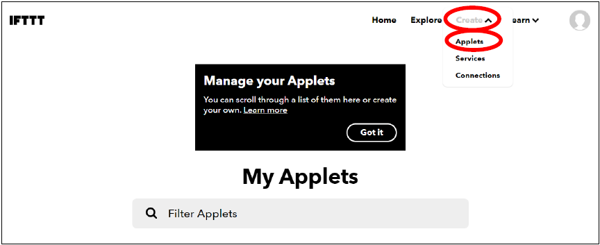
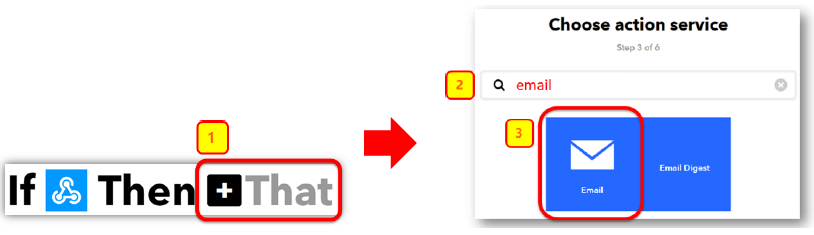

# 章節2: 利用IFTTT傳送電郵

IFTTT平台提供一個整合的地方讓裝置和服務連結在一起，像Twitter、Dropbox、 電郵、Google助理等。使用者只需要用基本的編程邏輯 '如果...否則' ， 即可通過平台提供的API，在適當的時候使用各種服務。

在IFTTT裡，使用時需要先建立一個 'Applet' ，在裡面連接上指定的服務API。例如，選擇 'Webhooks' 來接收micro:bit的訊息來作為觸發器，選擇 '電郵' 作為需要運行的服務。透過IFTTT平台這一幫助，就能夠讓Micro:bit做到發送電郵到指定郵箱的行為，而不需要擔心受限於Micro:bit的擴展而難以做到的事。 

在這章節，你將會學習到如何讓Micro:bit完成webhooks的觸發，以及如何在IFTTT上佈置服務。 

## IFTTT配置

<H3>目標:</H3>
配置Applet小程式及取得Webhooks API

第一步驟 

前往 [http://www.ifttt.com](http://www.ifttt.com)， 註冊一個帳號以登入 

第二步驟 

到右上角的菜單，點擊Create->Applet 

第三步驟 

在This那裡，選擇"Webhooks"，然後輸入想要的觸發事件名稱(例如SendEmail)，點擊Create Trigger  

第四步驟 

在That那裡選擇"email" 

第五步驟 

選擇“Send me an email” ，輸人電郵想要的標題及內容，點擊Create action. 

第六步驟 

回到My services， 點擊Webhooks。  

第七步驟 

點擊 Documentation，記下Webhooks的API金鑰 

## 編程(Makecode)

第一步驟 

在上載訊息到IFTTT之前，需要先確保已經連接上Wi-Fi及網絡。 

第二步驟 

為了確保已經連上網絡，添加一個 '`如果..` 式來檢測是否已經連上 然後在上載到IFTTT的模塊裡輸入以下資料: 
 

* `IFTTT key`: XXXXXXXXXXXXXXXX.(Webhooks API金鑰) 
* `事件名稱`: 在Webhooks中設定過的觸發事件名稱 (例如 SendEmail)
* `數值1-3`:  如果有需要上載數值到IFTTT，可以在這一拼上傳

第三步驟 

如果想知道上載到IFTTT的情況，可以使用 `當上傳到IFTTT後` 事件處理器來監測，使用OLED來顯示結果會是一種好方法。 

* 初始化OLED顯示屏
* 放置 `當上傳到IFTTT後` 
* 把 `顯示字符串` 拖放到 `當上傳到IFTTT後` 來把Status及錯誤碼顯示出來

完整答案 

MakeCode: [https://makecode.microbit.org/_5VWA5wdDT3aT](https://makecode.microbit.org/_5VWA5wdDT3aT) 

你可以在以下網頁下載HEX檔案: 
<iframe src="https://makecode.microbit.org/#pub:_5VWA5wdDT3aT" width="100%" height="500" frameborder="0"></iframe>

## 結果

當Micro:bit連接上Wi-Fi後，按A按鈕會發送訊息到IFTTT。 

如果發送成功，OLED會顯示 `OK` 及錯誤碼 `0` 

如果發送失敗，剛會顯示 `FAIL` 及相應的錯誤碼。 
* 如錯誤碼為`401`，則為輸入了錯誤的API金鑰
* 如錯誤碼為`-28674`，則為沒有網絡連接

當成功時，你將會在Email裡設定好的郵箱裡收到IFTTT發送的電郵 

