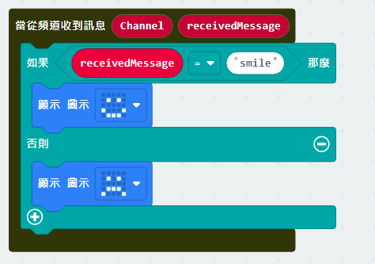
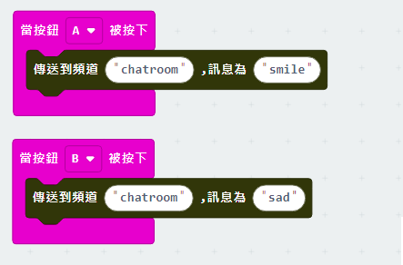
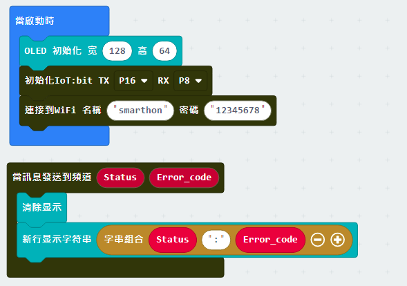

# 章節5: 物件與物件間的溝通

在這章節，Micro:bit們會同時連接到同一個頻道 'chatroom'。 

這個例子中，Peter希望透過互聯網傳送訊息給Sally，因此，他們事先約好連接到同一個頻道 'chatroom'，打算在那裡進行聊天。當Peter發送了一個微笑的訊息後，sally的Micro:bit LED顯示了一個微笑圖案。 

*在進行溝通前，請先確保兩台Micro:bit都連接上互聯網 

 
## 接收端

目標:

接收端需要加入頻道，然後在頻道中讀取訊息並依照訊息來作出反應

第一步驟:連接Wi-Fi 

在使用互聯網控制功能之前，需要先確保已連接上網絡

第二步驟:加入頻道 

我們可以讓Micro:bit加入指定頻道去接收訊息 
* 拖動 `加入到頻道...`到平台上
* 在 `加入到頻道...`中輸入頻道名稱(chatroom)

*<B>最多可以同時加入4條頻道</B>

第三步驟:設定反應 

當程式執行 `加入到頻道...` 後，將會連接到所輸入的頻道，這時候就可以使用 `當從頻道接收到訊息` 來讀取訊息及作出反應

* 拖動 `當從頻道接收到訊息` 到平台
* 如需要接收帶有數值的訊息時，可以同時使用<b>另一個能接收數值的版本</b>
* 添加一個 `如果` 條件式， 在設定條件時，對接收到的訊息進行對比以分辦
* 當接收到的訊息是 `smile` 時， 令LED顯示出微笑圖案 
* 當接收到的訊息不是 `smile` 時，每LED顯示出傷心圖案. 

完整答案 

MakeCode: [https://makecode.microbit.org/_YL7DkAE5JERf](https://makecode.microbit.org/_YL7DkAE5JERf) 

你可以在以下網頁下載HEX檔案: 
<iframe src="https://makecode.microbit.org/#pub:_YL7DkAE5JERf" width="100%" height="500" frameborder="0"></iframe>

<h2>附加功能:</h2>

1.檢查頻道的加入是否成功

在加入頻道時，可以檢查是否已經成功連接及開始監聽。只需要使用 `當加入頻道時` 這功能，就可以知道加入頻道的過程中有沒有發生錯誤。如發生錯誤，則會返回錯誤碼。
* 初始化OLED顯示屏
* 拖動 `當加入頻道時` 到平台
* 把錯誤碼顯示出來

如果錯誤碼為0， 表示沒有問題發生，連接成功 
如果錯誤碼不為0，表示加入失敗 
通常如果沒有網絡連接或是頻道伺服器故障，錯誤碼為-28674

2. 在接收訊息時顯示頻道名稱 

在加入多個頻道時，多個訊息的同時接收容易就成混淆，因此可以利用頻道名稱作區分。
 `當從頻道收到訊息` 有提供頻道名稱變數，只需要把這顯示出來即可輕易分辦出來自那一個頻道。
* 先清除舊畫面以免重疊造成不正常顯示
* 利用 '字串格式' 在OLED上同時顯示出頻道的名稱及訊息內容

完整答案 

MakeCode: [https://makecode.microbit.org/_XvVUvVAiW146](https://makecode.microbit.org/_XvVUvVAiW146) 

你可以在以下網頁下載HEX檔案: 
<iframe src="https://makecode.microbit.org/#pub:_XvVUvVAiW146" width="100%" height="500" frameborder="0"></iframe>

## 發送端

目標: 

 發送端能夠發送訊息到指定頻道
 
第一步驟:連接Wi-Fi 

在使用互聯網控制功能之前，需要先確保已連接上網絡

第二步驟:傳送訊息 

當連接到網絡後，可以開始發送訊息到頻道
* 在 `傳送到頻道...訊息為...`那分別輸入頻道及要發送的訊息
* 若要發送的訊息帶有數值，可以使用 `傳送到頻道...訊息為...數值為...` 

完整答案 

MakeCode: [https://makecode.microbit.org/_Up9itahRmKf6](https://makecode.microbit.org/_Up9itahRmKf6) 

你可以在以下網頁下載HEX檔案: 
<iframe src="https://makecode.microbit.org/#pub:_Up9itahRmKf6" width="100%" height="500" frameborder="0"></iframe>

<h2>附加功能:</h2>

檢查訊息發送狀態:

當發送端在發送訊息時，如果使用 '當訊息發送到頻道' ，就能夠知悉發送的狀態。

* 初始化OLED顯示屏
* 在 `當訊息發送到頻道` 裡加入 `顯示字符串` 
* 把 `Status` 及 `Error_code` 變數顯示出來

如果發送訊息成功，將會取得一個 `OK` 的 Status，以及 `0` 的Error_code。 
如果發送訊息失敗，將會取得一個 `FAIL` 的 Status，以及相應的Error_code。 
通常如果沒有網絡連接或是頻道伺服器故障，錯誤碼為`-28674`

完整答案 

MakeCode: [https://makecode.microbit.org/_9pxXJ5JKMCUV](https://makecode.microbit.org/_9pxXJ5JKMCUV) 

你可以在以下網頁下載HEX檔案: 
<iframe src="https://makecode.microbit.org/#pub:_9pxXJ5JKMCUV" width="100%" height="500" frameborder="0"></iframe>

