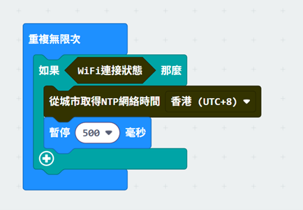

# 章節 6: 網路時間協定

時間同步在數位世界中至關重要，它有助於協調活動、精確記錄事件、確保交易安全以及維持數據一致性。網路時間協議（NTP）是電腦網路中的基礎協議，用於在網路上同步裝置的時鐘。  
NTP 伺服器從權威時鐘來源（如原子鐘或 GPS）接收精確的協調世界時（UTC），然後 NTP 客戶端向 NTP 伺服器請求並接收時間。NTP 通常能將時間精準度維持在數十毫秒以內。在本章節中，您將學習如何透過 NTP 在 iot:bit 上更新日期和時間。

 

## 第一部分： 編程 (Makecode)

目標：開發一個程式以頻繁同步時間。

### 步驟 1：連接 WiFi

在獲取 NTP 時間之前，我們需要先連接到網路。我們已經在第一章學習了如何連接 WiFi。 

 

### 步驟 2：獲取 NTP 時間

- 在 重複無限次 迴圈中加入 如果 條件判斷。
- 使用 ‘WiFi 連接狀態’  作為條件。
- 前往 IoT:bit -> IoT 服務，選擇 `從城市取得NTP網絡時間 香港（UTC+8）` 或  `從時區取得NTP網絡時間 UTC+0`。
- 選擇您的時區。
- 加入一個暫停。

 

### 步驟 3：在 OLED 顯示日期和時間

- 前往 IoT:bit -> IoT 服務，添加 當取得NTP網絡時間 積木。
- 在每次更新前清除顯示屏。
- 以 日.月.年 格式顯示日期。
- 插入新行。
- 以 時:分:秒 格式顯示時間。

 

## 完整解決方案

MakeCode 連結：[https://makecode.microbit.org/_Rs8Lm1Js9JCL](https://makecode.microbit.org/_Rs8Lm1Js9JCL) 

您也可以從以下網站下載該程式： 
<iframe src="https://makecode.microbit.org/_Rs8Lm1Js9JCL" width="100%" height="500" frameborder="0"></iframe>

## 結果

連接 WiFi 後，每當 IoT:bit 獲取 NTP 時間後，它將顯示格式化的日期和時間。 
 
