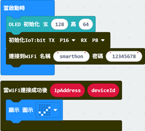
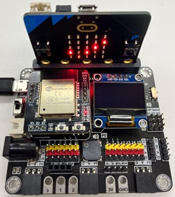
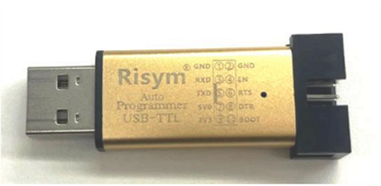

# 章節7：OTA更新固件

定期更新我們的IoT:bit固件非常重要，因為更新可能會增加新功能、提供更多傳感器和執行器，或修復軟件錯誤。在本章中，您將學習如何使用OTA更新IoT:bit固件並開發相應的程序。OTA（Over-the-air）是一種技術，允許設備通過Wi-Fi或移動寬帶獲取固件或操作系統更新。通過OTA，您無需通過USB將IoT:bit連接到計算機即可執行更新。

## 如何判斷當前的IoT:bit是否支援OTA？

OTA功能僅在固件版本4.0及以上版本中可用。您可以將此[<u>makecode程序</u>](https://makecode.microbit.org/_b0g5hV61K4H8)下載到您的micro:bit，啟動時將顯示版本號。如果版本低於4.0，您需要使用USB TTL來更新固件([<u>見10.6節</u>](#有線韌體更新))。 

如果您不希望自行更新固件，您可以：1）購買一台新的IoT:bit，新設備已預裝最新固件。2）聯繫我們以協助更新固件。請注意，您需要將設備寄送給我們，並需支付運費。 

## 程式設計（Makecode）

目標：開發一個程式以透過 OTA 獲取更新。

步驟1：連接WiFi

在透過 OTA 下載更新之前，我們需要連接到網路。我們在第一章已經了解如何連接WiFi。 

步驟2：設定一個顯示目前版本的功能

- 將`當按下按鈕A`塊拖到編程區。
- 前往 IoT:bit -> ESP 並找到`韌體版本`
- 將韌體版本變數繪製為`顯示字符串`

步驟3：設定啟動 OTA 更新的功能

- 將`當按下按鈕B`塊拖到編程區。
- 在 OLED 上顯示一則訊息，表示 OTA 更新已開始
- 到 IoT:bit -> ESP 並拖入`更新韌體至最新的版本`

步驟4：設定 OTA 更新進度偵聽器

- 將監聽器`OTA Progress`從 IoT:bit ->ESP 拖入到編程區
- 將 `OTA Progress `中的 `PercentageValue `繪製到 `顯示字符串 `以顯示進程百分比

步驟 5：設定 OTA 更新完成監聽器

- 將監聽器`On OTA Update Finished`從 IoT:bit -> ESP 拖入到編程區
- 在 OLED 上顯示圖示和訊息，表示 OTA 更新已完成。
- 顯示另一則訊息以提醒您重新啟動

步驟 6：設定 OTA 更新失敗監聽器

- 將監聽器`On OTA Update Failed`從 IoT:bit -> ESP 拖入到編程區
- 將`On OTA Update Failed`中的`Message`拖到 `顯示字符串` 以顯示錯誤訊息

完整解決方案

MackCode：[https://makecode.microbit.org/_9gbfzKdojHxh](https://makecode.microbit.org/_9gbfzKdojHxh) 
您也可以從以下網站下載程式： 
<iframe src="https://makecode.microbit.org/#pub:_EFiAdMEmvFqD" width="100%" height="500" frameborder="0"></iframe>

## OTA更新

目標：使用上述程序更新固件。

步驟 1：開始之前

- 將程式下載到Micro:bit中
- 找到一個WiFi信號強且穩定的地方。
- 開啟 IoT:bit 並等待圖示「勾號」顯示（Wifi 已連線）

步驟 2：檢查目前版本

- 按 A 顯示目前韌體版本

步驟 3：開始OTA更新

- 按 B 開始 OTA 更新
- 檢查更新是否正在進行（百分比從 0 到 100）
- 除非必要，否則在更新過程中請勿中斷電源/Wifi

步驟 4：更新完成

- micro:bit LED顯示笑臉，表示OTA更新完成
- 透過關閉和開啟電源來重新啟動 IoT:bit

步驟 5：檢查目前最新韌體版本

- 再次按 A 檢查目前韌體版本
- 完成！

## OTA 更新故障排除

如果出現任何錯誤訊息，請按照以下說明進行操作 ***請勿關閉*** 的力量。 

* NETWORK_NOT_STABLE — 按 B 重試。如果此錯誤訊息仍然存在，請連接更穩定的 WiFi，然後重試。
* FILE_NOT_EXIST – 請聯絡 Smarthon

更新韌體時請注意：

1. 更新時請勿關閉 IoT:bit 和 micro:bit
2. 如果更新超過 10 分鐘沒有進展，您可以重新啟動 IoT:bit 並重試
3. 確保WiFi網路訊號穩定且狀況良好
4. 一旦韌體更新開始，請勿再次執行更新功能（不要再次按下按鈕 B），除非 OLED 上顯示任何錯誤訊息

## 韌體發行說明

適用於 ESP32

**版本 4.2 - 2024年8月30日（最新版本）**
新增功能 
- 增加 IFTTT webhooks 功能
下載：[<u>firmware_v4.2</u>](https://control.smarthon.cc/UpdateFW/4.2/firmware_v4_2.bin) 

**版本 4.01 — 2023 年 6 月 12 日（最新版本）**
新增功能 
- 重新加入 LEDC 模組

修復： 
- 修復無法控制舵機的問題

**版本 4.0 — 2023 年 3 月 5 日**
新增功能 
-  新增OTA功能API以允許用戶下載最新/特定版本的韌體

**3.2 版本**
新增功能 
- 新增HTTP函數API以允許HTTP GET請求

**版本 3.1 — 2020 年 12 月 17 日**

新增功能 
- 新增NTP功能API以允許使用者設定時區

修復： 
- 修復 HTTP 連線（包括 HTTP、IFTTT、Thingspeak、WAN/Channel Control）收到錯誤代碼時崩潰的問題

**3.0 版本**

新增功能 
- 序列表傳回的大量修改
- 相容於最新版本 PXT (v0.5+)

**2.3 版本**

更新 
- 更新http結果措辭
- 更新Wifi連線措辭

**2.2 版本**

新增功能 
- 更新ESP Servo AT命令，現在允許透過一個命令控制三個Servo端口

**2.1 版本**

新增功能 
- 新增網路狀態標誌
- 新增NTP功能

修復 
- 修正 esp32 的 Wifi AP/熱點模式
- 修正使用esp32進行pwm和舵機控制時的bug

更新 
- 更新措辭
- 將 pubnub 連線 URL 變更為 smarthon 網域位址

**版本 2.0**

新增功能 
- 引入網路連線狀態
- 更新相容esp32

## 有線韌體更新

對於IoT:bit 4.0以下的韌體版本，請依照本教學進行更新。 

你需要的東西

- 一台裝有 Windows 作業系統的計算機
- 4 根跳線（母對母）
- USB TTL（可購買這裡 或其他 淘寶店）

步驟1：安裝CP210x驅動程式

- 下載並解壓縮“CP210x Windows 驅動程式”[<u>Silicon Labs網站</u>](https://www.silabs.com/developers/usb-to-uart-bridge-vcp-drivers?tab=downloads)

- 在解壓縮的資料夾中，執行"CP210xVCPInstaller_x64.exe"安裝CP210x驅動程式

步驟二：取得Flash下載工具

- 下載並解壓縮“Flash 下載工具”[ESP網站](https://www.espressif.com/en/support/download/other-tools?keys=&&&order=field_release_date&sort=asc)

- 執行Flash下載工具
- 將設定變更為 ESP32 和 Factory，然後按 OK

- 取消選取 SPIFlashConfig 上的“LockSettings”，然後按一下“確定”

第三步：將ESP32連接到電腦

-  依照下面的圖片和映射表連接ESP32和USB TTL

|USB TTL|ESP32|
|--|--|
|GND|GND|
|3V3|3V3|
|RXD|TX|
|TXD|RX|

- 將USB TTL插入電腦USB端口

第四步：Flash下載工具燒錄設置

1. 選擇COM串口
2. 在波特率下選擇 921600
3. 選擇IoT:bit韌體Bin文件[<u>下載 這裡</u>](https://control.smarthon.cc/UpdateFW/4.2/firmware_v4_2.bin)並選中附近的框
4. 輸入燒錄位址0x0000
5. 取消選取 DoNotChgBin
6. 其他設定不要更改，點選START開始刻錄

第五步：按START後，將ESP32置於燒錄模式

1. 按住啟動按鈕
2. 按下並釋放 RST 按鈕
3. 放開 BOOT 按鈕

第六步：等待刻錄完成

第七步：等待刻錄完成

