# 章節 8: HTTP 功能

HTTP代表超文本傳輸協議。它是全球資訊網數據通訊的基礎。HTTP在客戶端-服務器計算模型中作為請求-回應協議運作。它用於在網頁瀏覽器（客戶端）和網頁服務器之間傳輸超媒體文件，例如HTML頁面、圖像和其他資源。HTTP的工作方式是客戶端向服務器發送請求，然後服務器回應所請求的資源，並附帶一個HTTP狀態碼，該狀態碼指示請求的成功或失敗。在本章中，您將學習如何使用Iot:bit發送HTTP請求並接收回應。

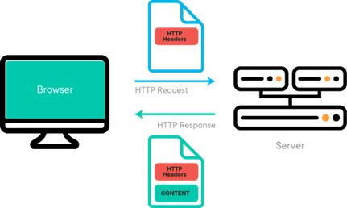 

## 示範場景

目標： 

此範例旨在透過HTTP從服務器獲取字串內容。

詳情： 

在此範例中，涉及兩個部分。
- 在第一部分中，我們需要創建一個承載字串的HTTP服務器。
- 在第二部分中，我們對micro:bit進行編程，使其發送HTTP請求並接收來自服務器的回應。

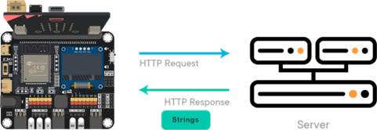 

## 第一部分：創建HTTP API服務器

目標： 

我們使用一個免費的服務器服務來設置一個包含字串內容的服務器進行測試。

步驟一： 

前往 [https://ptsv3.com](https://ptsv3.com)輸入一個獨特的ID以找到一個未被占用的Toilet（訪問路徑），例如“smarthon”。 

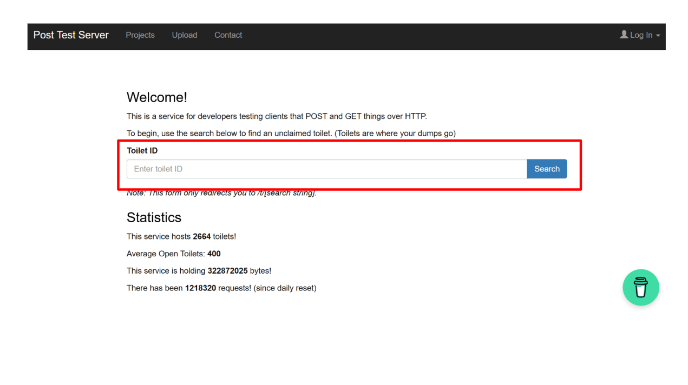 

步驟二： 

修改配置，使服務器以JSON格式返回回應。修改完成後，點擊“Update Toilet Config”。 

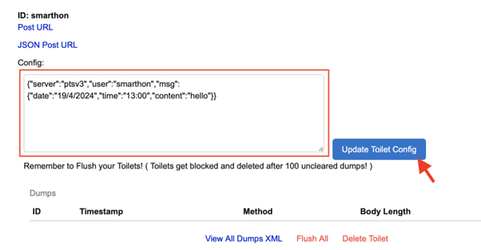 

<H5>例子 JSON:</H5>

{"server":"ptsv3","user":"smarthon","msg":{"date":"19/4/2024","time":"13:00","content":"hello"}} 

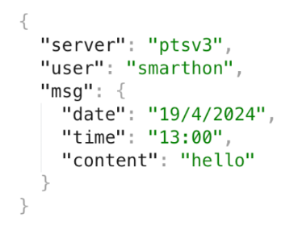 

## 第二部分：編程

目標： 

向服務器發送HTTP請求並提取內容 

第一步：連接WiFi 

在獲取內容之前，我們需要連接到網絡。我們在第一章中已經學習了如何連接到WiFi。 

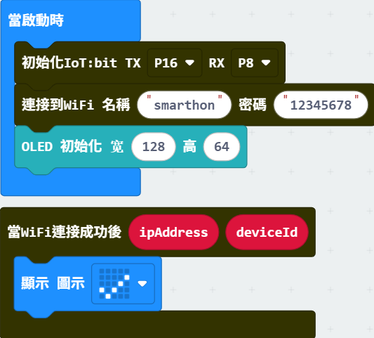 

第二步：複製URL 

- 通過右鍵點擊 -> 複製鏈接，複製Post URL。

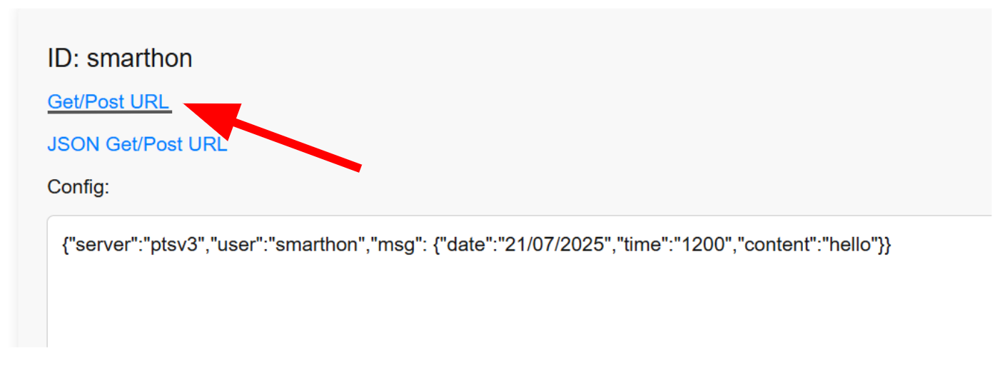 

第三步：設置一個發送HTTP請求的函數 

- 將一個 `當按鈕A被按下` 塊拖入編輯器
- 前往 IoT:bit -> IoT服務，並拖入 `發送HTTP請求` 塊
- 將URL貼入該塊中
- 在此範例中我們使用GET，所以將Body留空

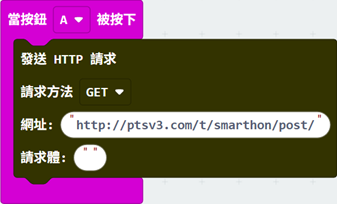 

第四步：創建回應處理程序 

- 前往 IoT:bit -> IoT服務，並將 `當HTTP連接成功後` 塊拖入編輯器
- 在OLED上顯示 `HTTP_Status_Code`

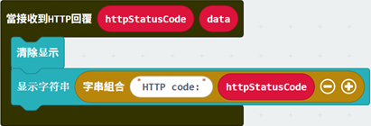 

備註： 

HTTP_Status_Code 會返回一個表示發送結果的代碼，例如 200（成功）、404（未找到）、502（錯誤網關），更多資訊請參閱 [https://developer.mozilla.org/en-US/docs/Web/HTTP/Status](https://developer.mozilla.org/en-US/docs/Web/HTTP/Status)

第五步：設置JSON提取函數 

- 前往 IoT:bit -> IoT服務，並拖入 獲`取鍵的值` 塊
- 根據JSON填入鍵名
- 將 `數據` 拖入 `JSON字串`

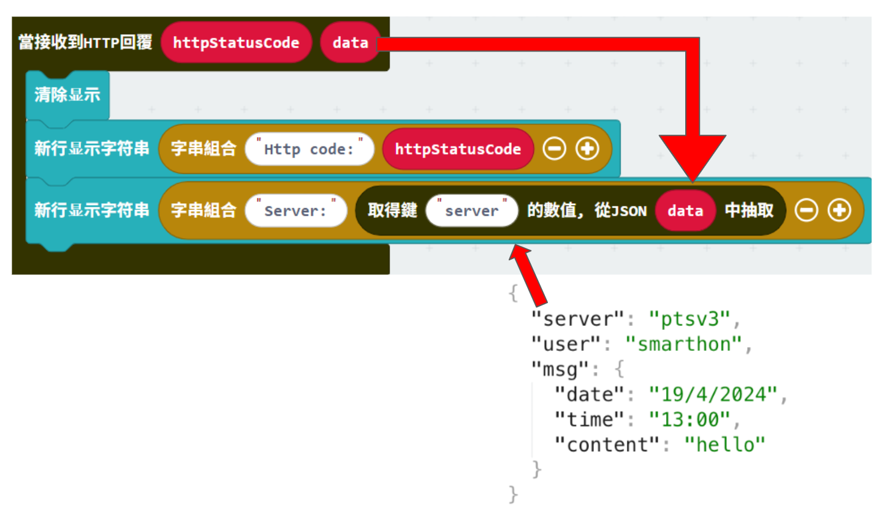 

當需要訪問多層級JSON時，嵌套這些塊，直到訪問到目標層級為止。 

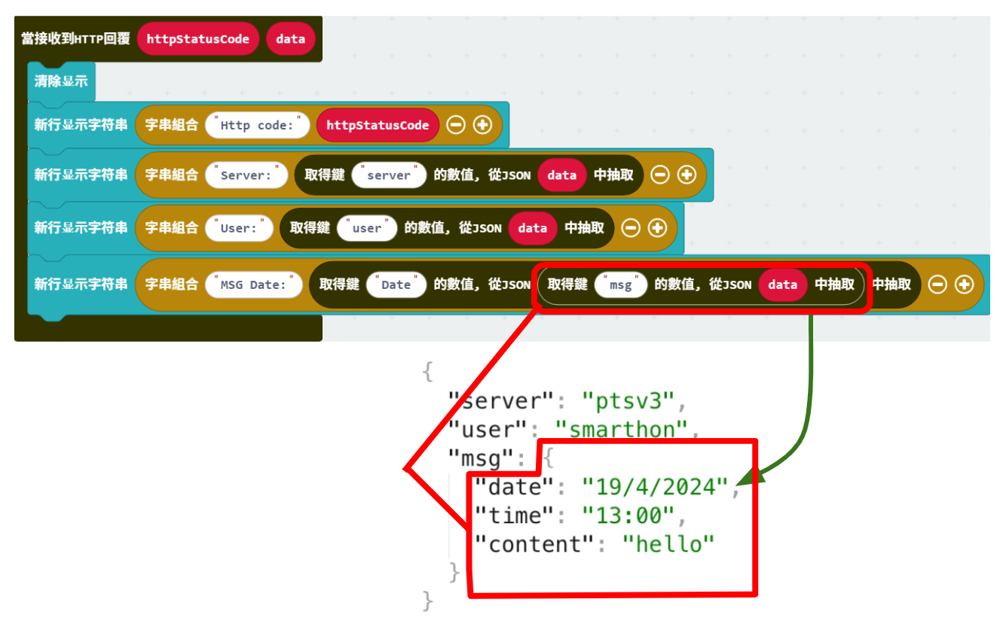 

完整答案 

MakeCode: [https://makecode.microbit.org/_90jJ0wPhaPr3](https://makecode.microbit.org/_90jJ0wPhaPr3)  
您也可以從以下網站下載HEX檔案： 

<iframe src="https://makecode.microbit.org/#pub:_90jJ0wPhaPr3" width="100%" height="500" frameborder="0"></iframe>

## 結果

連接到WiFi後，按下A鍵，OLED將顯示URL中的內容。 
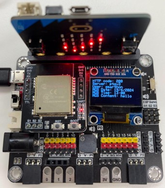 

<!-- ## 程序

第零步：添加擴展並連接WiFi 

- 從“[https://github.com/smarthon/pxt-iot-bit](https://github.com/smarthon/pxt-iot-bit)”添加IoT:bit擴展，或從“[https://github.com/SMARTHON/pxt-smartcity](https://github.com/SMARTHON/pxt-smartcity)”添加智慧城市擴展 
- 初始化並將IoT:bit連接到WiFi 

第一步：發送HTTP請求 

- 使用 發送HTTP請求方法…… 塊
- 選擇發送方法，可以是GET或POST
- 在 URL: 塊中，輸入API的URL
- 如果使用POST方法，您可以在JSON格式中包含POST Body

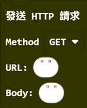 

第二步：接收回應 

- 將  `On HTTP received ….` 塊放入編輯器 
- 有兩個變量：`HTTP_Status_Code` 和 `Data`
- `HTTP_Status_Code` 返回表示發送結果的代碼，例如 200（成功）、404（未找到）、502（錯誤網關），更多資訊請參閱 [https://developer.mozilla.org/en-US/docs/Web/HTTP/Status](https://developer.mozilla.org/en-US/docs/Web/HTTP/Status)
- `Data` 返回服務器回應的主體，以字串格式呈現，可以是任何字串格式的內容，例如文字訊息、數字或JSON內容

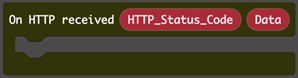 

第三步：提取JSON  

- 有時服務器的回應是JSON格式的內容，從JSON字串XXX中獲取鍵XXX的值 是一個提取器，幫助從標準JSON內容中獲取值。
- 從JSON字串XXX中獲取鍵XXX的值 需要兩個資訊，第一個是要搜尋的鍵名，第二個是JSON的來源字串。 
- 當函數在JSON中找到該鍵後，它將以字串格式返回對應的值。

  -->
