# 章節 8: HTTP 功能

HTTP代表超文本傳輸協議。它是全球資訊網數據通訊的基礎。HTTP在客戶端-服務器計算模型中作為請求-回應協議運作。它用於在網頁瀏覽器（客戶端）和網頁服務器之間傳輸超媒體文件，例如HTML頁面、圖像和其他資源。HTTP的工作方式是客戶端向服務器發送請求，然後服務器回應所請求的資源，並附帶一個HTTP狀態碼，該狀態碼指示請求的成功或失敗。在本章中，您將學習如何使用Iot:bit發送HTTP請求並接收回應。 
 
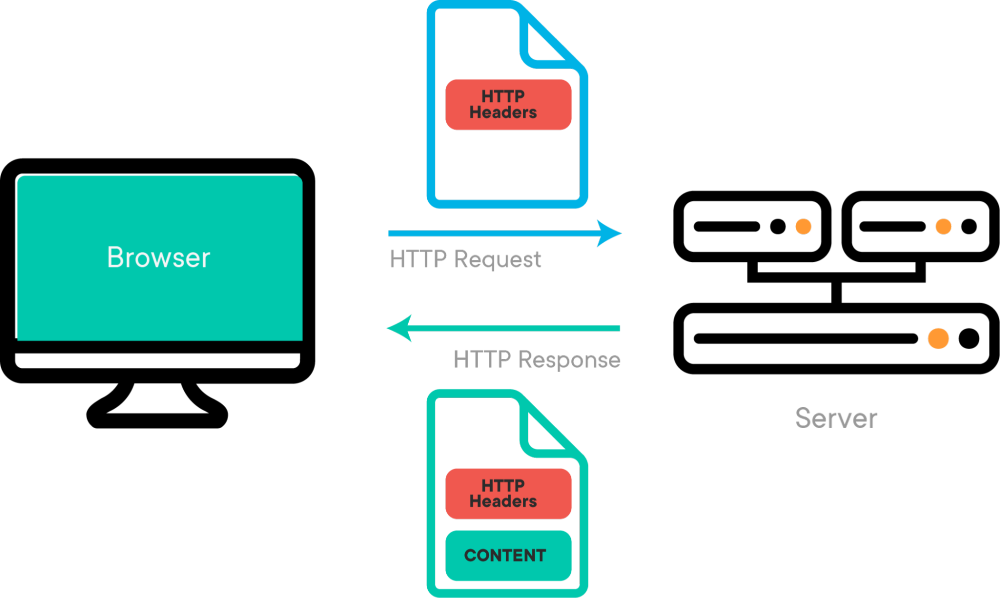 

| 功能 | 有Body | 沒有Body |
| -- | -- | -- | 
| GET |<b>#Body 不會被送出，最終會被忽略</b>| 正常運作 |	
| POST | 正常運作 | *會送出空字串 "" 作為 body |

<b># HTTP 規範指出，使用 HTTP GET 包含 body 不是一個好主意。</b> 
<b>* 這僅在韌體版本 4.2 之後支援</b> 

## 示範場景

目標： 

此範例旨在透過HTTP從服務器獲取字串內容。 

詳情： 

在此範例中，涉及兩個部分。 

- 在第一部分中，我們需要創建一個承載字串的HTTP服務器。 
- 在第二部分中，我們對micro:bit進行編程，使其發送HTTP請求並接收來自服務器的回應。 

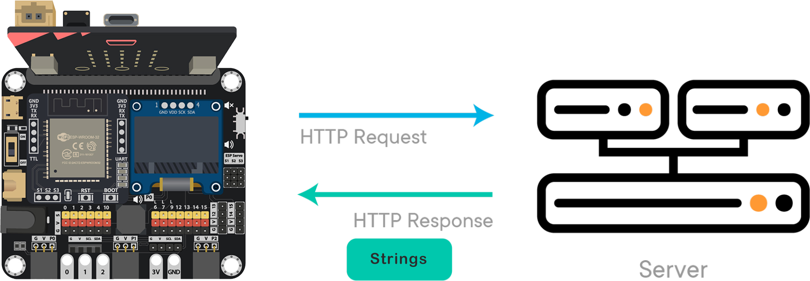 

## 第一部分：創建HTTP API服務器

目標： 

我們使用一個免費的服務器服務來設置一個包含字串內容的服務器進行測試。 

第一步： 

前往 [https://ptsv3.com](https://ptsv3.com)輸入一個獨特的ID以找到一個未被占用的Toilet（訪問路徑），例如“smarthon”。 

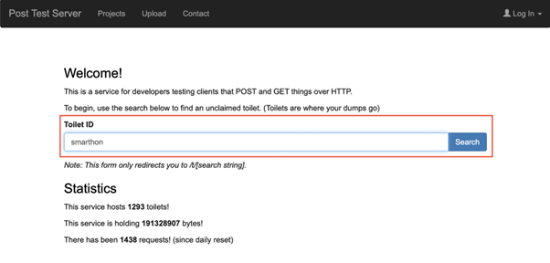 
 
第二步： 

修改配置，使服務器以JSON格式返回回應。修改完成後，點擊“Update Toilet Config”。 
 
 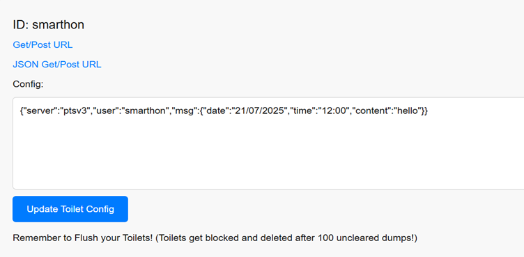 

例子 JSON: 
{"server":"ptsv3","user":"smarthon","msg":{"date":"19/4/2024","time":"13:00","content":"hello"}} 

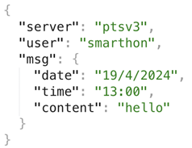 

## 第二部分：編程

目標： 

向服務器發送HTTP請求並提取內容 

第一步：連接WiFi 

- 在獲取內容之前，我們需要連接到網絡。我們在第一章中已經學習了如何連接到WiFi。 

 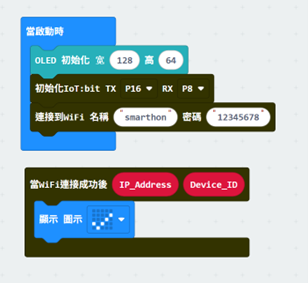 
 

第二步：複製URL 

- 通過右鍵點擊 -> 複製鏈接，複製Post URL。 
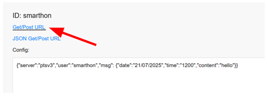 
 
第三步：使用POST功能去更新數據 

- 將 `當按鈕A被按下` 塊拖入編輯器 
- 前往 IoT:bit -> IoT服務，並拖入 `發送HTTP請求` 塊 
- 將URL貼入該塊中 
- 在此範例中我們使用POST 

**在Body中放入數據**
- 例子 JSON: 
- {"server":"ptsv3","user":"smarthon","msg":{"date":"21/07/2025","time":"12:00","content":"hello"}} 
- 時間和日期會被改變 

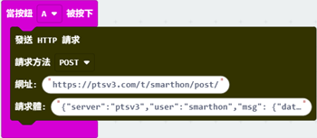 
 
第四步：使用 GET 方法獲取數據 

- 將 `當按下按鈕 B` 塊拖入編輯器 
- 前往 IoT:bit -> IoT 服務，拖入 `發送HTTP請求` 塊 
- 將 URL 貼到該塊中 
- 本例中使用 GET 方法，因此將 Body 留空 
 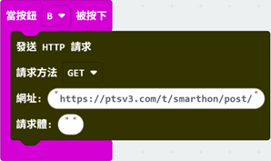 

第五步：創建回應處理程序 

- 前往 IoT:bit -> IoT服務，並將 `當接收到HTTP回復` 塊拖入編輯器 
- 在OLED上顯示 `HTTP_Status_Code` 
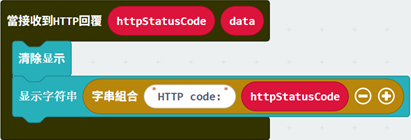 

第六步：設置JSON提取函數 

- 前往 IoT:bit -> IoT服務，並拖入 `獲取鍵的值` 塊 
- 根據JSON填入鍵名 
- 將 `data` 拖入 `JSON字串` 

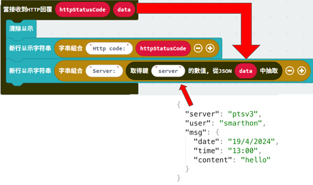 

- 當需要訪問多層級JSON時，嵌套這些塊，直到訪問到目標層級為止。 

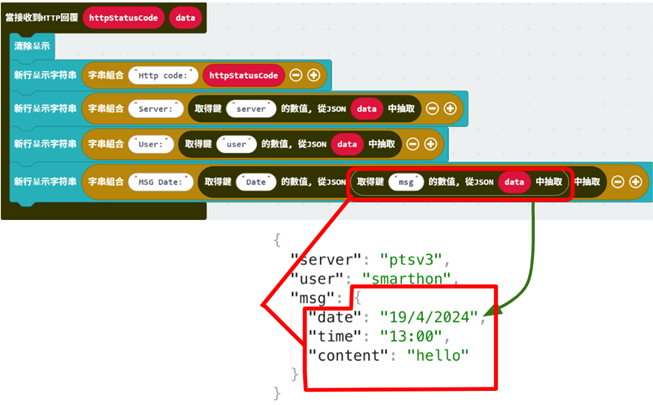 

- 備註：`HTTP_Status_Code` 會返回一個表示發送結果的代碼，例如 200（成功）、404（未找到）、502（錯誤網關），更多資訊請參閱 [https://developer.mozilla.org/en-US/docs/Web/HTTP/Status](https://developer.mozilla.org/en-US/docs/Web/HTTP/Status) 

## 完整答案

MakeCode: [https://makecode.microbit.org/S67494-15951-48626-85113](https://makecode.microbit.org/S67494-15951-48626-85113)
您也可以從以下網站下載HEX檔案： 

<iframe src="https://makecode.microbit.org/S67494-15951-48626-85113" width="100%" height="500" frameborder="0"></iframe>

## 結果

連接到 Wi-Fi 後，按下按鈕 A，將 body 資訊 POST 到網頁伺服器，並更改 body 部分。如果伺服器的 body 部分有任何變更，按下按鈕 B，將 GET body 資訊到 micro:bit。 
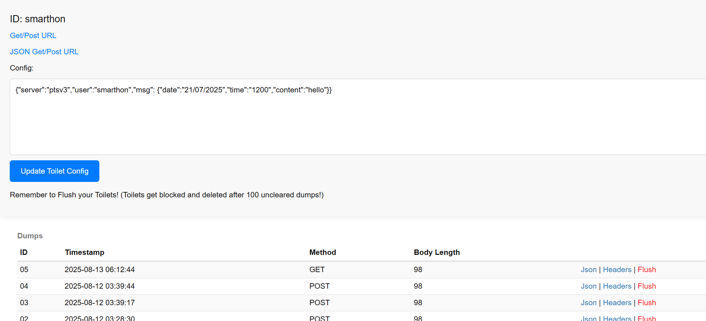 
 
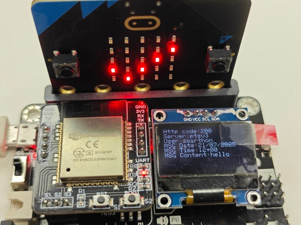 

  

 
