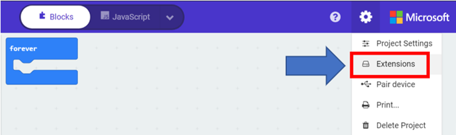
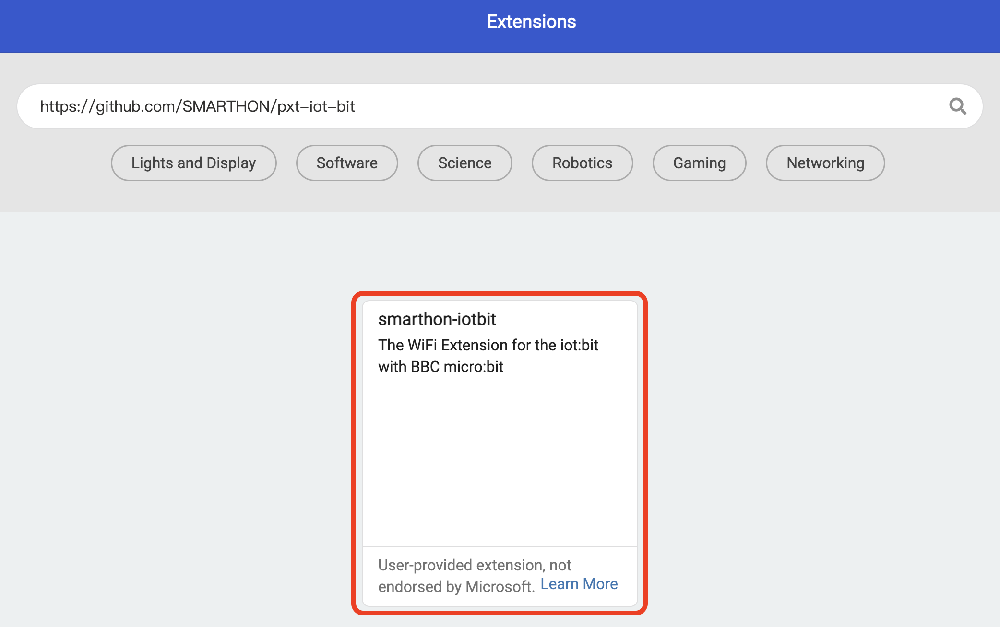
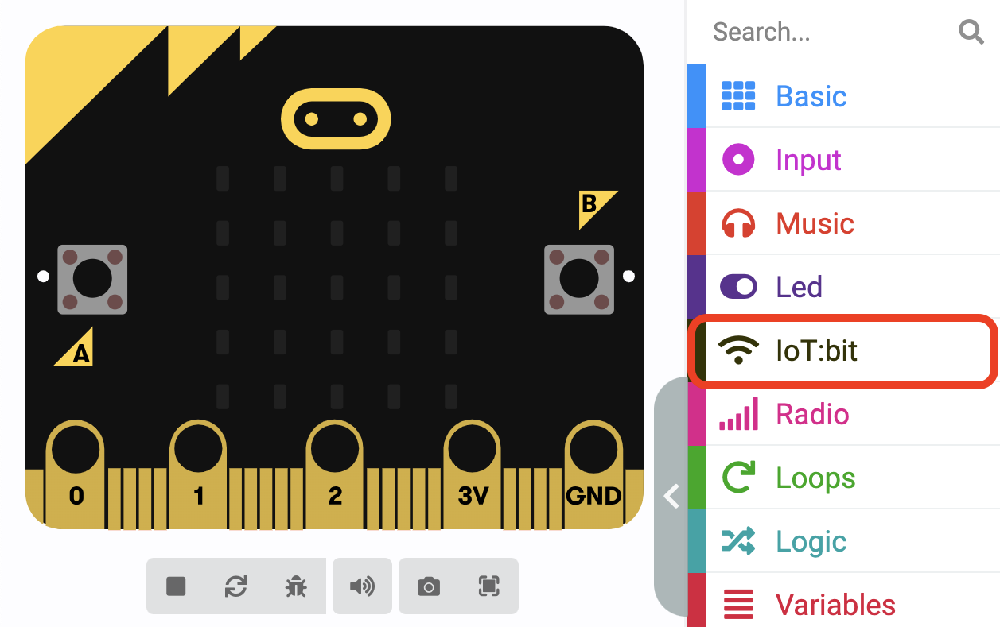

# 快速入門: 添加PXT擴展

第一步驟 

打開[MakeCode](https://makecode.microbit.org), 建立一個新的專案 

第二步驟 

為專案命名 

第三步驟 

點擊 後選擇擴展 

 

第四步驟 

搜索 "[https://github.com/SMARTHON/pxt-iot-bit](https://github.com/SMARTHON/pxt-iot-bit)" 及點擊“smarthon-iotbit”

第五步驟 

就能成功添加 IoT:bit PXT擴展 

