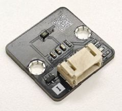
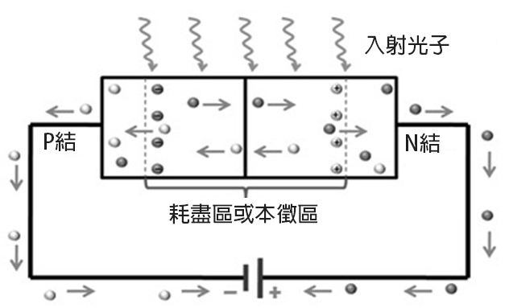
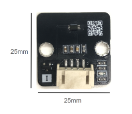
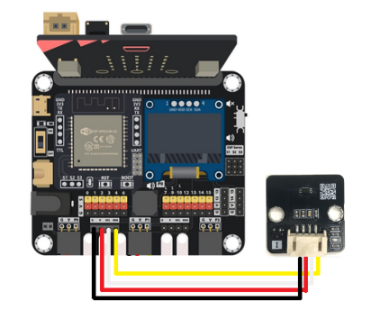
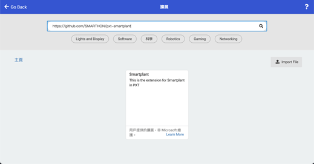
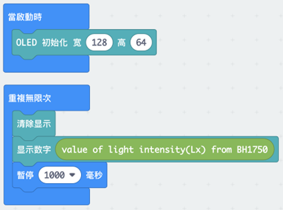
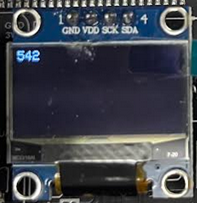

# 數位光照傳感器 (BH1750)

 

## 簡介

數位光照傳感器 (BH1750) 利用光電二極體來測量環境光。光電二極體會消耗光能來產生電流，而它產生的電力與光的強度成正比。照度的單位是 LUX。  

## 原理

光電二極體是一種 PN 接面二極體。 P型和N型的接觸面有一個稱為空乏區的區域。 

 
光以稱為光子的小能量包形式攜帶著能量。當有能量足以打破原子間共價鍵的光子照射到空乏區，就會產生一對電子（圖中的黑點）和電洞（圖中的白點）。電子會繼續沿電線流向電源和 P 型，而電洞因為不能在電線中移動，它們會在 P 型與流入的電子重新結合。當中產生的光電流會轉換為電壓，然後由模擬值轉換為數位值，最後以單位為 LUX 的照度輸出。 

## 規格

- 型號: BH1750FVI-TR
- 峰值波長: 560 nm
- 使用溫度: - 40℃ ~ 80℃
- 工作電壓: 3V (3-3.6V)
- 工作電流: Ev = 100 lx 時 120μA (max: 190μA) 
- 最低電流：無光輸入時 0.01μA (max:1.0μA)
- 功率: 260 mW
- 輸出: 數位 16 bit

## 針腳

|針腳|功能|
|--|--|
|G|接地|
|V|電源供應|
|SDA|訊號輸出|
|SDL|時鐘|

## 外觀及大小

 
大小：25mm X 25 mm

## 快速指引

- 連接數位光照傳感器到開發板上（使用連接線材） 
  
- 打開Makecode，使用 https://github.com/SMARTHON/pxt-smartplant 擴展
  
- 在 OLED 顯示屏上顯示光強度 
  

## 結果

OLED 顯示屏上顯示的光強度 
 

## FAQ

Q：數位光照傳感器 (BH1750) 和光敏電阻 (LDR) 有什麼不同？ 
A：BH1750 的準確度、精密度都高，而 LDR 的精密度較低。  
&nbsp&nbsp&nbsp&nbsp&nbsp&nbsp  BH1750 的輸出單位是 lux (lx)，而 LDR 以電阻值 (ohms) 變化的形式輸出。 
&nbsp&nbsp&nbsp&nbsp&nbsp&nbsp  LDR 比 BH1750 便宜。

Q：數位光照傳感器 (BH1750) 的輸出範圍是多少？ 
A：輸出範圍為 1 - 65535 lx 

