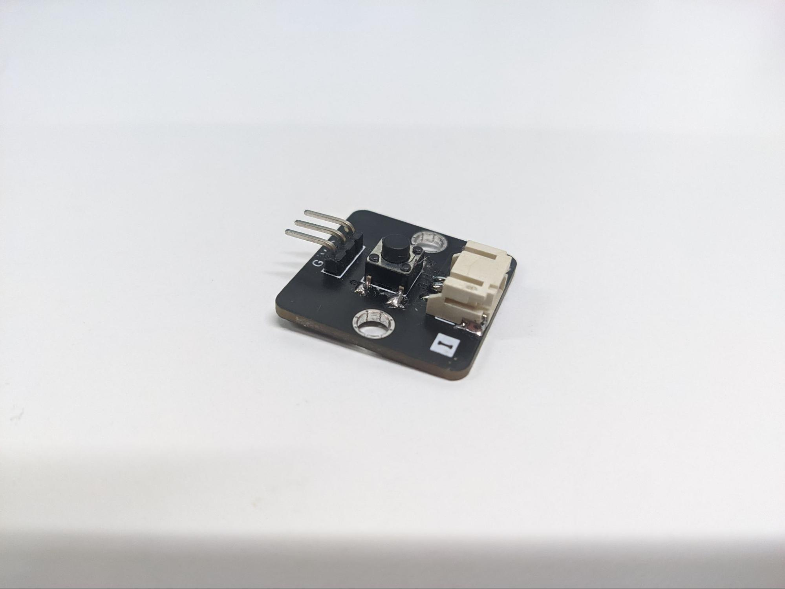
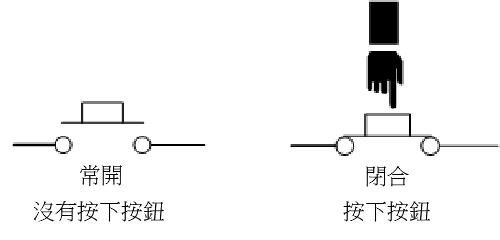
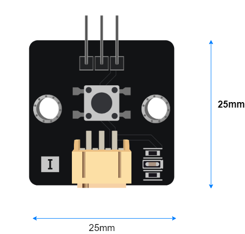
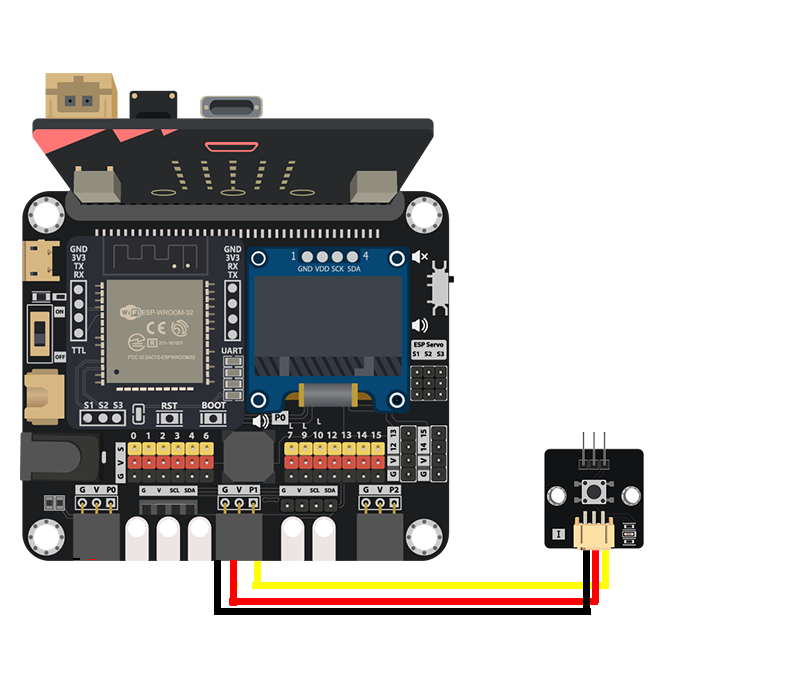
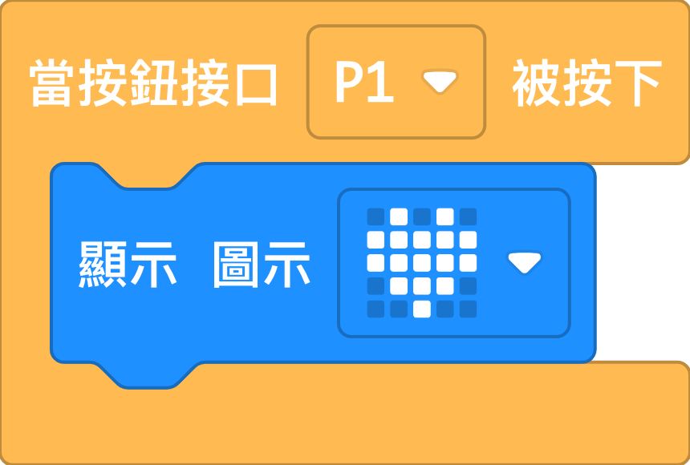

# 按鈕

##  簡介
按鈕是一款傳感器，它可以在物理上控制電路開關，通常作控制用途。

## 原理
按鈕使用簡單開關原理來控制電路的連接狀態。按鈕的構造分為常開式和常閉式。常開式按鈕是一種常見的按鈕構造，他的預設狀態為斷路，兩個接點沒有彼此接觸，沒有電流經過。按下按鈕後，兩個接點彼此接觸，形成通路。

## 規格
* 操作電壓: 0-5V
* 介面: 類比
* 輸出電壓: 0V (按下按鈕) ~ 操作電壓 (沒有按下按鈕)

## 針腳

|針腳|功能|
|--|--|
|G|接地|
|V|電源供應|
|S|輸出 (與電源供應一樣)|

## 外觀及大小

大小: 25mm X 25mm

## 快速指引

* 連接按鈕到開發板上(直接插入或用線材連接)

* 打開 Makecode，使用 [https://github.com/smarthon/pxt-smarthome](https://github.com/smarthon/pxt-smarthome) PXT擴展 

* 使用 `When Button at P1 pressed` 使按下按鈕後執行行動

## 結果

當按下按鈕時，Micro:bit上的LED會顯示心型圖案。

