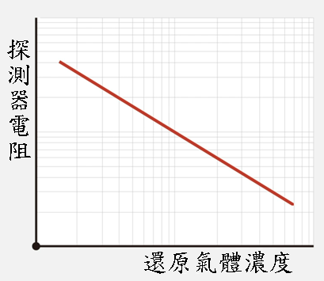

二氧化碳傳感器
============

 

## 簡介

CCS811 量度室內的 eCO2 和 TVOC 密度。eCO2 即等效二氧化碳，其濃度藉由測量環境空氣造成的輻射強迫水平所推算出。而 TVOC 代表總揮發性有機化合物，是多種毒素和化學物質釋放的氣體的統稱。

## 原理

CCS811 是一種金屬氧化物傳感器，能測量暴露在空氣中的敏感元件的電阻，過程中敏感元件會加熱。

 

當處於潔淨空氣中時，敏感元件會吸收空氣中的氧。由於氧會吸引自由電子，導致敏感元件中的電子流動減少，造成高電阻。

而當處於污染空氣中時，氧因污染物而減少，釋放出電子，導致敏感元件中有更多的電子流動。 這種氧化會降低電阻。

 
電阻越低，讀數會越高。

## 規格

- 供電電壓：1.8～3.6V
- 供電電流：30mA
- 耗電量：60mW
- 工作溫度範圍：-5～50℃
- 工作濕度範圍：10～95%
- eCO2輸出範圍：400～8192ppm
- TVOC輸出範圍：0～1187ppb

## 針腳

|針腳|功能|
|--|--|
|G|接地|
|V|電源供應|
|SDA|數據|
|SDL|時鐘|

## 外觀及大小

 
大小：25mm X 25 mm

## 快速指引

- 連接 CO2  sensor 到開發板上（使用連接線材） 
 

- 打開Makecode，使用 [https://github.com/SMARTHON/pxt-advancedSensor](https://github.com/SMARTHON/pxt-advancedSensor) 擴展 
 

- 在 OLED 上顯示 CO2  和 TVOC  
 

## 結果

OLED 顯示屏上顯示的 CO2 和 TVOC 
 

## FAQ

Q：為什麼不建議在户外環境下使用？ 
A：在户外環境下，交通和高強度太陽輻射產生的臭氧，會增加傳感器的電阻，導致讀數不正確。 此外，溫度和相對濕度也會影響傳感器的電阻。當它們突然變化時，基線電阻不再適用，因此傳感器的讀數將不正確。

Q：為什麼 CO2 讀數從 400ppm 開始？ 
A：400ppm 是目前新鮮空氣的本底 CO2 濃度。

