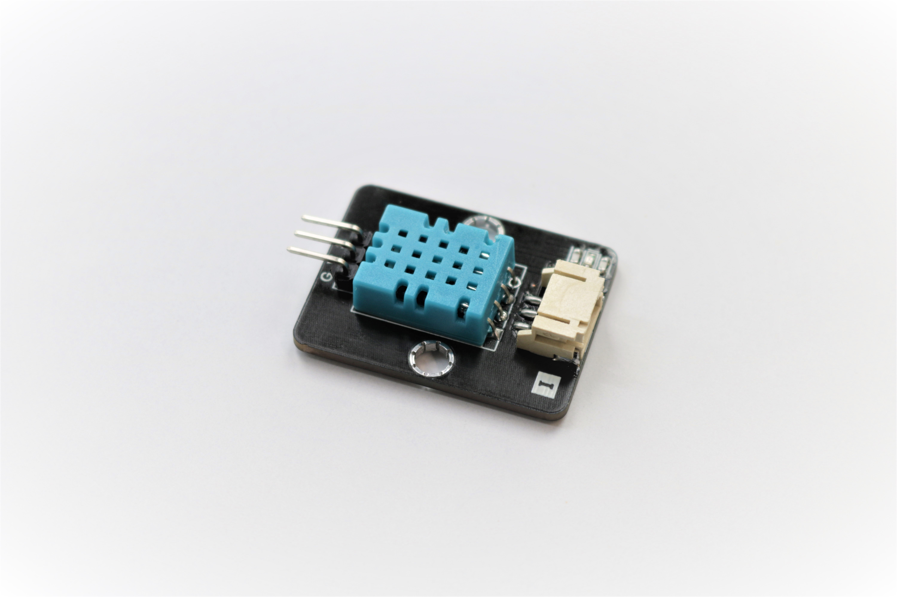
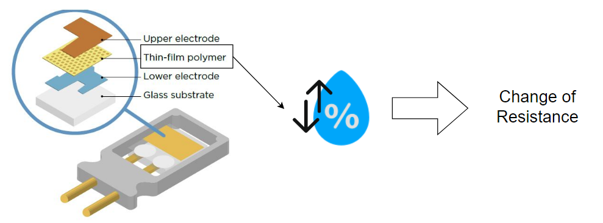
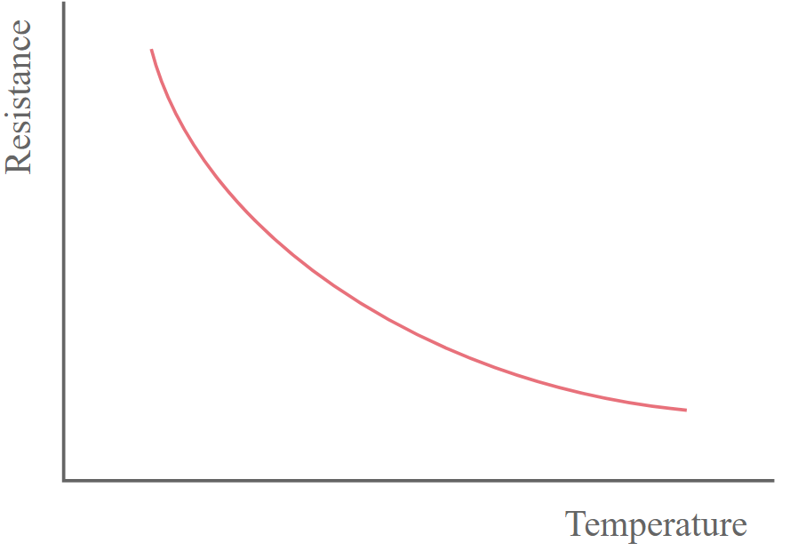
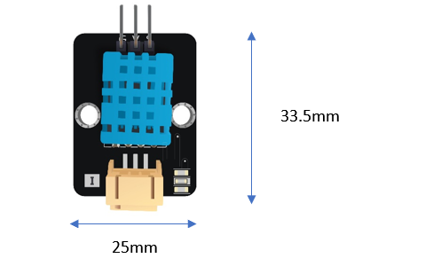
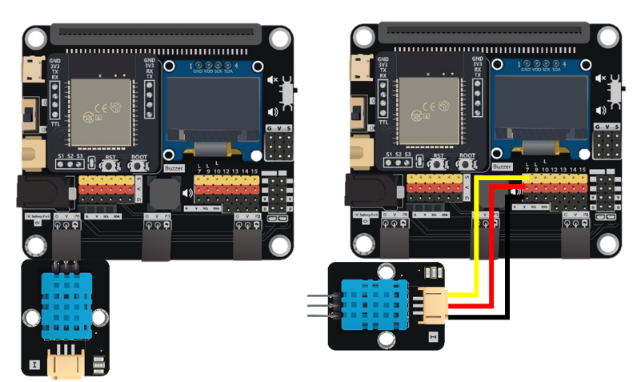
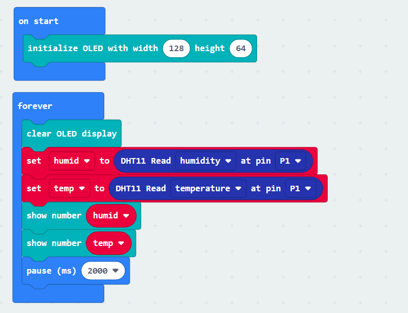
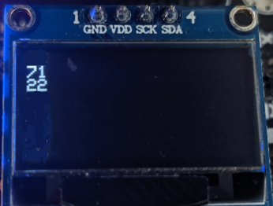

# DHT11

## 簡介
DHT11是一種常用的溫濕度傳感器,得益於他的易用性及低廉的價錢,普遍用於不同STEM項目

## 原理
DHT11主要由兩個部分組成。

第一部分是由聚合物的導電率而計算出濕度。當環境的濕度改變,會影響聚合物的電阻令電流發生變化。 

第二部分為「負溫度係數熱敏電阻」, 當溫度上升時,電阻會依溫度而下降,傳感器利用此原理檢測出環境溫度

## 規格 
* 供應電壓: 3.3V 至 5V
* 溫度感應範圍: 0-50°C (+- 2°C 準確率)
* 濕度感應範圍: 20%~80% (+- 5% 準確率)
* 取樣速率: 1Hz

## 針腳

|針腳|功能|
|--|--|
|G|接地|
|V|電源供應|
|S|訊號輸出(數位)|

## 外觀及大小

大小: 33.5mm X 25mm

## 快速指引

<H3><u>基礎操作</u></H3>
* 連接DHT11到開發板上(直接插入或用線材連接)

* 打開 Makecode, 使用 https://github.com/smarthon/pxt-smartcity PXT擴展 

* 當初始化OLED顯示屏後,設立兩個變量以儲存讀取的數值,然後把讀取回來的數值放入變量中

* DHT11擴展裡已經有內建1秒延遲以防止過快讀取

* 把溫度和濕度的變量顯示在OLED上

## 結果

傳感器所在環境的溫度和濕度都會顯示在OLED顯示屏上

## FAQ

Q:為什麼DHT11的檢測反應有延遲? 
A:因為DHT11需要時間讓內部部件變化以檢測出準確的數值
根據官方數據,溫度和濕度的最短反應時間分別為10秒和6秒

## 數據表

[DHT11_Datasheet](https://www.mouser.com/datasheet/2/758/DHT11-Technical-Data-Sheet-Translated-Version-1143054.pdf)
