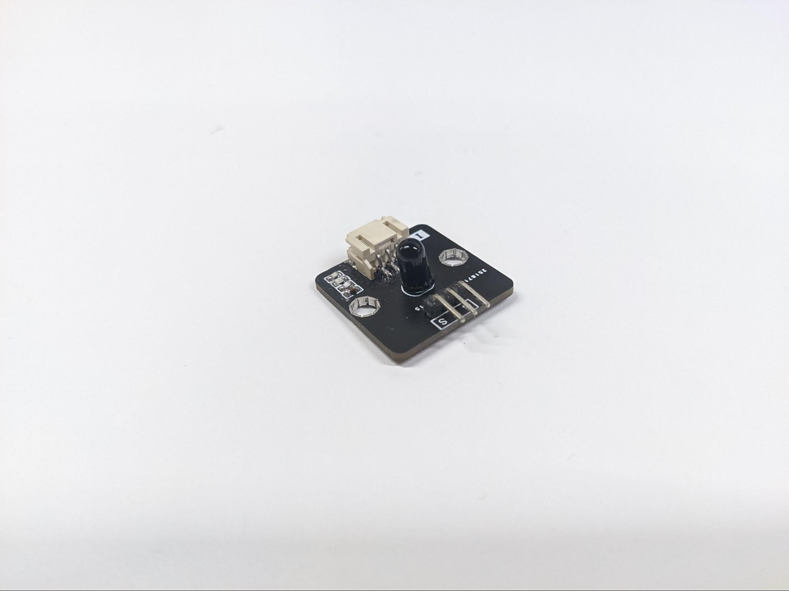
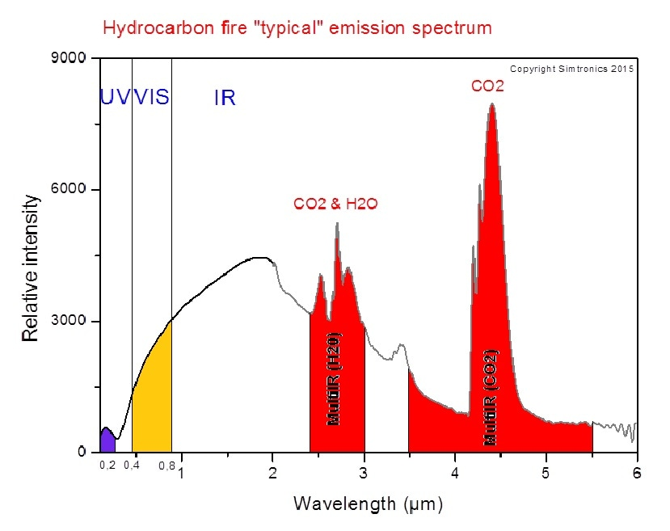
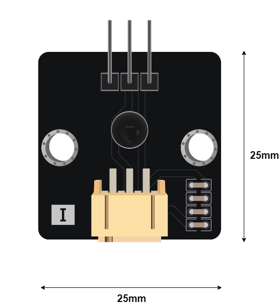
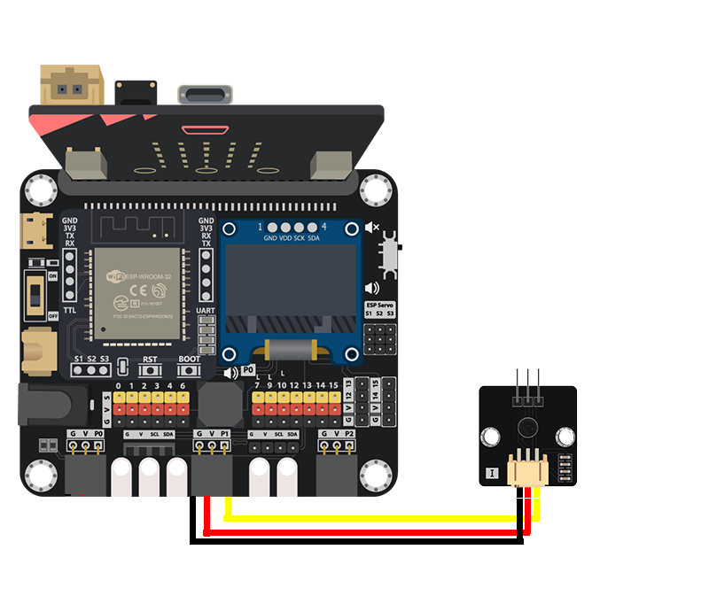
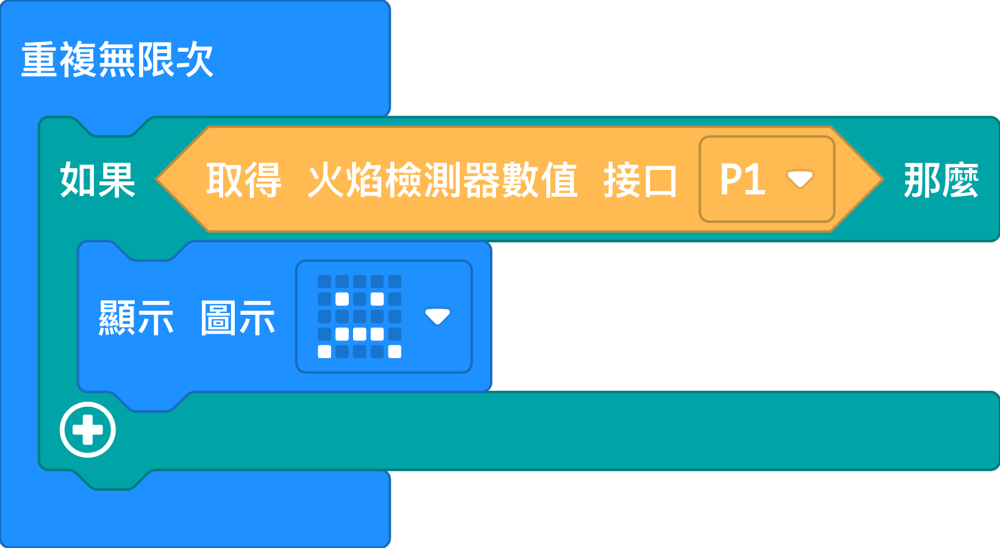
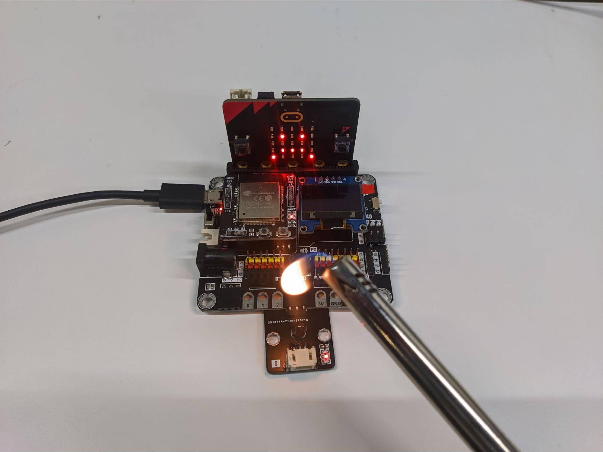

# 火焰傳感器

## 簡介
火焰傳感器透過紅外線感測器來感應焰光光譜，從而檢測前方的火焰。

## 原理
火焰會散發不同光線，其中大部份是不可視光。不同燃料會散發不同光線，發射光譜涵蓋紫外線、可見光和紅外線。例如在燃燒碳氫化合物時，火焰會釋放不同波長的光線，其中紅外線明顯強很多。

火焰傳感器使用的紅外線感測器能夠檢測波長超過760nm的光。當檢測器指向火焰，紅外線感測器便檢測到強烈的紅外線，然後改變輸出電壓。當輸出電壓達到閾值，火焰傳感器便可檢測到火焰。

## 規格
* 操作電壓: 3.3/5V
* 介面: 類比
* 波長靈敏度: 760nm 或以上
* 檢測距離: 少於1米
* 輸出電壓: 0V (沒有檢測到火焰) ~ 操作電壓 (能檢測的最大紅外線強度數值)

## 針腳

|針腳|功能|
|--|--|
|G|接地|
|V|電源供應|
|S|輸出|

## 外觀及大小

大小: 25mm X 25mm

## 快速指引

* 連接火焰傳感器到開發板上 (直接插入或用線材連接)

* 打開 Makecode，使用 [https://github.com/smarthon/pxt-smarthome](https://github.com/smarthon/pxt-smarthome) PXT擴展 

* 使用 `Get flame detection at Pin P1` 來讀取火焰傳感器的檢測結果

## 結果

當火焰傳感器前有火焰時，火焰傳感器感應到火焰，Micro:bit上的LED會顯示傷心的表情

