霧化器
==========

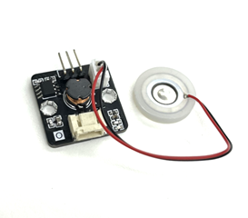 

## 簡介

霧化器由一個壓電陶瓷環和金屬薄片組成，能將電能轉換為機械能。將它放在水面上時，它會振動水面並產生霧。

## 原理

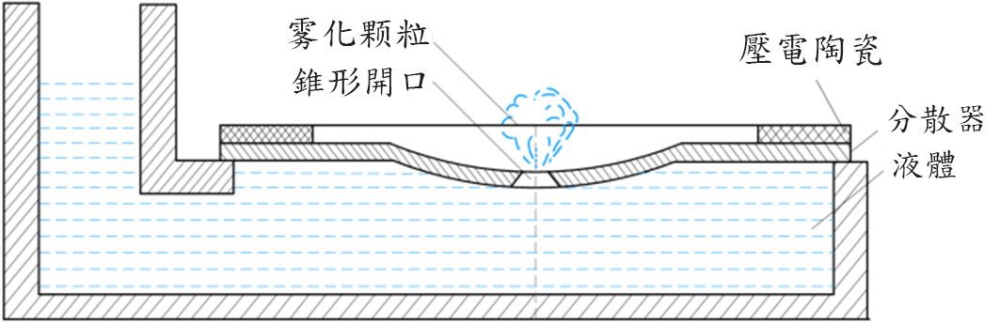 

壓電陶瓷環將電能轉化為機械能，使金屬薄片以高頻率振動，於是薄片會發生週期的細微機械變形，繼而將能量釋放到接觸到的水中，打破水的表面張力並產生小水滴。薄片上有一些微孔，會將一面的液體吸收並噴射出去另一面，形成液霧。這一過程稱為霧化，而氣泡的大小取決於微孔的孔徑。 

## 規格

- 針腳端口類型：PH2.0
- 共振頻率：108-110kHz
- 孔徑：4-5μm
- 微孔數量：1100
- 材質：壓電陶瓷、304不鏽鋼
- 重量：1.92g

## 針腳

| 針腳 | 功能       |
|----|------|
| G | 接地 |
| V | 電源供應   |
| S | 輸出     |

## 外觀及大小

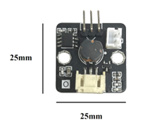 
大小：25mm X 25mm 
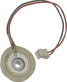
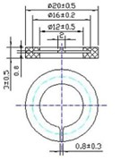 
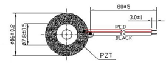
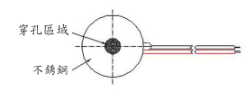 
霧化片直徑：16mm 
圓盤直徑：20mm 
圓盤厚度：3.5mm 
電線長度：10cm 

## 快速指引

- 連接霧化器傳感器到開發板上（使用連接線材）
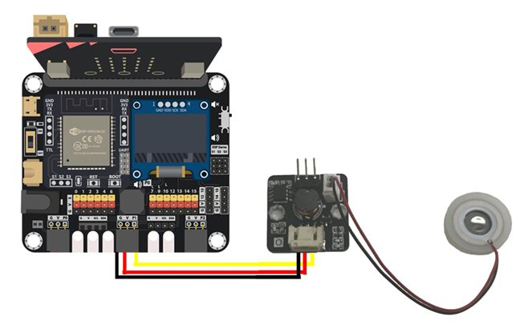  

- 將圓盤放到水面上，有壓電陶瓷的一面應朝上。 
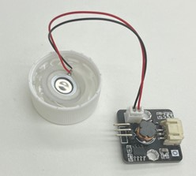
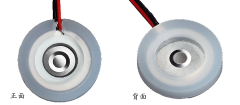  

- 打開Makecode，使用[https://github.com/SMARTHON/pxt-smartplant](https://github.com/SMARTHON/pxt-smartplant)擴展
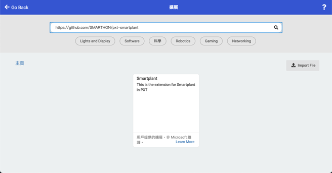  

- 設定不同按鈕以開啟/關閉霧化器
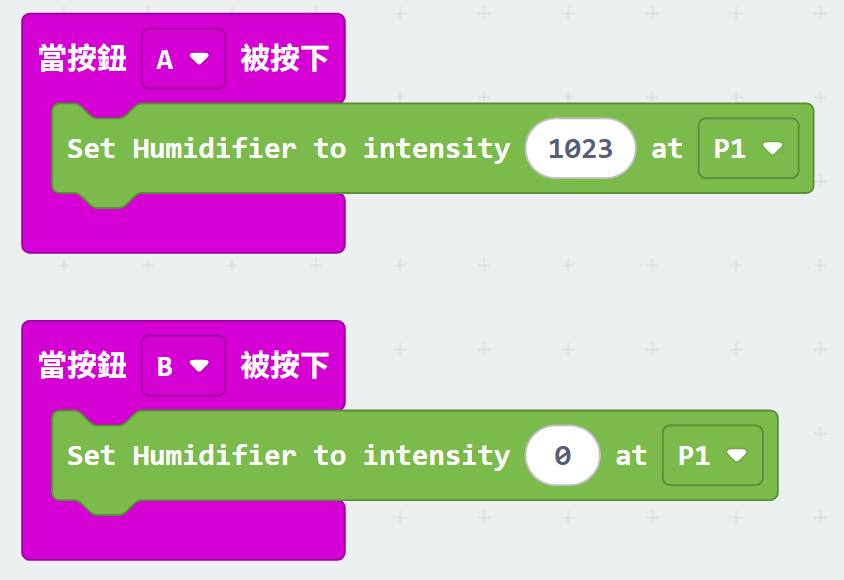 

## 結果
- 按下按鈕 A 開啟霧化器
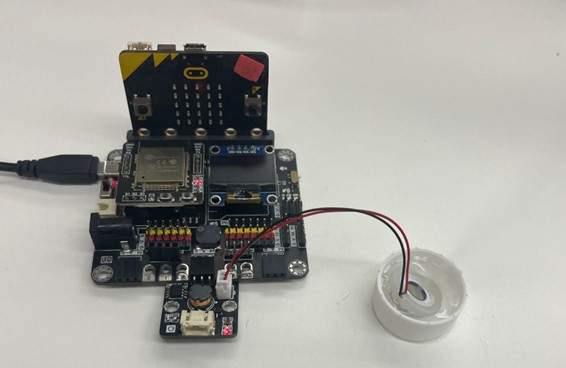  

- 按下按鈕 B 關閉霧化器
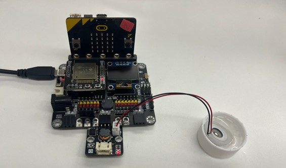 

## FAQ

Q：為什麼沒有霧氣噴出？ 
A：1.檢查圓盤是否放反了。有壓電陶瓷的一面應朝上，以散發霧氣。 
&emsp;&nbsp;&nbsp;&nbsp;&thinsp;2.檢查有壓電陶瓷的一面是否有水。若圓盤上方有水，霧氣就會被水阻擋。

