# LCD1602
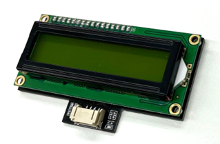

## 簡介

LCD1602是一款16x2液晶顯示器(LCD),16x2表示顯示器有2行,每行可以顯示16個字符。它利用液晶的特性和偏振鏡來操控光線,從而產生圖像。 

## 原理

LCD由夾在兩層玻璃電極板之間的液晶層組成。通過施加電流,液晶分子可以被調整成不同的排列方式,兩個偏光片亦被放置在玻璃板的外側,以確保背光源的光以特定的方向通過LCD。偏光片及前電極板之間不同的彩色濾光片則可以為每個像素創造不同的顏色。 

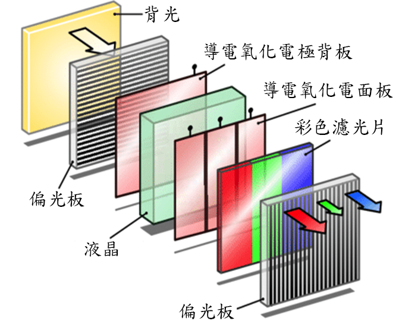

當沒有電壓施加到液晶層時,偏振光會被液晶分子旋轉90度,並通過第二個偏光片。當施加電場時,液晶分子的取向發生變化。偏振光不再被扭曲,因此被第二個偏光片遮擋,從而在屏幕上創造出黑暗區域(像素)。 

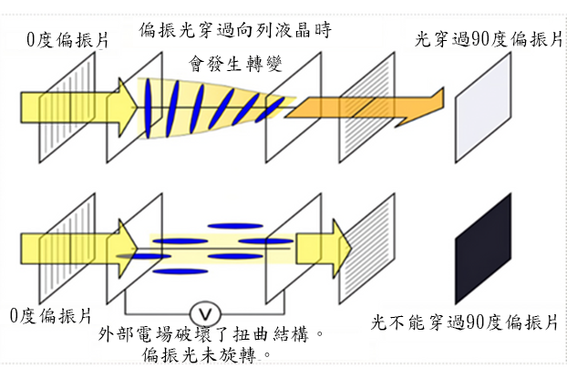

## 規格

- 顯示類型: 數字字符顯示
- 背光: LED背光
- 供應電壓: 5V直流電
- 工作溫度範圍: -20°C至+70°C
- 介面: I2C
- 顯示區域: 64.5 x 14.5 mm
- 字符數量: 16個字符 x 2行

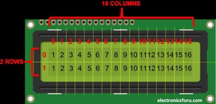 
字符格式: 5x8 像素 
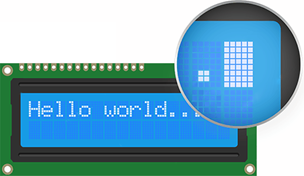 

## 針腳

|Pin|功能|
|--|--|
|G|接地|
|V|電源供應|
|SDA|數據|
|SCL|時鐘|

## 外觀及大小

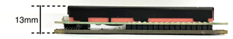 
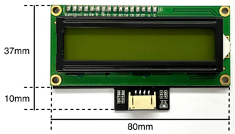 
大小: 80mm X 47mm X 13mm 

## 快速指引

- 使用電線將LCD1602連接到開發板的I2C接口上
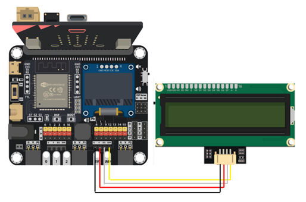  

- 打開Makecode, 使用 [https://github.com/SMARTHON/pxt-smartplant](https://github.com/SMARTHON/pxt-smartplant) 擴展
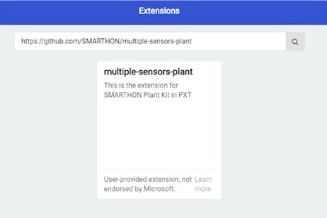  

- 初始化LCD後,把字串顯示在LCD1602上
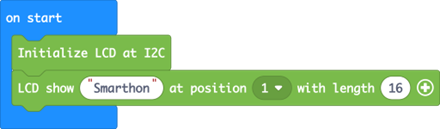  

## 結果

LCD1602 顯示一個字串
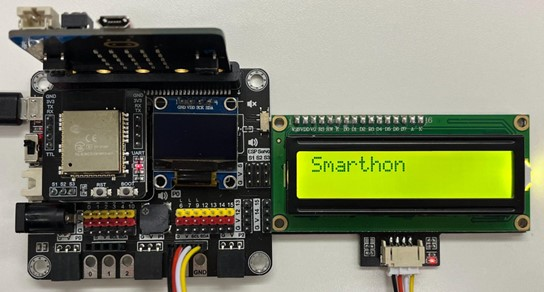

## FAQ

Q. 16x2 LCD可以顯示什麼樣的信息? 
A. 16x2 LCD可以顯示各種各樣的信息,包括文字、數字、符號和基本圖形。它也常被用來顯示狀態信息、菜單選項、傳感器讀數等。 

Q. 使用16x2 LCD有沒有任何限制? 
A. 儘管你可以在很多方面活用16x2 LCD,但它們也有一些限制,例如屏幕尺寸和分辨率有限,可能無法顯示複雜的圖形或大量信息。 

Q. 我能否在LCD上更改字體大小? 
A. 不能。在標準的16x2 LCD顯示器上,字體大小是固定的, 每個字符佔用一個單獨的單元格,字體亦無法更改。 

## Datasheet

[LCD1602-datasheet](https://hades.mech.northwestern.edu/images/f/f7/LCD16x2_HJ1602A.pdf)

