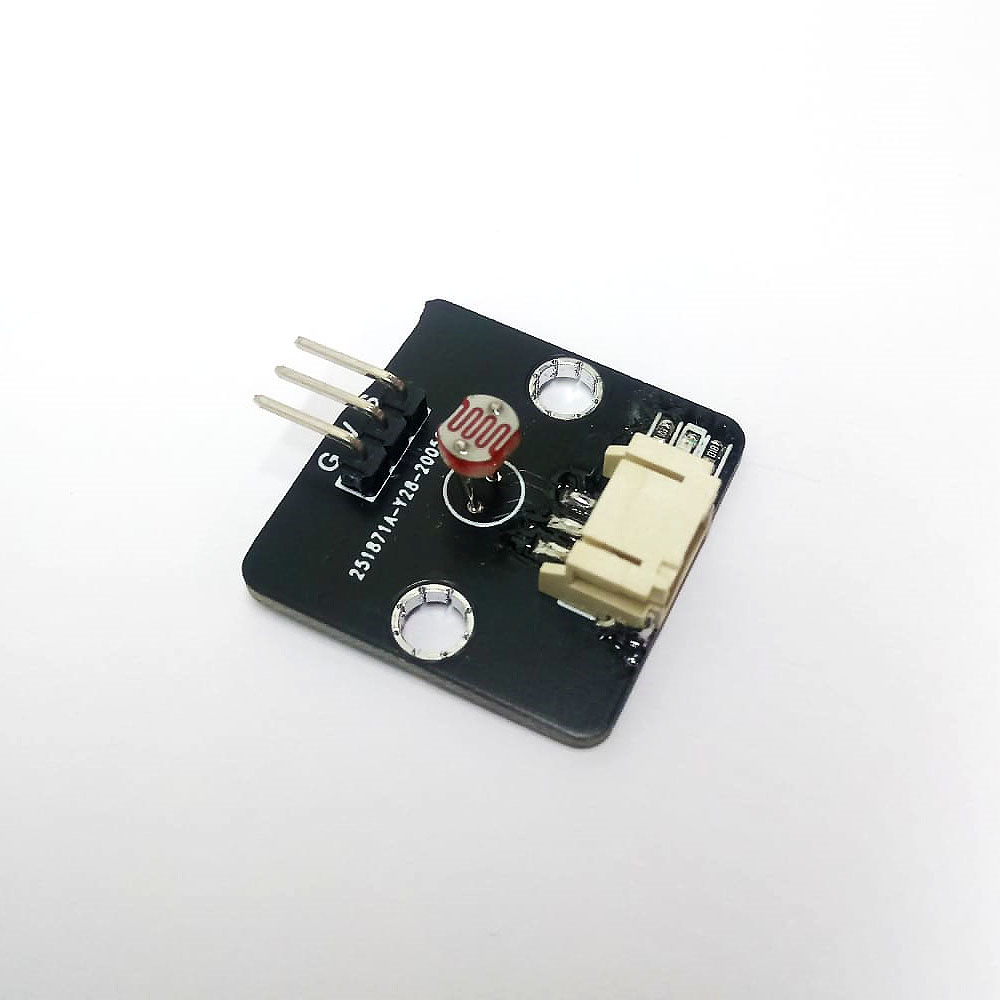

# Light Sensor

## Introduction
The Light sensor use one photoresistor to detect the luminance of environment. The darker of the environment, the lower voltage will be provided. 

## The principle
The Light sensor also call as Light Dependent Resistor(LDR), the physical property will change under different light source as the name implied.  

Depend on the model of different LDR, the resistance value and curves have difference, but all follow the principle:  
When the Illumination is increase, the resistance of the resistor will reduce. 
When the Illumination is decrease, the resistance of resistor will increase.  

## Specification 
* Supply Voltage: 3.3V to 5V
* Interface: Analog 
* Output Voltage Range: 1%~90% of supply Voltage
* Reading in the PXT(with Mirco:bit): 1~100(0.04V~3.3V)

## Pinout Diagram

|Pin|Function|
|--|--|
|G|Ground|
|V|Voltage Supply|
|S|Signal Output(Analog)|

## Outlook and Dimension

Size: 25mm X 25mm

## Quick to Start/Sample

* Connect the sensor to development board (direct plugin or using wire))

* Open Makecode, using the https://github.com/smarthon/pxt-smartcity PXT 

* Initial the OLED and show the reading of Voltage Output

## Result

The reading of the luminance will show according to the environment. 

## FAQ

Q: Why the reading mostly stays in the middle range? 
A: Generally, using in a in-door environment (with electric light source) will have a middle range value. 
The close to limit value will only appear in the extreme cases, like under the sun/ close to light bulb, or stay in a full dark environment.

## Datasheet

[Photoresistor-5516-datasheet](http://yourduino.com/docs/Photoresistor-5516-datasheet.pdf)
