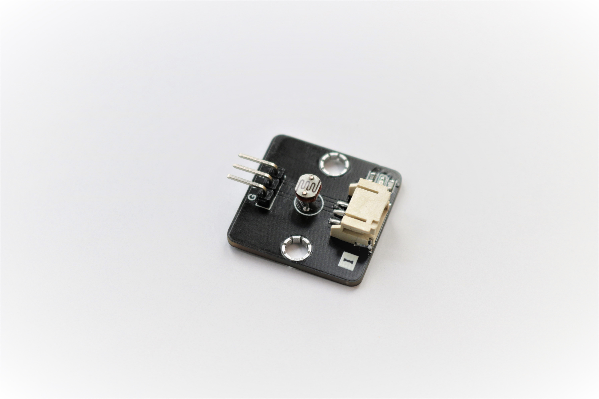
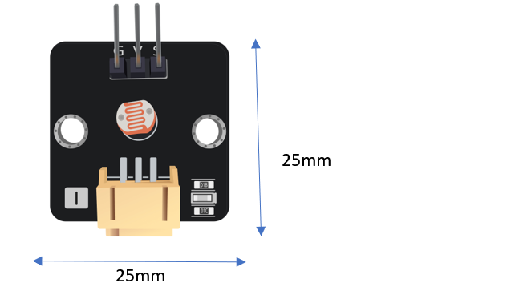
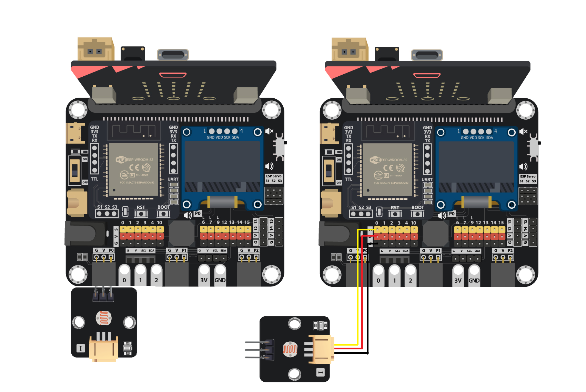
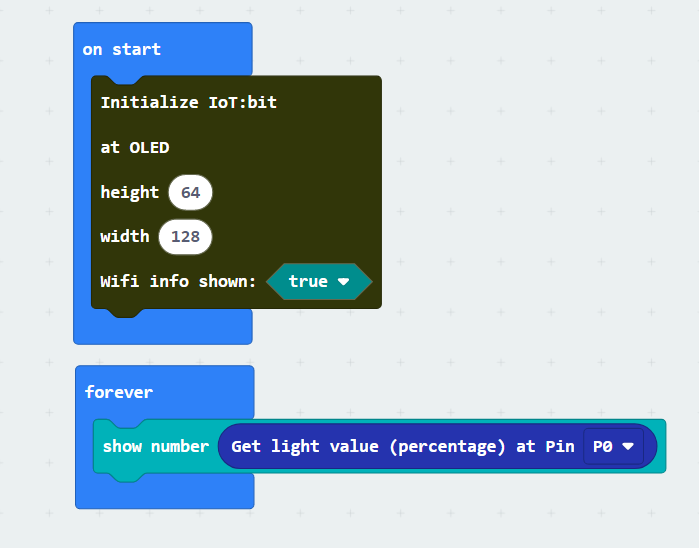
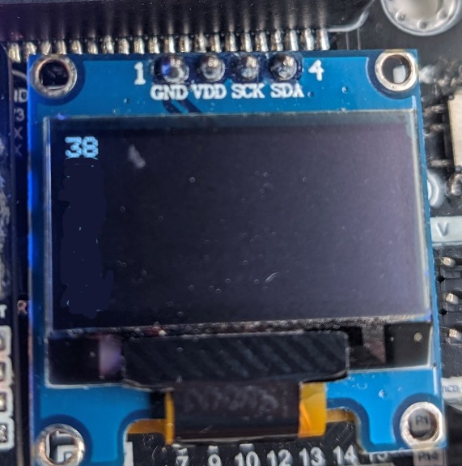

# 光度傳感器

## 簡介
光度傳感器使用光敏電阻去檢測環境光度的變化,當環境變得越暗,經電阻輸出的電壓會更低。 

## 原理
光敏電阻擁有著依照環境狀況改變物理性質的特性。 

根據不同型號的光敏電阻,其電阻值及變化曲線亦有所不同,但基本依照以下原則。 
* 「當亮度提升,電阻值下降」 
* 「當亮度下降,電阻值提升」 

## 規格
* 供應電壓: 3.3V 至 5V
* 介面: 類比
* 輸出電壓範圍: 輸入電壓的1%至90%
* PXT擴展裡的讀數: 1至100(0.04V~3.3V)

## 針腳

|針腳|功能|
|--|--|
|G|接地|
|V|電源供應|
|S|訊號輸出(類比)|

## 外觀及大小

大小: 25mm * 25mm

## 快速指引

* 連接傳感器到開發板上(直接插入或使用連接線材)

* 打開Makecode, 使用 https://github.com/smarthon/pxt-smartcity 擴展 

* 初始化OLED顯示屏後,把讀數顯示在OLED顯示屏上

讀取的數值會介0至100之間

## 結果

當前環境的相對亮度會顯示出來

## FAQ

Q: 為什麼讀數比較偏於中間? 
A: 即使在室內環境,一些光源例如電燈亦能夠提供一定光亮度給傳感器。如想測試極端的數值,可以嘗試放到全黑的環境或是暴露在太陽直射的地方。 

## Datasheet

[Photoresistor-5516-datasheet](http://yourduino.com/docs/Photoresistor-5516-datasheet.pdf)
