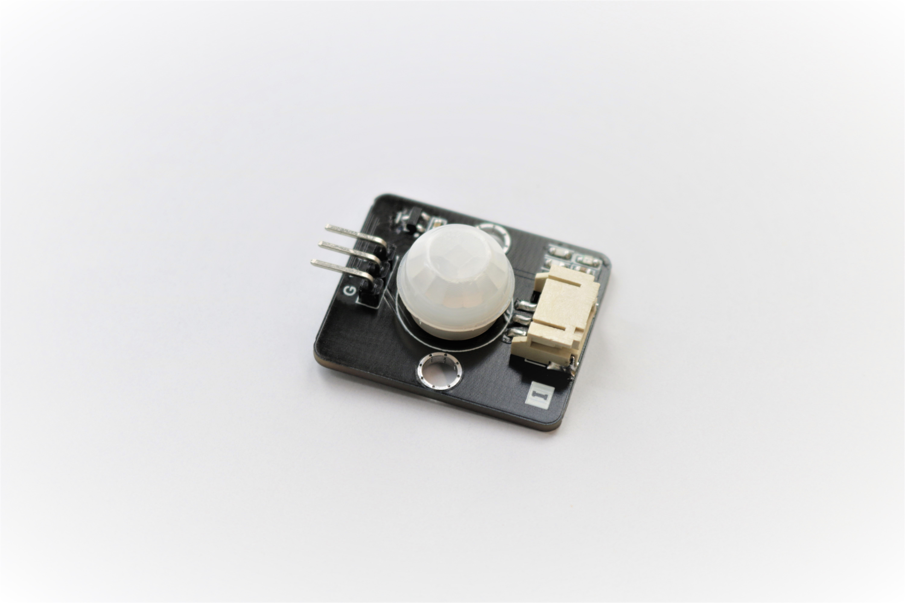
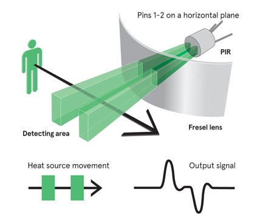
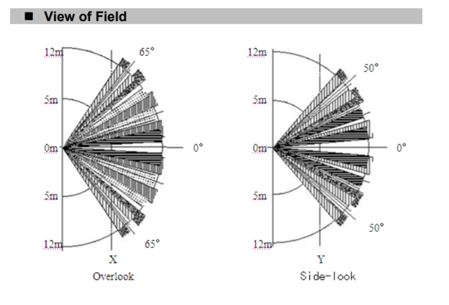
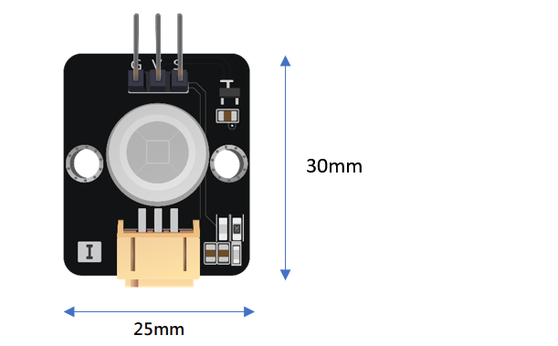
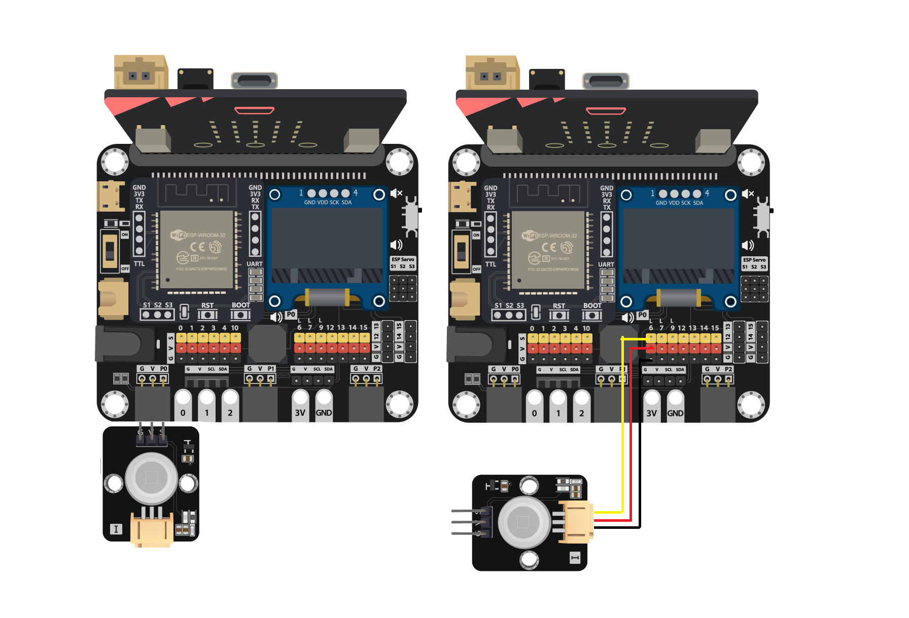
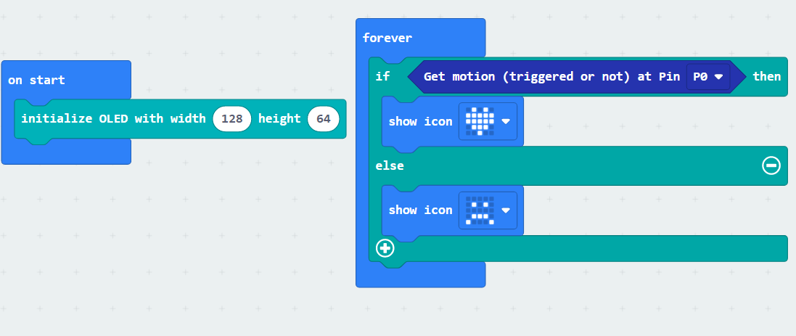
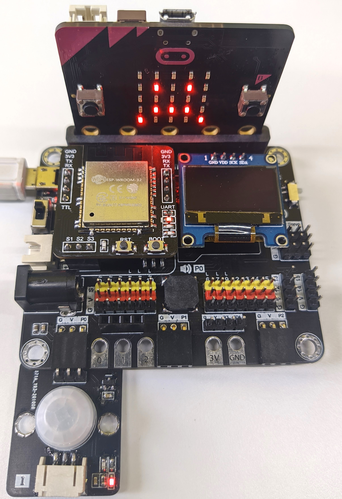

# 運動傳感器

##  簡介
運動傳感器是使用紅外線感測器去檢測出前方有沒有正在移動的物體。

當檢測到的訊號急劇變化,則輸出高電平訊號,否則輸出低電平訊號。

## 原理
焦電式感測器是一種紅外線感測器,它會一直吸收及記錄前方範圍的紅外線強度數據。像人體這種帶有體溫的物體,會不斷發放出紅外線。 當經過傳感器檢測範圍時,傳感器接收到的數值就會發生改變,從而得知有物體的移動。

感測器最大偵測距離可達到5至12米,檢測出前方130度的物件移動。 

## 規格
* 輸入電壓: 3.3V
* 介面: 類比
* 操作溫度: -20°C至85°C
* 檢測角度: 左右65°,共130°

## 針腳

|針腳|功能|
|--|--|
|G|接地|
|V|電源供應|
|S|感應訊號輸出|

## 外觀及大小

大小: 25mm X 30mm

## 快速指引

* 把傳感器連接到發開板上(直接插入或使用連接線)

* 打開Makecode, 使用 https://github.com/smarthon/pxt-smartcity 擴展 

* 使用PXT擴展去讀取數值,並令LED依照數值改變

## 結果

當手在傳感器前方揮舞時,觸發了感應,Mirco:bit上的LED會改變

## 數據表

[PIR-am312-datasheet](http://www.image.micros.com.pl/_dane_techniczne_auto/cz%20am312.pdf)
