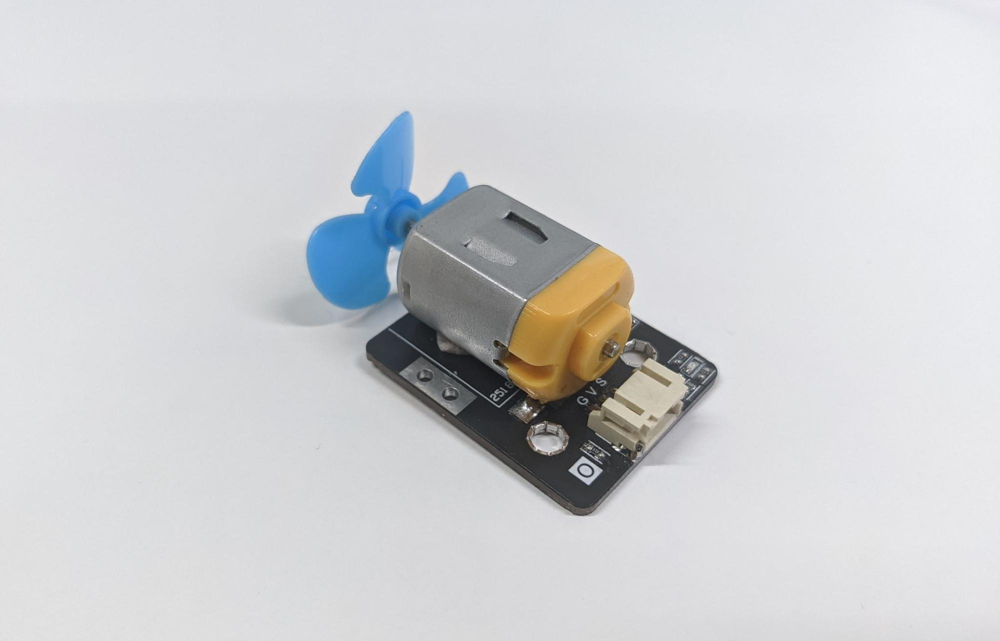
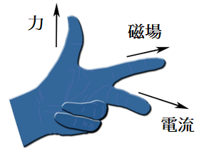
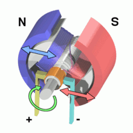
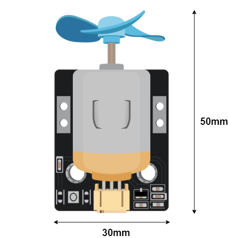
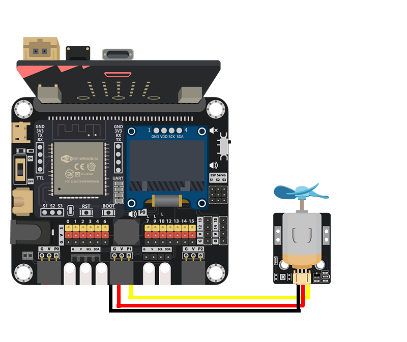
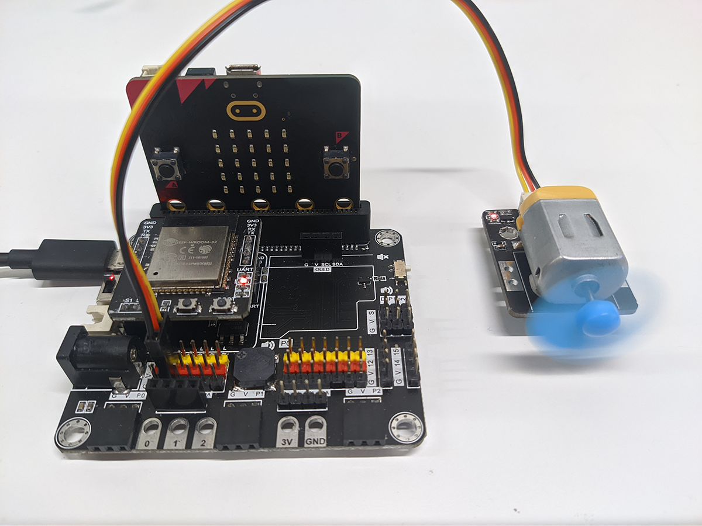

# 風扇馬達

##  簡介
風扇馬達是一種驅動器，它能把電能轉為機械能。發動機連接電源後，它的軸心會帶動其他已連接部件一起旋轉。

## 原理
發動機的運作原理應用了弗來明左手定則。當電流經過磁場，便會產生動力。

發動機的內部有兩個部件，分別是定子和轉子。

* 定子提供磁場，通常是一塊永久磁鐵。
* 轉子在發動機運作時不斷轉動，它提供機械能來讓軸心旋轉。它由電樞和換向器組成。當電流通過時，根據弗來明左手定則，轉子會按照電流和磁場的方向來旋轉。

詳細原理可參考[維基百科](https://en.wikipedia.org/wiki/Electric_motor)和[youtube影片](https://en.wikipedia.org/wiki/Electric_motor)。

## 規格
* 供應電壓：3V ~ 6V
* 介面: 類比
* 輸入訊號電壓：1.5V ~ 5V
* 軸徑：2mm
* 操作電流（無負重）：220ma(3V) ~ 370ma(6V)
* 操作電流（堵轉）：600ma(3V)
* 速度：15000rpm(3V) ~ 27400rpm(6V)

## 針腳

|針腳|功能|
|--|--|
|G|接地|
|V|電源供應|
|S|輸出|

## 外觀及大小

大小: 50mm X 30mm

## 快速指引

* 連接風扇馬達到開發板上(直接插入或用線材連接)

* 打開 Makecode，使用 [https://github.com/smarthon/pxt-smarthome](https://github.com/smarthon/pxt-smarthome) PXT擴展 

* 使用 `Set motor fan with speed 1023 at P1` 來設定風扇馬達以最高速旋轉

## 結果

風扇馬達將以最高速旋轉。

## FAQ

Q: 為什麼在使用風扇馬達時，micro:bit或其他零件不能正常運作？ 
A: 因為發動機所需電壓較大，供電不足可能會使電壓下降、過載、不穩定、甚至破壞micro:bit和供電系統。遇到這情況時，要確認供電電壓足夠大。使用舊式的USB充電線、連接電腦USB插頭(5V 0.5A)、或是電池快耗盡時都可能會遇到上述問題。
