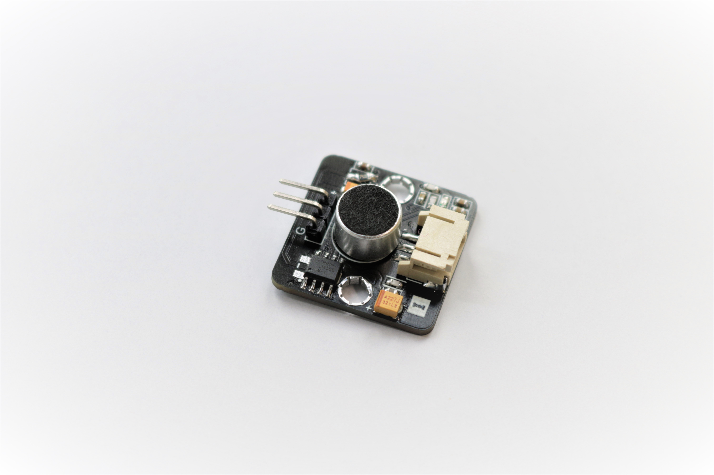

# 聲音傳感器

## 簡介
聲音傳感器使用了咪高峰及放大器去檢測出環境音量。透過錄取聲波後進行放大,就能用電壓的方式傳遞聲音訊號到發開板上。當接受到訊號後,就可以利用振幅計算結果。

## 原理
聲音傳感器結合了咪高峰及放大器。錄取從空氣中傳播的聲波,然後利用lm386放大器去令微少振幅的聲波變得可偵測及輸出到開發板。 

## 規格
* 供應電壓: 3.3V - 5V
* 介面: 類比
* 輸出電壓: 0~3.5V
 
電壓(安靜時): 1.74~1.83V 
 

電壓(接收440hz聲波時): 0.98~2.58V 
 

## 針腳

|針腳|針腳|
|--|--|
|G|接地|
|V|電源供應|
|S|聲波電壓訊號輸出|

## 外觀及大小

大小: 25mm * 25mm

## 快速指引

* 連接傳感器到開發板(使用連接線)

* 打開Makecode, 使用[https://github.com/smarthon/pxt-smartcity](https://github.com/smarthon/pxt-smartcity)擴展

* 初始化OLED顯示屏及把傳感器讀取的數值顯示在OLED顯示屏上

讀取的數值將會在0至100之間

## 結果

當環境十分安靜時的情形 

當有人在說話時的情形 

## 數據表

[LM386-datasheet](https://www.ti.com/lit/ds/symlink/lm386.pdf)
