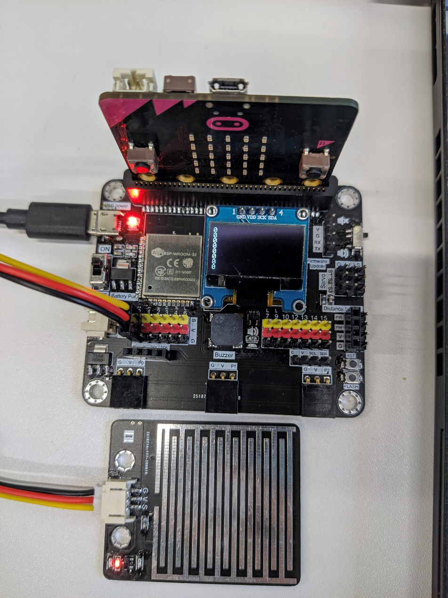

# RainDrop Sensor

## Introduction
Raindrop sensor use the Conductivity to determine the rain drops is on the board or not, when there are no liquid on the board, the reading will be very small (0 if no liquid), however even one drop of rain, can increase the conductivity very much and make the reading to extremely high (100). 

## The principle
The RainDrop Sensor use the conductivity between the two electrodes to determine the change of the water drop on the plane. When there is no water drop on the plane, the material between the two electrodes is air, result in very low conductivity.  However, when the water drop is on the plane, the conductivity between the electrodes will become very high since water is a good conductor.  

## Specification 
* Supply Voltage: 5V
* Interface: Analog
* Range: 0(Dry surface) ~ 100(WaterDrop on surface)

## Pinout Diagram

|Pin|Function|
|--|--|
|G|Ground|
|V|Voltage Supply|
|S|RainDrop Signal Output|

## Outlook and Dimension

Size: 50mm X 40mm

## Quick to Start/Sample

* Connect the sensor to development board (using wire)

* Open Makecode, using the https://github.com/smarthon/pxt-smartcity PXT 

* Initial the OLED screen and show the reading of the raindrop sensor

## Result

When there are no water on board, the reading is 0

After put one waterdrop on that, the reading getting close to 100

