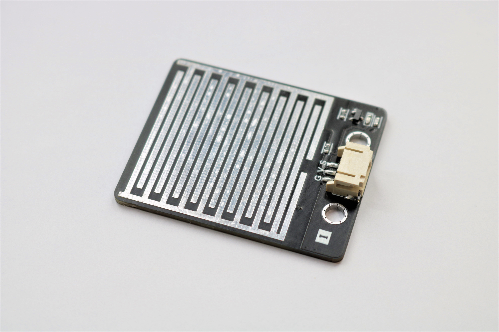
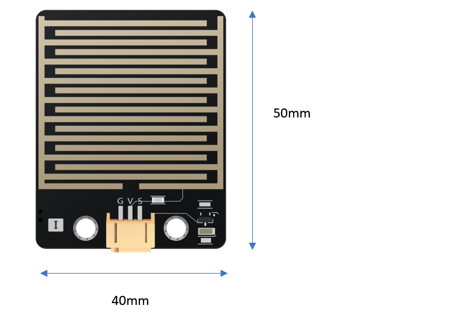
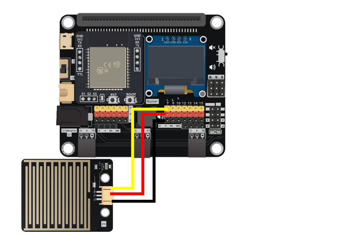
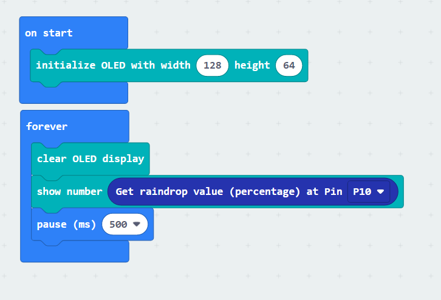
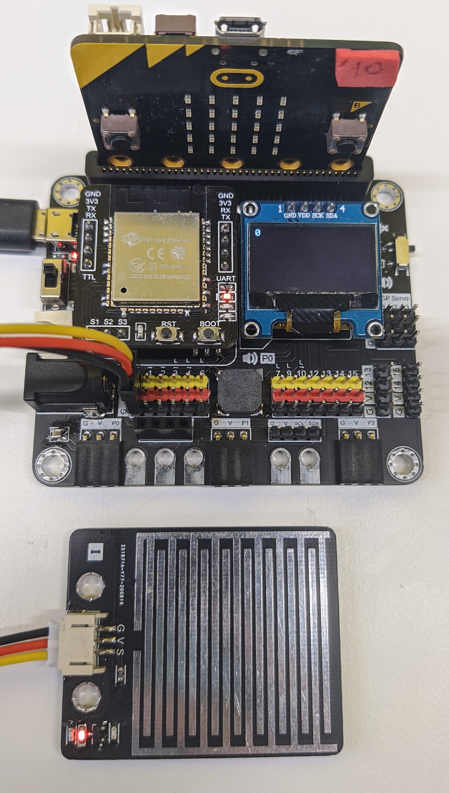
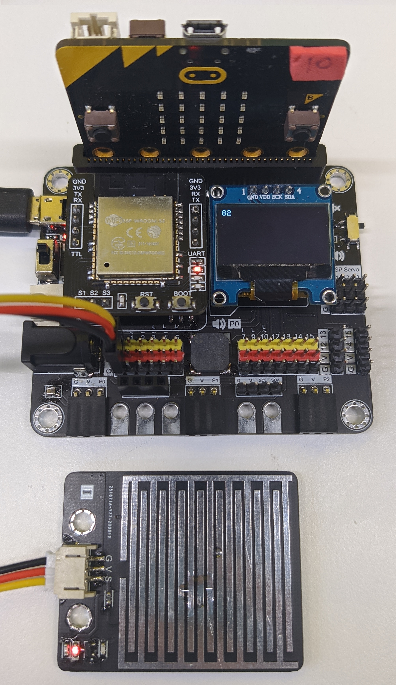

# 雨水傳感器

## 簡介
雨水傳感器利用導電率這物理特性去檢測傳感器上是否有雨水。當沒有雨水上面時,讀取的數值會相當小(0)。當雨水在上面時,其導電性會令讀數變得非常大(100)。

## 原理
雨水傳感器利用兩個電極之間的導電率去決定板上是否有水滴存在。 
當沒有水滴(雨水)在板上時,電極之間只有絕緣性良好的空氣,所以導電率十分低。 
如果有水滴在板上,將會令兩個電極之間被水這種良好的導電體接通,令整體導體率提升。 

## 規格
* 操作電壓: 5V
* 介面: 類比
* 檢測數值範圍: 0(沒有水滴在板上) ~ 100(有水滴在板上)

## 針腳

|針腳|功能|
|--|--|
|G|接地|
|V|供應電壓|
|S|雨水感應訊號輸出|

## 外觀及大小

大小: 50mm X 40mm

## 快速指引

* 連接雨水傳感器到開發板上(使用連接線)

* 打開Makecode, 使用https://github.com/smarthon/pxt-smartcity 擴展

* 初始化OLED顯示屏並把傳感器讀取的數值顯示在顯示屏上

## 結果

當沒有水滴在板上時,讀數接近為0

當有水滴在板上時,讀數提升至接近100

