# 舵機 SG90 (180度/360度)

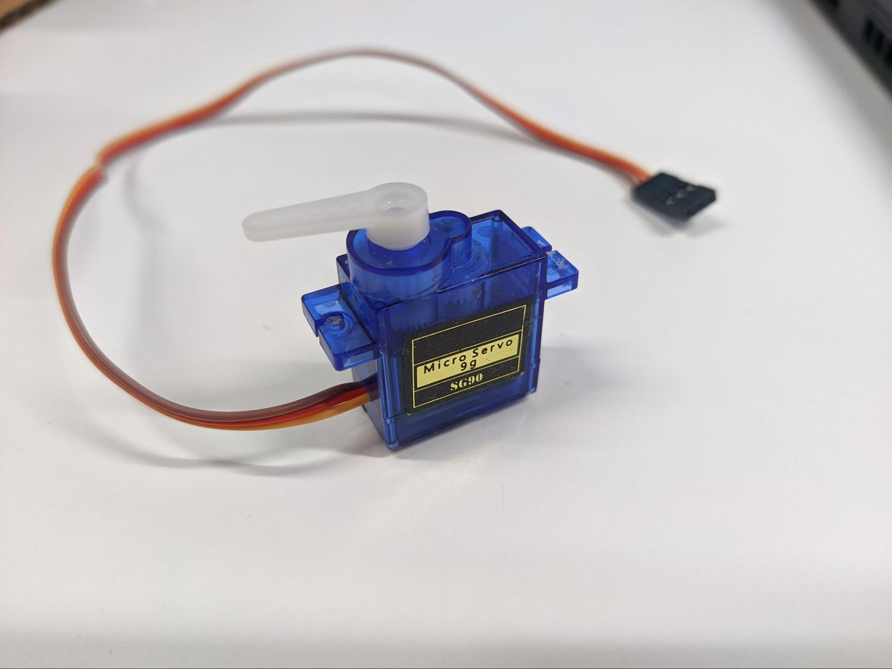
## 簡介
SG90舵機使用了小型、輕量級的馬達。180度舵機可以調整至不同角度，而360舵機則可旋轉。

## The 原理
舵機馬達接收PWM訊號，然後按照輸入訊號的工作週期來移動。 
SG90舵機的工作週期 (亦稱為脈波寬度)是500至2500微秒。按照工作週期的數值區間，舵機有不同的移動方式。
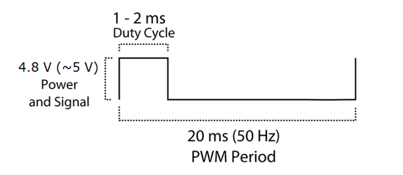

### 180度舵機

工作週期各數值區間所代表的舵機移動角度 

|工作週期(微秒)|角度|
|--|--|
|500|0°|
|833|30°|
|1166|60°|
|1500|90°|
|1832|120°|
|2165|150°|
|2500|180°|

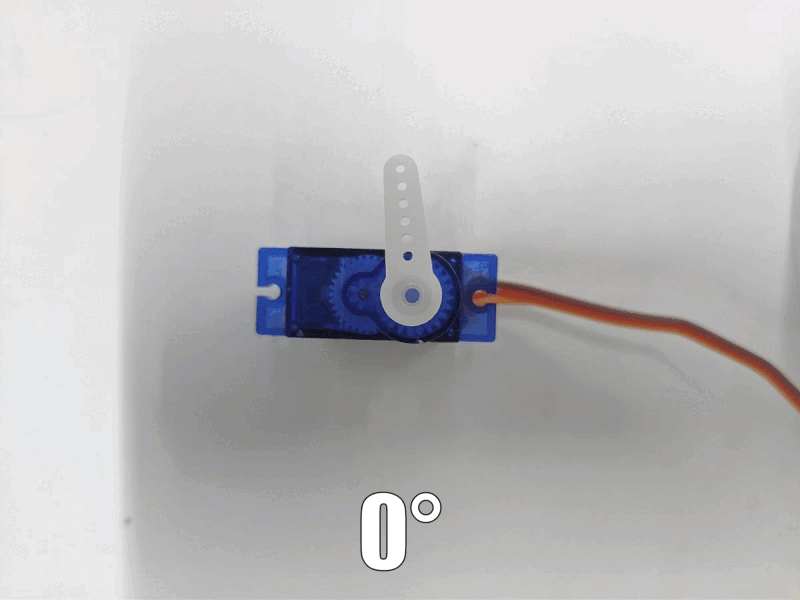

### 360度舵機

360度舵機和180度舵機的工作週期範圍不同。在360度舵機上，工作週期各數值區間代表了舵機的移動方向和速度。 

|工作週期(微秒)|方向|速度|
|--|--|--|
|1000|順時針|100%|
|1166|順時針|60%|
|1333|順時針|30%|
|1500|不適用|停止|
|1666|逆時針|30%|
|1832|逆時針|60%|
|2000|逆時針|100%|

## 規格
* 操作電壓: 4.8V (~5V)
* 重量: 9克
* 操作速度: 0.1秒 / 60度
* 堵轉力矩: 1.8kgfcm
* 介面：PWM 訊號
* PWM週期: 20ms(50Hz)
* 工作週期: 500µs ~ 2500µs
* 操作角度: 0 ~ 180度 (180度舵機) / 不適用 (360度舵機)
* 温度範圍: 0 ~ 55°C

## 針腳

|針腳|功能|
|--|--|
|G|接地|
|V|電源供應|
|S|輸入 (有工作週期的PWM訊號)|

## 外觀及大小
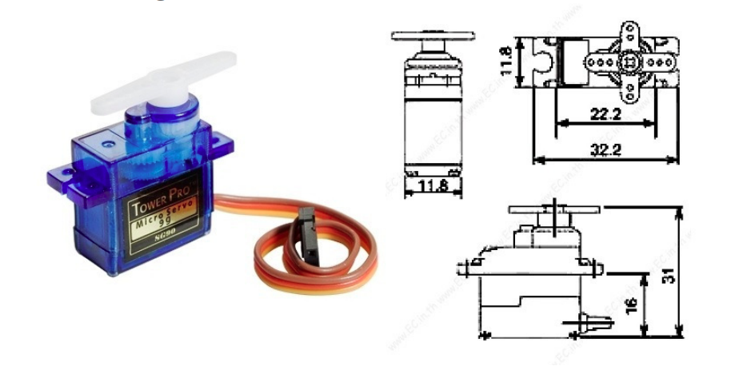

大小: 32mm\*12mm\*32mm

## 分辨180度和360度舵機
檢查接駁了線材的舵機側面，如果舵機內有綠色可變電阻器，便是180度舵機。

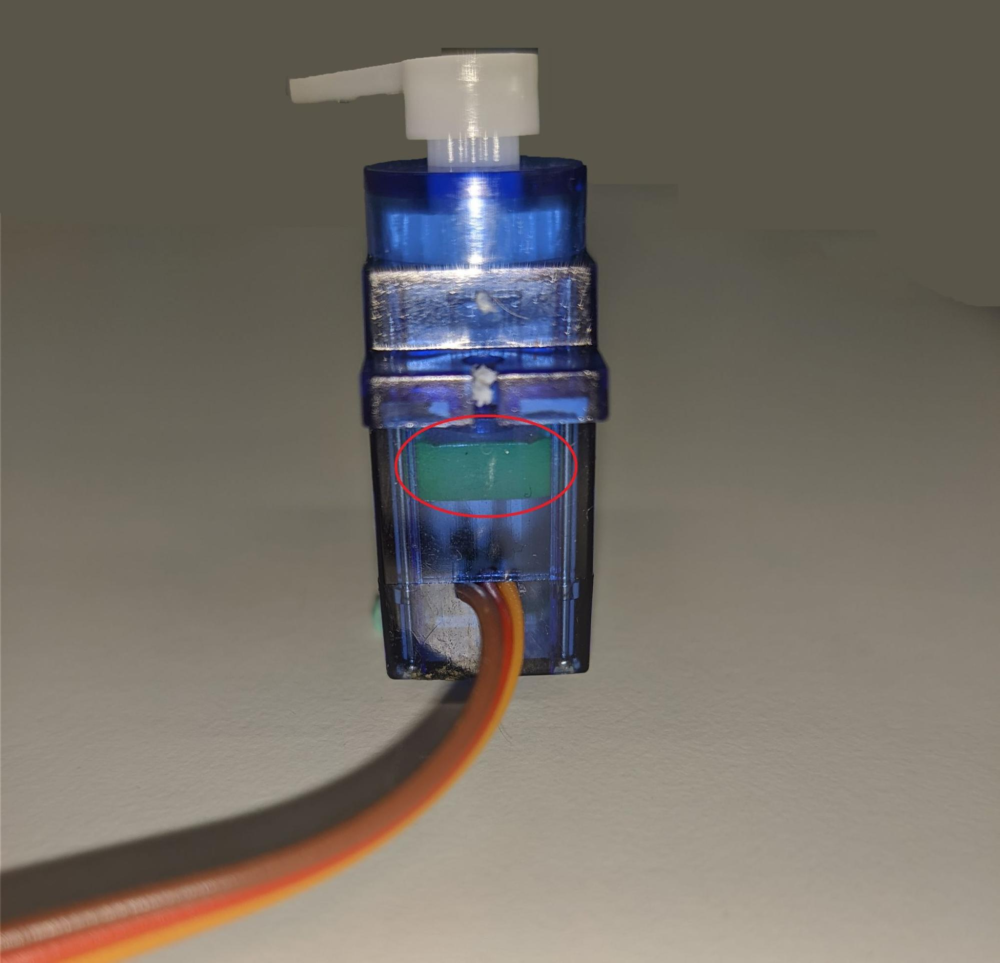

如果舵機內沒有綠色可變電阻器，便是360度舵機。

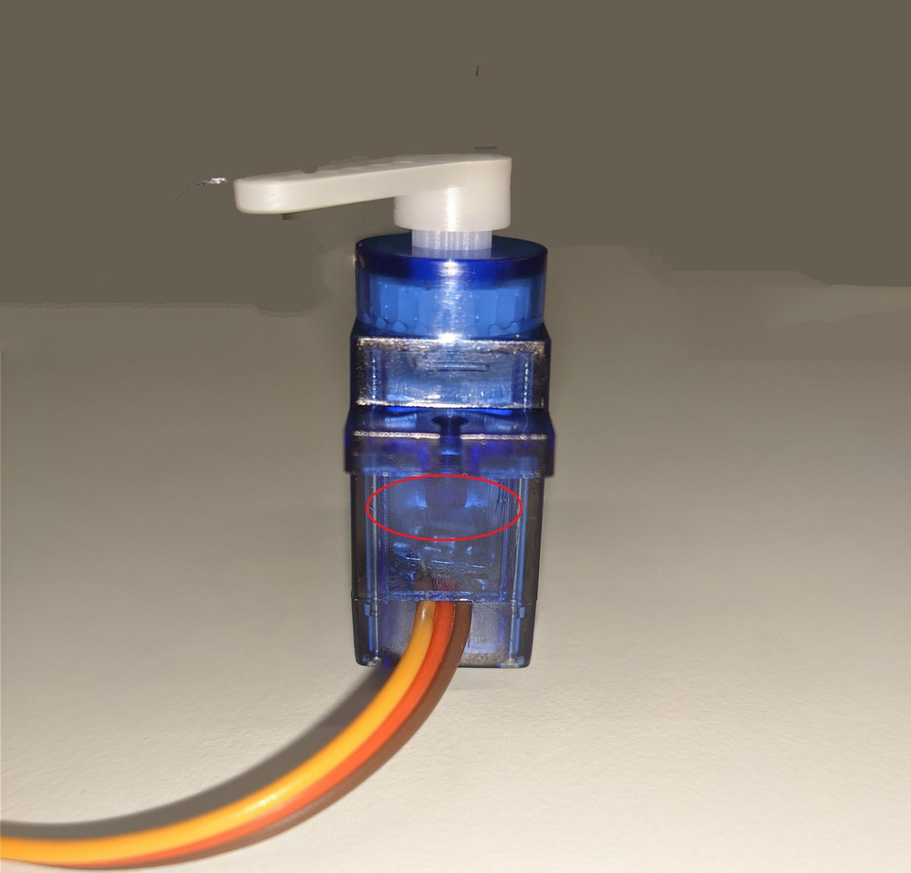

## 快速指引

* 連接舵機到開發板上 (直接插入或用線材連接)
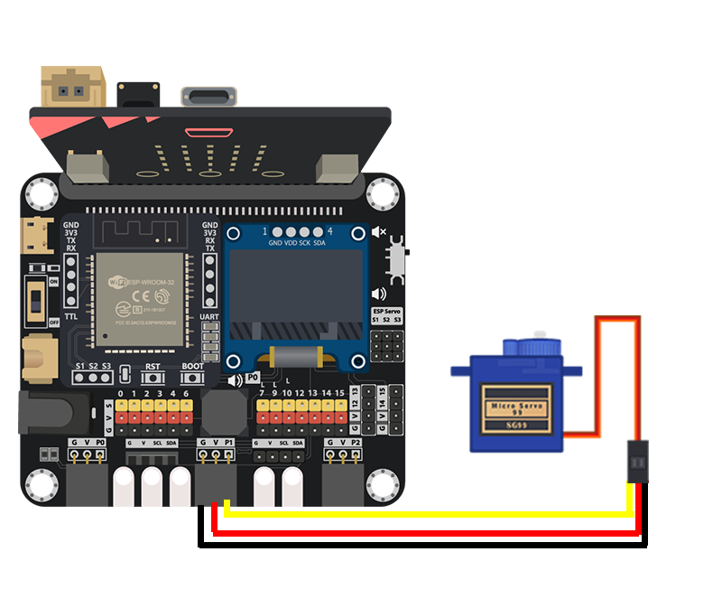

* 打開 Makecode，使用 [https://github.com/smarthon/pxt-smarthome](https://github.com/smarthon/pxt-smarthome) PXT擴展 

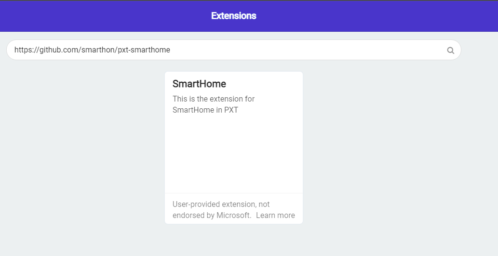

<H3>PXT擴展提供了兩個積木來控制舵機，它們分別可以設定舵機移動至特定位置或旋轉。</H3>

用家可以控制180度舵機移動到特定角度

* 使用 `Turn 180° Servo to 135 degree at P1` 來設定舵機移到135度
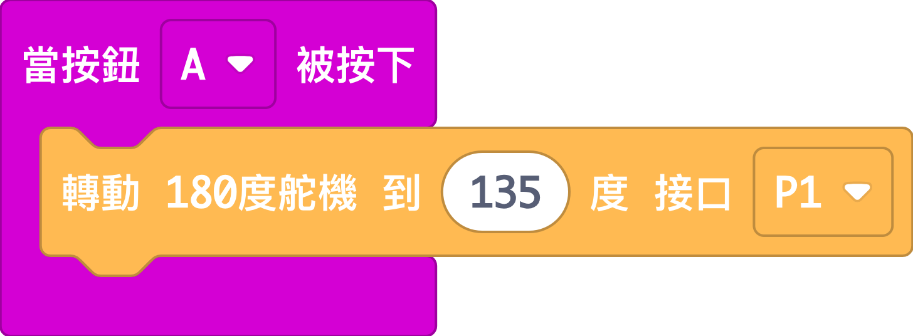

用家可以控制360度舵機旋轉方向和速度

* 使用 `Turn 360° Servo with clockwise direction speed Level 3 at P1` 來設定舵機順時針以最高速旋轉
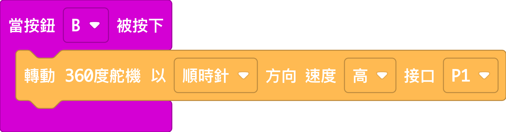

## 結果
如果連接了180度舵機，按下按鈕A後，180度舵機會移到135度
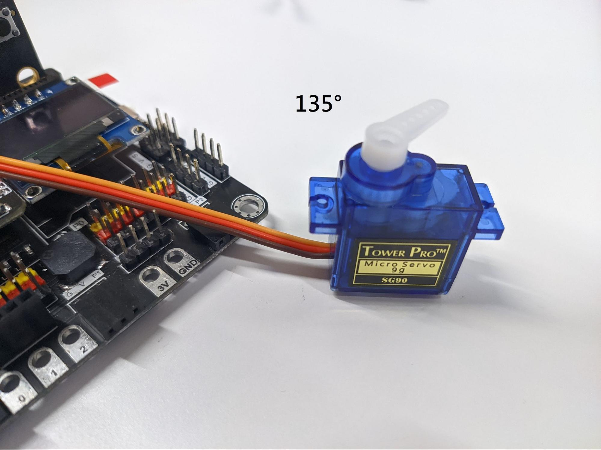

如果連接了360度舵機，按下按鈕B後，360度舵機會順時針以最高速旋轉
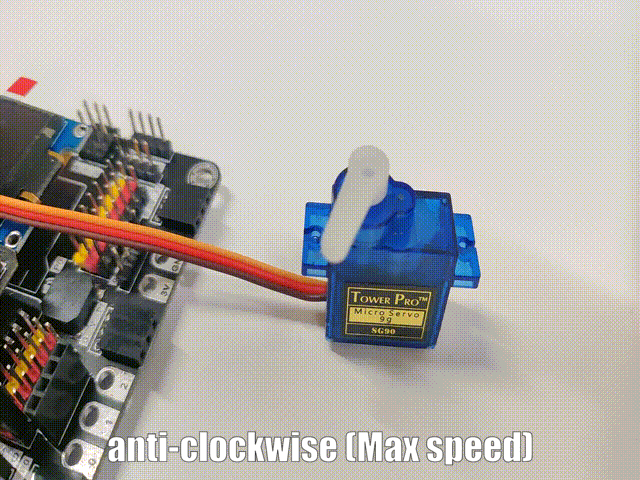

## 數據表
[SG90](https://content.instructables.com/ORIG/FA2/O1SS/J7ARLNBW/FA2O1SSJ7ARLNBW.pdf)
