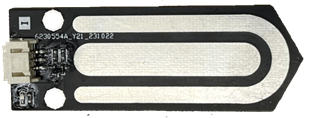
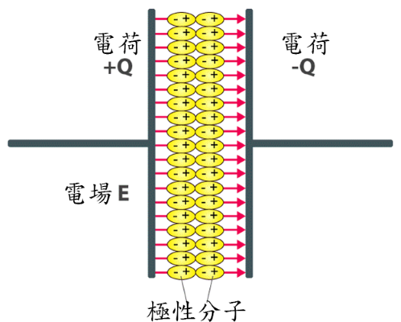
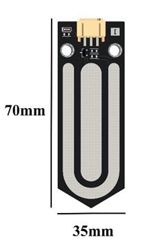
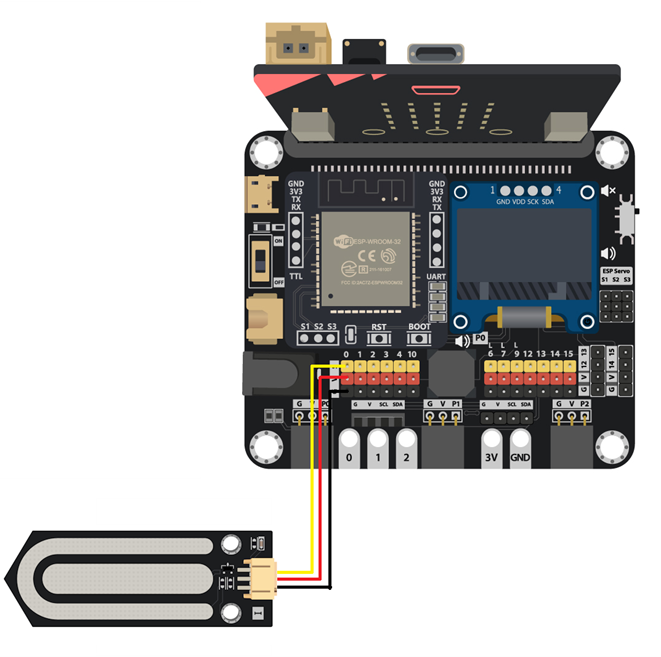
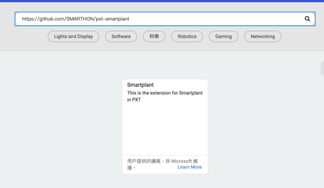
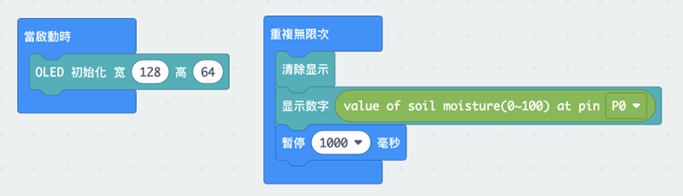
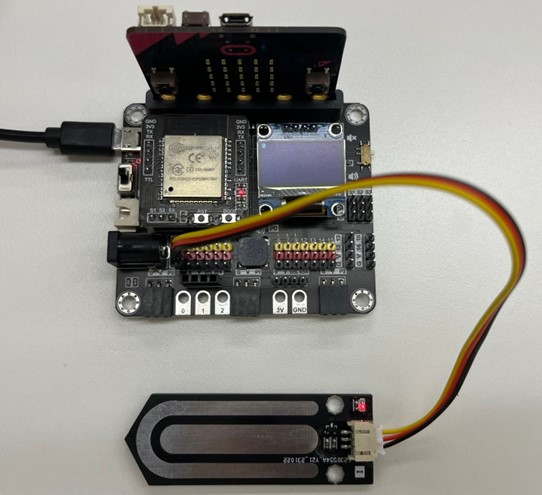
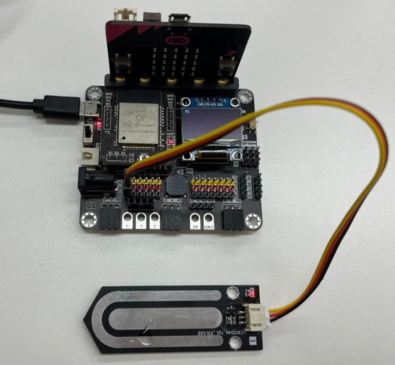

土壤濕度傳感器
==============

## 簡介

這款土壤濕度傳感器透過感測電容來監測土壤的濕度。每當電容器正負極之間的區域有水，傳感器就可以探測出濕度，讀數介乎 0 至 100%。  

## 原理

土壤濕度傳感器上有一個外露的電容器，由正極板和負極板組成。當我們將傳感器插入土壤中，土壤就變成了介電質。 

 

電容器可以透過在兩塊極板上累積電荷來在電場中儲存電能，這種儲存電荷的能力稱為電容。 

由於水的介電常數（電容率）比空氣高，因此它在電場中比空氣更容易極化。 當土壤潮濕時，電容就會上升。 

 

透過測量電容的變化，即可得知土壤濕度。 

## 規格

供電電壓：5V 
介面：模擬 
原始值回傳：0 - 1023  
Makecode 擴展回傳：0 - 100%   

## 針腳

| 針腳 | 功能 |
| -- | -- |
| G | 接地 |
| V | 電源供應 |
| S | 訊號輸出（模擬） |

## 外觀及大小

 

大小：35mm X 70mm 

## 快速指引

- 連接土壤濕度傳感器到開發板上（使用連接線材） 

  

- 打開Makecode，使用 <https://github.com/SMARTHON/pxt-smartplant> 擴展 
  

- 啟動 OLED 螢幕並顯示土壤濕度的讀數。  
 

- 讀數的範圍介乎 0 到 100。 

## 結果

當傳感器偵測不到水時 

  
當傳感器變濕時 

  

## FAQ

Q：為什麼我給植物澆水後傳感器的讀數仍然很低？ 
A：傳感器與土壤充分接觸可以獲得更準確的濕度讀數，請檢查土壤是否有覆蓋外露的電容器。  

Q：我可以使用傳感器來檢測其他介質的濕度嗎？ 
A：此傳感器僅設計用於檢測土壤中的濕度，它不適用於其他情況。 

