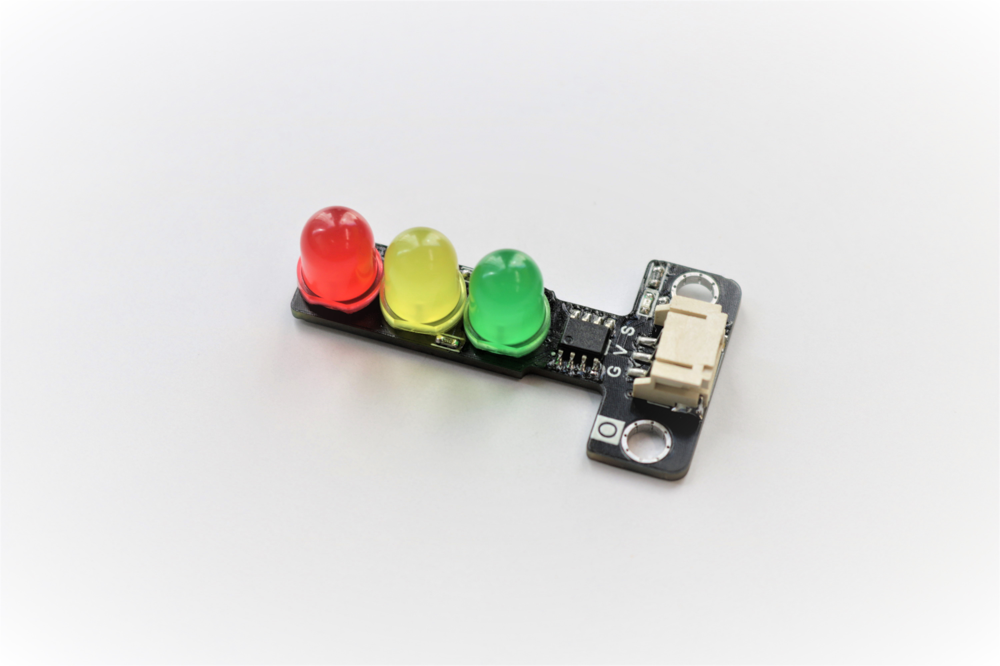
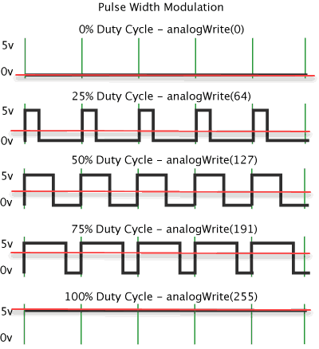
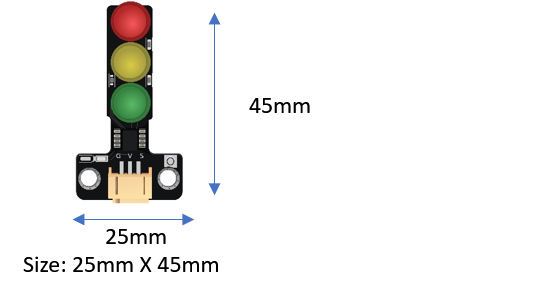
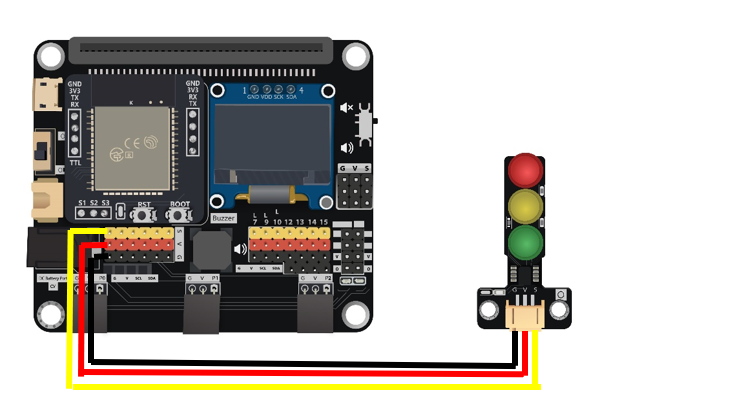
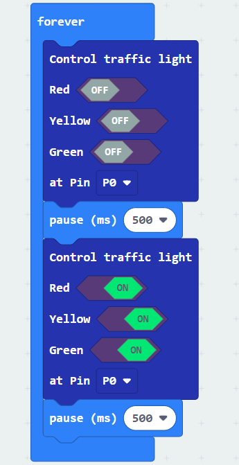

# Traffic Light

## Introduction
The traffic light module including three different colors LED which are red, yellow and green color, like the real-life traffic light. When received different frequency of PWM signal, it will provide different pattern of light.

## The principle

Most of the traffic light module on market will using the concept of common anode to make it easy to use. However, it required 4 pin on the module(3 signal and 1 ground) and consume 3 control pin from the controller, make it become heavy and hard to use on some tiny device. When using PWM method instead of common anode, it can reduce to 3pins and only consume 1 signal pin form the controller, more suitable for the tiny project.

The PWM signal can represent in the average voltage output, or duty cycle % in one complete cycle. This module will control by the duty cycle method. The chip on the traffic light module keep recording the incoming PWM signal and distinguish the “states” of traffic light by the preset duty cycle % level table. Then control the turn on /off states of the three LED lights.

## Specification 
* Supply voltage: 3.3V~5V
* Interface: Analog/Digital PWM

Duty Cycle: 

|Duty cycle(%)|Light|
|--|--|
|<5|OFF: Red Yellow Green|
|5~12.5|ON: Green OFF: Red Yellow|
|12.5~25|ON: Yellow OFF: Red Green|
|25~37.5|ON: Yellow Green OFF: Red|
|37.5~50|ON: Red OFF: Yellow Green|
|50~62.5|ON: Red Green OFF: Yellow|
|62.5~75|ON: Red Yellow OFF: Green|
|>75|ON: Red Yellow Green|

## Pinout Diagram

|Pin|Function|
|--|--|
|G|Ground|
|V|Voltage Supply|
|S|Signal Input (PWM Voltage)|

## Outlook and Dimension

Size: 25mm X 45mm

## Quick to Start/Sample

* Connect the sensor to development board (using wire)

* Open Makecode, using the https://github.com/smarthon/pxt-smartcity PXT 

* Provide the corresponding PWM signal

## Result
The traffic light will turn on and off

## FAQ

Q: Why the lights is out of control? 
A: Check the PWM signal duty cycle is fit the requirement or not. Also be care the change of light status should not too quick, at least wait for 1 second.

