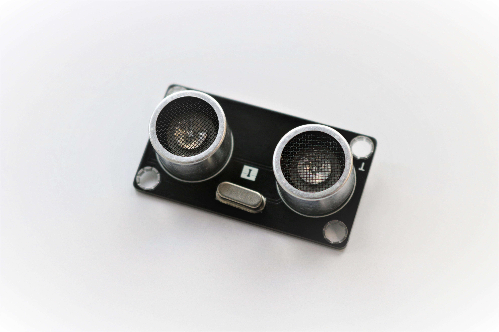
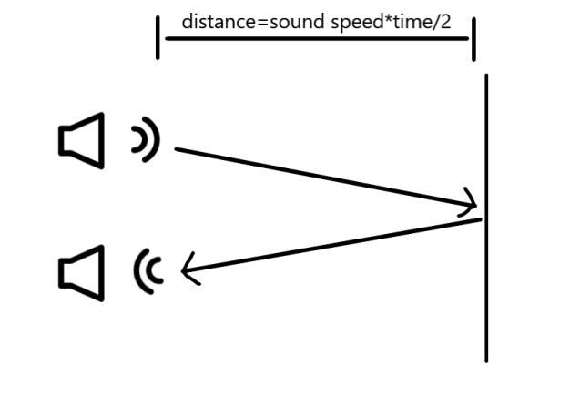
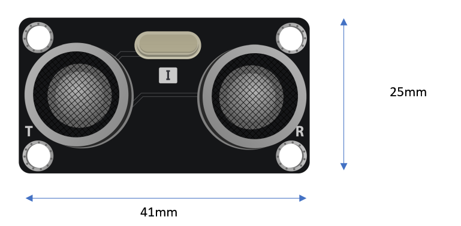
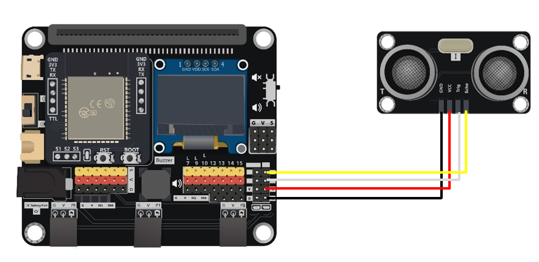
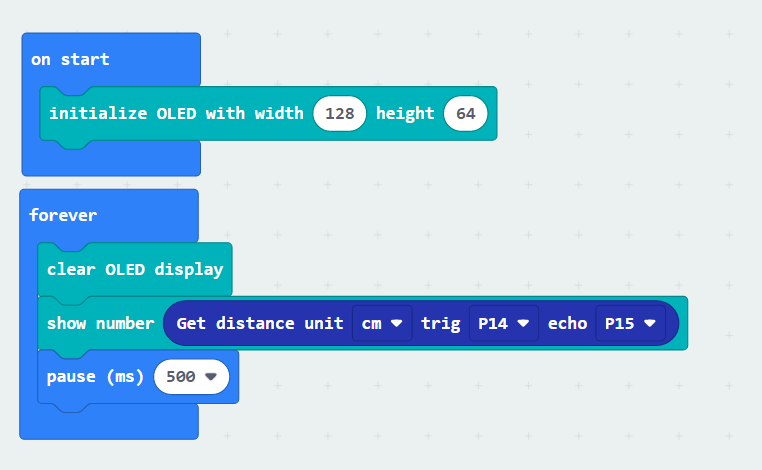

# Ultrasonic Distance Sensor US-025A

## Introduction
The Distance sensor using two ultrasonic sensors to detect the distance between current position and object. In most situation, the availability of ultrasonic allow it provided quick and accurate result.

## The principle
The Distance sensor use the ultrasonic to measure the distance between the sensor and object. When the sensor emit a wave of ultrasonic wave, it will start passing thought the air until it hit the object, then rebound and back to the receiver. The sound wave travel in the air is approximately 340meter per second, with it, use the interval time between sent and received can calculate the distance. 

## Specification 
* Supply voltage: 5V
* Working Frequency: 40kHz
* Range: 3cm to 4m 
* MeasuringAngle: <15°

## Pinout Diagram

|Pin|Function|
|--|--|
|GND|Ground|
|VCC|Voltage Supply|
|Trig|Starting trigger signal Input|
|Echo|Response signal Output|

## Outlook and Dimension

Size: 41 X 25mm

## Quick to Start/Sample

* Connect the sensor to development board (using wire)

* Open Makecode, using the https://github.com/smarthon/pxt-smartcity PXT 

* Initial the OLED and show the distance value on the OLED screen

## Result

The Distance will be increasing when moving out the hand from sensor

## FAQ

Q: Why I cannot get the correct reading in far distance? 
A: Because of the ultrasonic sender and receiver both on the board, limited by the physical reason, the reflection angle of the object will affect the result correctly, especially when the distance is far, little reflection angle can create large displacement of mainstream, so please adjust the angle of detection.

