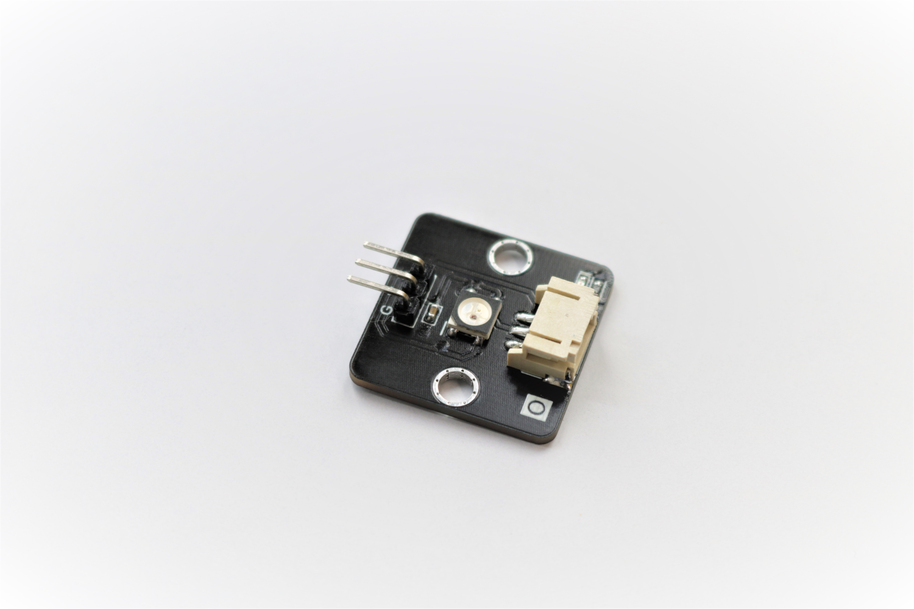
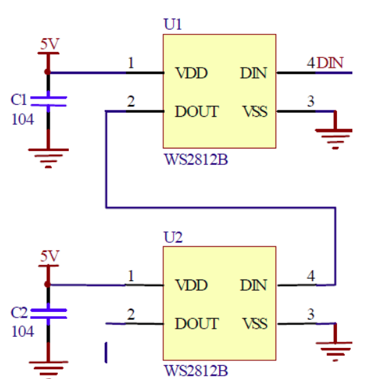
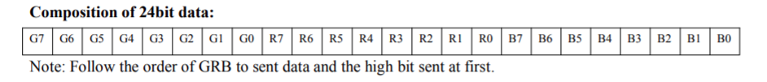
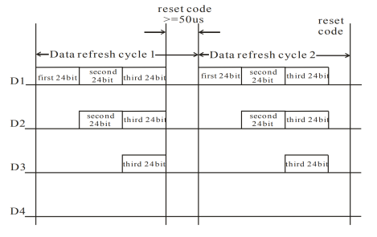
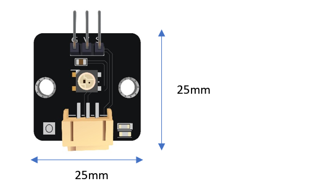
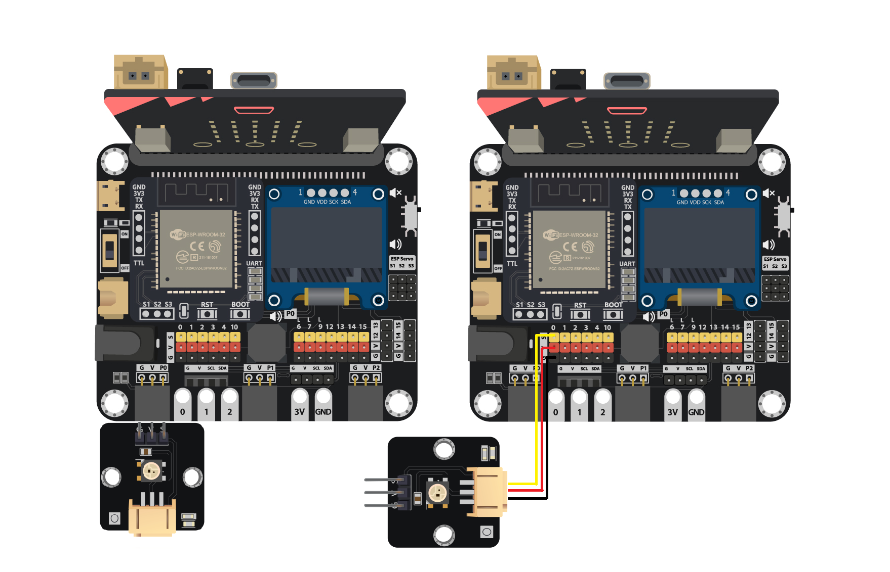
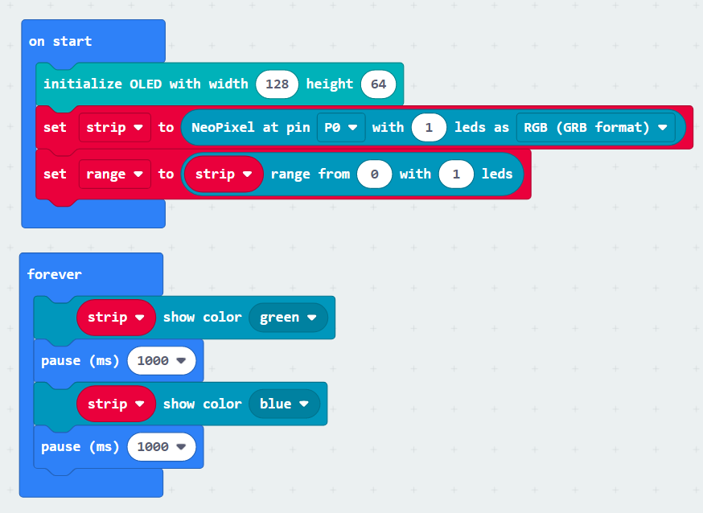

# 彩色LED燈(WS2812)

## 簡介
彩色LED燈(WS2812)是一種內置控制晶片的LED燈,能夠依RGB值產生出不同的燈光。通過編程發出控制訊號,使用者能夠在1600萬種顏色中選擇想要展示的顏色。

## 原理

WS2812包含一塊微小的控制晶片,能夠通過序列埠與開發板進行溝通,接收指定的數據然後控制燈光。當中傳輸的數據需要按照特定的格式去表達不同數值。 

WS2812同時擁有數據輸入端及輸出端,可利用數據線連接到另一WS2812的輸入端,把複數的WS2812串連在一起。這樣的好處是只需要把單一的輸入端連接到第一塊WS2812,即可以獨立控制串聯上所有的WS2812晶片。

每一塊WS2812都有3粒 8bit LED(紅,藍,綠),因此每次需要傳輸24bit的數據到WS2812。 

當24bit的數據被WS2812讀取後,餘下的數據(如有)將會經輸出端傳送給下一塊WS2812,因此,每一塊WS2812都能接收到獨立的數據而發出不同的顏色。在一輪的數據傳輸中,當最後的一段24bit數據後應該添加一段50微秒的重設碼,讓WS2812知道數據傳輸完畢及發光。

## 規格
* 供應電壓: 3.3V 至 5V
* 介面: 數位 
* 顏色範圍: (0,0,0) 至 (255,255,255)

## 針腳

|針腳|功能|
|--|--|
|G|接地|
|V|電源供應|
|S|訊號輸入(數位)|

## 外觀及大小

大小: 25mm * 25mm

## 快速指引

* 連接傳感器至開發板上(直接插入或使用連接線)

* 打開Makecode, 使用https://github.com/smarthon/pxt-smartcity 擴展 

* 利用PXT擴展去控制WS2812 LED發出不同顏色

## 結果

WS2812會依照程式改變顏色

