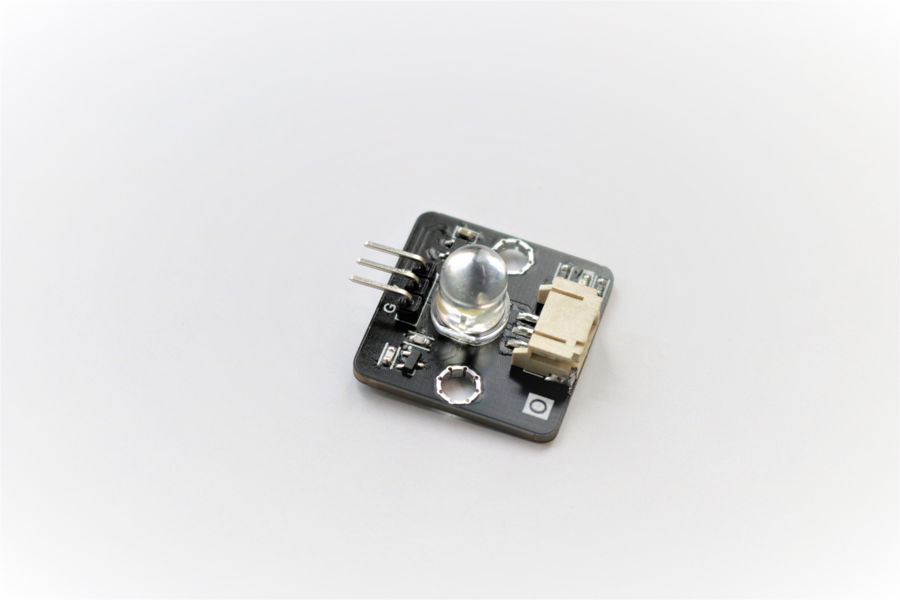
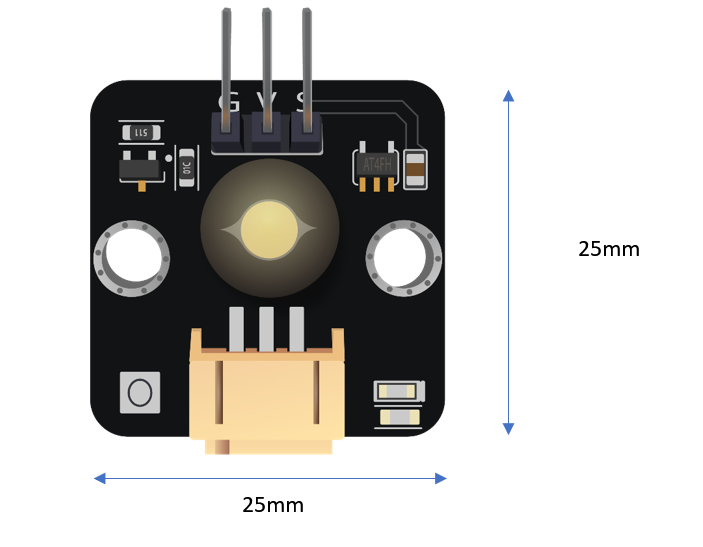
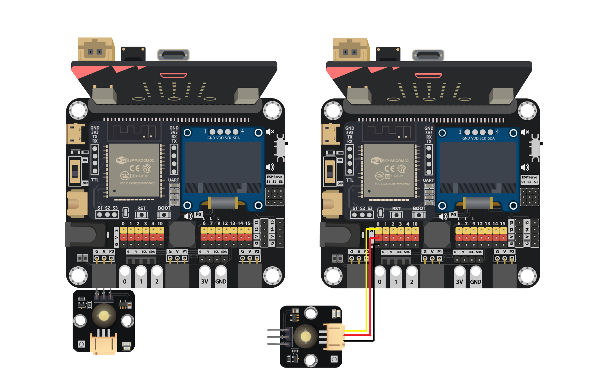
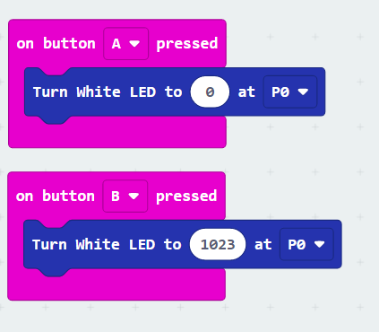
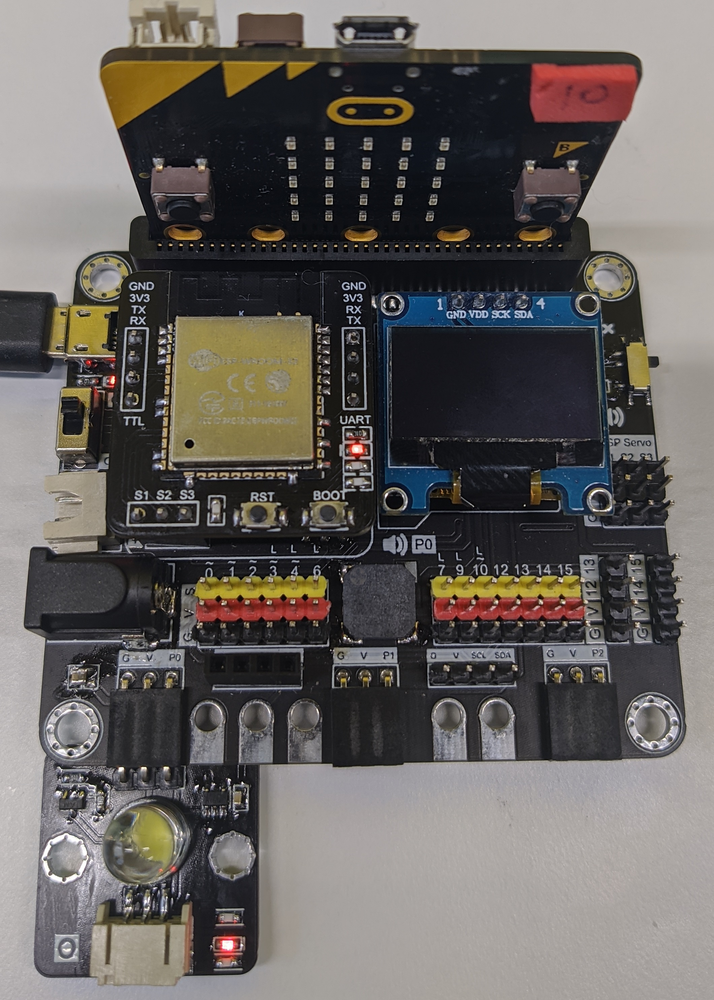
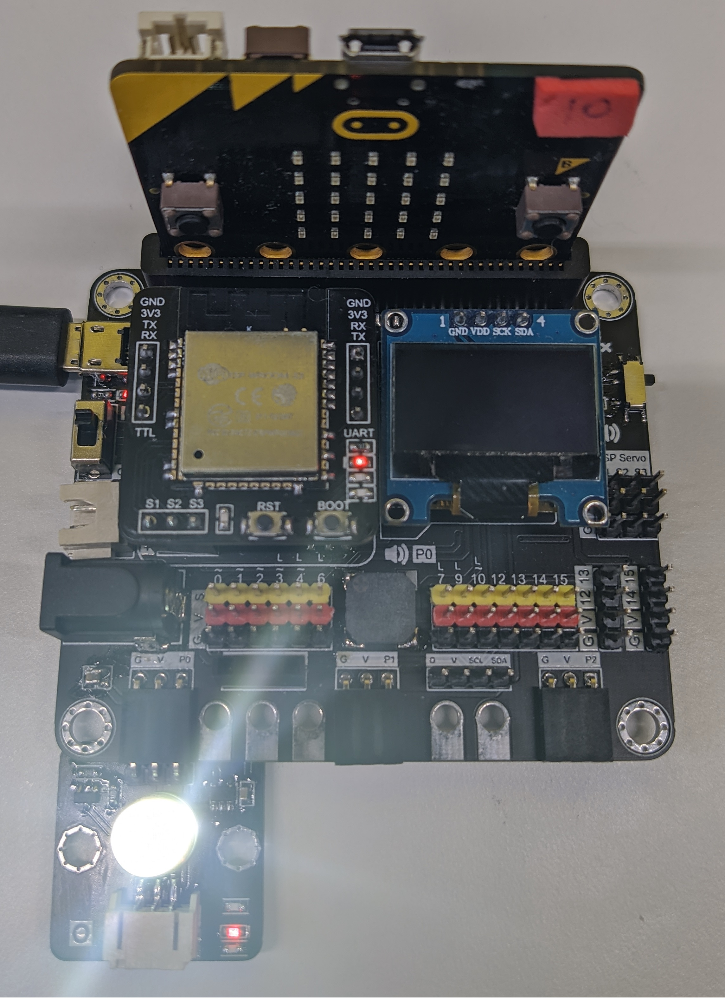

# 白色LED

## 簡介
白色LED模組使用了高效能LED燈,能夠用作照明,表達程序狀態,或是製造視覺效果。簡單的操作方式,透過改變電壓就能夠控制亮度。

## 原理
LED全稱發光二極體,通過電場發光理論,當電流通過時,電子會與元素間的電洞進行複合過程,電子流失能量時會以光的形式釋放能量。光的顏色根據二極體的不同成份而有所不同。

## 規格
* 操作電壓: 3V ~ 5V
* 功率: 0.06W
* 效能: 90 lm/W

## 針腳

|針腳|功能|
|--|--|
|G|接地|
|V|電源供應|
|S|訊號輸入(數位/類比)|

##  外觀及大小

大小: 25mm * 25mm

## 快速指引

* 把白色LED燈連接到開發板上(直接插入或使用連接線)

* 打開Makecode, 使用 [https://github.com/smarthon/pxt-smartcity](https://github.com/smarthon/pxt-smartcity) 擴展 

* 設定不同按鈕去開或關LED

## 結果
按A按鈕去關閉LED(設成0)

按B按鈕去打開LED(設成1023)

