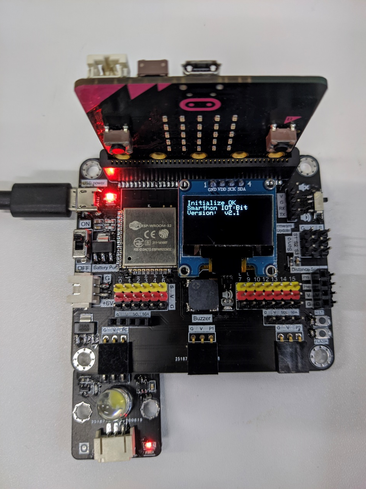

# White LED

## Introduction
White LED module build in a high-performance LED for different usage, such illuminate, express program status, or make visual presentation. User just need to provide voltage, then can control the brightness by the corresponding input.

## The principle
The LED is a two-lead semiconductor light source. Under electroluminescence theory, when a suitable voltage is applied to the leads, electrons are able to release energy in the form of photons, which means emit of light. The color of light emitted depend on the energy level drop when doing electroluminescence, it is relative to material of the semiconductor.

## Specification 
* Operate voltage: 3 - 5V
* Power consumption: 0.06W
* Efficiency: 90 lm/W

## Pinout Diagram

|Pin|Function|
|--|--|
|G|Ground|
|V|Voltage Supply|
|S|Signal Input(Digital/Analog)|

## Outlook and Dimension

Size: 25mm X 25mm

## Quick to Start/Sample

* Connect the sensor to development board (direct plugin or using wire)

* Open Makecode, using the https://github.com/smarthon/pxt-smartcity PXT 

* Set different buttons to on/off the LED

## Result
Press A button the turn off the LED (set to 0)

Press B button the turn on the LED (set to 1023)

