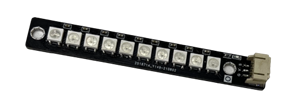
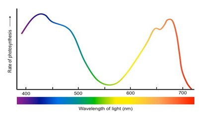
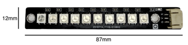
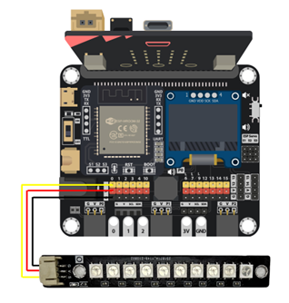
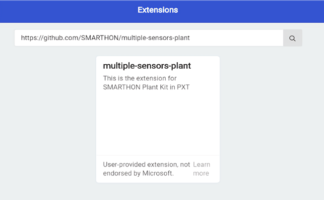
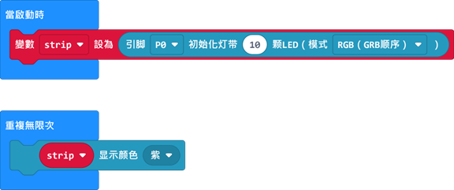
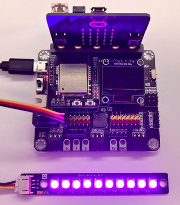

# LED植物生長燈

## 簡介

LED 植物生長燈可以發出植物進行光合作用所需的不同顏色（波長）的光,為室內植物提供補充光源。

## 原理

LED 植物生長燈由10個WS2812 LED模組組成。WS2812是一種可編程的LED,可以產生各種顏色。每個WS2812 LED包含三個獨立的LED：一個紅色、一個綠色和一個藍色。它的模組中嵌入了一個控制芯片,可以單獨控制每個RGB LED的強度。 
關於WS2812的詳細工作原理,請參考[多色LED (WS2812)]。

**光譜**
植物使用葉綠素吸收光並通過光合作用將其轉化為化學能量。植物的光合作用主要在光譜中的紅色和藍色區域進行; 在生長階段時主要使用藍光（400-490 nm）,而在開花和結果階段則主要使用紅光（580-700 nm）。 
通過編程WS2812,我們可以增加紅色和藍色LED的強度,同時保持綠色LED關閉,提供對植物生長和健康最有益的波長,而混合紅光和藍光會產生紫光。

## 規格

- LED 型號：WS2812 * 10
- 電源電壓：6 ~ 7V
- 存儲溫度：-55 ~ +150℃

|發出顏色|波長(nm)|
|--|--|
|紅色|620 - 630|
|綠色|515 - 530|
|藍色|465 - 475|

## 針腳

|針腳|功能|
|--|--|
|G|接地|
|V|電源供應|
|S|訊號輸入(數位/類比)|

## 外觀及大小
 
大小: 12mm X 87mm

## 快速指引

- 使用導線將LED植物生長燈連接到開發板。 

- 打開Makecode, 使用 [https://github.com/SMARTHON/pxt-smartplant](https://github.com/SMARTHON/pxt-smartplant) 擴展 

- 初始化10個LED並將LED設置為顯示紫色。 

## 結果

LED生長燈發出紫光 
 

## FAQ
Q：我可以使用LED生長燈以外的顏色來照明我的植物嗎？ 
A：是的,您可以在PXT中選擇其他顏色,根據植物的需求提供適當的波長。

Q：為什麼我們需要為植物提供不同顏色的光？ 
A：植物在不同階段主要需要特定的波長,提供更多適當的波長可以幫助它們的生長和健康。

Q：LED燈應該離植物有多遠？  
A：通常離植物幾英寸的距離就足夠了,LED燈在工作時非常高效,產生的熱量很少,因此即使離植物很近,也不需要擔心LED燈會損壞植物。

Q：使用LED生長燈是否已足夠支持植物生長？  
A：WS2812 LED無法提供植物生長所需的所有波長,因為10個LED的光強度不高。因此建議將植物放在陽光充足的地方（例如靠近窗戶）。而當陽光較少或夜間時,可以使用LED生長燈提供輔助照明。

Q：傳統的植物生長燈和LED生長燈有什麼區別？  
A：傳統的植物生長燈通常是白熾燈或螢光燈的變種。它們通常提供全光譜的光線，照顧到植物生長的不同方面。此外，它們的光輸出通常比LED更高，這意味著您可能需要很多LED來替代一個傳統的植物生長燈，從而增加成本。然而，傳統的植物生長燈在工作時產生的熱量比LED更多，可能對植物造成風險。此外,LED燈也更節能且壽命更長。

## Datasheet

[WS2812-datasheet](https://cdn-shop.adafruit.com/datasheets/WS2812.pdf)