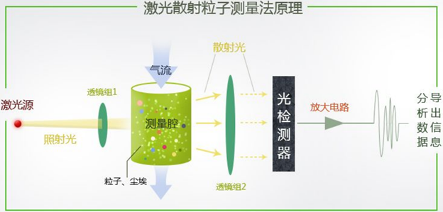
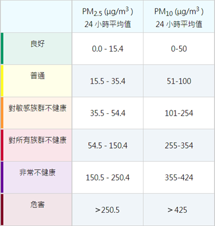
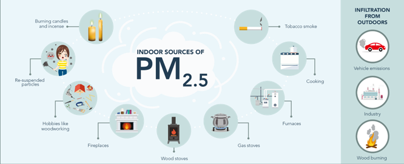
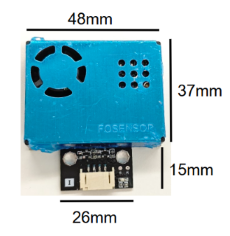
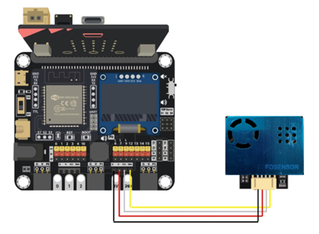
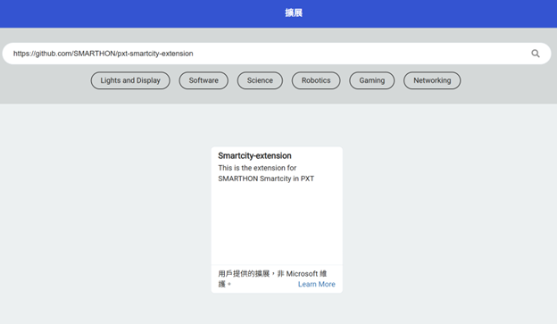
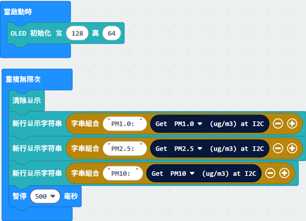
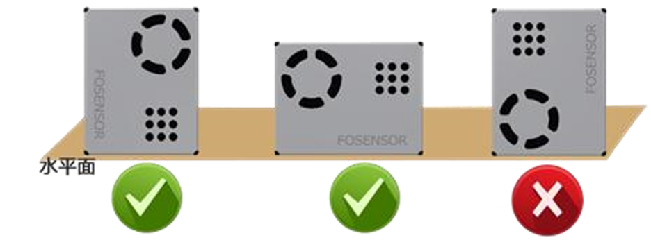

# 激光粉塵傳感器

 

## 簡介

激光粉塵傳感器是一種利用激光和光散射原理來測量空氣中粉塵濃度的儀器。 

## 原理

激光粉塵傳感器利用風扇產生穩定的氣流，以採集空氣。當含有粉塵顆粒物的空氣進入傳感器測量腔室時，激光會照射到這些顆粒物上。顆粒物會將激光向各個方向散射，散射光的強度與顆粒物的尺寸、數量和折射率有關。光電探測器接收散射光並產生電信號，電信號的強度與散射光的強度成正比。經過放大、濾波等處理後，電信號送入微處理器進行計算。微處理器根據光散射理論和米氏散射理論，計算出空氣中不同粒徑的顆粒物濃度。 

 

## 室內懸浮粒子濃度指標

 

 

## 規格

- 檢測類型：PM1.0、PM2.5、PM10 濃度 (μg/m3)
- 檢測範圍：0~500 μg/m3
- 最小解析度：1 μg/m3
- 數據精準度：0~100 μg/m3：±10 μg/m3 
&emsp;&emsp;&emsp;&emsp;&emsp;&emsp;&ensp;    : 101~1000 μg/m3：±10% reading
- 工作電壓：DC 5V
- 工作電流：≤100mA
- 檢測頻率：每秒更新數據 1 次
- 使用壽命：>40000 小時 (連續工作)

## 針腳

|針腳|功能|
|--|--|
|G|接地|
|V|電源供應|
|SDA|數據|
|SCL|時鐘|

## 外觀及大小

 
傳感器大小：48mm X 37mm 
整體大小：48mm X 52mm

## 快速指引

- 連接激光粉塵傳感器到開發板上（直接插入或使用連接線材） 

 

- 打開Makecode，使用 [https://github.com/SMARTHON/pxt-smartcity-extension](https://github.com/SMARTHON/pxt-smartcity-extension) 擴展  

 

- 初始 OLED 顯示屏，然後顯示不同大小粉塵的濃度 

 

## 結果

 

## 使用指引

- 開啟電源後傳感器的風扇會轉動，可從進出氣口觀察風扇有否轉動從而判斷傳感器是否運作。 
- 傳感器運作後需要預熱，預熱期間的測量結果不準確，所以請先等待約一分鐘，待數值穩定下來才讀取結果。 
- 如有數值顯示為 -1，代表傳感器沒有成功回傳數據，請檢查線路連接和風扇的轉動情況。 
- 切勿在未斷電情況下觸碰傳感器。 

## 注意事項

本傳感器適用於一般室內環境的粉塵顆粒物檢測，在實際使用中應注意以下事項： 

### 環境限制

- 避免油煙環境 (如廚房)：油煙中的油脂顆粒容易粘附在傳感器內部，影響其正常工作。 
- 避免粉塵濃度過大的環境 (如工地)：粉塵濃度過高會導致傳感器超載，影響測量精度。 
- 避免高濕環境 (如浴室)：高濕環境會導致傳感器內部元件受潮損壞。 
- 避免高溫環境：高溫會加速傳感器內部元件的老化，縮短其使用壽命。 
- 如要在上述環境中使用，應做好相應的防護措施，例如加裝濾網或防水保護。 

### 安裝注意

- 遠離粉塵源：應選擇空氣流通順暢、無明顯粉塵源的地方安裝。若安裝在粉塵源附近，應保持一定的距離，以免影響測量結果。 
- 遠離地面：建議放置高於地面 20cm 以上，因為地面往往有較多大塵埃顆粒甚至絮狀物，會纏繞傳感器的風扇。 
- 氣流暢通：確保傳感器的進出氣口氣流暢通，避免受強氣流直接衝擊，例如，勿安裝於風扇的前後方。安裝時注意不要遮蓋進出氣口以保證外部氣流可進入傳感器。以下為參考的安裝方式： 

 

## FAQ

Q：這個激光粉塵傳感器需要在使用前先校準嗎？ 
A：這個傳感器不需要校準，而且不具備校準模式。 

Q：讀數一直顯示為 0 正常嗎？ 
A：在通風、空氣清新的情況下顯示為 0 是正常現象。 

Q：為什麼讀數一直在改變？ 
A： 讀數會因為氣流、方向、濕度等環境因素的轉變而改變，尤其當室內有污染源，會導致該區域的粉塵濃度一直改變。 

## 數據表

[激光粉塵傳感器](http://www.ds-parts.co.kr/upload/goods/h1571117458_FS00202_1.pdf)