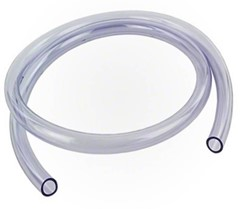

# 水泵（立式）

## 簡介

這款微型立式離心水泵將旋轉能量轉換為動能。水從底部吸水口進入，並從排水口離開。 

## 原理

水泵從底部吸水口吸入水，並從排水口排出水。在水泵內部，葉輪緊固於泵軸上。馬達驅動泵軸帶動葉輪一起作高速旋轉，迫使葉片間的水向外流動。當水撞擊到渦殼內壁時，動能會轉換成位能將水推出排水口。於是在葉輪眼形成了一個低壓區域，從吸水口再次吸入水。 

## 規格

* 型號：JT-DC-3L
* 工作電壓：2.5 - 6V
* 供電電壓：5V
* 介面：模擬
* 電流：200mA
* 功率：1W
* 最大揚程：61cm
* 最大流速：106公升/小時
* 啟動電壓：1V
* 防水等級：IP68
* 針腳端口類型：XH2.54

## 針脚

|針腳|功能|
|--|--|
|G|接地|
|V|電源供應|
|S|訊號輸出(模擬)|

## 外觀及大小

大小：25mm * 25mm

   
高度：42.6mm 寬：38.5mm 
 
長：35cm 內徑：6mm 

## 快速指引

* 連接水泵到開發板上（直接插入或使用連接線材） 

* 將水泵垂直放置在水下 

* 打開Makecode，使用[https://github.com/SMARTHON/pxt-smartplant](https://github.com/waterpump_image/SMARTHON/pxt-smartplant) 擴展 

* 設定不同按鈕以開啟/關閉水泵 

## 結果

按下按鈕 A 開啟水泵

按下按鈕 B 關閉水泵

## FAQ

Q：這款水泵是甚麼類型？ 
A：類型是立式的，而不是臥式的。

Q：為什麼水泵不運作？ 
A：可能有雜物卡在水泵裡。由於馬達的扭力有限，如果有雜物卡在齒輪中，則無法旋轉。請嘗試用牙籤從底部入口轉動葉輪以將雜物取出。

Q：水泵的壽命是多久？ 
A：這款水泵的操作壽命從 1 至 100 小時。一旦馬達內的碳刷磨損，水泵就會停止工作。使用者必須更換新的水泵。

Q：為什麼水泵裡面變黑了？ 
A：這是正常現象。當水泵長時間放置在水中，可能會有一些細菌使水泵內外的材料變質。

## 水泵不運作的原因
1. 水泵內有雜物。
2. 水泵的碳刷磨損，需要更換新的水泵。

## 數據表
[DC Motor 3V](https://m.eleparts.co.kr/data/goods_attach/202207/good-pdf-11902681-1.pdf) 
