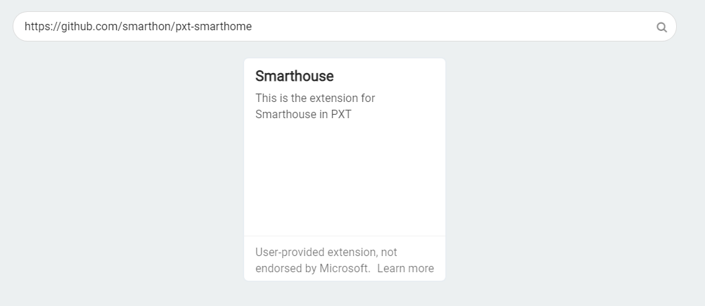
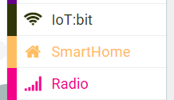

# 快速入門: 添加PXT擴展

第一步驟 

打開 [MakeCode](https://makecode.microbit.org)，建立一個新的專案 

第二步驟 

為專案命名 

第三步驟 

點擊  後選擇擴展 

 

第四步驟 

搜索 「[https://github.com/smarthon/pxt-smarthome](https://github.com/smarthon/pxt-smarthome)」 及點擊「smarthome」

第五步驟 

就能成功添加 `SmartHome` 和  `IoT:bit` 擴展 

