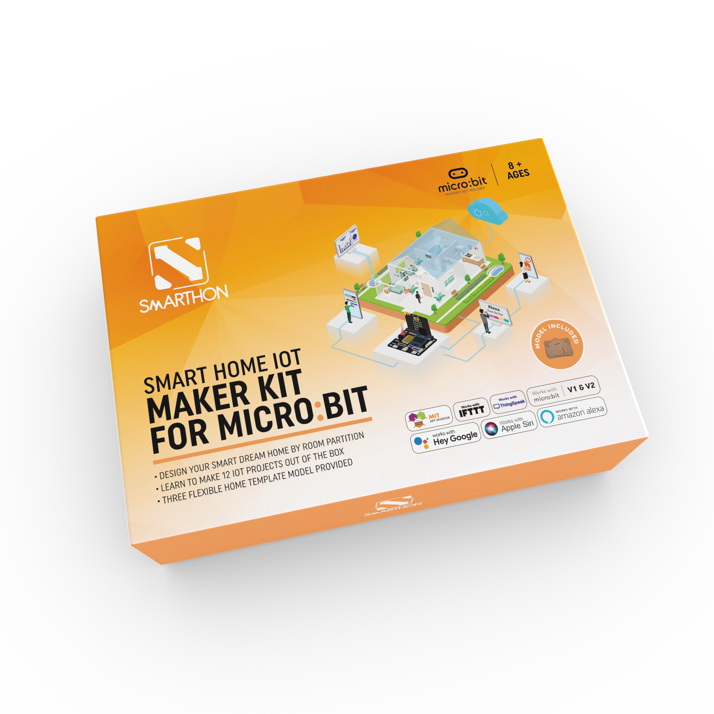

# 簡介

## 簡介

SMARTHON micro:bit 智能家居IoT創作套裝 旨在介紹智能家居概念，將物聯網 (IoT) 的應用引入日常生活。套件採用Smarthon IoT板，用家可以發揮創意，打造智能家居生活，讓您建構不同種類的智能家居功能。套件包含13個案例，由簡單至物聯網程度，包括智慧節能燈泡和家居健康監察系統等，應用於家居的不同位置如客廳、睡房、廁所、廚房及門位置。套件著重使用著創意發揮，附送的模型讓用家可以製作不同款式的房屋模型、容易添加設計，以減省手工時間專注於學習智能家居知識。 

 

## 應用場景

<H3>智慧節能燈泡</H3>

 

<H3>水滲漏偵檢系統</H3>

 

<H3>家居健康監察系統</H3>

 

如想知道更多應用場景，請參考說明書。

## 零件列表

| No. | 零件 | 數量 | 備註 |
| :-: | :-- | :--| :-- |
|  | Micro: bit | 1 | 不包括 |
| 1 | Smarthon IoT:bit | 1 |  |
| 2 | 風扇馬達 | 1 |  |
| 3 | 超音波距離傳感器 | 1 |  |
| 4 | 按鈕 | 1 |  |
| 5 | 火焰傳感器 | 1 |  |
| 6 | 彩色LED (WS2812) | 1 |  |
| 7 | 光度傳感器 | 1 |  |
| 8 | 運動傳感器 | 1 |  |
| 9 | 溫濕度傳感器 (DHT11) | 1 |  |
| 10 | 180° 舵機 | 1 |  |
| 11 | 360° 舵機 | 1 |  |
| 12 | 紙板模型 | 1 |  |
| 13 | 模組連接線 | 9 | 3腳\*8, 4腳\*1 |
| 14 | 延長線 | 8 | 3腳\*5, 4腳\*2, 舵機\*1 |
| 15 | M2\*10毫米 螺絲 | 12 |  |
| 16 | M3\*10毫米 螺絲 | 6 |  |
| 17 | M4\*10毫米 螺絲 | 30 |  |
| 18 | M2 螺母 | 12 |  |
| 19 | M3 螺母 | 6 |  |
| 20 | M4 螺母 | 30 |  |
| 21 | 萬字夾 | 3 |  |
| 22 | L型支架 | 2 |  |
| 23 | 縲絲批 | 1 |  |
| 24 | 萬用黏土膠 (Blu Tack) | 1 |  |
| 25 | 橡皮筋 | 1 |  |
| 26 | 窗簾紙布 | 1 |  |
| 27 | 窗簾鐵杆 | 1 |  |
| 28 | 鱷魚夾 | 2 |  |
| 29 | USB連接線 | 1 |  |
| 30 | 電池盒 (AA\*4) | 1 |  |
