# 案例 01：智慧節能燈泡

難度：
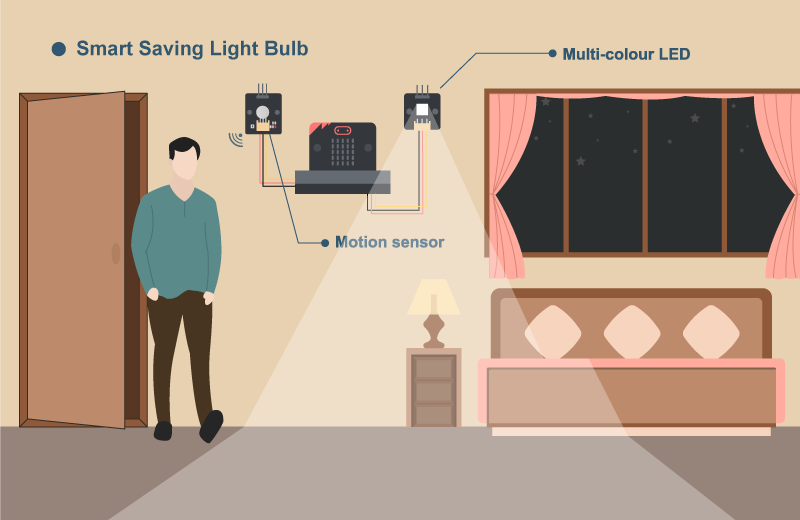

## 目標

製作一個能偵測周遭活動的智慧節能燈泡。

## 背景

甚麼是智慧節能燈泡？

人們常常忘記在離開時關燈，智慧節能燈泡是一個可以隨著周遭環境內有否人活動而自動開關的燈泡，當環境內沒有人存在或活動一段時間後就會自動熄滅。在房屋裏安裝可以有效節省電力。 

運作原理

運動傳感器會偵測附近是否有人活動。如果室內有人，燈泡會自動開啟；否則會關閉。 

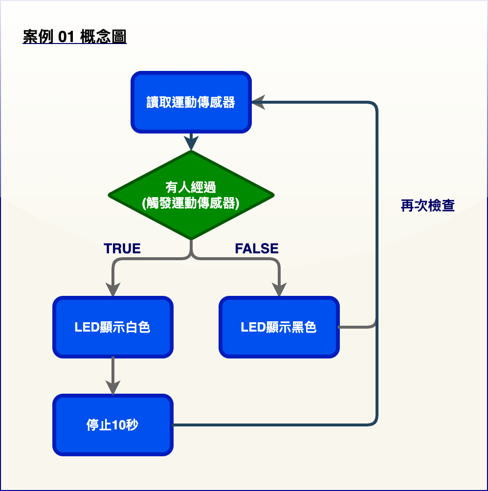

## 所用部件

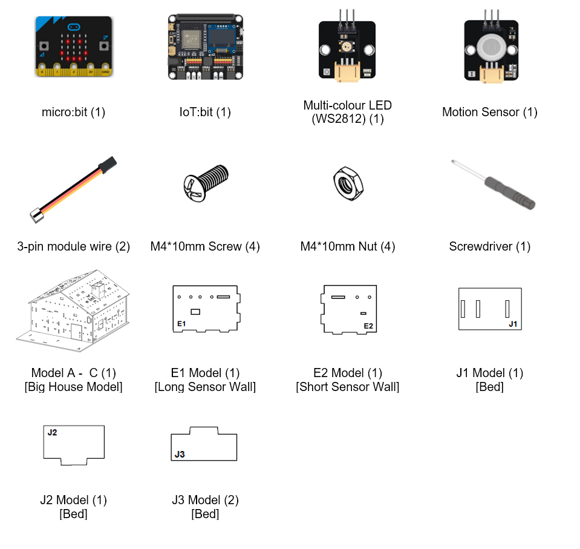

## 組裝步驟

步驟一 

首先組裝大房子模型。 

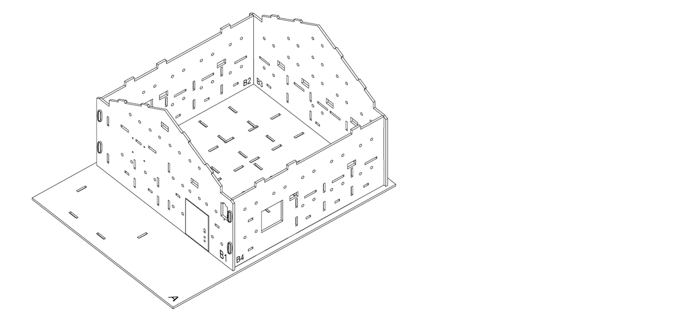

步驟二 

選擇房子其中一個角落，在以下例子中，我們選擇了左上角。安裝兩面牆（E1 和 E2）來建造一個小房間。 

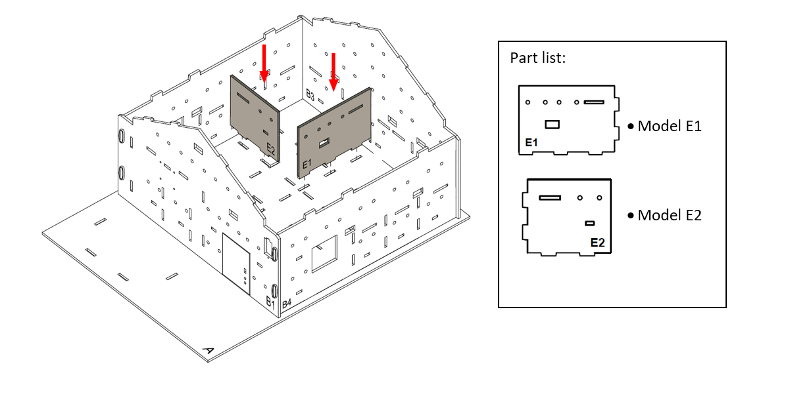

步驟三 

用 M4 * 10 毫米螺絲及螺母把運動傳感器安裝到 B3 模型上。 

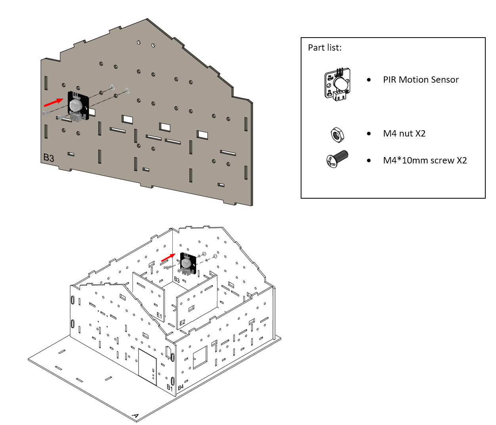

步驟四 

用 M4 * 10 毫米螺絲及螺母把彩色 LED 安裝到 B3 模型上。 

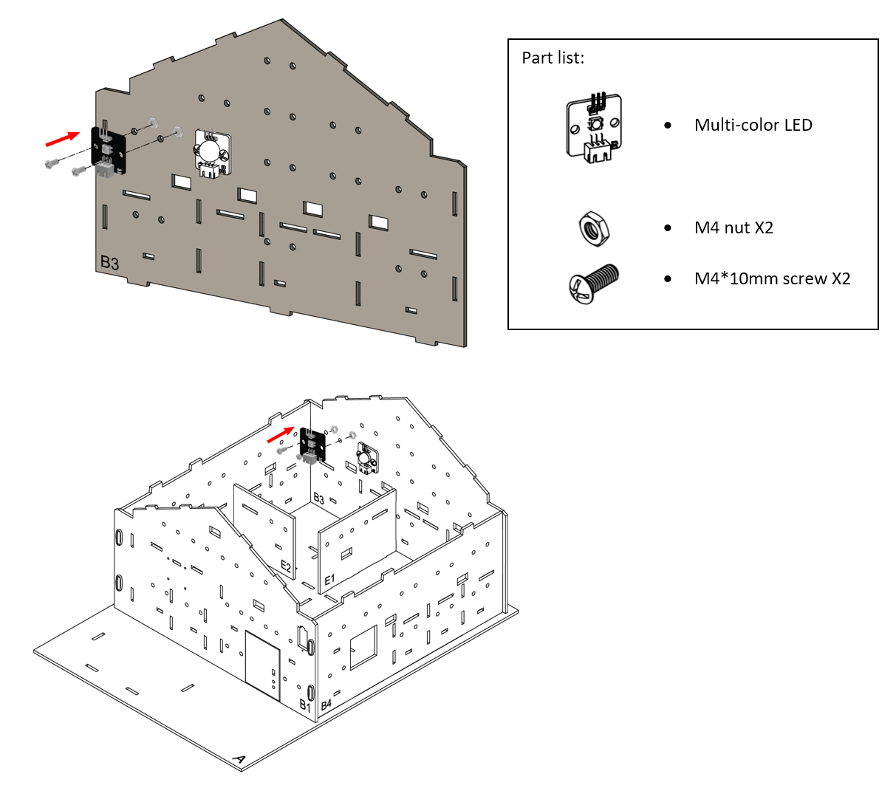

步驟五 

安裝完成！ 

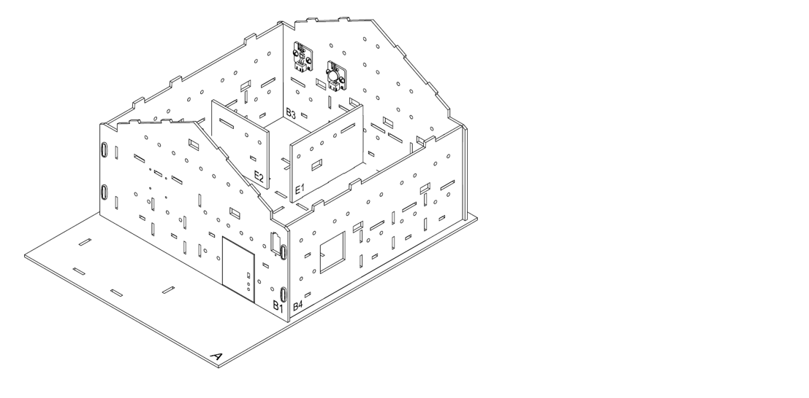

步驟六 

我們來組裝一張床。把 J2 模型放在 J1 模型上，然後將所有紙板模型（J1-J3）組裝起來。 

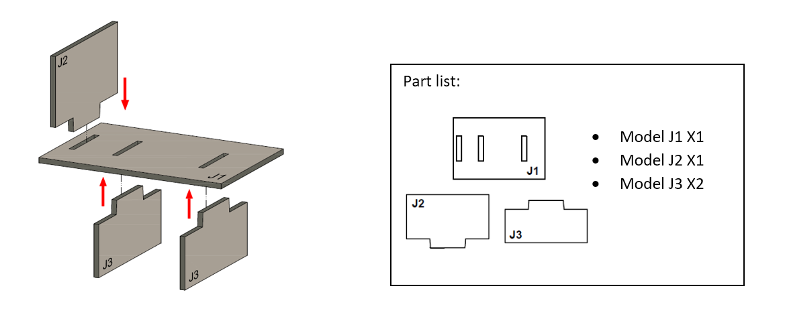

步驟七 

床完成了！ 

步驟八 

把床放入睡房。  

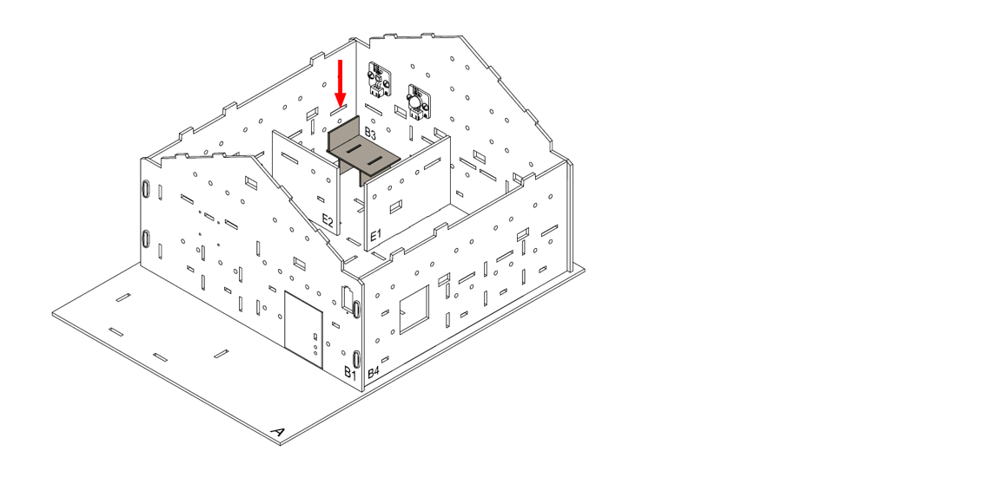

步驟九 

組裝完成！ 

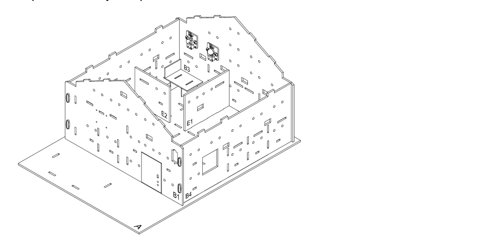

## 線路連接

1. 連接運動傳感器到 P0 端口 
2. 把蜂鳴器開關向上撥以斷開蜂鳴器 
3. 連接彩色 LED（WS2812）到 P1 端口 

 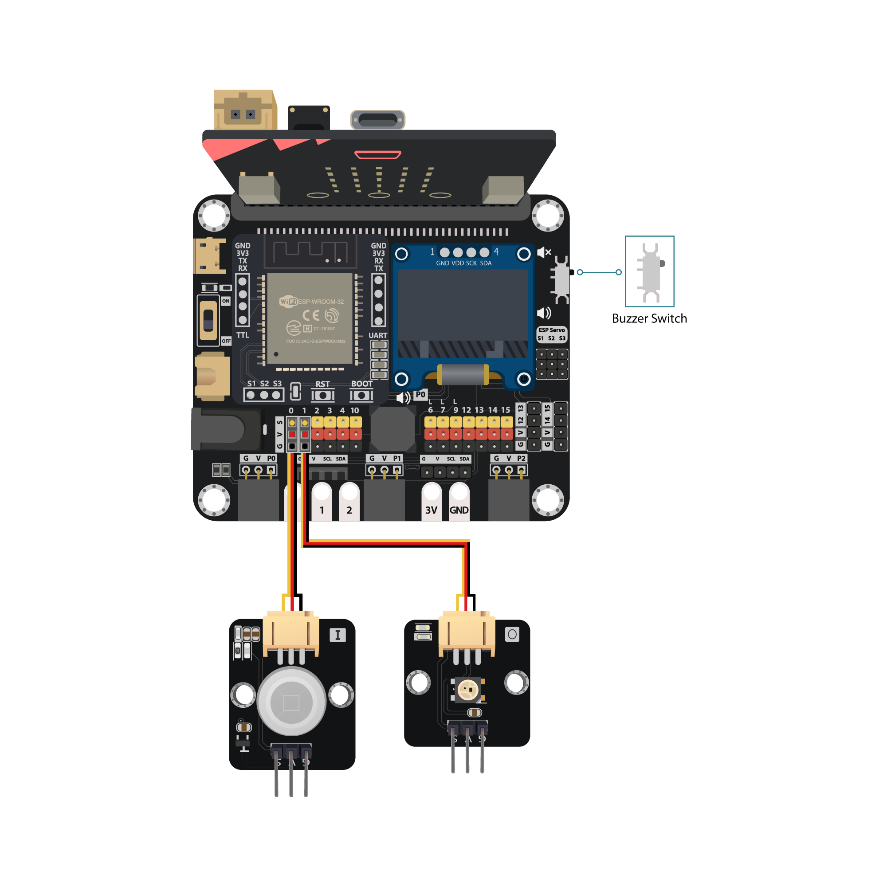

## 編程（MakeCode）

步驟一. 啟動彩色 LED 

* 使用彩色 LED 前要先啟動它
* 把`變數 strip 設為引腳 P1 初始化燈帶 1 顆LED（模式 RGB（GRB 順序））`加入到`當啟動時`

步驟二. 根據運動傳感器結果改變 LED 顏色 

* 在`重複無限次`放入一個`如果-否則`語句
* 設定`取得動作傳感器數值接口 P0 = true`為條件
* 在`如果`段中加入`strip 顯示顏色白`
* 在`如果`段中再加入`暫停10000毫秒`以保持亮燈 10 秒
* 在`否則`段中加入`strip 顯示顏色黑`
* 當條件成立時，即探測到運動，有人經過。程式會運行`如果`段落來開燈
* 否則，程式將運行`否則`段來關燈
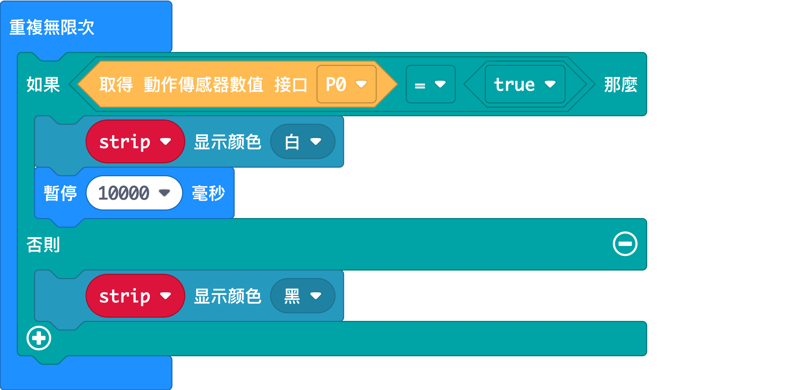

完整答案 

MakeCode: <a href="https://makecode.microbit.org/_14TcUYPjrXiX" target="_blank">https://makecode.microbit.org/_14TcUYPjrXiX</a> 

你可以從以下網頁中下載HEX檔案： 

<iframe src="https://makecode.microbit.org/#pub:_14TcUYPjrXiX" width="100%" height="500" frameborder="0"></iframe>

## 結果

當有人在房間內移動時，運動傳感器將觸發並保持 LED 亮起。 當沒有人移動時，LED 將關閉。 

## 思考

Q1. 除了在洗手間安裝智慧節能燈泡外，還有哪些地方可以安裝智慧節能燈泡？ 討論地點並簡要解釋節約能源的目的。 

Q2. 提議添加任何能讓燈泡變得更智能的組件。 

Q3. 您能在程式中加入計時器，令它只會在 10 分鐘沒有活動後關燈嗎？ 

