# 案例 02：智能家居防衛系統

難度：
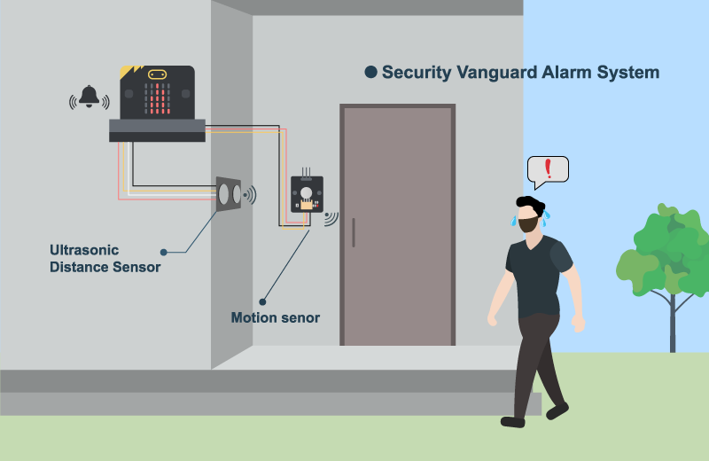

## 目標

製作一個監測房屋周遭活動的智能家居防衛系統。

## 背景

甚麼是智能家居防衛系統？

智能家居防衛系統是一個能偵測屋附近的活動，並在有可疑人仕靠近時自動觸發警報提示的系統。

運作原理

在屋周圍安裝運動及距離傳感器，用以檢查有否賊人。如附近有移動物件，傳感器會回饋結果予系統，從而觸發警報，直至該物件離開。 

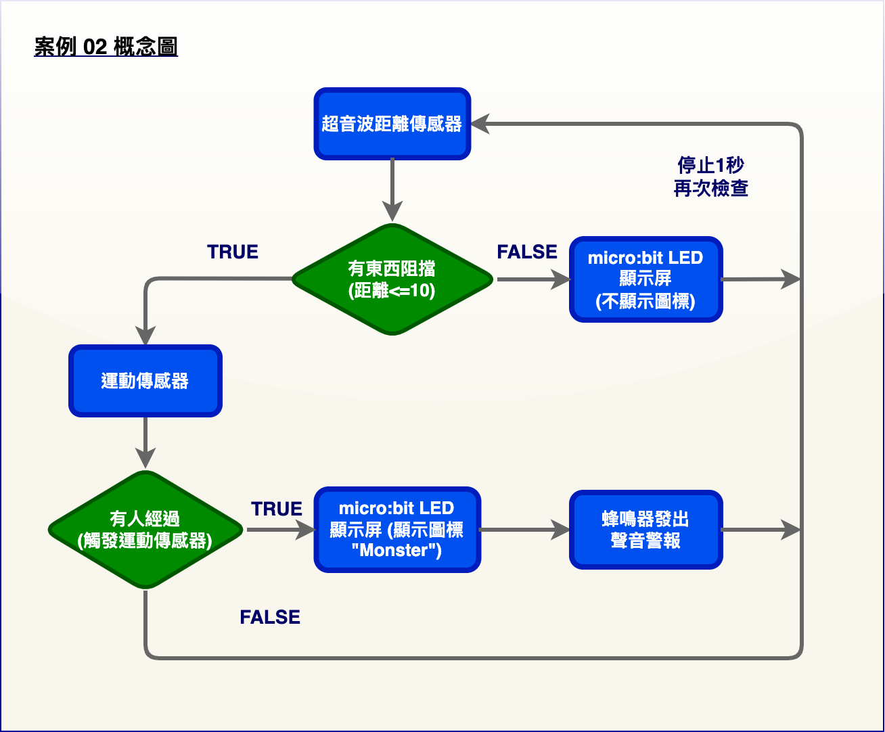

## 所用部件

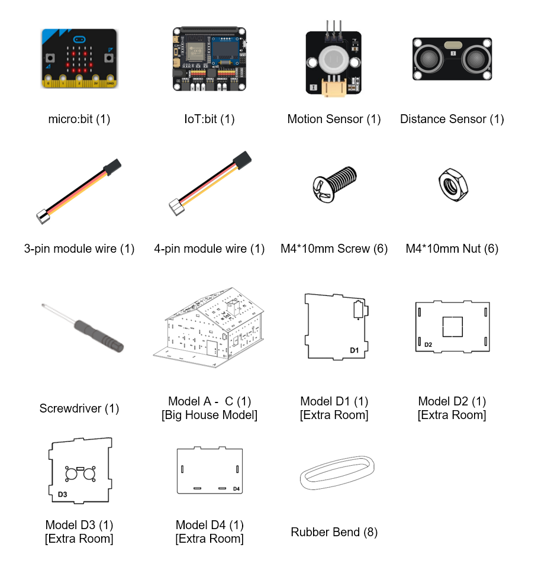

## 組裝步驟

步驟一 

首先組裝大房子模型。 

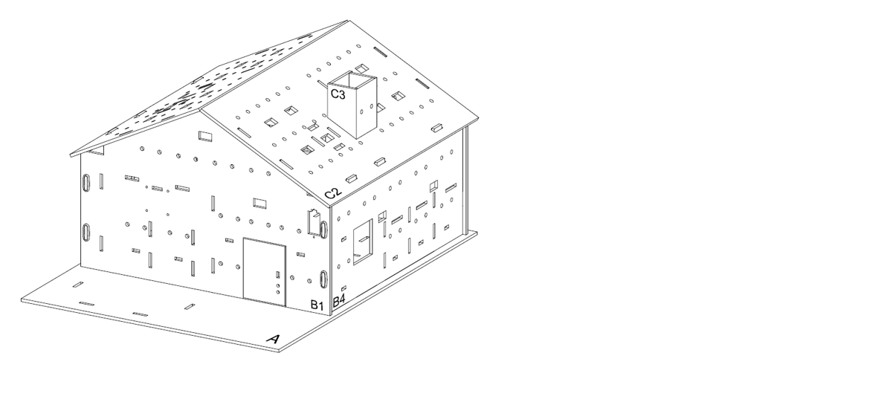

步驟二 

把 D1、D3 模型與 A 模型上的孔對齊並插入 B1 模型，以組裝一個額外的房間。 

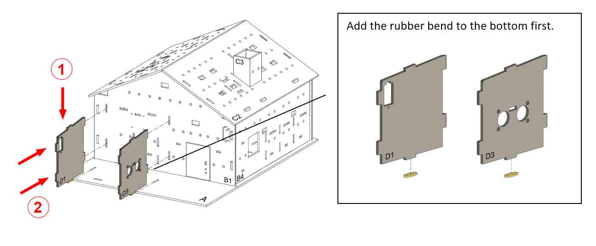

步驟三 

用 M4 * 10 毫米螺絲及螺母把超音波距離傳感器安裝到 B3 模型上。 

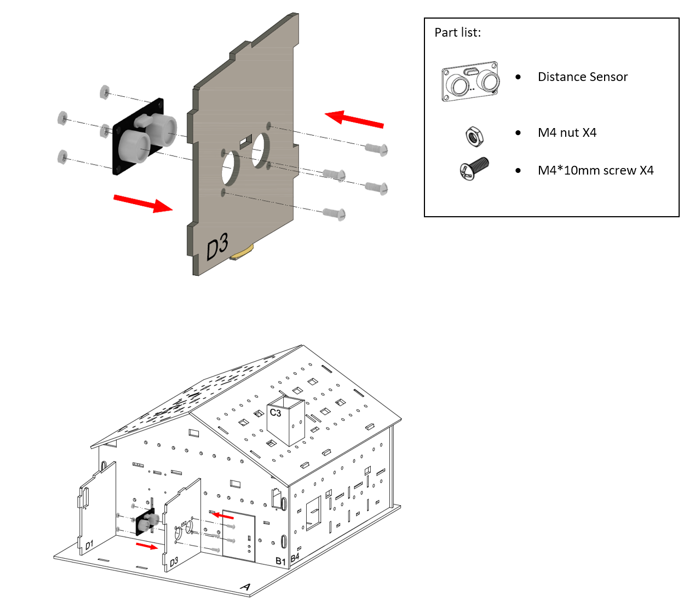

步驟四 

把 D2 模型與 A 模型上的孔對齊並插入 D1、D3 模型。 

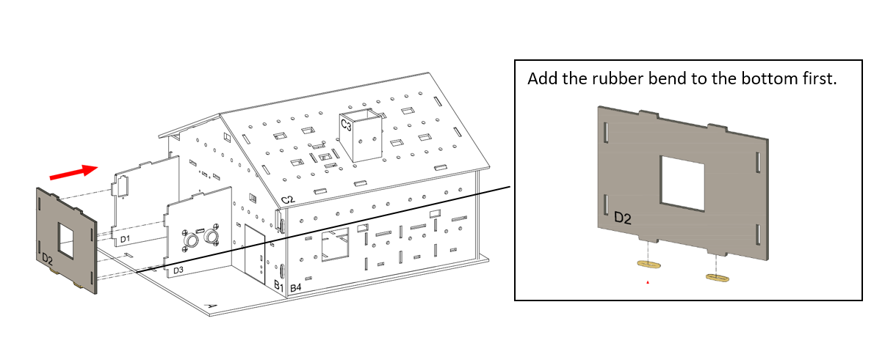

步驟五 

在 D2 模型上加上四根橡筋，以確保房間不會鬆脫。 

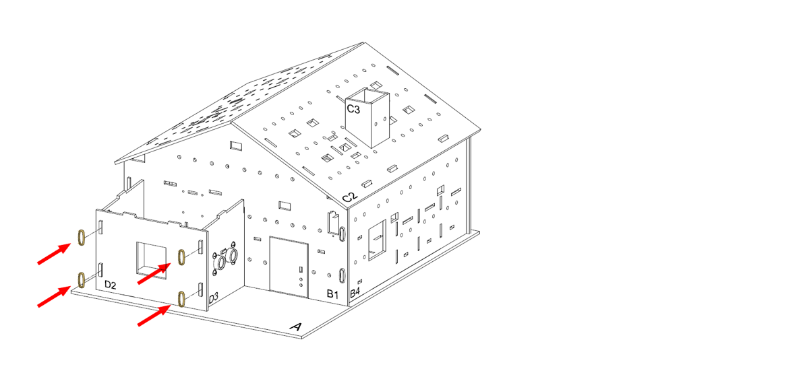

步驟六 

把 D4 模型插入 B1模型，並連接到 D1、D2 和 D3 模型。 

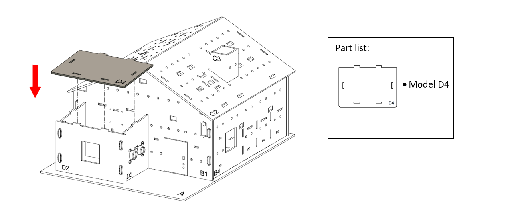

步驟七 

完成。 

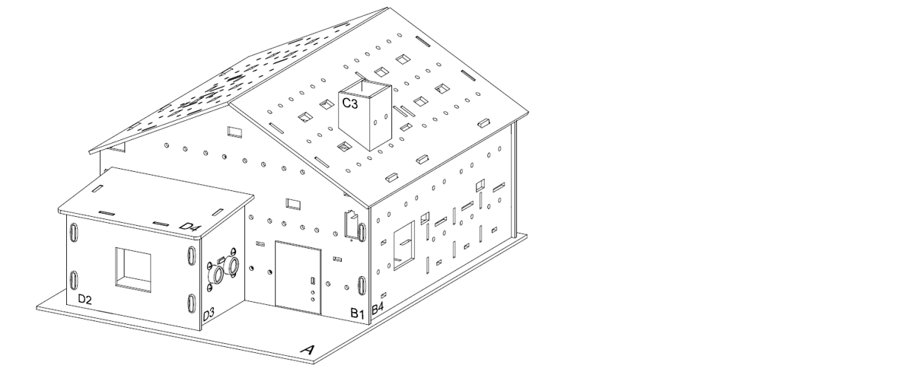

步驟八 

用 M4 * 10 毫米螺絲及螺母把運動傳感器安裝到 B4 模型（靠近門的位置）上。連接線應穿過上方的孔。 

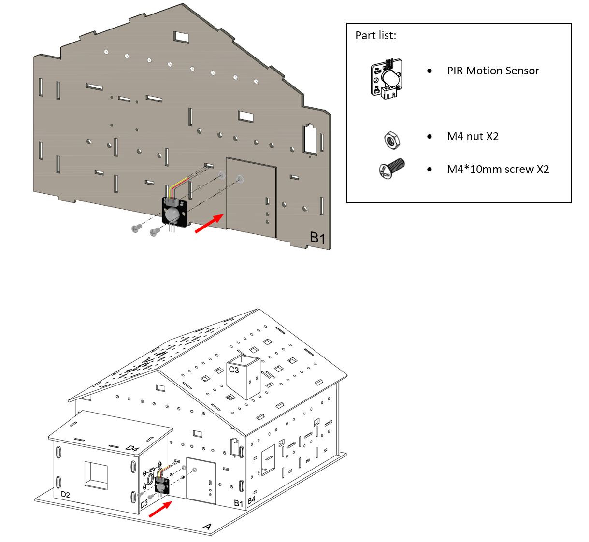

步驟九 

組裝完成！ 

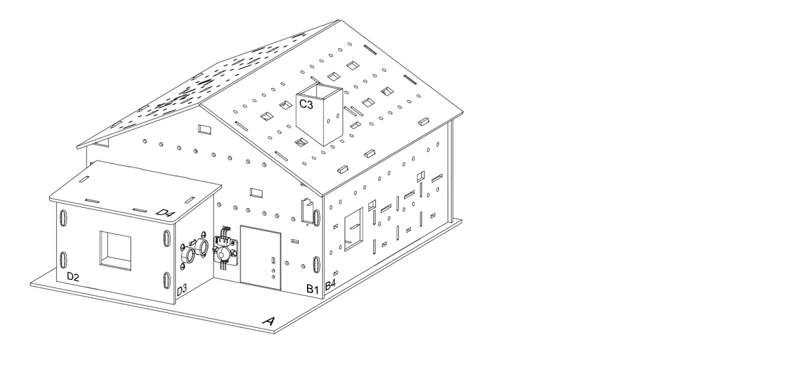

## 線路連接

1. 連接運動傳感器到 P2 端口 
2. 連接超音波距離傳感器到 P14、P15 端口 
3. 把蜂鳴器開關向下撥以連接蜂鳴器 

 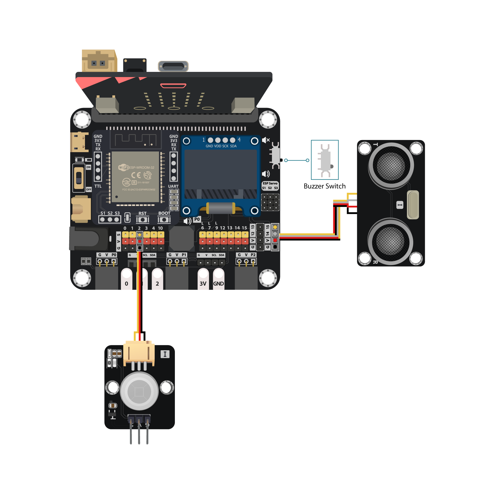

## 編程（MakeCode）

步驟一. 建立變數並將讀數儲存到其中 LED 

* 建立兩個名為`distance`和`motion`的變數。
* 在`重複無限次`中，用`變數distance設為 取得量度距離使用單位厘米trig接口 P14 echo接口 P15`將距離的讀數保存到變數`距離`。
* 用`變數motion設為 取得運動傳感器數值接口 P2`將運動偵測結果保存到變數`運動`。

步驟二. 檢查讀數 

* 在`重複無限次`加入一個`如果-否則`語句到儲存讀數的下方。
* 要同時檢查距離和運動結果，條件應包含兩個比較和一個額外的邏輯運算符。
* 將條件設為`motion = true 或 distance < 10`。

步驟三. 防禦！ 

* 在`如果`區塊中，代表有人從門前經過，用`顯示圖示`顯示憤怒的圖案。
* 並用 `play melody at tempo 120 (bpm) until done`發出警告音以驅逐可疑人。
* 在`否則`區塊中，代表沒有人待在家附近，不需要表現出憤怒的表情，用`顯示指示燈`來清除圖案。
* 用`暫停1000毫秒`加入 1 秒的間隔，令防衛系統以 1 秒取樣率運作。

完整答案 

MakeCode: <a href="https://makecode.microbit.org/_TaA5MuJ7302y" target="_blank">https://makecode.microbit.org/_TaA5MuJ7302y</a> 

你可以從以下網頁中下載HEX檔案： 

<iframe src="https://makecode.microbit.org/#pub:_TaA5MuJ7302y" width="100%" height="500" frameborder="0"></iframe>

## 結果

當有人靠近門時，超音波距離傳感器或運動傳感器就會偵測到並向房主發出警報。 

## 思考

Q1. 除了簡單的觸發警報系統外，您認為智能防衛系統還應該具備什麼？（例如發送通知／報警） 

Q2. 是否有其他的位置可以放置運動傳感器來達到防禦效果？ 

