# 案例 04：水滲漏偵檢系統

難度：
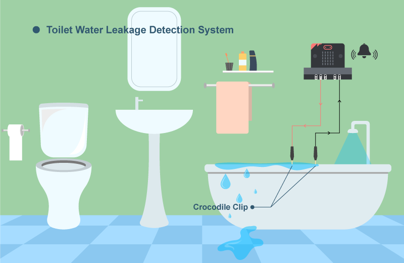

## 目標

製作一個偵測傳感器是否有通電的水滲漏偵檢系統。 

## 背景

甚麼是水滲漏偵檢系統？

水滲漏偵檢系統用於避免水流到預期外的地方而不知情，在水滲漏到偵測器的時候，會觸發警報，讓使用者得知出現了意外，從而處理。 

運作原理

系統包含兩個獨立連接至主板的鱷魚夾，它們會被放置在想偵測水滲漏情況的地方，兩夾之間保持一定距離。當該區域有滲漏情況，導電的水會把兩隻夾連接，從而讓電流通過，並得知有水滲漏的狀況出現。 

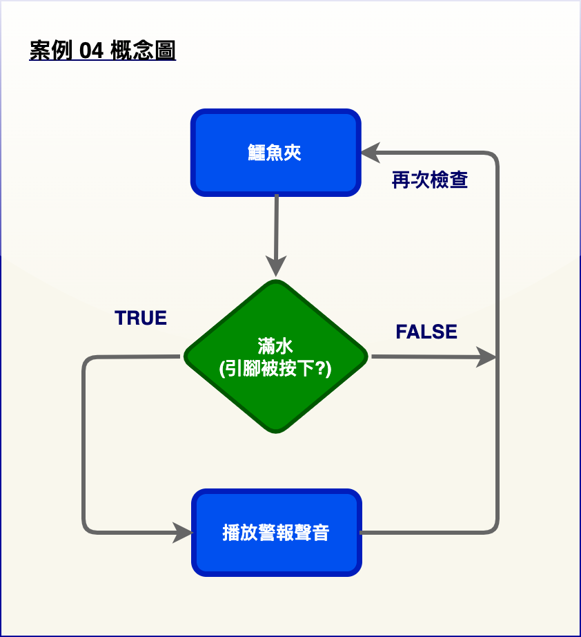

導體：水與空氣

系統有兩個一端連接著電路板（P1 和 GND）的鱷魚夾，它們物理上斷開連接。 我們可以想像兩個鱷魚夾之間有一個導體。

一般情況下，導體是空氣，空氣是極好的絕緣體，因此 P1 和 GND 之間的電路成了開路，沒有電流可以通過。 

當水位上升時，水在兩個夾子之間將 P1 和 GND 連接起來，而水是良好的導體，因此形成閉合電路，電流將從 P1 流向 GND。 

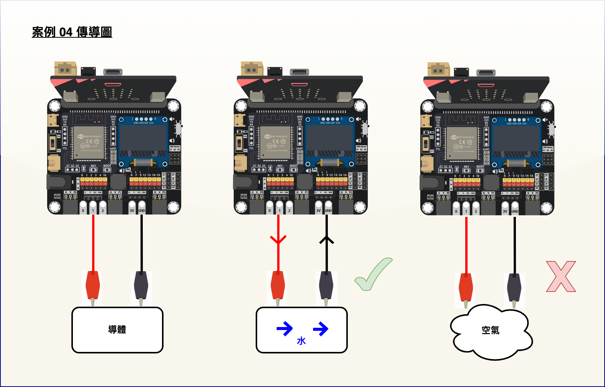

了解更多：什麼是電路？

電路是電子工程中的基本概念之一。 當某物體能夠使電流通過時，便形成了電路。

一般來說，電路有兩種狀態。 如果電路是完整的，能夠讓電流流動，稱為閉合電路。 如果電路中有斷點，不能讓電流通過，則稱為開路。

那麼，如何讓電流通過呢？ 這與電路所用的材料有關。 在日常生活中，金屬導線通常有較高的導電性，因此可以用來建構電路。 此外，一些離子性材料如自來水也有相同的性質，能夠作為導體建構電路。 而空氣的導電性非常差，因此很難讓電流通過。 

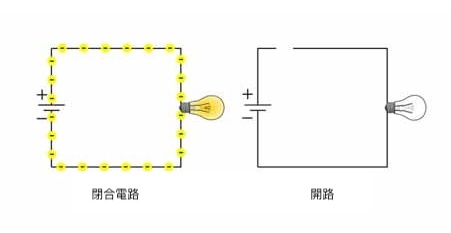

## 所用部件

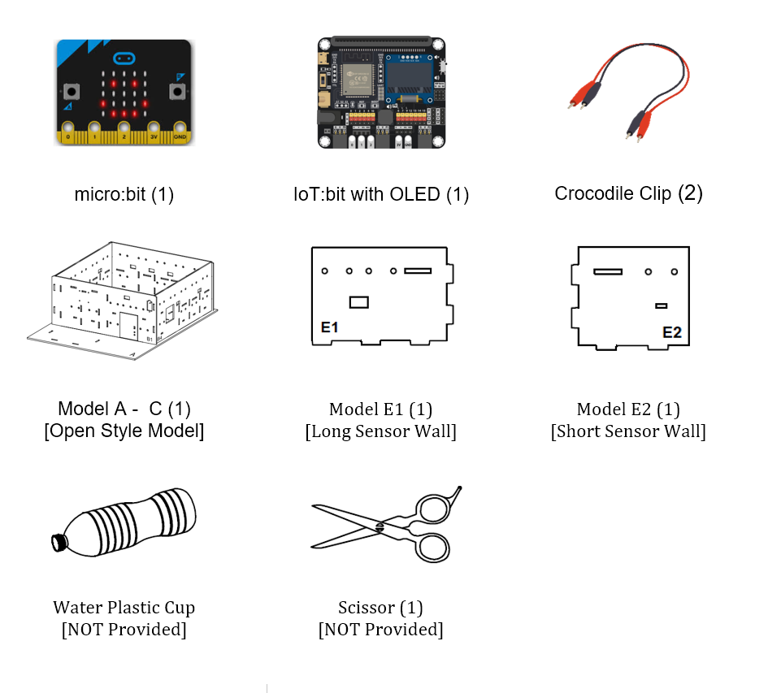

## 組裝步驟

步驟一 

這個案例以「開放式模型」作為房子的基礎。 

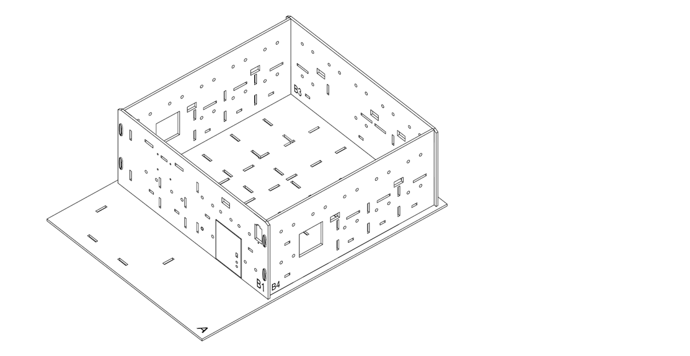

步驟二 

來蓋一個浴室吧。對準 A 和 B2 模型上的孔，將 E2 模型放到 A 模型上。 

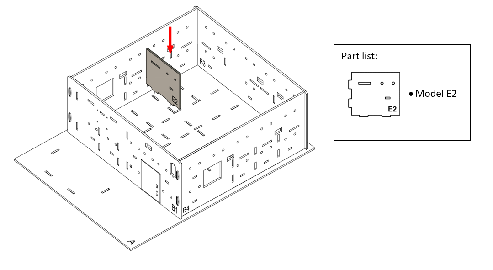

步驟三 

對準 A 和 B3 模型上的孔，將 E1 模型放到 A 模型上。 

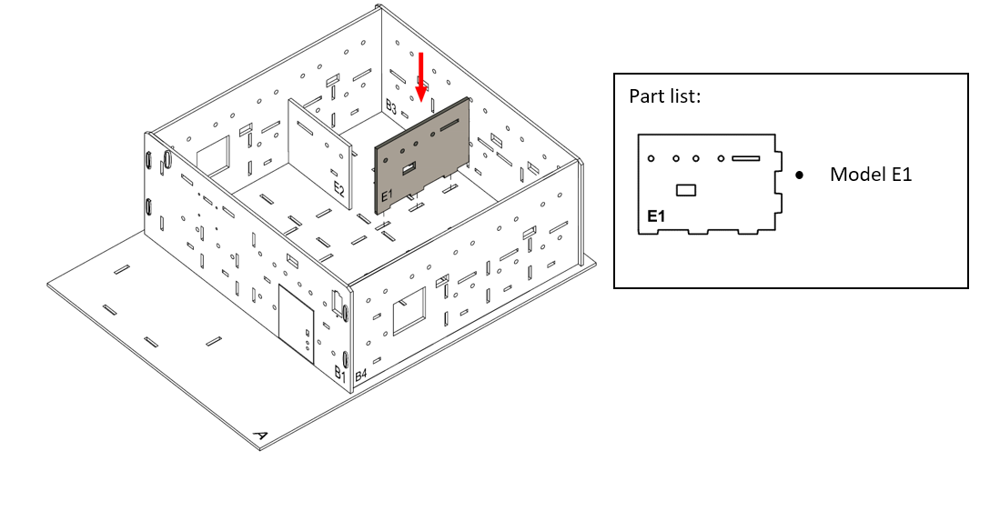

步驟四 

找一個塑膠瓶，把它剪成浴缸。如圖所示，沿著紅線剪開瓶子。 

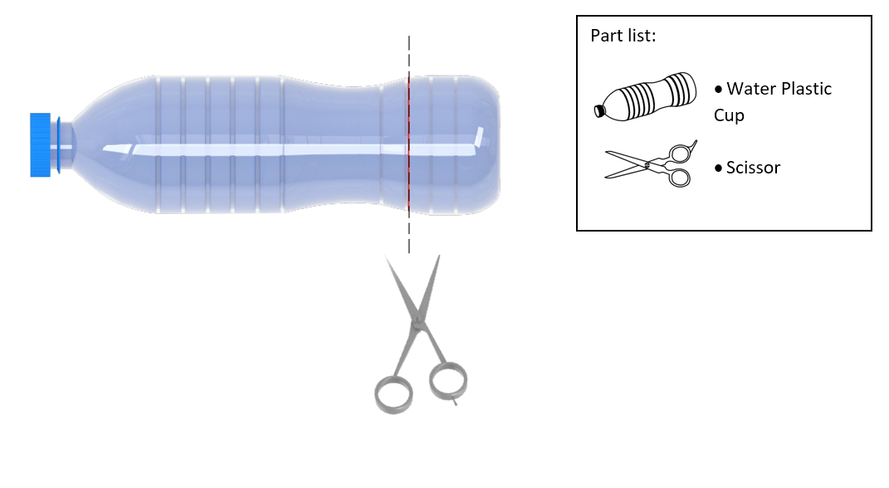

步驟五 

將浴缸放入浴室。 

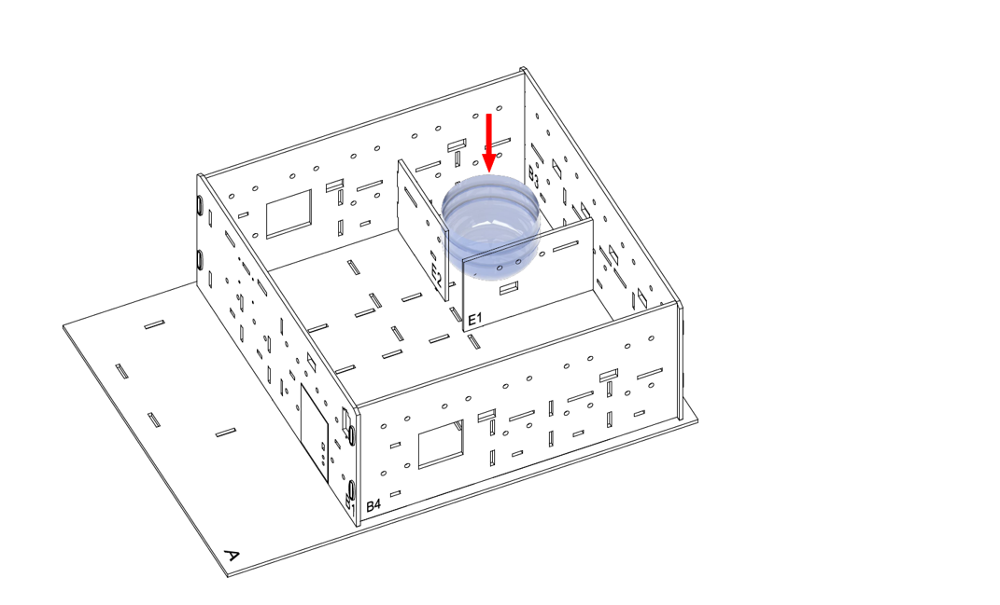

步驟六 

在水缸兩側夾上兩個鱷魚夾來偵測水。 

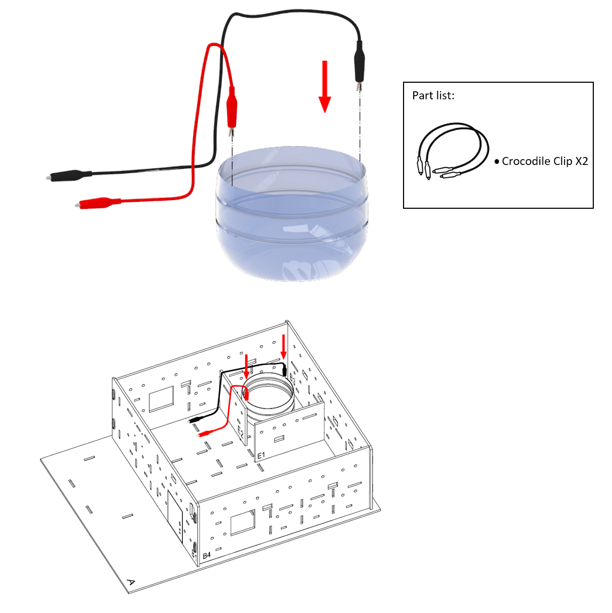

步驟七 

組裝完成！ 

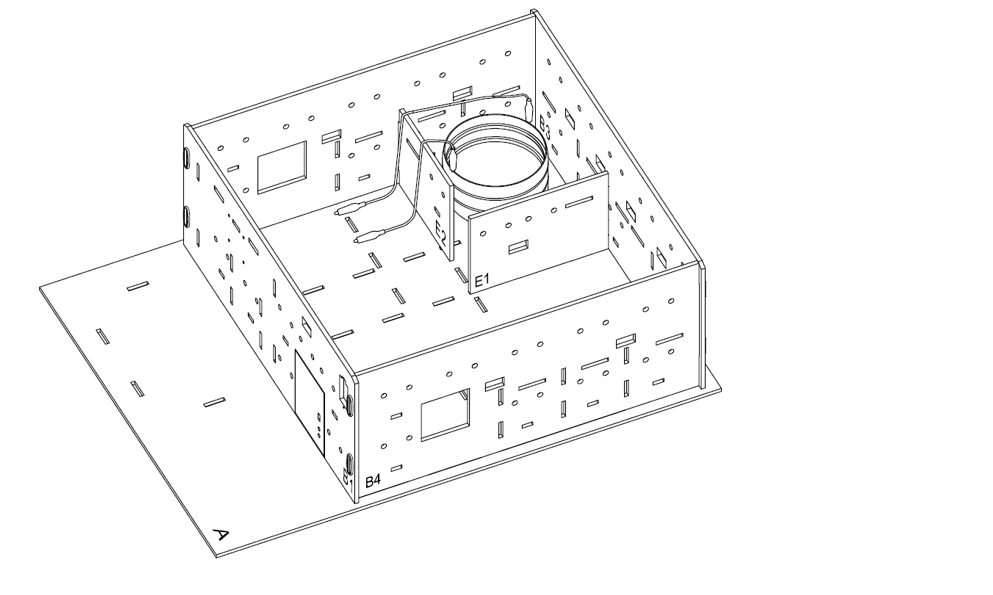

## 線路連接

1. 連接兩個鱷魚夾的電線到 P1 和 GND 端口
2. 把蜂鳴器開關向下撥以連接蜂鳴器

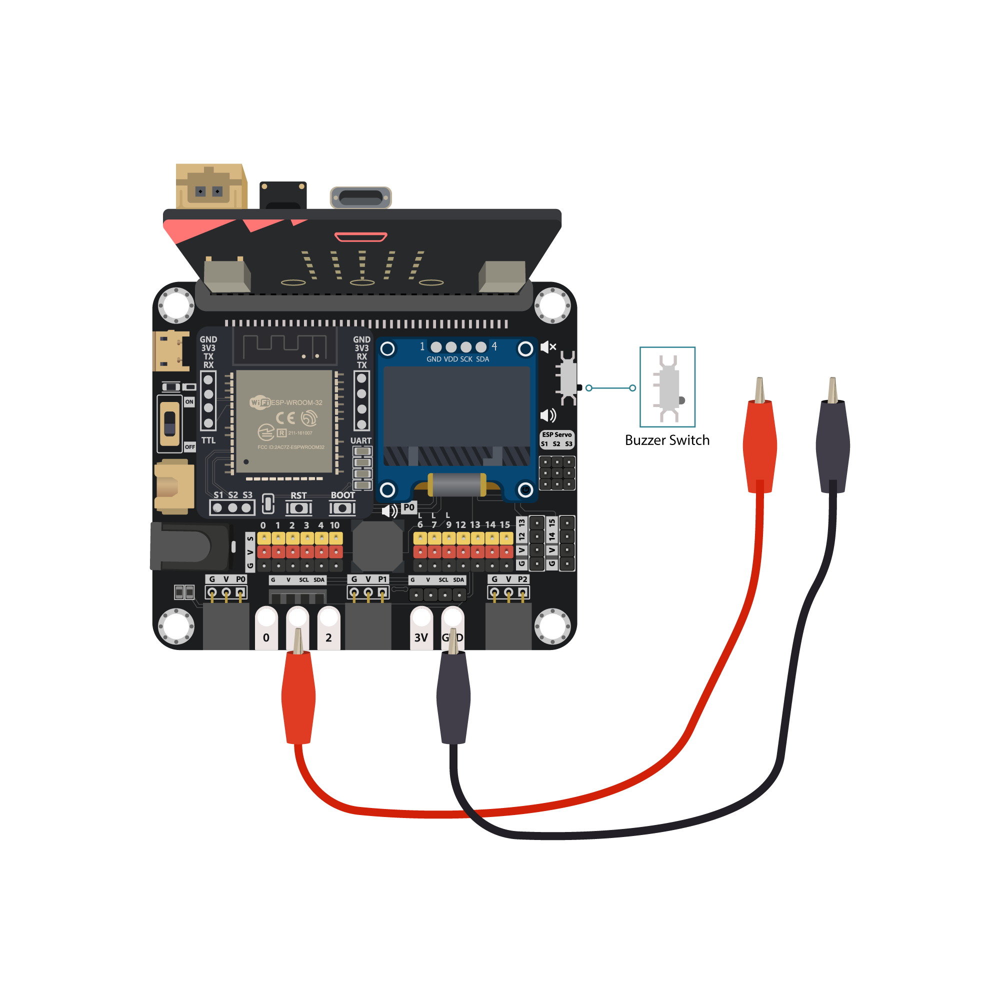

## 編程（MakeCode）

步驟一. 檢查接口狀態

* 在`重複無限次`中放上一個`如果`語句
* 將條件設為`引腳 P1 被按下？ = true`

步驟二. 設定警報

* `如果`段代表水連接了兩個夾子
* 用`play tone 高音 A for 2 拍 until done`來播放警報聲音
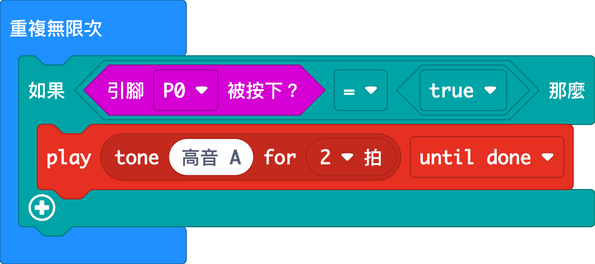

完整答案 

MakeCode: [https://makecode.microbit.org/_XuHfwK8wPMmm](https://makecode.microbit.org/_XuHfwK8wPMmm) 

你可以從以下網頁中下載HEX檔案： 
<iframe src="https://makecode.microbit.org/#pub:_XuHfwK8wPMmm" width="100%" height="500" frameborder="0"></iframe>

## 結果

當水位上升到鱷魚夾位置時，就會觸發警報提醒使用者。 

## 思考

Q1. 除了以蜂鳴器來警報，還有什麼方法可以通知屋主呢？ 例如：亮起紅色 LED燈 

