# 案例 05：智慧冰箱警報

難度：
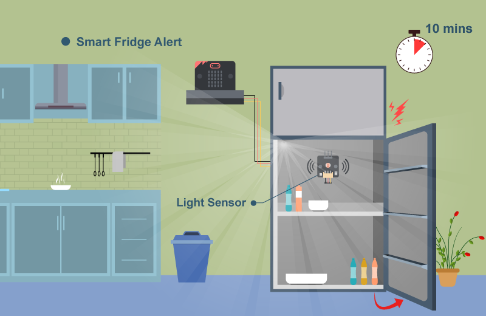

## 目標

製作一個使用光度傳感器探測冰箱門開關的智能系統。 

## 背景

甚麼是智慧冰箱警報？

智慧冰箱利用額外的傳感器來判斷冰箱門是否關好，當使用者忘記關門時，它會提醒使用者關門，以減少能源浪費並防止食物變壞。 

運作原理

首先，我們設定一個初始值為 0 的變數`counter`。當冰箱門關閉時，冰箱內部會變得黑暗（光度傳感器值 < 30），此時不會做任何動作；當冰箱門打開時，室內的光線會進入冰箱（光度傳感器值 > 30），`counter`就會開始每秒增加 1，如果`counter`超過 60，就會觸發蜂鳴器發出聲音，以提醒使用者。 

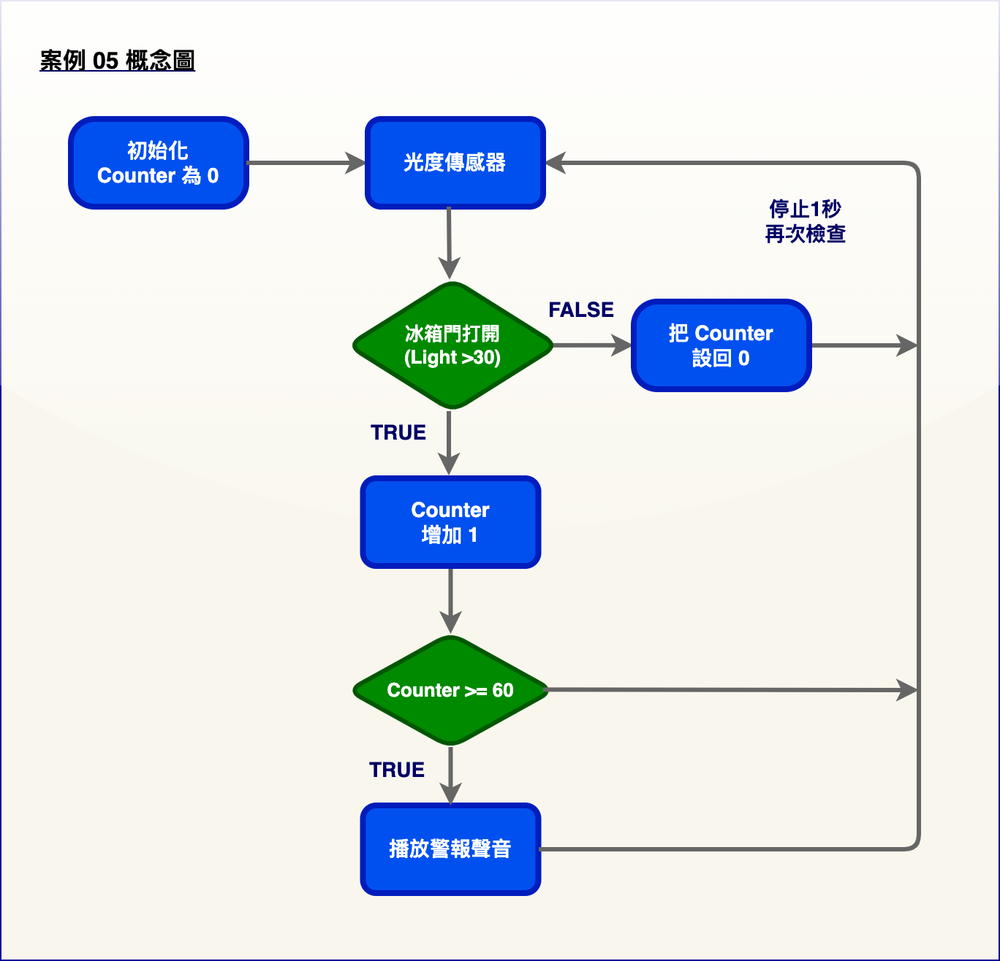

## 所用部件

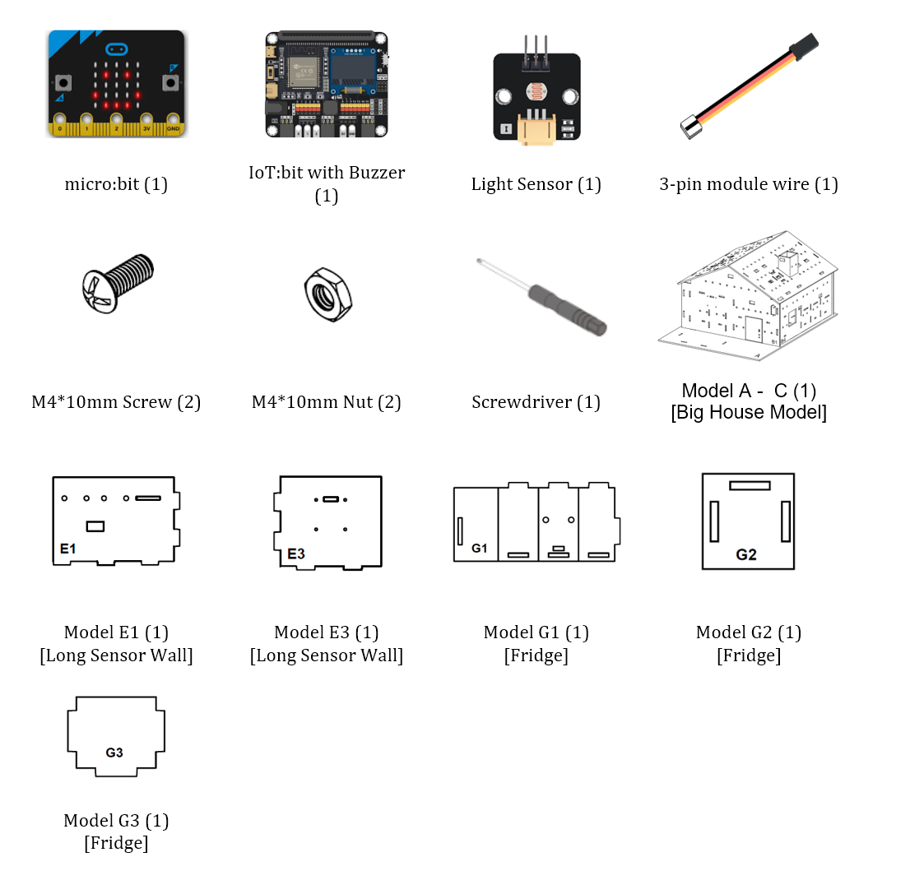

## 組裝步驟

步驟一 

這個案例以「大房子模型」作為房子的基礎。 

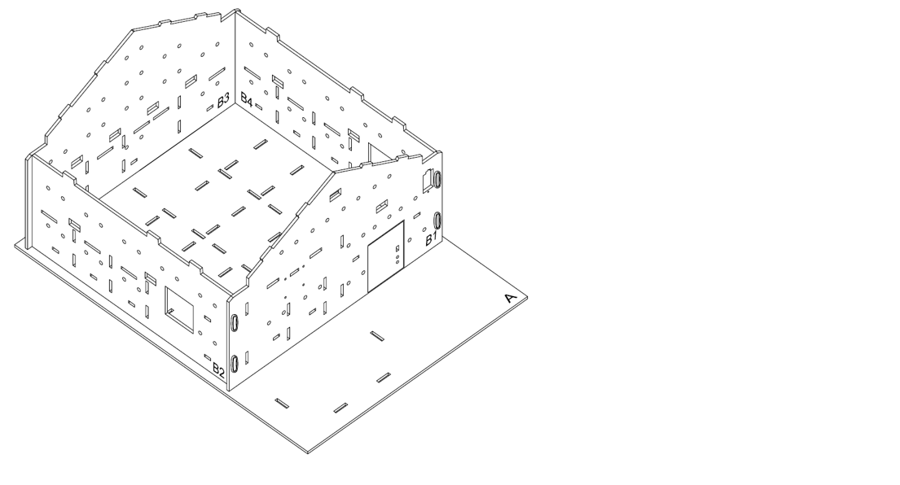

步驟二 

來蓋一個廚房吧。對準 A、B3 和 B4 模型上的孔，將 E1 和 E3 模型放到 A 模型上。 

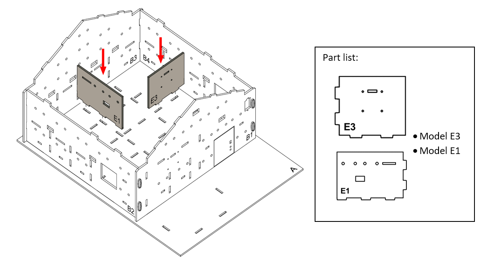

步驟三 

廚房完成。 

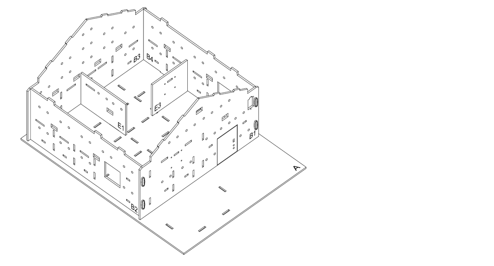

步驟四 

用 M4 * 10 毫米螺絲及螺母把光度傳感器安裝到 G1 模型上，以製作一台冰箱，連接線可以穿到旁邊的孔中。 

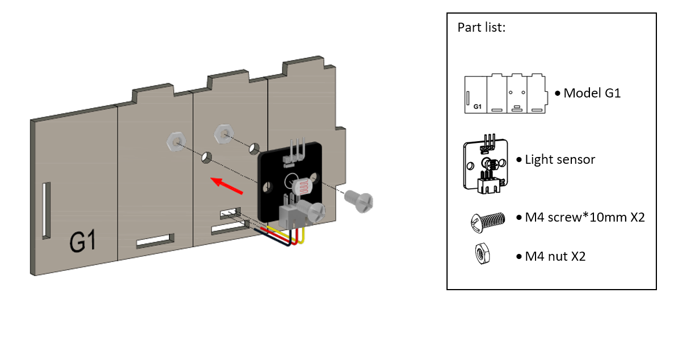

步驟五 

將 G1 模型如圖中折疊和彎曲，然後對準孔，將 G3 模型拼到 G1 模型中。 

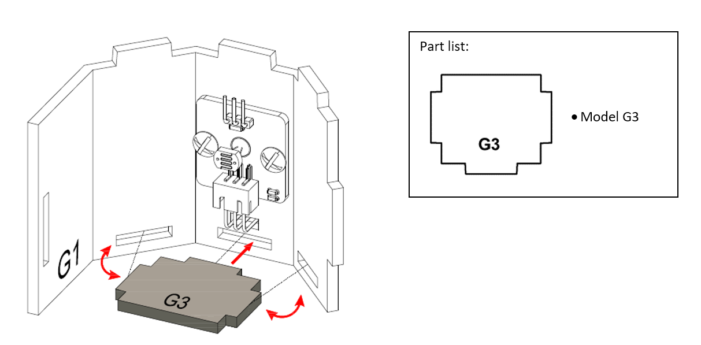

步驟六 

對準孔，將 G2 模型裝到 G1 模型上。 

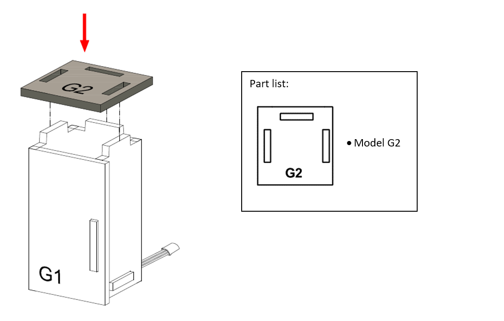

步驟七 

冰箱完成。 

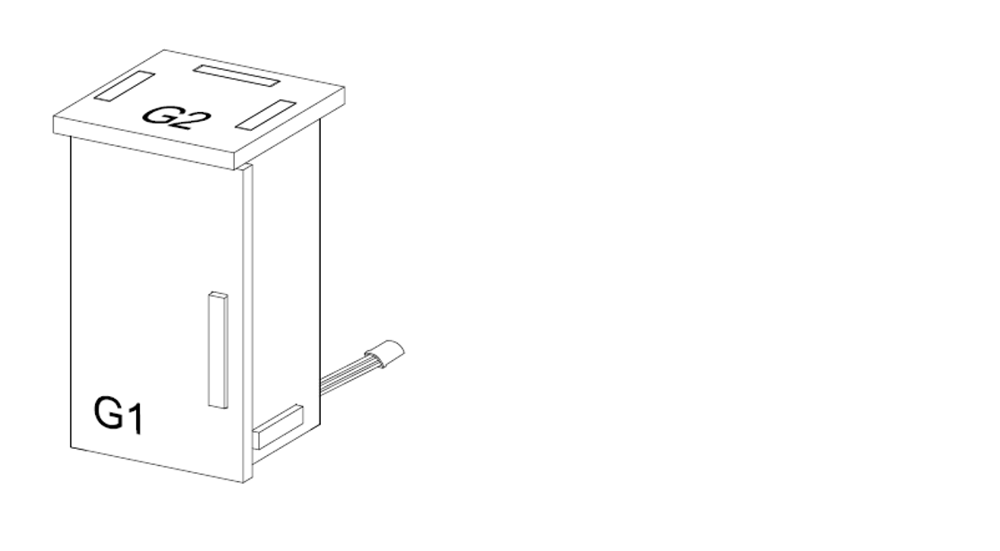

步驟八 

把冰箱放到角落。 

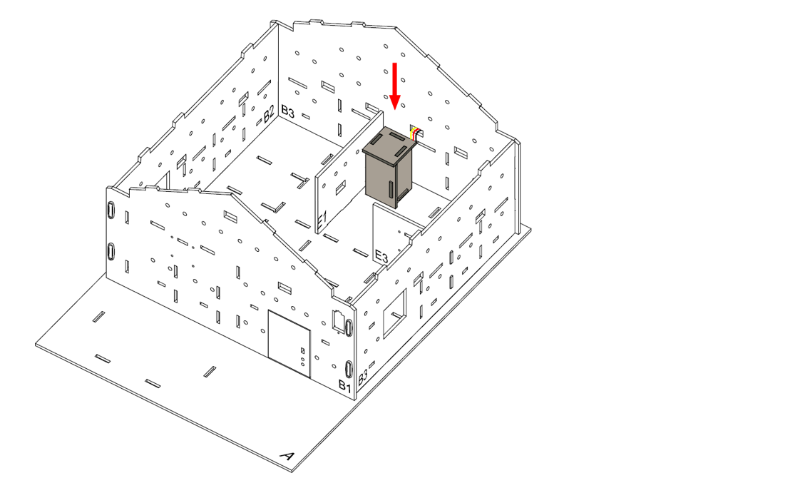

步驟九 

組裝完成！ 

## 線路連接

1. 連接光度傳感器到 P1 端口
2. 把蜂鳴器開關向下撥以連接蜂鳴器

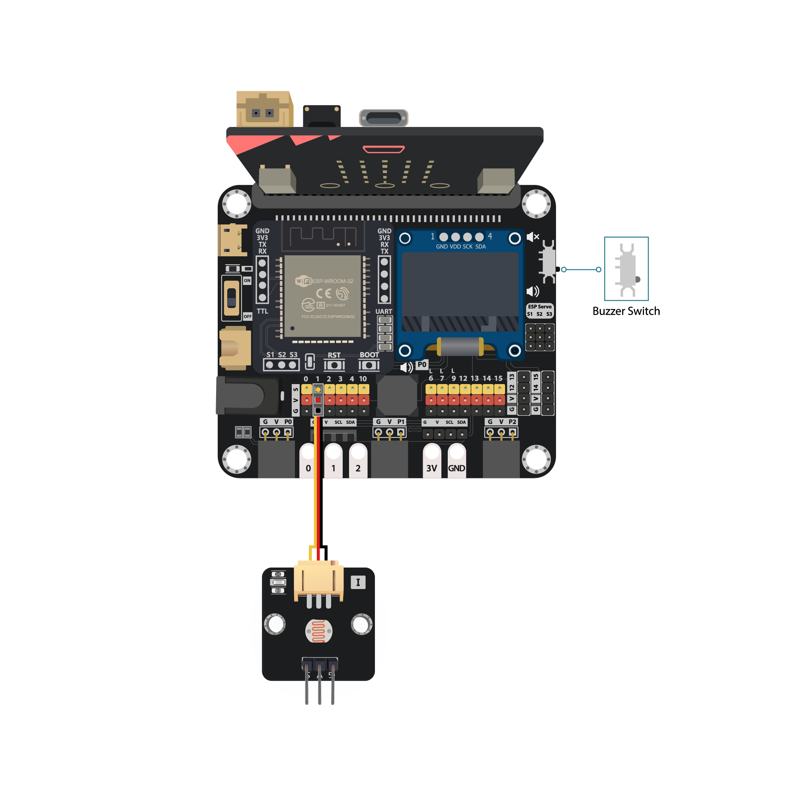

## 編程（MakeCode）

步驟一. 初始化變數計時器

* 在`當啟動時`裡建立一個變數`counter`並設為 0

步驟二. 檢查光度

* 在`重複無限次`放入一個`如果-否則`語句
* 設`取得亮度傳感器接口 P1 > 30 `為條件

步驟三. 讀取並顯示 DHT11的讀數

* `如果`段代表光度強，冰箱門打開了
* 用`變數counter改變 1 `來將`counter`加 1，以累計門打開的時長
* 放入第二個條件為`counter > 60 `的`如果-否則`語句來判斷何時應發出提示聲
* 在第二個`如果`段放入`play melody jump down until done`來發出提示聲
* 回到第一級`如果-否則`，`否則`段代表光度弱，冰箱門關閉，因此用`變數counter設為 0` 將`counter`重設為 0
* 放入`暫停 1000 毫秒`來每秒檢查門一次
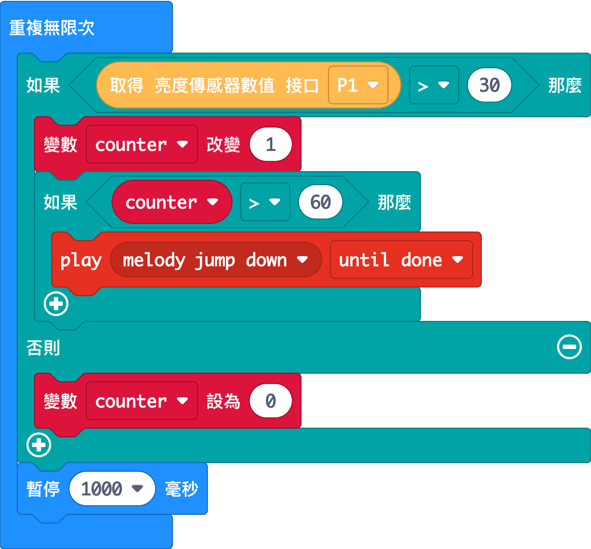

完整答案 

MakeCode: [https://makecode.microbit.org/_Xjb1jocVECYJ](https://makecode.microbit.org/_Xjb1jocVECYJ) 

你可以從以下網頁中下載HEX檔案： 
<iframe src="https://makecode.microbit.org/#pub:_Xjb1jocVECYJ" width="100%" height="500" frameborder="0"></iframe>

## 結果

當門打開超過 1 分鐘，蜂鳴器會發出聲音以提醒使用者。 

## 思考

Q1. 除了用蜂鳴器發出聲音之外，還有什麼方法來提醒使用者？ 

Q2. 你能利用冰箱來製作一個會提醒使用者的智慧盒子嗎？ 

