# 案例 06：密碼自動門

難度：
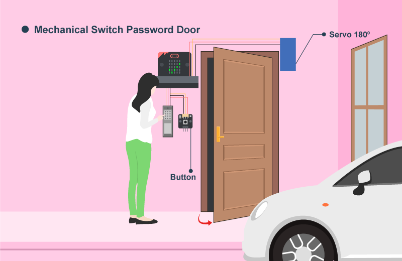

## 目標

製作一個能用按鈕開門的密碼自動門。 

## 背景

甚麼是密碼自動門？

現在電子鎖及自動門已經十分普及，其功能除了防盜外，亦提升了不少的方便性。例如不用攜帶實體鎖匙，只需要使用密碼或生物特徵，就可以解鎖。過程中也不用去推拉門來打開或關閉，自動門會自動執行開關動作。 

運作原理

房主設定開門密碼為（A=2 & B=3）
1. 初始化兩個變數`count_A`和`count_B`。
2. 按下按鈕 A，`count_A`會加 1。而按下按鈕 B，則`count_B`會加 1。
3. 使用者輸入密碼後，再按按鈕 A+B 檢查密碼。如果正確，micro:bit 會顯示剔號，否則會顯示交叉。
4. 使用者按下門旁邊的按鈕。
5. 如果密碼正確，門就會打開，並在5秒後關上。

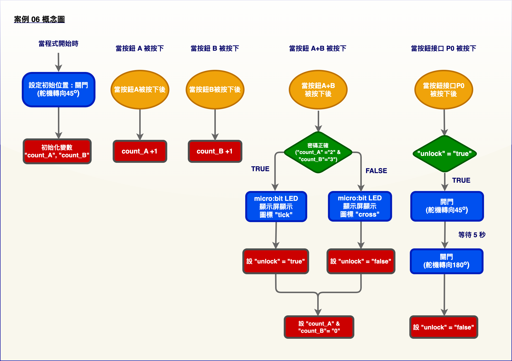

## 所用部件

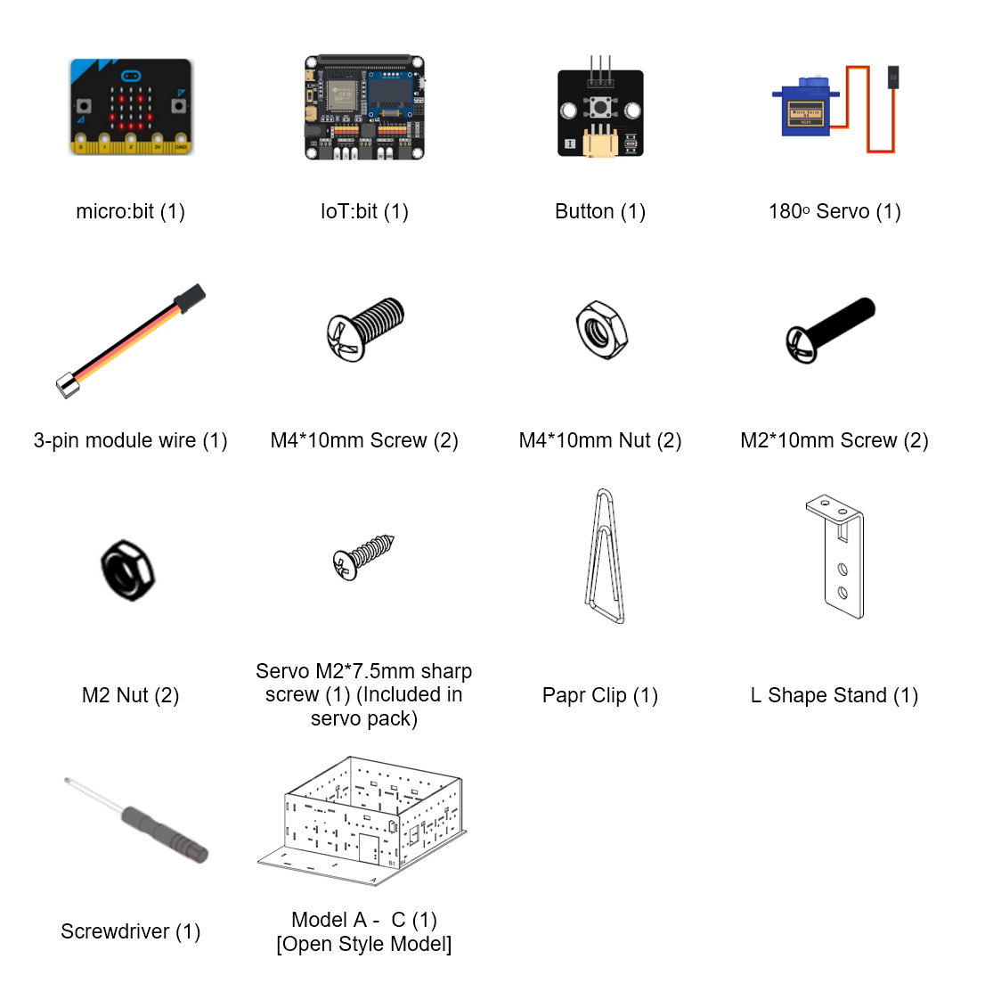

## 組裝步驟

步驟一 

這個案例以「開放式模型」作為房子的基礎。 

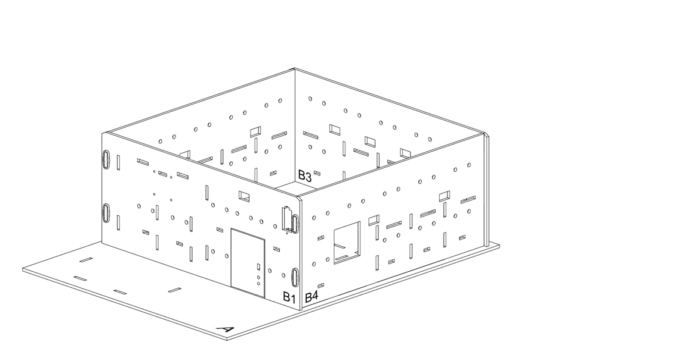

步驟二 

要建造智慧門，先用 M4 * 10 毫米螺絲及螺母把按鈕安裝到 B1 模型上，並與 B1 模型上門旁邊的孔對齊。連接線應穿過上面的孔。 

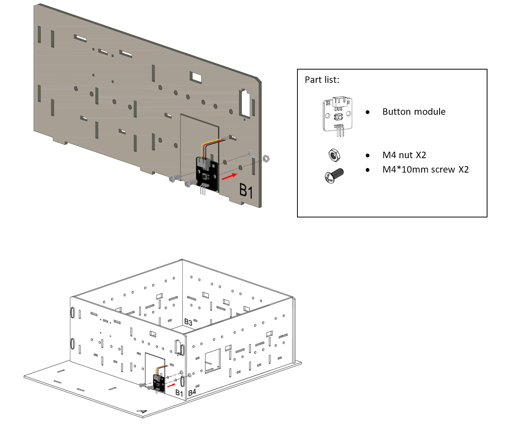

步驟三 

用 M3 * 10 毫米螺絲及螺母把 L型支架固定到 B1 模型的背面。 

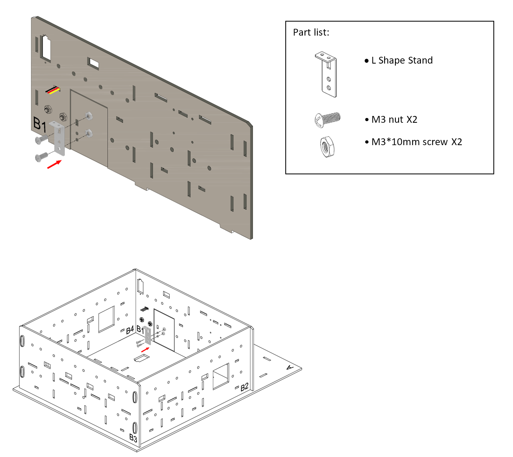

步驟四 

用 M2 * 7.5 毫米螺絲把舵機半搖臂固定在舵機，並把 180ᵒ舵機組裝到 A 模型。
 

步驟五 

把萬字夾用作鉤子連接 L型支架和 180ᵒ舵機。 

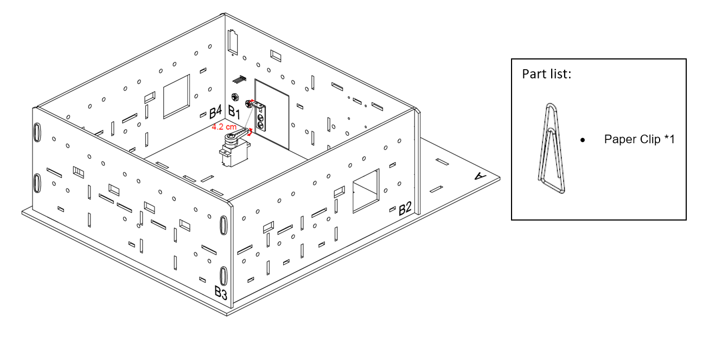

步驟六 

組裝完成！ 

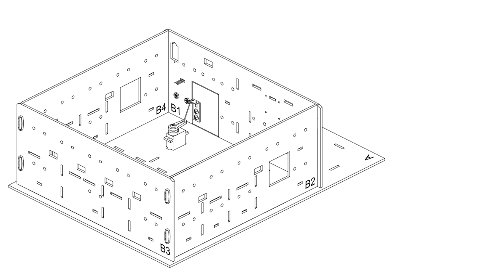

## 線路連接

1. 連接按鈕到 P0 端口
2. 連接180ᵒ舵機到 P1 端口
3. 把蜂鳴器開關向上撥以斷開蜂鳴器

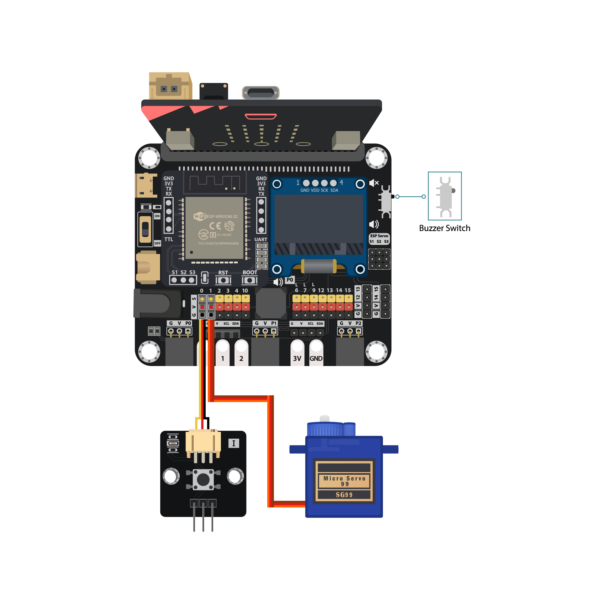

## 編程（MakeCode）

步驟一. 建立變數和初始化舵機

* 建立變數`count_A`、`count_B`和`unlock`
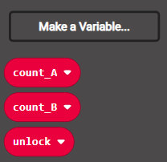

* 在`當啟動時`裡，用`變數 unlock 設為 false`和`轉動180度舵機到45度接口P1`將門的狀態初始化為關閉，並設`count_A`和`count_B`為 0。
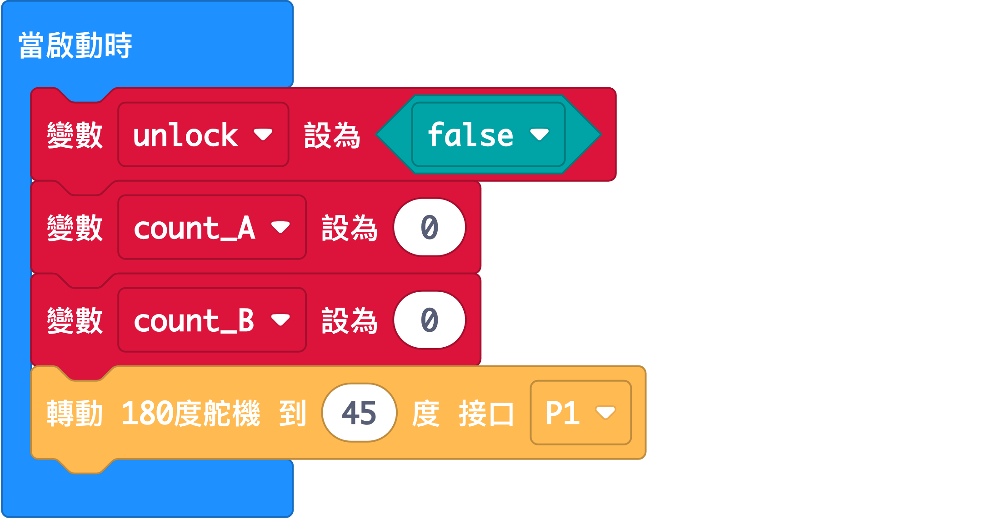

步驟二. 監測按鈕狀態並採取行動

* 加入`當按鈕接口P0被按下`
* 在裡面加入一個`如果`語句
* 設條件為`unlock = true`
* 當`unlock = true`，即表示成功解鎖，舵機應以`轉動180度舵機到180度接口P1`來打開門，​​之後通過`暫停 5000 毫秒`等待5秒，最後以`轉動180度舵機到45度接口P1`和`變數 unlock 設為 false`來關上門並再次鎖上。
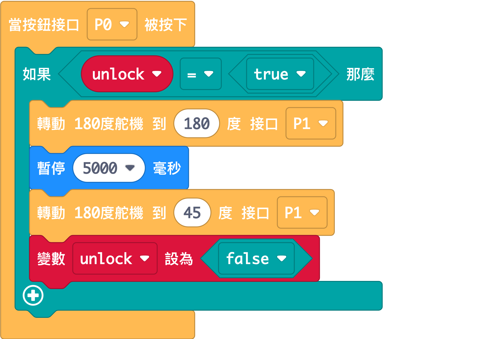

步驟三. 密碼輸入方式

* 加入`當按鈕 A 被按下`
* 用`變數 count_A 改變 1`把計數變數增加1
* 重複以上步驟，但稍有不同的是讓按鈕 B 增加`count_B`

步驟四. 檢查密碼

* 加入`當按鈕 A+B 被按下`
* 在裡面加入一個`如果-否則`語句
* 設`count_A = 2`和`count_B = 3`為條件，您也可以將其變更為您喜歡的密碼
* 在代表輸入正確的`如果`段中，加入`顯示圖示剔號`和`變數 unlock 設為 true`，按下擴充按鈕即可打開門。
* 在代表輸入錯誤的`否則`段中，加入`顯示圖示交叉`和`變數 unlock 設為 false`，按下擴充按鈕時拒絕開門。
* 將兩個計數變數`count_A`和`count_B`重設為 0 以供下次輸入。
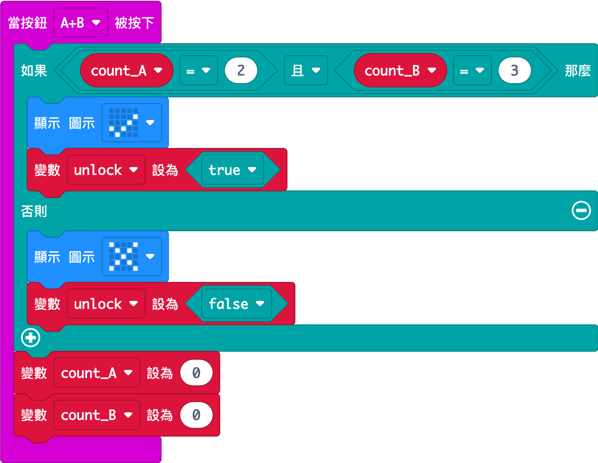

完整答案 

MakeCode: [https://makecode.microbit.org/_JbC8kyH4p48m](https://makecode.microbit.org/_JbC8kyH4p48m) 

你可以從以下網頁中下載HEX檔案： 
<iframe src="https://makecode.microbit.org/#pub:_JbC8kyH4p48m" width="100%" height="500" frameborder="0"></iframe>

## 結果

按下正確次數的按鈕 A 和 B 後，按 A+B 驗證。 
如果密碼正確，按下擴充按鈕門就會打開。5 秒後門將再次關閉並鎖上。如果輸入錯誤，請勿開門。 

## 思考

Q1. 除了使用實體按鈕之外，還有更好的方法來控制門的開關嗎？ 

Q2. 可以讓門鈴在開門時發出聲音嗎？ 

Q3. 除了門，開關還可以用於其他用途嗎？ （例如開啟/關閉 LED） 

Q4. 你能否新增一個規則，如果輸入錯誤超過3次，則顯示警報訊息並鎖門5分鐘？ 

