# 案例 08：智能太陽檢測窗簾

難度：
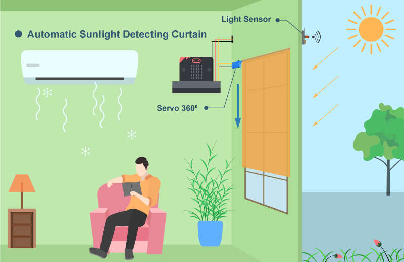

## 目標

製作一個會偵測屋外陽光並自動開關的智能太陽檢測窗簾。 

## 背景

甚麼是智能太陽檢測窗簾？

智能太陽檢測窗簾會根據偵測到的陽光量自動收起或放下來。 

運作原理

在屋外安裝一個光度傳感器，當它偵測到強光（Light > 70）時，代表會有陽光照射到房屋。 於是窗簾會放下來，以減少熱能傳導到屋內。如此一來可以減少能量損失，並節省空調的能源。 

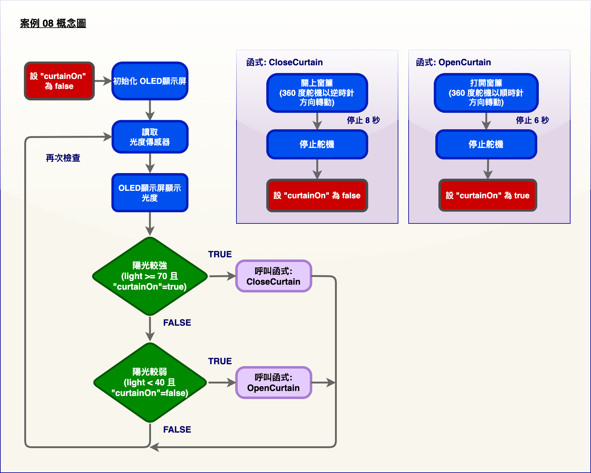

## 重點知識

在這個案例的編程部分，會運用到一個「flag」的概念。這是用來檢查窗簾是否已經放了下來，避免繼續放下窗簾。

## 所用部件

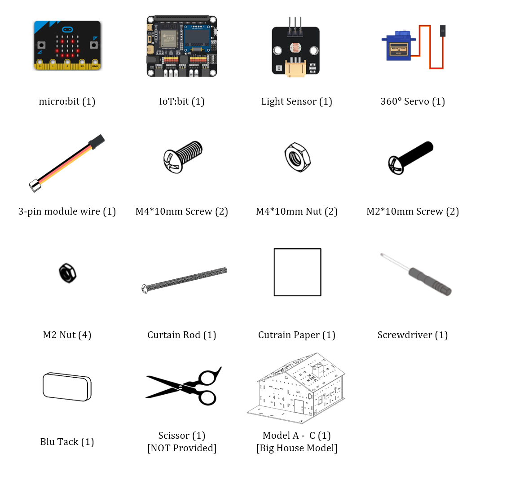

## 組裝步驟

步驟一 

這個案例以「大房子模型」作為基礎。 

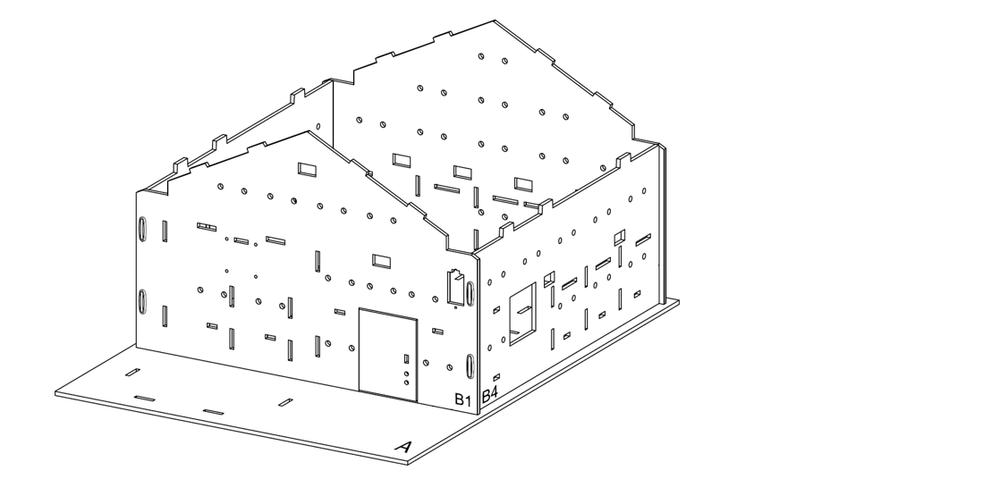

步驟二 

用縲絲批將窗簾鐵杆安裝到360ᵒ舵機上，以製作窗簾。
 

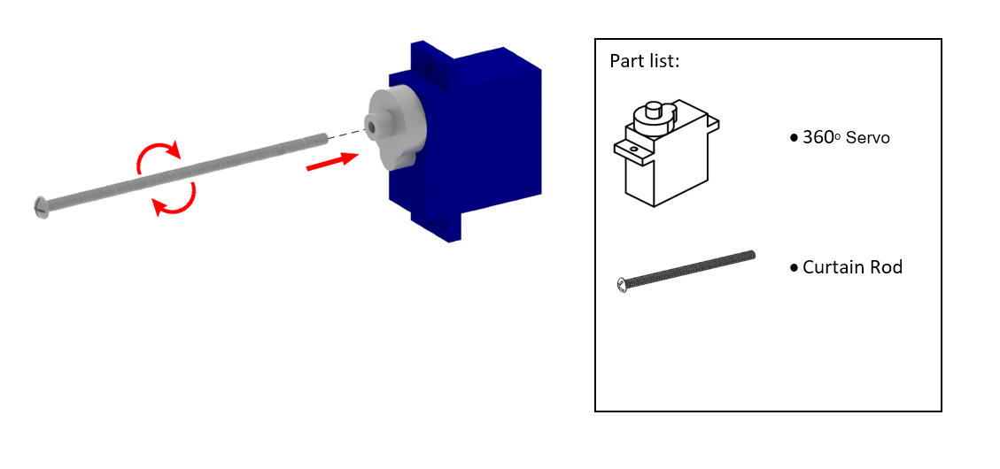

步驟三 

將窗簾紙布剪成 8cm*8cm 的正方形。 

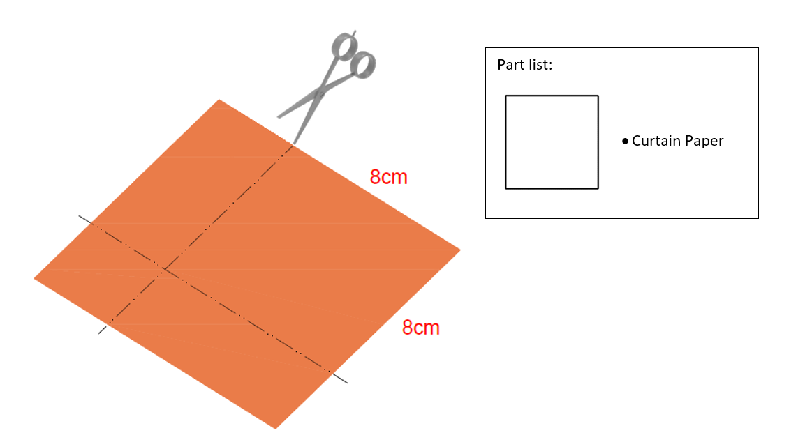

步驟四 

用膠水將剪好的紙布黏在窗簾鐵杆上。 

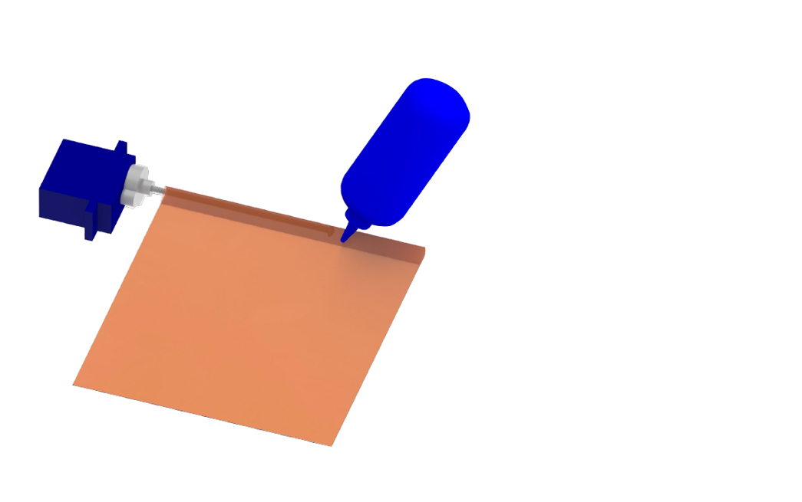

步驟五 

把萬用黏土膠搓成長條。 

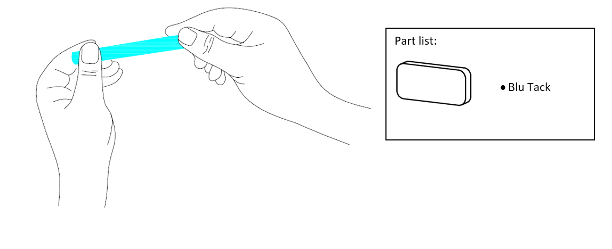

步驟六 

將捏好的萬用黏土膠黏在窗簾的底部。 

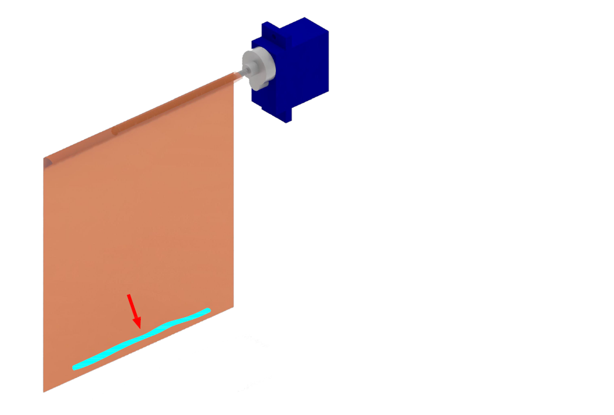

步驟七 

用 M2*10 毫米螺絲及螺母把製作好的窗簾 (舵機) 安裝到 B1 模型上。 

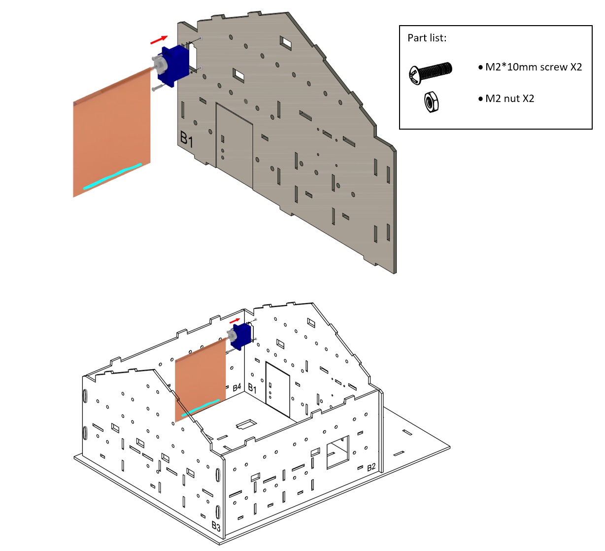

步驟八 

蓋上 B1 和 C1 模型。 

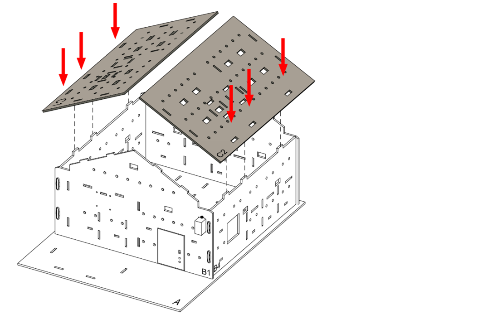

步驟九 

用 M4*10 毫米螺絲及螺母把光度傳感器安裝到 C1 模型上。 

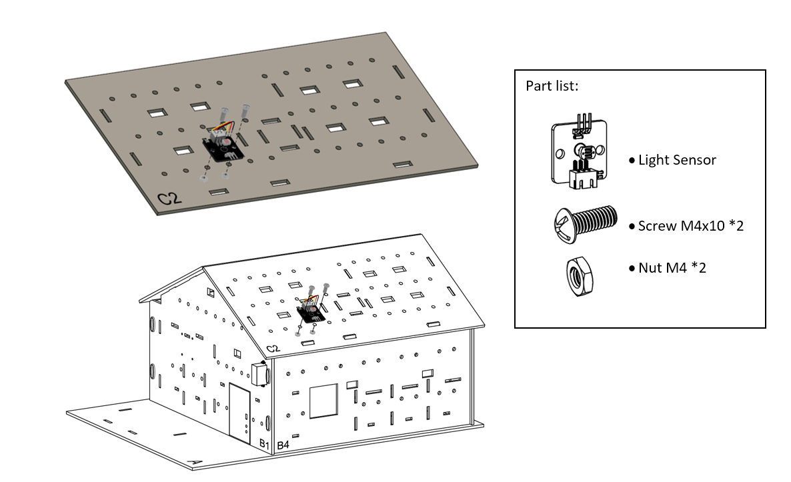

步驟十 

組裝完成！ 

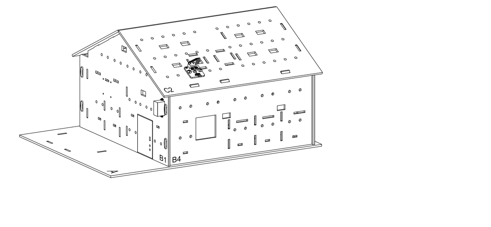

## 線路連接

1. 連接光度傳感器到 P1 端口
2. 連接360ᵒ舵機到 P2 端口
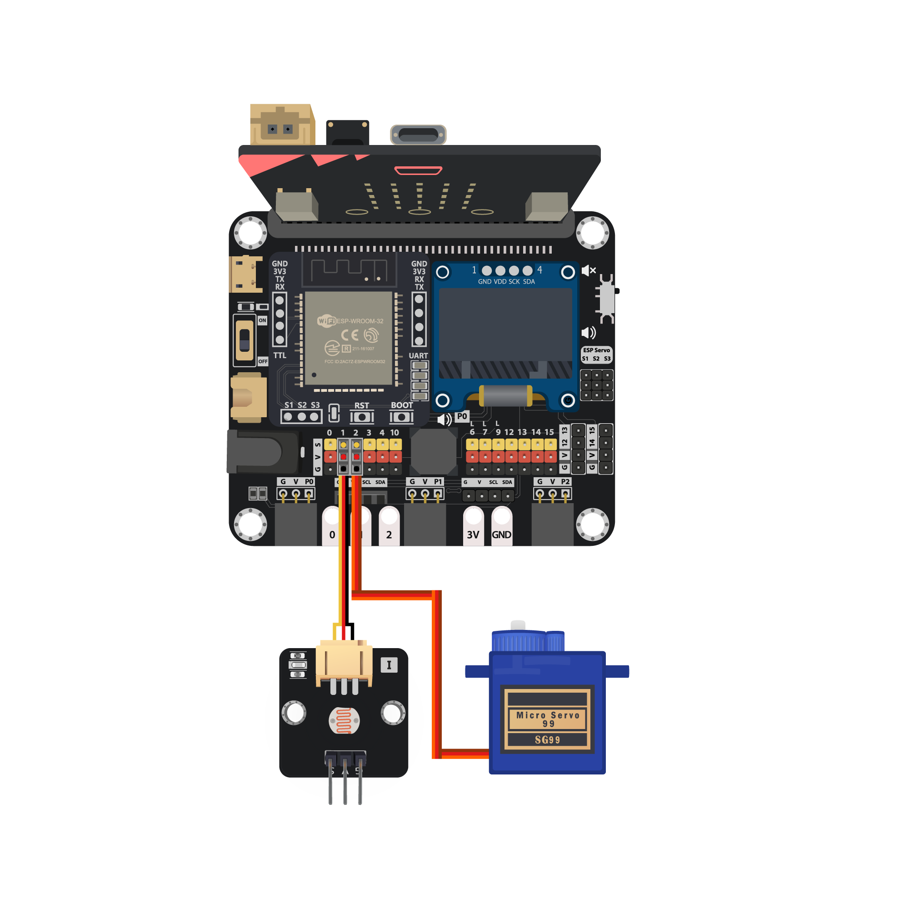

## 編程（MakeCode）

步驟一. 初始化 OLED顯示屏並建立變數

* 把`OLED 初始化 寬128 高64`加入到`當啟動時`，以啟動 OLED 顯示屏
* 建立變數`curtainOn`，並將其設為`false`

步驟二. 建立窗簾控制函式「openCurtain」

* 建立函式`openCurtain`
* 在函式裡，控制連接端口上的 360°舵機的速度和方向，例如`轉動360度舵機以順時針方向速度高接口 P2`
* 加入暫停讓它有幾秒鐘的時間轉動 (取決於您設定的速度)
* 用同樣方式停止 360°舵機，例如`轉動360度舵機以順時針方向速度停止接口 P2`
* 將變數`curtainOn`設為`true`
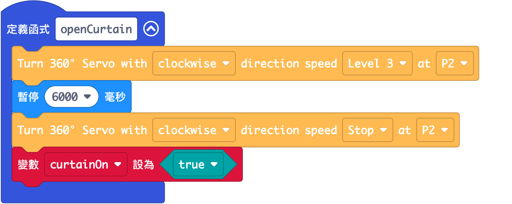

步驟三. 建立窗簾控制函式「closeCurtain」

* 建立函式` closeCurtain`
* 這個函式與上一個函式相似，但方向和狀態相反
* 控制連接端口上的 360°舵機的速度和方向，例如`轉動360度舵機以逆時針方向速度高接口 P2`
* 加入暫停讓它有幾秒鐘的時間轉動 (取決於您設定的速度)
* 用同樣方式停止 360°舵機，例如`轉動360度舵機以逆時針方向速度停止接口 P2`
* 將變數`curtainOn`設為`false`
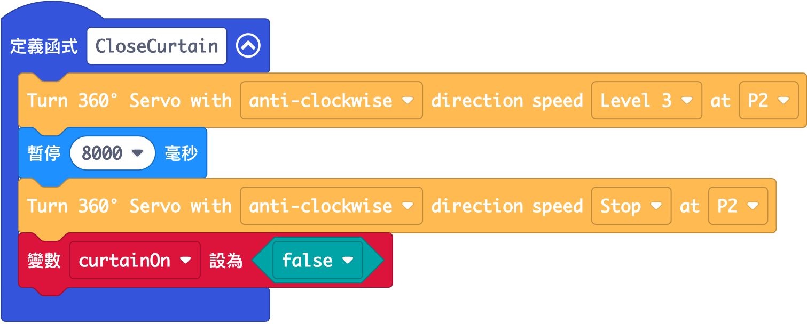

步驟四. 取得光度數值

* 在`重複無限次`中，用`變數 light 設為取得光度傳感器數值接口 P1`
* 透過`清除顯示`在每次刷新前先清除顯示
* 用`顯示數字 light`在顯示屏上顯示數值

步驟五. 檢查光度數值並作出反應

* 在`重複無限次`加入一個巢狀的`如果`語句
* 將第一個條件設為`light ≥ 70 且 curtainOn = true`
* 第一個 If 段代表陽光較強，需關掉窗簾，所以加入`呼叫closeCurtain`
* 將第二個條件設為`light < 40 且 curtainOn = false`
* 第二個 If 段代表陽光較弱，需打開窗簾，所以加入`呼叫openCurtain`
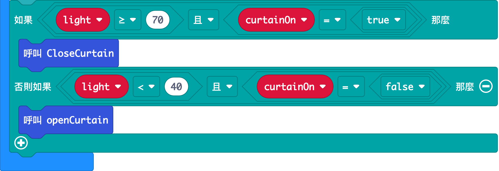

完整答案 

MakeCode: [https://makecode.microbit.org/_d184i0bPygjJ](https://makecode.microbit.org/_d184i0bPygjJ) 

你可以從以下網頁中下載HEX檔案： 
<iframe src="https://makecode.microbit.org/#pub:_d184i0bPygjJ" width="100%" height="500" frameborder="0"></iframe>

## 結果

當光度傳感器感測到屋外的光度較強時，舵機會轉動放下窗簾。而當光度不強時，舵機會反方向轉動，收起窗簾。 

## 思考

Q1. 除了陽光量之外，還有什麼條件可以用來決定收起還是放下窗簾呢？
