# 物聯網案例 09：智能數位鬧鐘

難度：
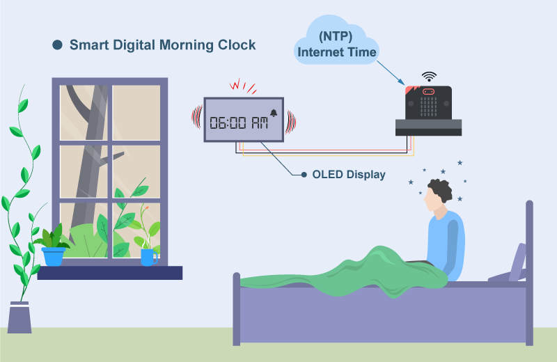

## 目標

製作一個可以自動同步時間，並在指定時間響鬧的智能數位鬧鐘。 

## 背景

甚麼是智能數位鬧鐘？

智能數位鬧鐘是一個透過同步網絡從而得到最精確時間的鬧鐘。 

運作原理

網路時間協定是一個容許設備與網際網路供應商同步時間的網絡協議。透過連接互聯網，數位鬧鐘可以達到與原子鐘只有數毫秒的誤差。 

數位鬧鐘會每0.5秒從網上獲取一次時間，並顯示在 OLED 顯示屏上。當到了設定的時間（例如06:00:00），它就會響鬧。使用者可以按下按鈕 A 關閉響鬧。 

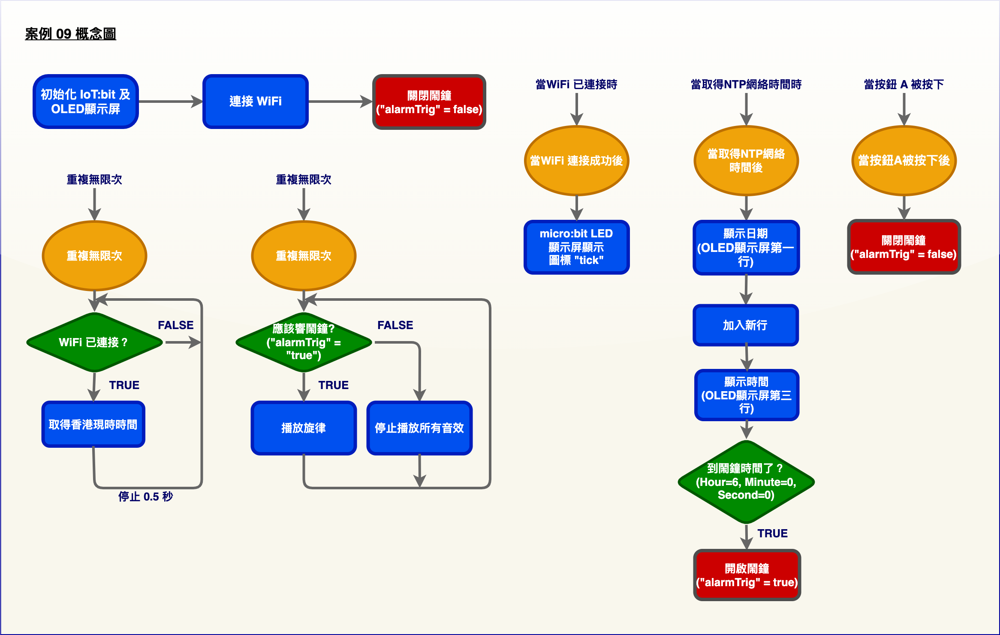

## 所用部件

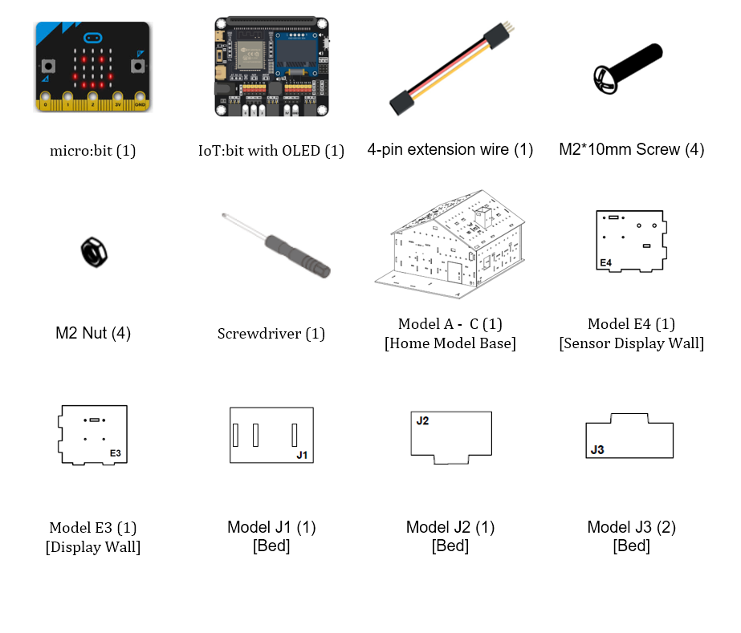

## 組裝步驟

步驟一 

這個案例以「大房子模型」作為基礎。 

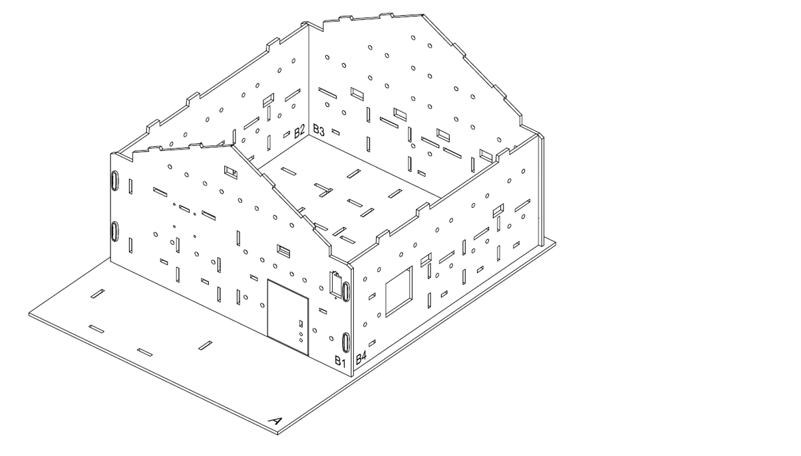

步驟二 

我們來建造一間睡房來放置數位鬧鐘。對準 A 和 B3 模型上的孔，將 E3 模型組裝到 A 模型上。 

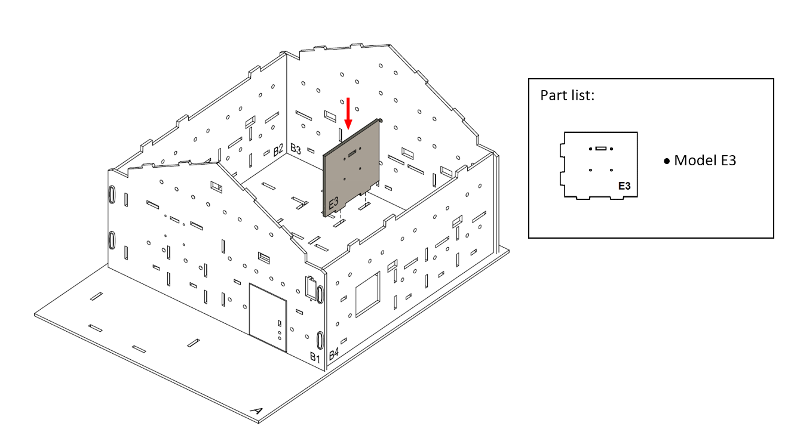

步驟三 

用 M2*10 毫米螺絲及螺母把 OLED 顯示屏安裝到 E3 模型上，當作數位鬧鐘。 

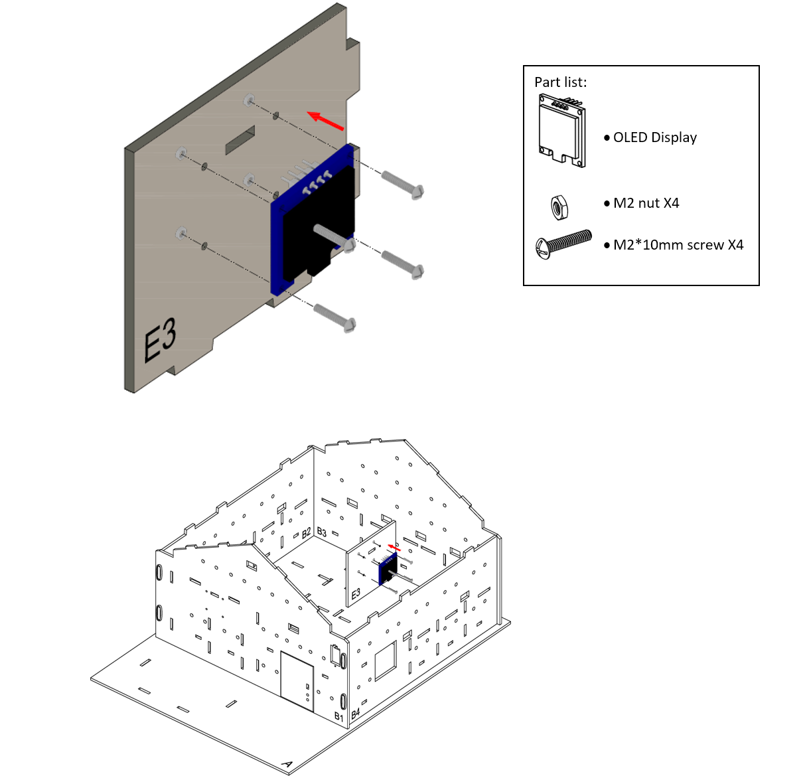

步驟四 

對準 A 和 B4 模型上的孔，將 E4 模型組裝到 A 模型上。 

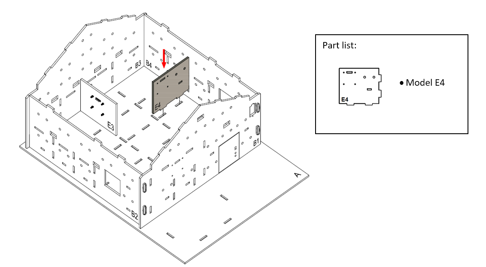

步驟五 

我們來製作一張床。將 J2 模型組裝到 J1 模型上面，兩個 J3 模型組裝到 J1 模型下面。 

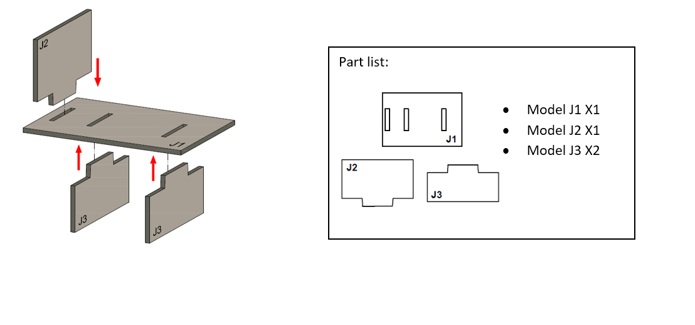

步驟六 

床完成了！ 

步驟七 

將床放到睡房裡的數位鬧鐘旁邊。 

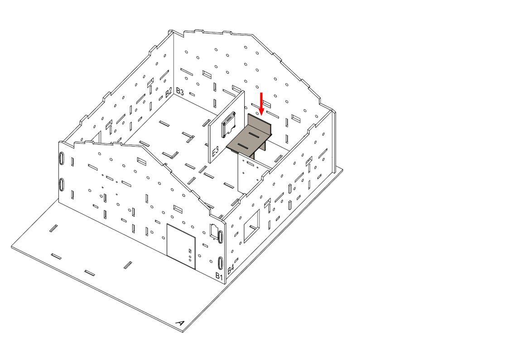

步驟八 

組裝完成！ 

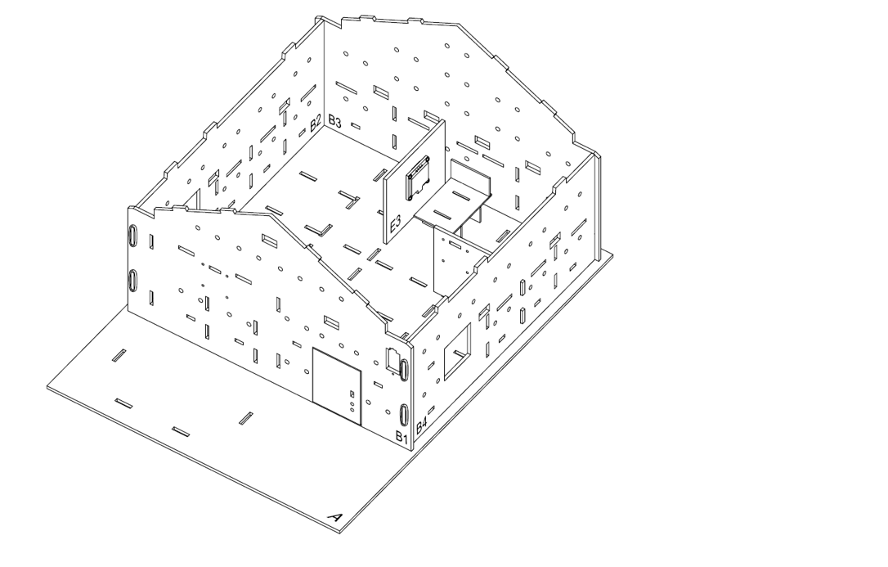

## 線路連接

1. 使用延長線連接擴展 OLED顯示屏到 I2C端口
2. 把蜂鳴器開關向下撥以連接蜂鳴器

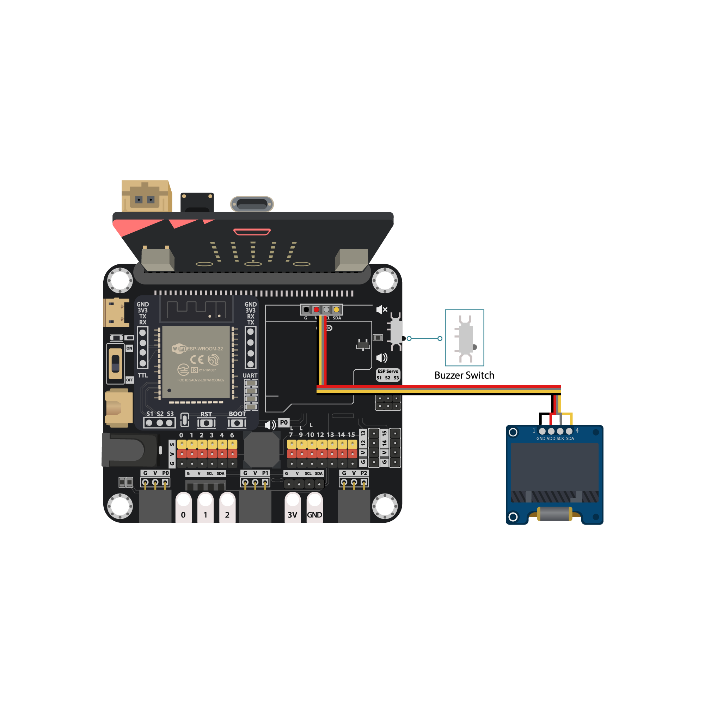

## 編程（MakeCode）

步驟一. 初始化OLED、IoT:bit，連接WiFi和建立變數

* 在`當啟動時`加入`OLED 初始化寬128高64`
* 加入`初始化IoT:bit TX P16 RX P8`
* 加入`連接到 WiFi 名稱 密碼`並輸入 WiFi 名稱和密碼
* 建立變數`alarmTrig`
* 將變數`alarmTrig`設為`false`
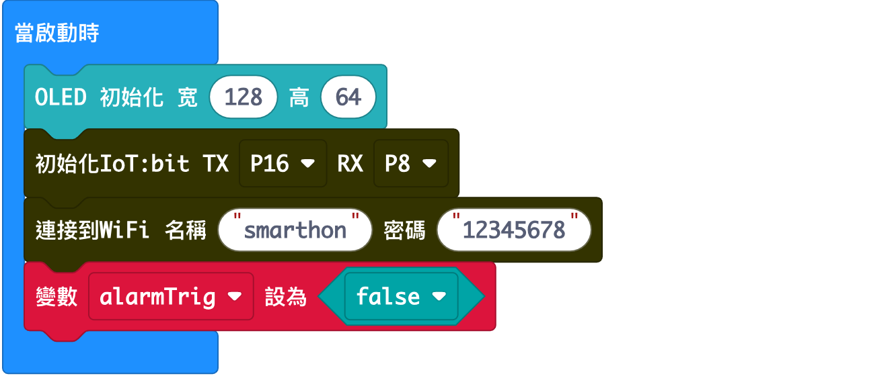

步驟二. 檢查 Wi-Fi 連線狀態

* 放入一個`當WiFi連接成功後`
* 在裡面加入`顯示圖示勾號`，以在連線後顯示勾號

步驟三. 取得NTP時間

* 在`重複無限次`加入一個`如果`語句
* 用`WiFi連接狀態`作為條件
* 在`如果`裡面加入`從城市取得NTP網絡時間 香港 (UTC+8)`以獲取NTP時間
* 加入`暫停500毫秒`以0.5秒的間隔獲取NTP時間

步驟四. 在顯示屏上顯示 NTP 時間

* 放入一個`當取得NTP網絡時間`
* 每當取得NTP時間，這區塊中的程式就會運行
* 加入`清除顯示`以在每次刷新前清除顯示
* 用`新行顯示字符串 字串組合 Date: day.Month.Year `顯示格式化的時間
* 用`新行顯示字符串 字串組合 Time: Hour:Minute:Second `顯示格式化的時間
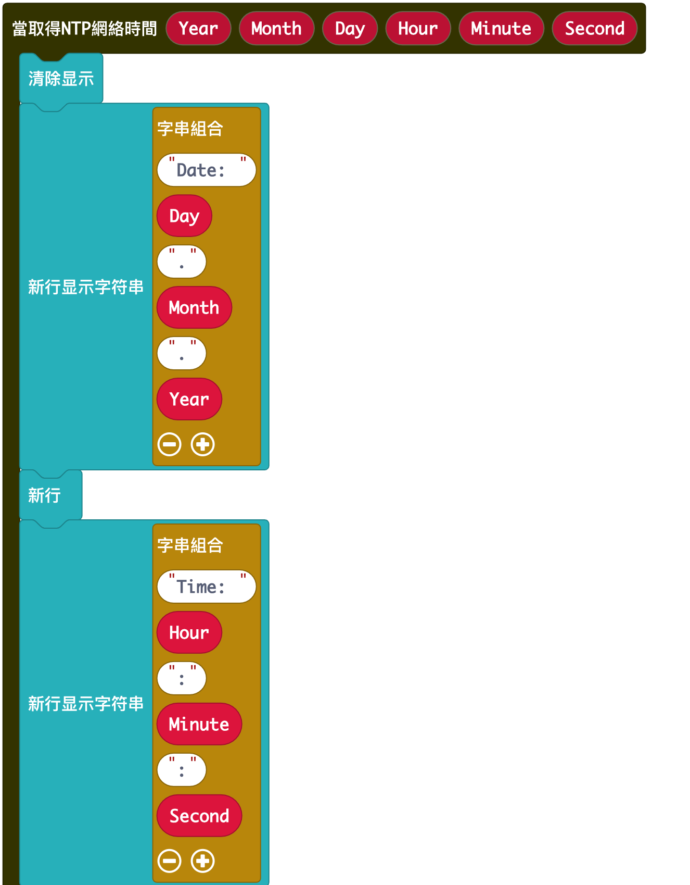

步驟五. 設定鬧鐘

* 加入一個`如果`語句並設條件為`Hour = 6 且 Minute = 0 且 Second = 6`
* 在`如果`裡面加入`變數 alarmTrig 設為 true`
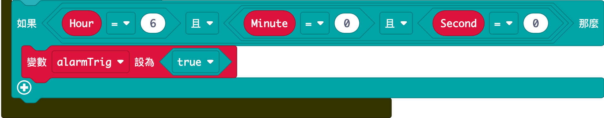

步驟六. 設定鬧鐘聲

* 另外放入一個`重複無限次`
* 在裡面加入一個`如果-那麼`語句
* 用`alarmTrig = true`作為條件
* 以 500 bpm 的節奏按旋律播放鬧鐘聲
* 否則停止鬧鐘聲
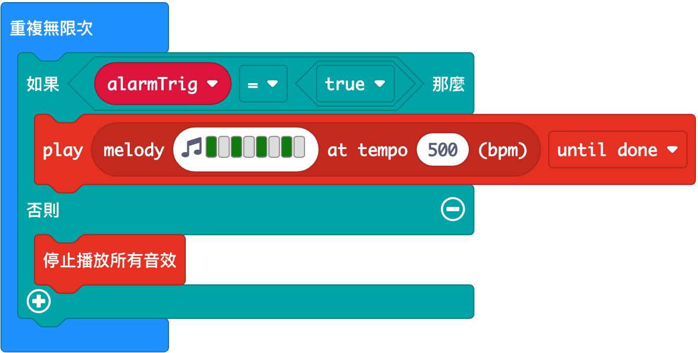

步驟七. 關閉鬧鐘

* 放入一個`當按鈕 A 被按下`
* 加入`變數 alarmTrig 設為 false`

完整答案 

MakeCode: [https://makecode.microbit.org/_DsyTqDJLMD66](https://makecode.microbit.org/_DsyTqDJLMD66) 

你可以從以下網頁中下載HEX檔案： 
<iframe src="https://makecode.microbit.org/#pub:_DsyTqDJLMD66" width="100%" height="500" frameborder="0"></iframe>

## 結果

連接到網路後，會顯示勾號並開始獲取 NTP 時間。 

## 思考

Q1. 當我們取得時間後，除了顯示時間和鬧鐘之外，還有甚麼功能可以執行？ 

