# 物聯網案例 10：家居健康監察系統

難度：

## 目標

製作一個透過屋內傳感器收集健康相關數據並進行分析監察的家居健康監察系統。 

## 背景

甚麼是家居健康監察系統？

家居健康監測的概念是追蹤用戶家中各種環境參數的狀況。對於室內環境而言，分析居家舒適度的重要參數包括溫度、濕度、PM2.5、二氧化碳 (CO2) 和揮發性有機化合物 (VOC)。通過監測溫度和濕度，我們可以評估居家舒適度。過高的溫度或過低的濕度都會引致不舒適。 

運作原理

本案例採用整合式 DHT11 溫濕度傳感器。 它會持續追蹤房間的溫度、濕度和室內空氣品質 (IAQ) 值，並將數據顯示在 OLED 螢幕上，同時上傳到 Thingspeak 平台以便進一步分析。 

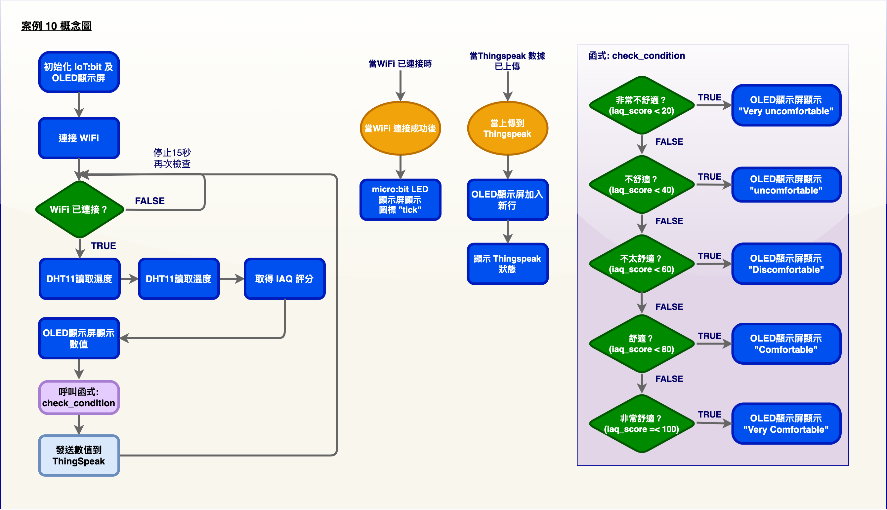

了解更多：什麼是 IAQ？

室內空氣品質 (IAQ) 是指建築物內及其周圍的空氣質素，尤其與建築物居住者的健康和舒適度息息相關。了解和控制常見的室內污染物可以降低罹患室內健康問題的風險。 重要的參數包括溫度、濕度、PM2.5、二氧化碳 (CO2) 和揮發性有機化合物 (VOC)。 

了解更多：如何確定 IAQ 分數？

在 Smarthon 智能家居IoT創作套裝中，我們使用溫度和濕度這兩個參數來評定房間的舒適度 (IAQ 評分)。下表顯示了最舒適的溫度 (20-22°C) 和濕度 (40-70%) 值。 

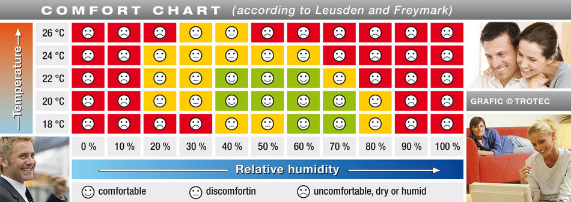

因此，較好的溫度和濕度範圍會帶來較高的 IAQ 評分，兩者的 IAQ 評分平均值可以確定房間的舒適度。換句話說，使用 Smarthon 的擴展來編程，可以得到溫度和濕度 IAQ 評分的平均值。

## 所用部件

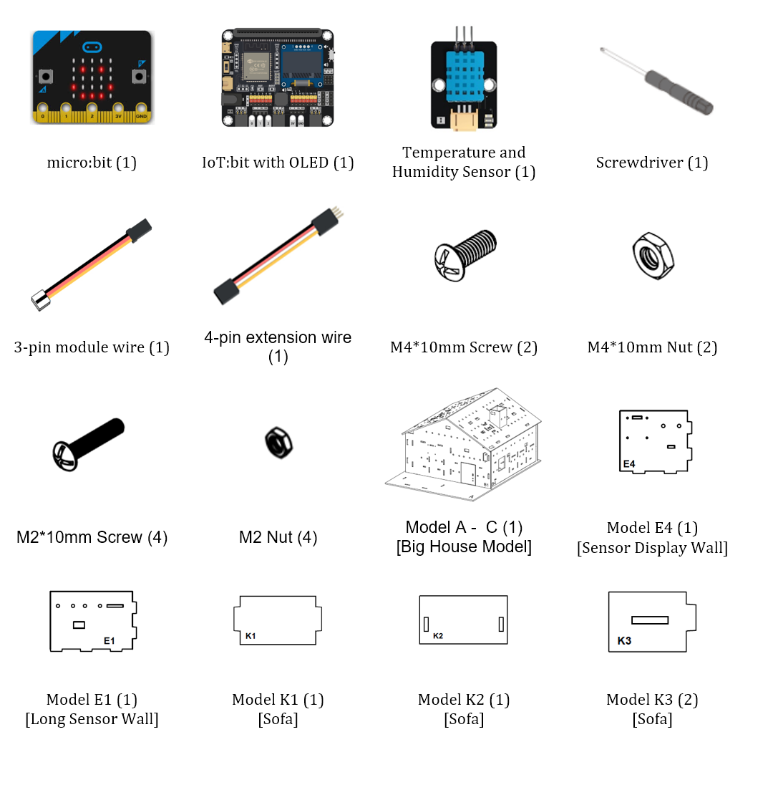

## 組裝步驟

步驟一 

這個案例以「開放式模型」作為房子的基礎。 

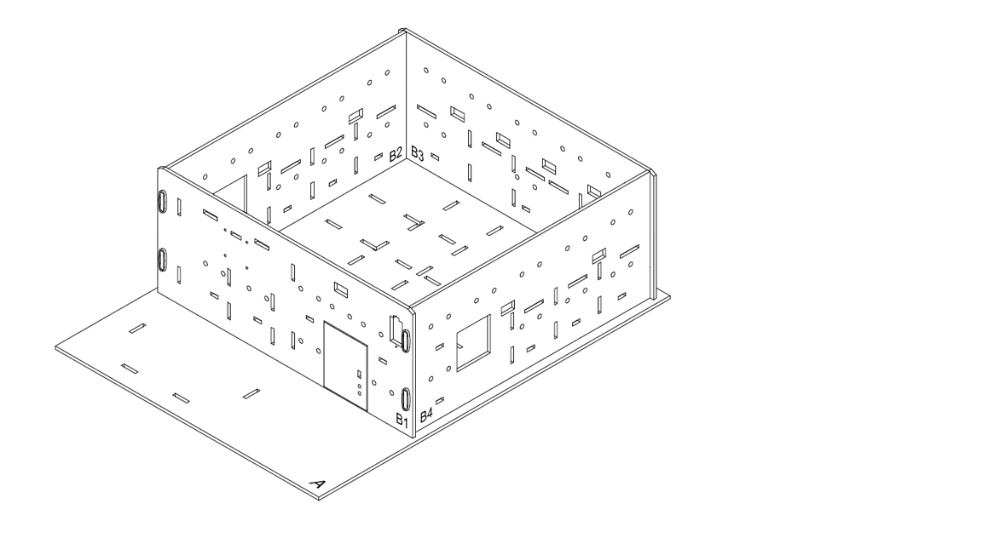

步驟二 

對準 A、B2 和 B3 模型上的孔，將 E1和 E4 模型組裝到 A 模型上。 

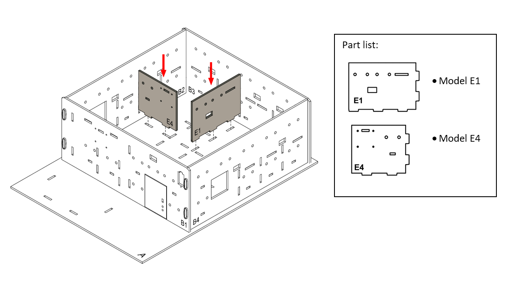

步驟三 

用 M2*10 毫米螺絲及螺母把 OLED 顯示屏安裝到 E4 模型上。 

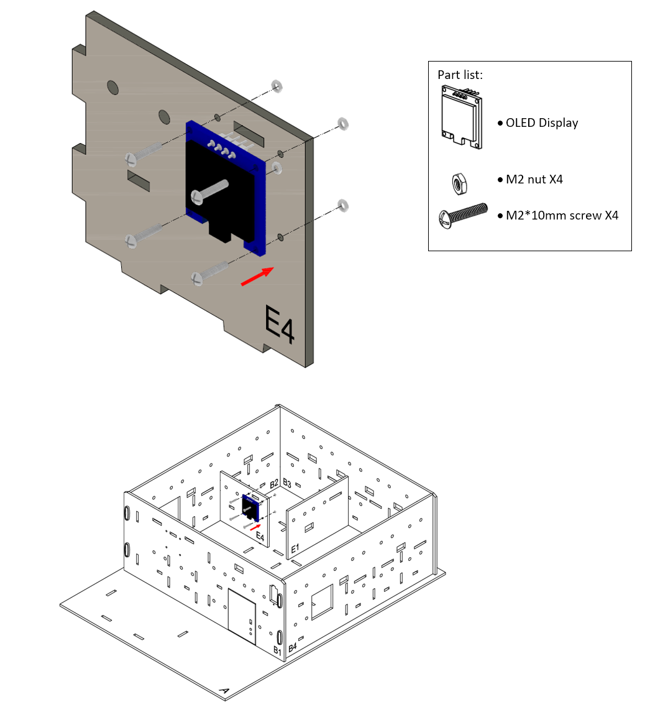

步驟四 

用 M4*10 毫米螺絲及螺母把溫濕度傳感器安裝到 E4 模型上，連接線穿過旁邊的孔。 

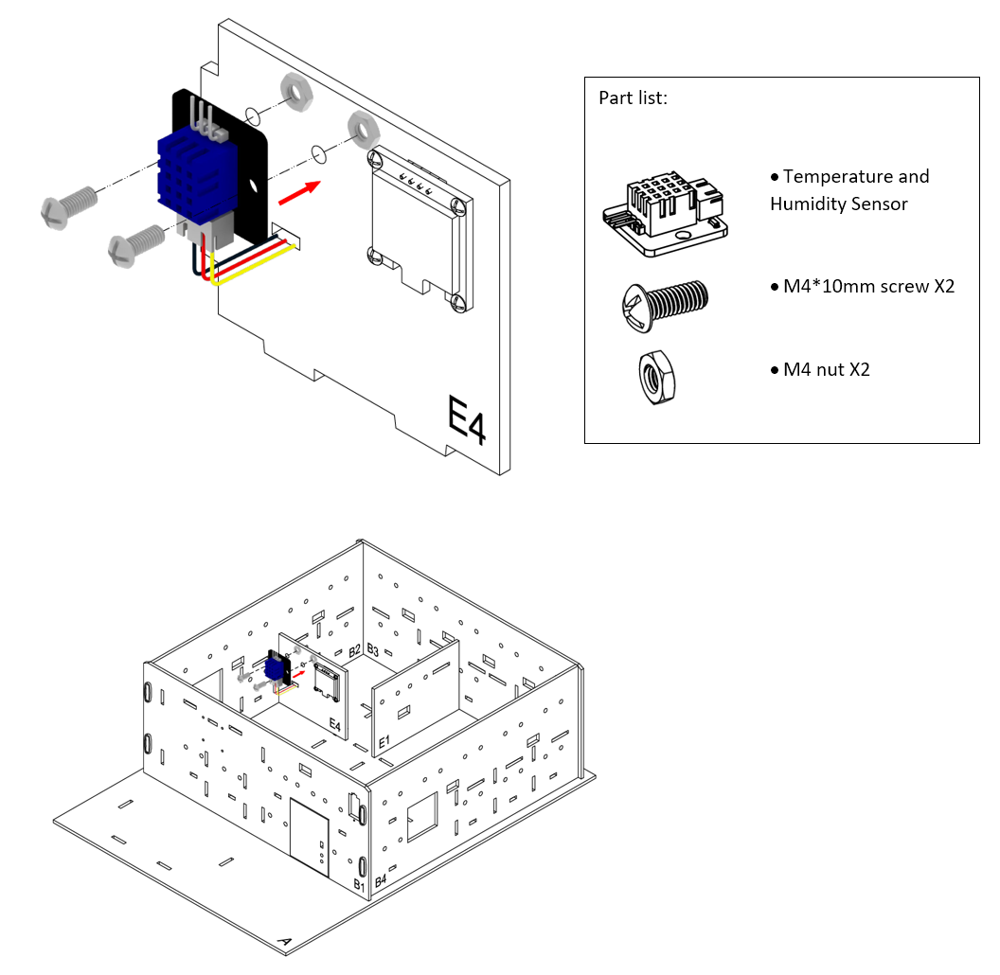

步驟五 

我們來製作一張沙發。將 K3 模型裝到 K1 模型的兩側。 

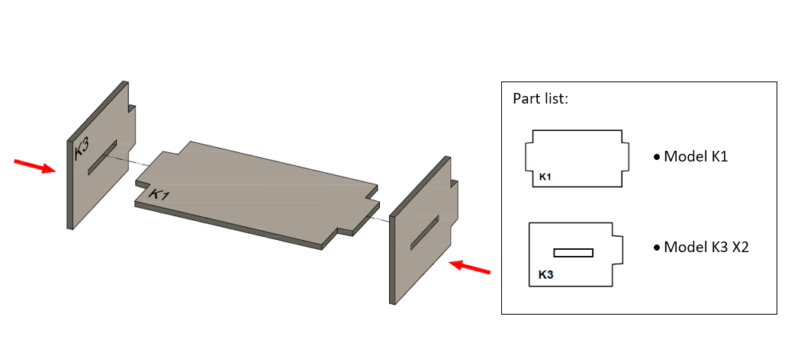

步驟六 

將 K2 模型與 K1-K3 模型組裝到一起。 

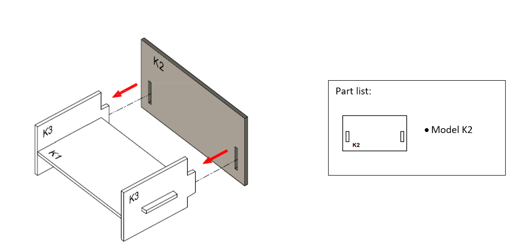

步驟七 

把沙發放到 E4 模型前面。 

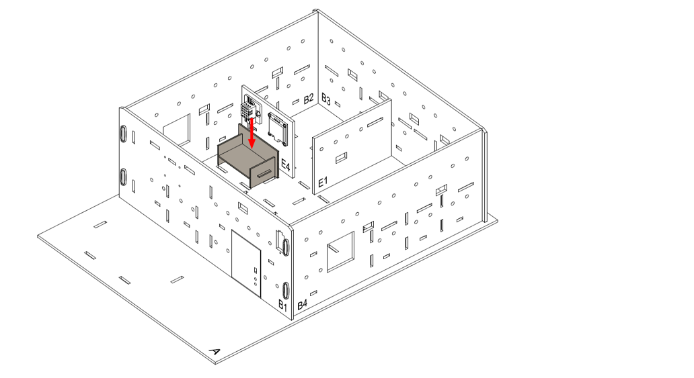

步驟八 

組裝完成！ 

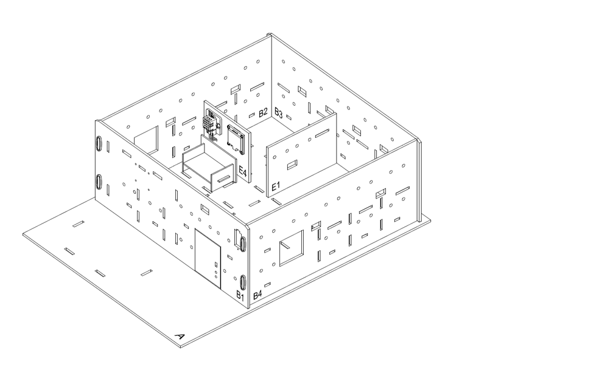

## 線路連接

1. 連接溫度及濕度傳感器到 P0 端口
2. 把蜂鳴器開關向上撥以斷開蜂鳴器
3. 使用延長線連接擴展 OLED顯示屏到 I2C端口

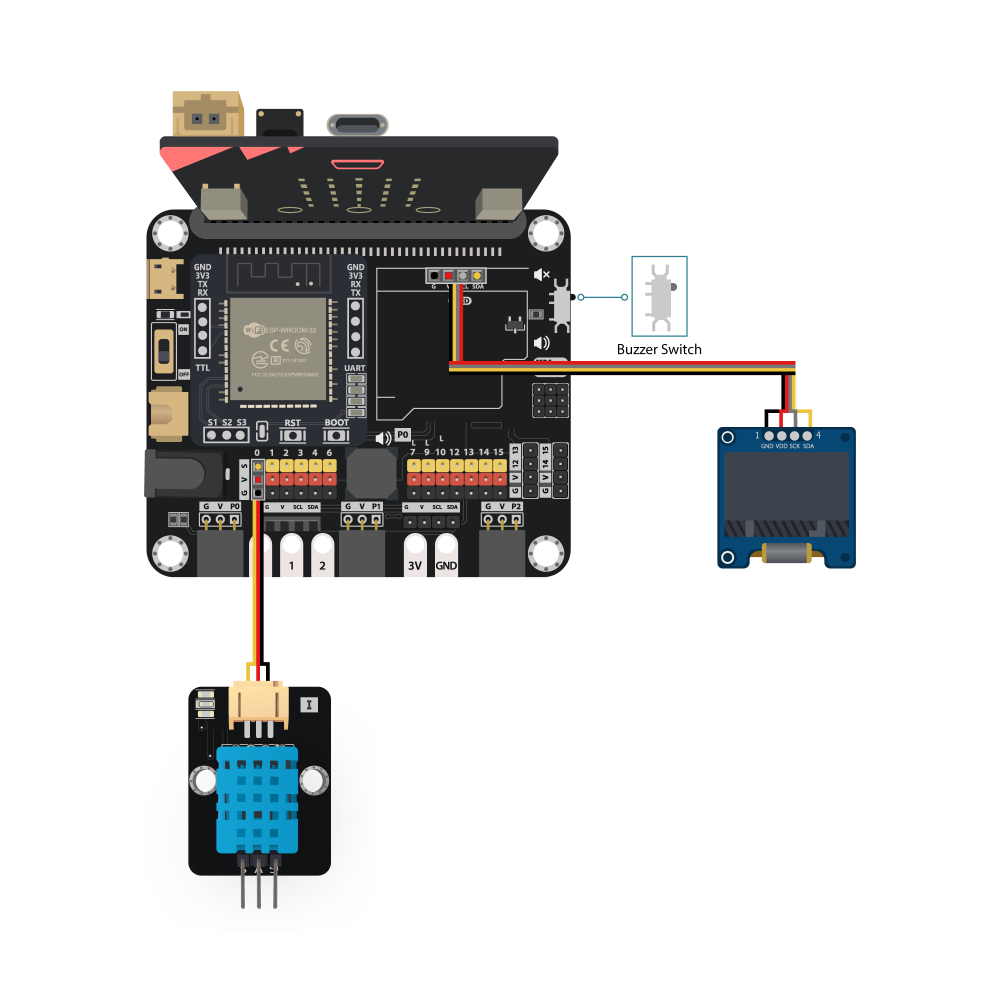

## 物聯網（Thingspeak）

步驟一. 建立 Thingspeak 頻道

* 前往 Thingspeak 建立帳戶然後建立頻道
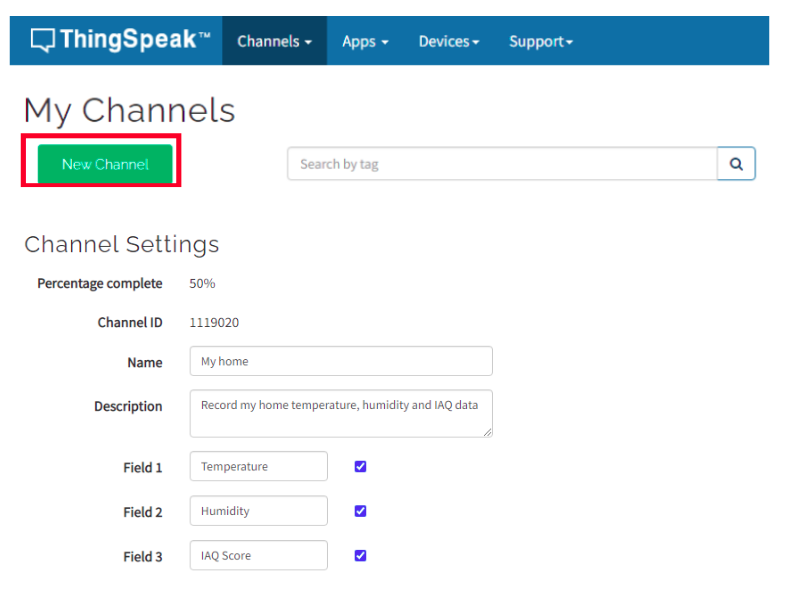

步驟二. 取得頻道 API

* 建立頻道之後，能取得 Write API Key
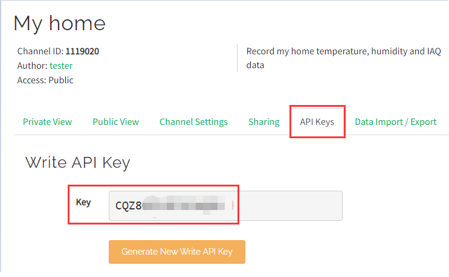

## 編程（MakeCode）

步驟一. 初始化OLED、IoT:bit；連接WiFi；建立並初始化變數

* 在`當啟動時`加入`OLED 初始化寬128高64`
* 加入`初始化IoT:bit TX P16 RX P8`
* 加入`連接到 WiFi 名稱 密碼`並輸入 WiFi 名稱和密碼
* 建立變數`temperature`、`humidity`和`iaq_score`，並初始化為 0
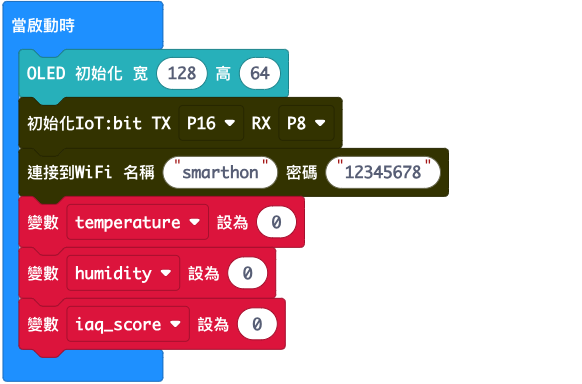

步驟二. 檢查 Wi-Fi 連線狀態

* 放入一個`當WiFi連接成功後`
* 在裡面加入`顯示圖示勾號`，以在連線後顯示勾號
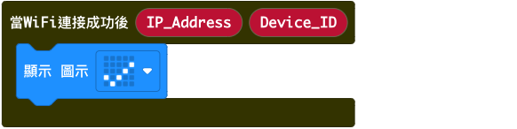

步驟三. 建立函式「check_condtion」

* 建立一個函式並命名為`check_condtion`
* 在裡面加入一個巢狀的`如果-否則`語句
* 第一個條件是`iaq_score < 20`，裡面加入`顯示字符串 Very uncomfortable`
* 第二個條件是`iaq_score < 40`，裡面加入`顯示字符串 Uncomfortable`
* 第三個條件是`iaq_score < 60`，裡面加入`顯示字符串 Discomfortable`
* 第四個條件是`iaq_score < 80`，裡面加入`顯示字符串 Comfortable`
* 第五個條件是`iaq_score ≤ 100`，裡面加入`顯示字符串 Very comfortable`
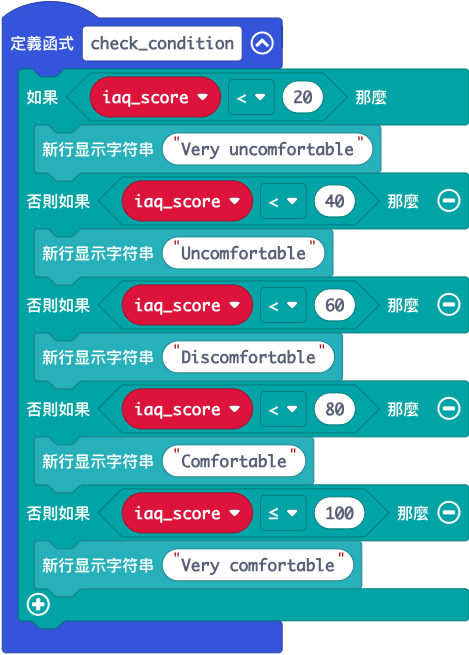

步驟四. 讀取溫濕度傳感器數據

* 在`重複無限次`加入一個`如果`語句，條件設為`WiFi 連接狀態`以確保在上傳 Thingspeak 之前連接到網絡
* 用`讀取溫濕度傳感器數值接口P0`來讀取數據
* 讀取 DHT11 數據後，使用以下三個擴展取得結果並設定到變數
1. `變數 temperature 設為 取得溫度數值攝氏`對應溫度
2. `變數 humidity 設為 取得濕度數值`對應濕度
3. `變數 iaq_score 設為 取得室內空氣質素(IAQ)`對應 IAQ 評分
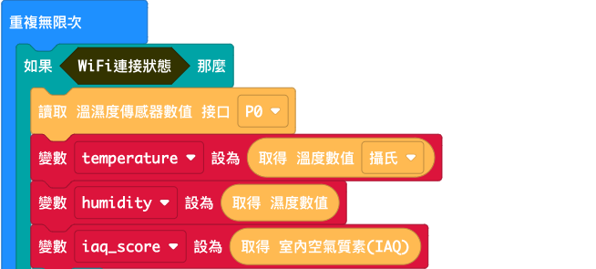

步驟五. 在顯示屏上顯示數據

* 加入`清除顯示`以在每次刷新前清除顯示
* 分別顯示三個變數，並加上文字說明
1. `顯示字符串 字串組合 Temperature: temperature`對應溫度
2. `顯示字符串 字串組合 Humidity: humidity`對應濕度
3. `顯示字符串 字串組合 IAQ Score: iaq_score`對應 IAQ 評分
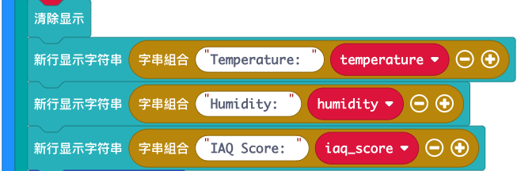

步驟六. 分析環境狀況

* 執行函式`check_condition`來總結 IAQ 評分結果

步驟七. 上傳到 Thingspeak

* 用`發送到 Thingspeak key XXX 項目1數值 XXX ...`將數據傳送至 Thingspeak，在空格填上 Thingspeak 頻道的 Write API Key 以及需要上傳的數據
* 將數據上傳到 Thingspeak 後，加入`暫停15000毫秒`等待 15 秒，避免過於頻繁的傳輸，之後再開始另一次讀取和上傳。
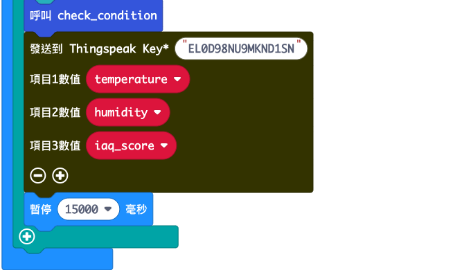

步驟八. 檢查 Thingspeak 上傳情況

* 用`當上傳到Thingspeak後`取得上傳結果以檢查上傳的情況
* 加入`新行`以便觀看
* 使用擴展上的`Status`和`Error_code`來分別顯示一些文字說明
1. `顯示字符串 字串組合 Thingseak: Status`對應上傳狀態
2. `顯示字符串 字串組合 Error: Error_code`對應上傳失敗時的錯誤代碼
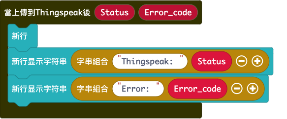

完整答案 

MakeCode: [https://makecode.microbit.org/_0YKgcrDyVRpk](https://makecode.microbit.org/_0YKgcrDyVRpk) 

你可以從以下網頁中下載HEX檔案： 
<iframe src="https://makecode.microbit.org/#pub:_0YKgcrDyVRpk" width="100%" height="500" frameborder="0"></iframe>

## 結果

OLED 顯示屏上顯示溫度、濕度、IAQ 評分以及基於 IAQ 評分的環境狀況，並在上傳後顯示上傳情況。 

## 思考

Q1. 除了溫度和濕度之外，您認為家居健康監察系統還必須包含哪些要素？（例如 CO2 水平？PM2.5 值？） 

Q2. 如果要在真正的家庭中使用，您認為系統還可以具備甚麼功能？（例如，當環境對健康不利時發出警報？） 

