# 物聯網案例 11：廚房火災警報系統

難度：
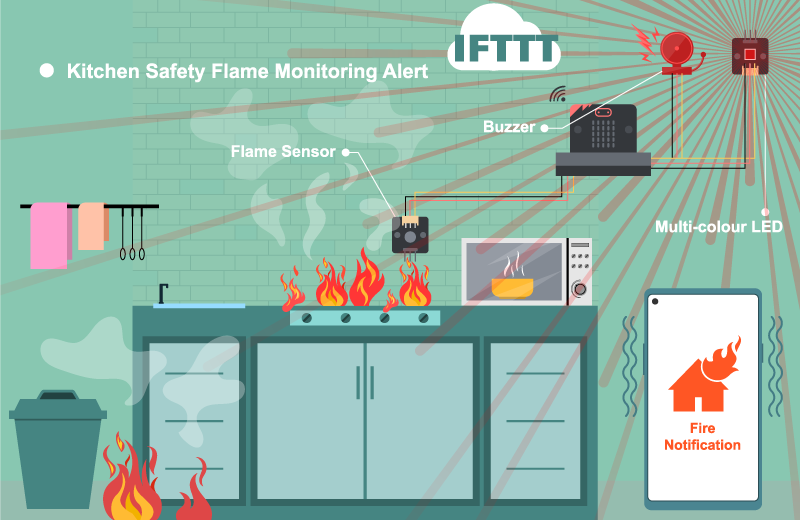

## 目標

製作一個會偵測附近是否有強火的火災警報系統。 

## 背景

甚麼是廚房火災警報系統？

火災事故經常發生在住戶睡著或不在家的時候。為了防止可怕的火災事故，在廚房或客廳安裝一套 IoT 系統是個好辦法，該系統可以在住戶睡覺或外出時透過手機提醒住戶。 

運作原理

在廚房區域安裝火焰傳感器後，系統會在偵測到火災時觸發警報並閃爍紅色 LED 燈以提醒家中的住戶。同時，它也會向住戶的手機發送 IFTTT 通知，即使住戶睡著或不在家也能收到警報。 

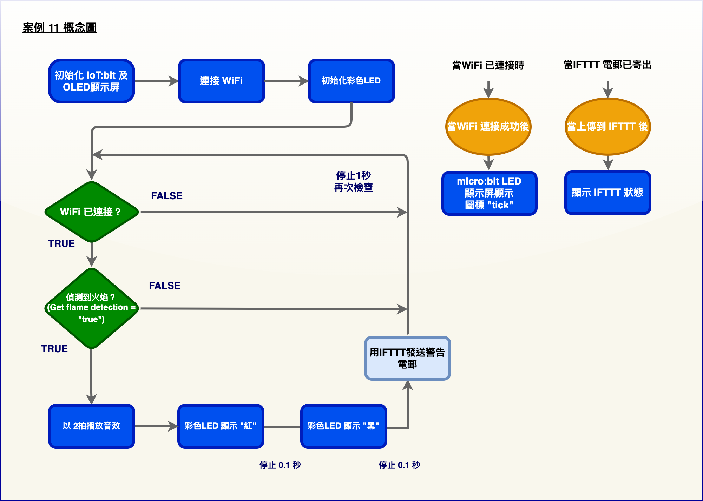

## 所用部件

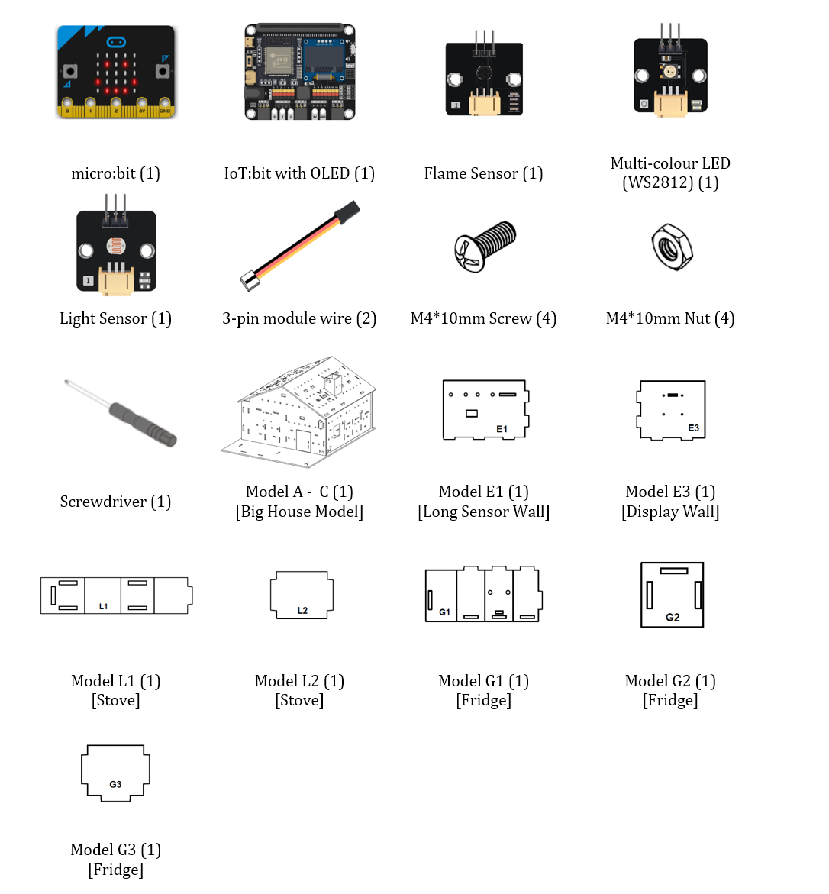

## 組裝步驟

步驟一 

這個案例以「大房子模型」作為基礎。 

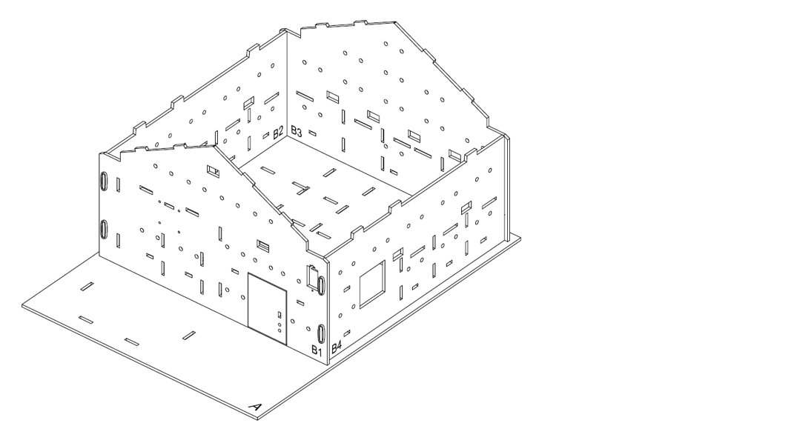

步驟二 

對準 A、B1 和 B2 模型上的孔，將 E1和 E3 模型組裝到 A 模型上，以建立一個廚房。 

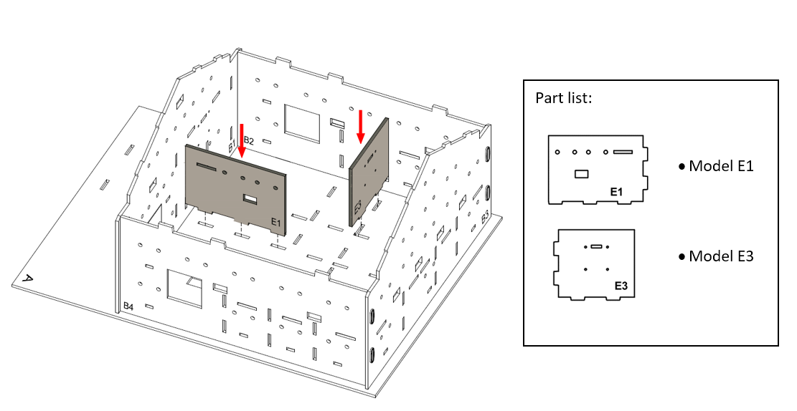

步驟三 

用 M4*10 毫米螺絲及螺母把火焰傳感器安裝到 E4 模型上，連接線穿過旁邊的孔。 

步驟四 

用 M4*10 毫米螺絲及螺母把彩色LED安裝到 E4 模型上，連接線穿過旁邊的孔。 

步驟五 

我們來製作一個煮食爐模型。將 L2 模型從上到下放置到 L1 模型。 

步驟六 

按照箭頭方向將 L1 模型折向 L2 模型。 

步驟七 

按照箭頭方向將 L1 模型的另一側折向 L2 模型。 

步驟八 

貼上爐灶圖案的紙貼。 

步驟九 

煮食爐完成了。 

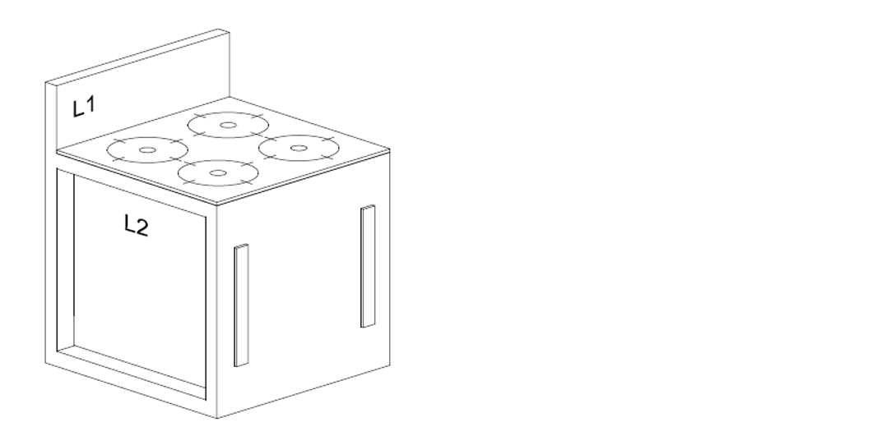

步驟十 

將煮食爐模型放在廚房。 

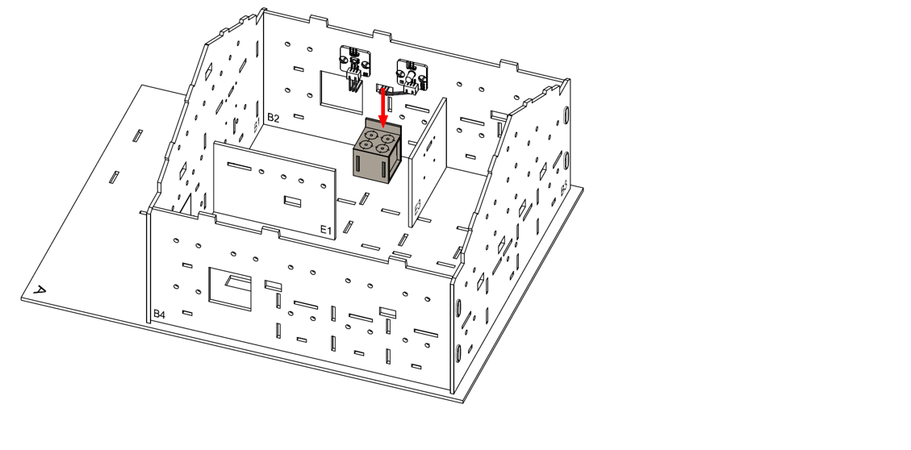

步驟十一 

用 M4*10 毫米螺絲及螺母把光度傳感器安裝到 G1 模型上，以製作一台冰箱，連接線穿過旁邊的孔。 

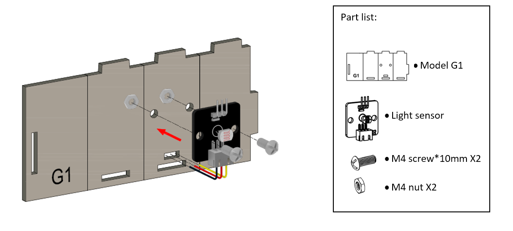

步驟十二 

將 G1 模型如圖中折疊和彎曲，然後對準孔，將 G3 模型拼到 G1 模型中。 

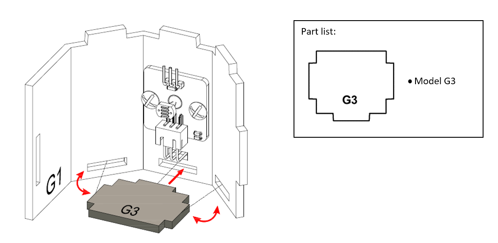

步驟十三 

對準孔，將 G2 模型裝到 G1 模型上。 

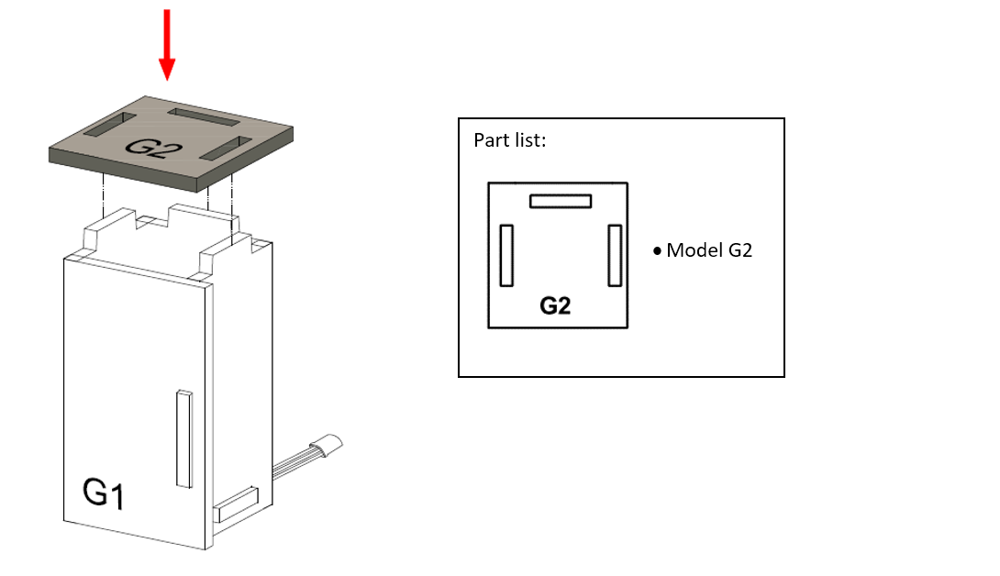

步驟十四 

冰箱完成。 

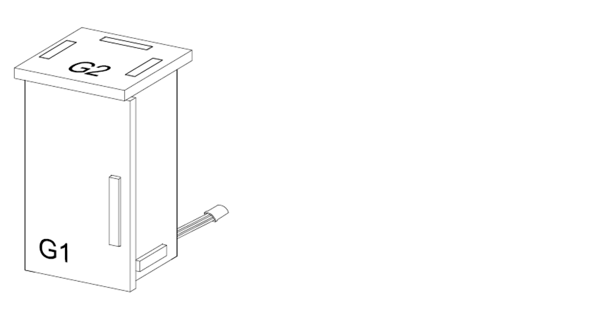

步驟十五 

把冰箱放到廚房角落。 

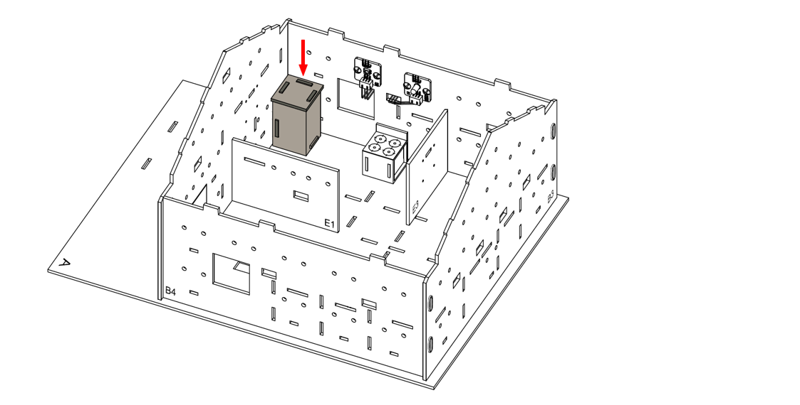

步驟十六 

組裝完成！ 

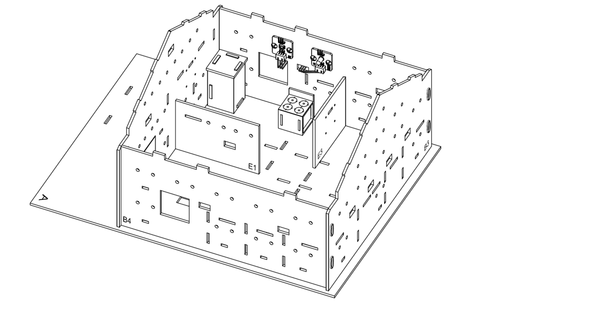

## 線路連接

1. 連接火焰傳感器到 P2 端口
2. 連接彩色LED到 P1 端口
3. 把蜂鳴器開關向下撥以連接蜂鳴器

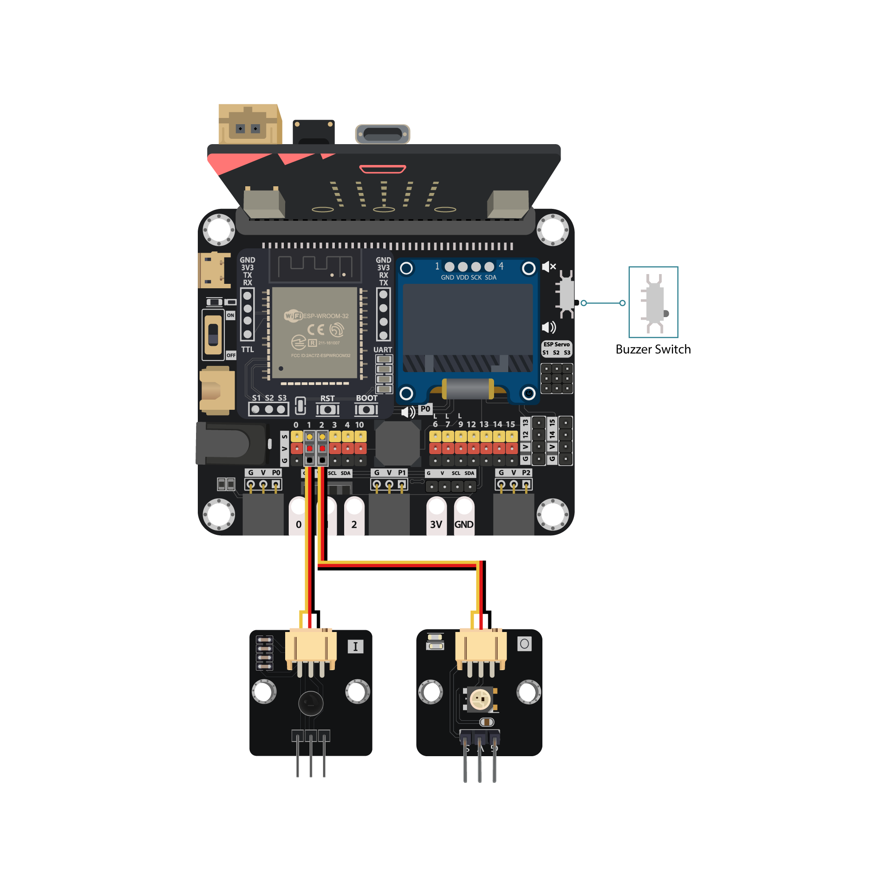

## 編程（MakeCode）

步驟一. 初始化OLED、IoT:bit；連接WiFi；啟動彩色LED

* 在`當啟動時`加入`OLED 初始化寬128高64`
* 加入`初始化IoT:bit TX P16 RX P8`
* 加入`連接到 WiFi 名稱 密碼`並輸入 WiFi 名稱和密碼
* 加入`變數 strip 設為引腳 P1 初始化燈帶 1 顆LED（模式 RGB（GRB 順序））`
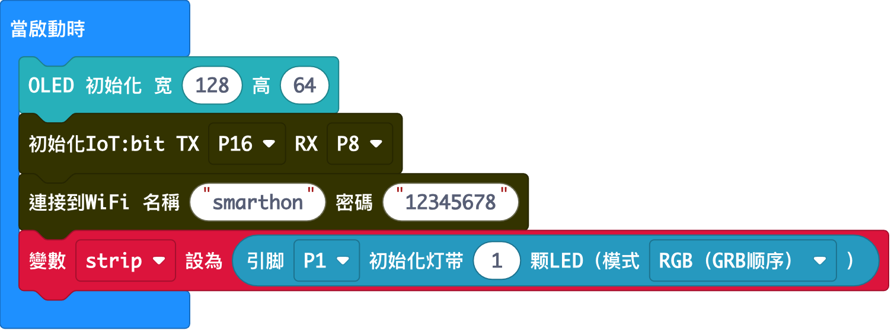

步驟二. 檢查 Wi-Fi 連線狀態和Device ID

* 放入一個`當WiFi連接成功後`
* 在裡面加入`顯示圖示勾號`，以在連線後顯示勾號
* 在`當Wifi連接後` 裡添加`顯示字符串`，並把ID放進去
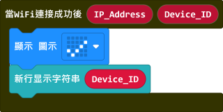

步驟三. 檢查網路連線狀態

* 在`重複無限次`加入一個`如果`語句，條件設為`WiFi 連接狀態`以檢查連線狀態

步驟四. 檢查火焰傳感器的回傳結果和警報聲

* 在`如果`裡加入另一個`如果`語句，條件設為`取得火焰檢驗器數值接口 P2 = true`來識別火焰
* 偵測到火焰時播放警報聲

步驟五. LED燈警報

* LED 應該閃爍以警告危險
* 加入`strip 顯示顏色紅`以亮起紅色 LED
* 加入`暫停 100 毫秒`以暫停 0.1 秒
* 加入`strip 顯示顏色黑`以關閉 LED
* 再次暫停 0.1 秒

步驟六. 傳送到 IFTTT

* 放入一個`發送到 IFTTT 事件名稱* XXX`將事件傳送到 IFTTT
* 在空格填上你的 Applet 的事件名稱
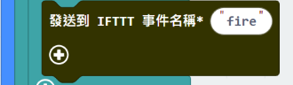

步驟七. 檢查上傳情況

* 用`當上傳到 IFTTT 後`取得上傳結果以檢查上傳的情況
* 用 OLED 顯示屏顯示資訊
* 加入`清除顯示`以在每次刷新前清除顯示
* 加入`新行顯示字符串 字串組合 IFTTT: Status`以顯示上傳狀態
* 加入`新行顯示字符串 字串組合 Error: Error_code`以顯示上傳失敗時的錯誤代碼
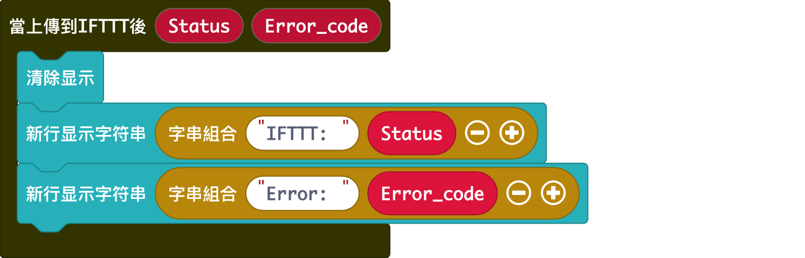

完整答案 

MakeCode: [https://makecode.microbit.org/_RziMMzU1eLiW](https://makecode.microbit.org/_RziMMzU1eLiW) 

你可以從以下網頁中下載HEX檔案： 
<iframe src="https://makecode.microbit.org/_RziMMzU1eLiW" width="100%" height="500" frameborder="0"></iframe>

## 物聯網（IFTTT）

### 第一部分：設定 IFTTT

第一步驟 

前往 [http://www.ifttt.com](http://www.ifttt.com)， 註冊一個帳號以登入 

第二步驟 

到右上角的菜單，點擊Create->Applet 

第三步驟 

* 選擇“This”
* 從選單中選擇“Smarthon IoT”。
* 輸入設備ID, 例如: 0x55a842e3477a (見編程部份第一步得到Device ID)
* 輸入事件名稱: Fire
* 點擊“Create trigger”按鈕。
  

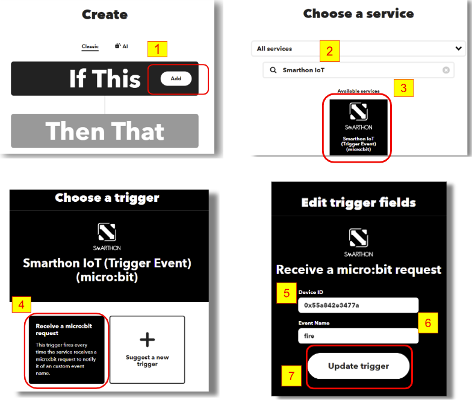

 

第四步驟 

* 在“That”部分,選擇“Notifications”。
* 選擇“Send a notification from the IFTTT app”。
* 在“Message"欄位中輸入“There is a fire in the house!”
* 最後點擊“Create action”按鈕。
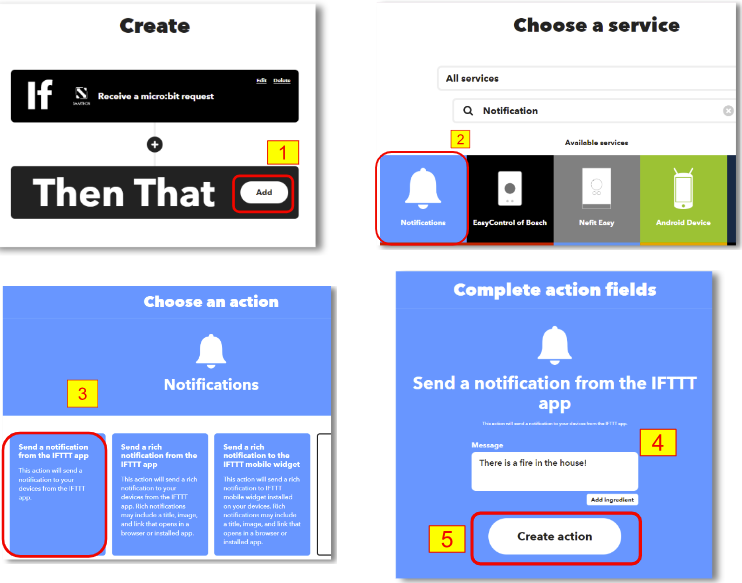

 

<H4>可選：使用電子郵件作為通知方法</H4>

在 THEN 欄位中，搜尋「email」並使用它來取代上一步驟中的「Notifications」
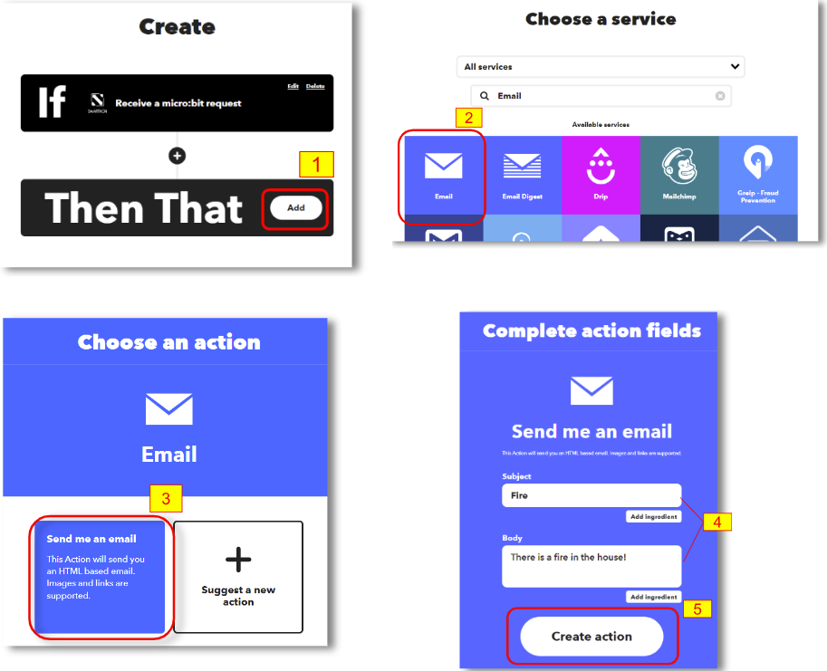

### 第二部分：在智能電話上安裝 IFTTT 應用程式
1. 前往 <U>Play商店</U> 或 <U>App Store</U> 搜尋並下載 IFTTT App

2. 登入你的 IFTTT 帳戶
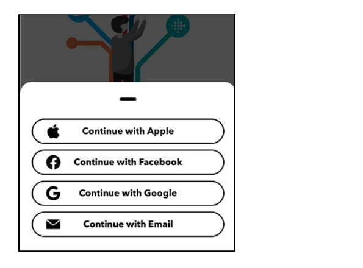

## 結果

## 思考

Q1. 當我們偵測到火焰時，除了發出警報之外，我們還能做什麼？（例如添加風扇或灑水器來滅火？ 自動報警？） 

