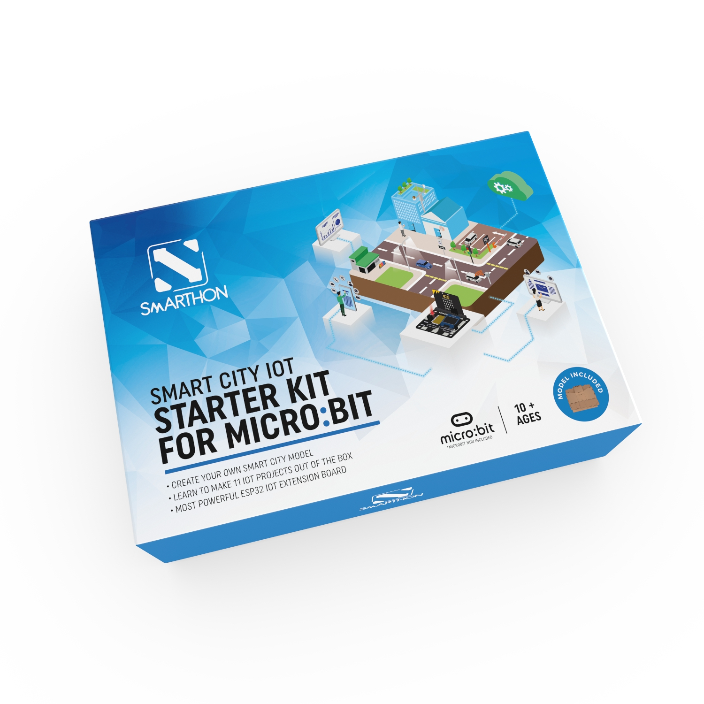
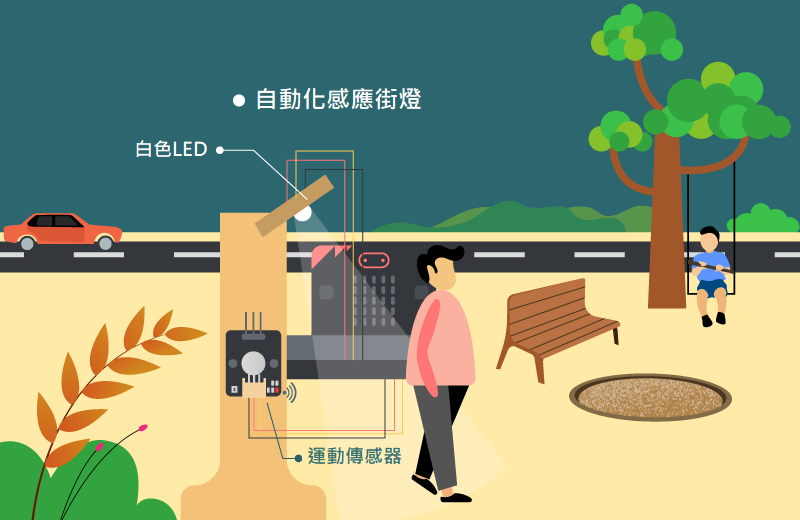
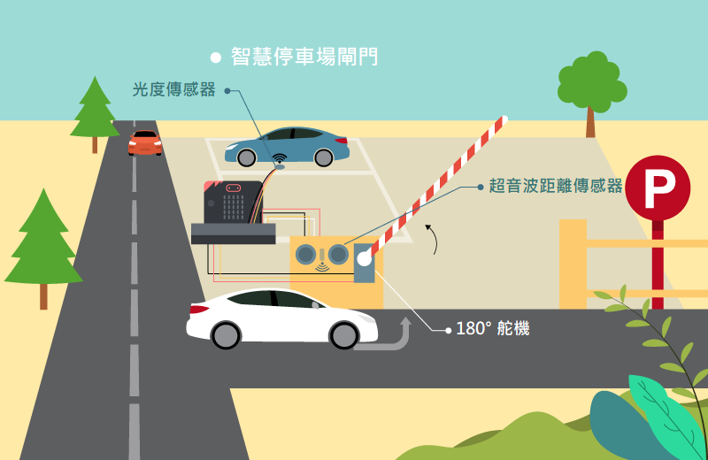
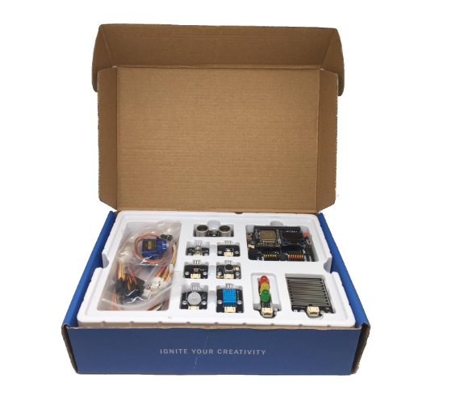

# 簡介

## 簡介
SMARTHON micro:bit 智慧城市IoT學習套裝是專門為了教授物聯網而設的套裝。透過學習基本的電腦編程及電子知識，你可以利用物聯網，建設一個獨一無二的智慧城市。套裝內提供的Smarthon IoT:bit 開發板，能夠使用各種傳感器及驅動器，令你能夠在設計中實現多種有趣的功能。例如，使用傳感器去偵測交通狀況然後上載到互聯網，令你能夠作出統計或是控制等。

 

 

## 應用場景
<H3>自動遊樂場燈</H3>

<H3>智慧停車場閘杆</H3>

如想知道更多應用場景,請參考說明書

## 零件列表

No. | 零件 |數量|備註
:-: | :-- | :--| :--
|Micro: bit|1|不包含
1|Smarthon IoT:bit|1|
2|雨水傳感器|1|
3|交通燈模組|1|
4|超音波距離傳感器|1|
5|白色LED|1|
6|彩色LED(WS2812)|1|
7|光度傳感器|1|
8|聲音傳感器|1|
9|運動傳感器|1|
10|溫濕度傳感器(DHT11)|1|
11|180° 舵機|1|
12|紙板及木板模型|1|
13|城市地圖|1|
14|模組連接線 |9|3腳\*8, 4腳\*1
15|延長線|8|3腳\*5, 4腳\*2, 舵機\*1
16|M2\*10毫米 螺絲|12|
17|M3\*10毫米 螺絲|6|
18|M4\*10毫米 螺絲|30|
19|M2 螺母|12|
20|M3 螺母|6|
21|M4 螺母|30|
22|萬字夾|3|
23|L型支架|2|
24|縲絲批|1|
25|沙紙|2|
26|萬用黏土膠 (Blu Tack)|1|
27|USB連接線|1|
28|電池盒(AA*4)|1|
29|智慧城市套裝使用手冊|1|

