# IoT:bit 介紹

## 介紹
Smarthon IoT:bit是一塊專為讓Micro:bit加入物聯網而設計的開發板，有了Iot:bit， Micro:bit除了能夠連接不同的傳感器，亦能透過Wi-Fi連上互聯網，成為物聯網中的一員。 

這提供了13個常規GVS插座，能夠讓使用者同時連接多個不同的傳感器以接收及傳送資料。對於一些比較特別的模組，例如超音波距離傳感器，馬達以及OLED顯示屏等，都留有額外的插座供它們使用。另外，不止能夠使用一些簡單的類比或是數位控制的模組，像一些需要使用I2C，SPI等協議的模組亦能夠透過Smarton IoT:Bit供Micro:bit使用。為了方便使用第一代Micro:bit的使用者，IoT:bit也內置了蜂鳴器讓Micro:bit能夠發出聲音。

IoT:bit是供Micro:bit使用Wi-Fi功能的強大擴展板，能夠有效幫助進行STEM項目。IoT:bit使用了最新款的ESP系列模組ESP32，其雙核心效能對比上一代的ESP8266有著明顯的提升，配合上記憶體的增加，能夠提供更加穩定的Wi-Fi功能。 IoT:bit除了支援Thingspeak及IFTTT等常用IoT平台服務，亦提供互聯網遙距控制功能，讓使用者能夠透過智能電話、Amazon 智能喇叭、Google 智能家居等裝置操控Micro:bit。而IoT:bit亦可以與其他IoT:bit進行溝通，經由Wi-Fi接上互聯網後，就能夠長距離地與其他Micro:bit進行資料交換，不像Micro:bit原來的無線電通訊有著短距離的限制。

## 產品功能

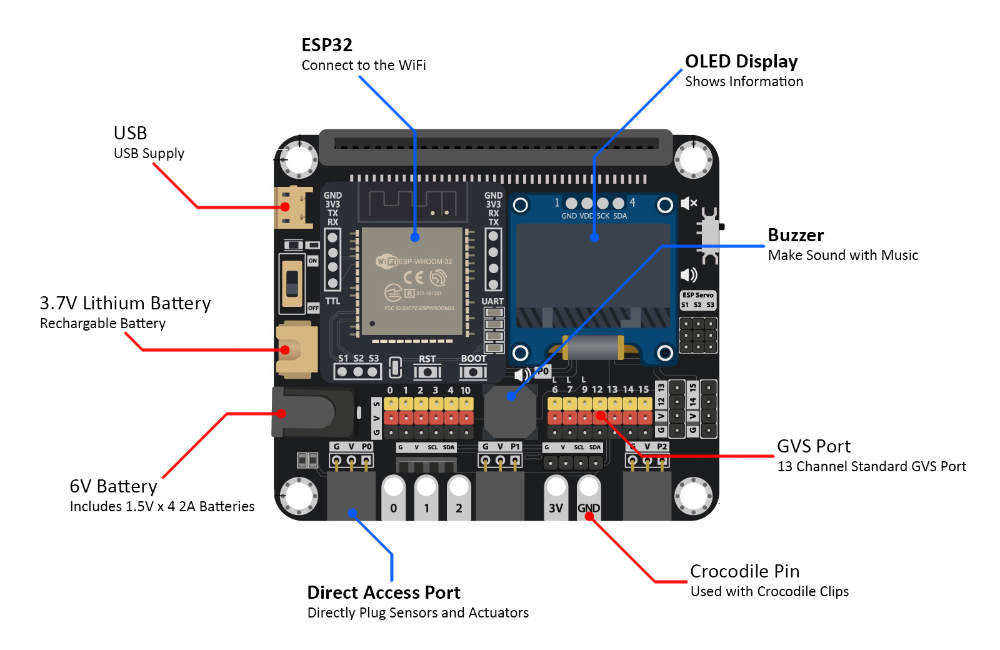

* 內置強大的IoT晶片ESP32
* 可換的無線模組(ESP8266,ES32,BLE)
* 內建OLED顯示屏及蜂鳴器
* 擁有共13個支持GPIO的GVS接口，2個支持I2C協議的接口
* 額外3個舵機接口(從ESP32模組) 
* 多種供電方式(USB / 3.7V鋰電池 / 1.5V AA電池 x4 )
* 多樣提供方便的接口:鱷魚夾觸點，快速接口，4針接口

## 硬件大小

產品大小: 75mm X 65mm X 20mm 
電路板厚度: 1.5mm 
開孔大小: 4mm 

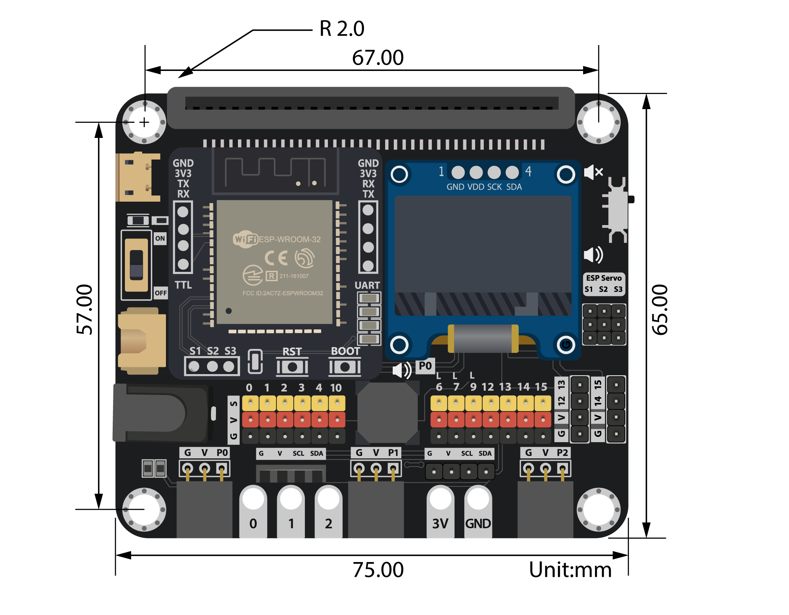

## 規格

||數值|備註|
|--|--|--|
|大小|75mm X 65mm X 20mm| 沒有包裝時|
|電源供應| USB:5V   18650鋰電池 :3.7~4.2V  AA電池*4 :6V |最大電流限制: 1A |
|操作溫度|0 到 80℃||
|蜂鳴器|被動式蜂鳴器(音樂)||
|無線模組|ESP8266 ESP32 藍芽|使用UART協議|
|OLED顯示屏模組|128*64解析度 OLED 顯示屏 SSD1306|使用I2C協議|
|Micro:bit引腳|13 I/O 引腳 (13 數位及類比輸出) (6 類比輸入)|<B>已被保留使用的引腳:</B> 無線模組:P8,P16 4針模組引腳:P12,P13|
|I2C 引腳|P19,P20|共3個可用的I2C接口, 其中1個專門供OLED顯示屏使用|
|ESP 引腳|3個舵機控制插座(S1,S2,S3)|由ESP晶片進行控制|

## 針腳資訊
<H3>針腳圖表:</H3> 
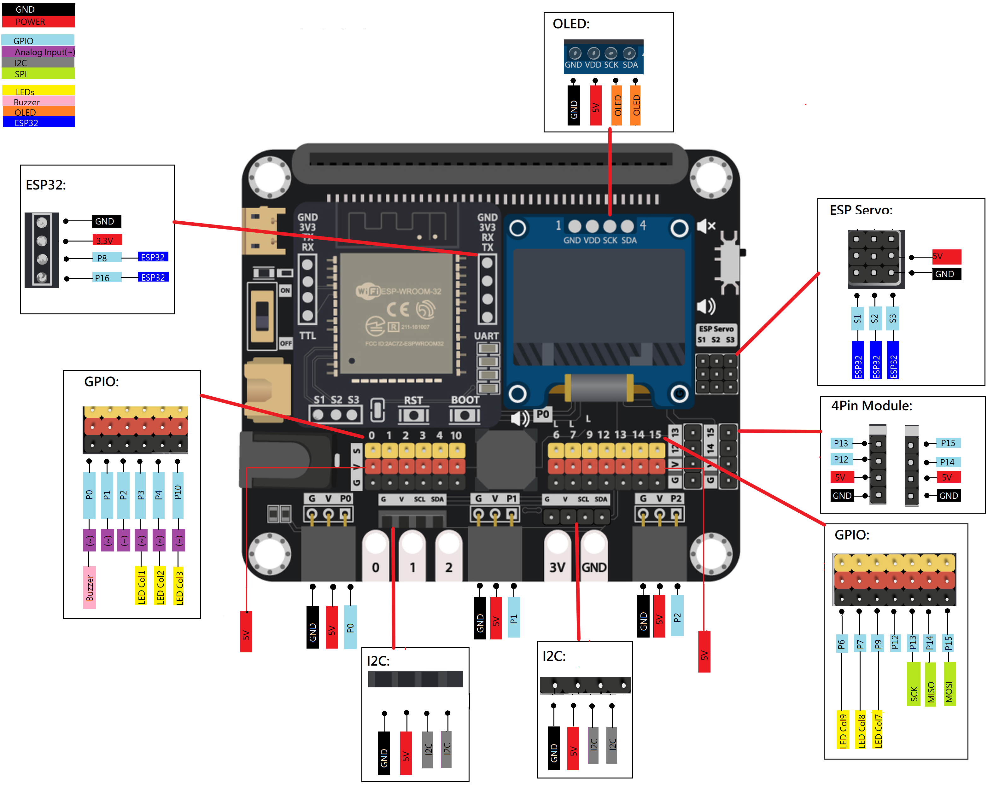

<H3>接口圖表:</H3> 
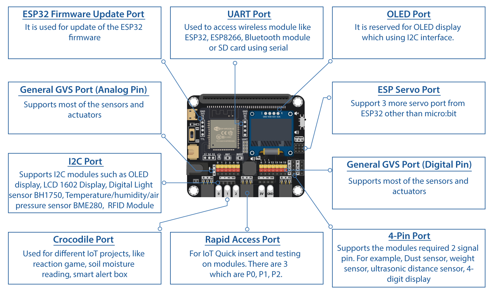

請使用新分頁開啟圖片而獲得更良好觀看體驗

<H3>針腳表</H3>

<table class="tg" style="undefined;table-layout: fixed; width: 599px">
<colgroup>
<col style="width: 98.008404px">
<col style="width: 80.008404px">
<col style="width: 85.004202px">
<col style="width: 101.004202px">
<col style="width: 235.004202px">
</colgroup>
<thead>
  <tr>
    <th class="tg-ux7d">類型</th>
    <th class="tg-ux7d"></th>
    <th class="tg-ux7d">Micro:bit</th>
    <th class="tg-ux7d">IoT:bit</th>
    <th class="tg-ux7d">額外接口</th>
  </tr>
</thead>
<tbody>
  <tr>
    <td class="tg-l89d" rowspan="6">類比</td>
    <td class="tg-l89d">P0</td>
    <td class="tg-l89d"></td>
    <td class="tg-l89d">蜂鳴器</td>
    <td class="tg-l89d">快速接口</td>
  </tr>
  <tr>
    <td class="tg-j1bp">P1</td>
    <td class="tg-j1bp"></td>
    <td class="tg-j1bp"></td>
    <td class="tg-j1bp">快速接口</td>
  </tr>
  <tr>
    <td class="tg-l89d">P2</td>
    <td class="tg-l89d"></td>
    <td class="tg-l89d"></td>
    <td class="tg-l89d">快速接口</td>
  </tr>
  <tr>
    <td class="tg-j1bp">P3</td>
    <td class="tg-j1bp">LED</td>
    <td class="tg-j1bp"></td>
    <td class="tg-j1bp"></td>
  </tr>
  <tr>
    <td class="tg-l89d">P4</td>
    <td class="tg-l89d">LED</td>
    <td class="tg-l89d"></td>
    <td class="tg-l89d"></td>
  </tr>
  <tr>
    <td class="tg-j1bp">P10</td>
    <td class="tg-j1bp">LED</td>
    <td class="tg-j1bp"></td>
    <td class="tg-j1bp"></td>
  </tr>
  <tr>
    <td class="tg-l89d" rowspan="6">數位</td>
    <td class="tg-l89d">P6</td>
    <td class="tg-l89d">LED</td>
    <td class="tg-l89d"></td>
    <td class="tg-l89d"></td>
  </tr>
  <tr>
    <td class="tg-j1bp">P9</td>
    <td class="tg-j1bp">LED</td>
    <td class="tg-j1bp"></td>
    <td class="tg-j1bp"></td>
  </tr>
  <tr>
    <td class="tg-l89d">P12</td>
    <td class="tg-l89d"></td>
    <td class="tg-l89d"></td>
    <td class="tg-l89d">4針接口</td>
  </tr>
  <tr>
    <td class="tg-j1bp">P13</td>
    <td class="tg-j1bp">SPI(SCK)</td>
    <td class="tg-j1bp"></td>
    <td class="tg-j1bp">4針接口</td>
  </tr>
  <tr>
    <td class="tg-l89d">P14</td>
    <td class="tg-l89d">SPI(MISO)</td>
    <td class="tg-l89d"></td>
    <td class="tg-l89d">4針接口</td>
  </tr>
  <tr>
    <td class="tg-j1bp">P15</td>
    <td class="tg-j1bp">SPI(MOSI)</td>
    <td class="tg-j1bp"></td>
    <td class="tg-j1bp">4針接口</td>
  </tr>
  <tr>
    <td class="tg-l89d" rowspan="2">序列埠</td>
    <td class="tg-l89d">P8</td>
    <td class="tg-l89d">UART(TX)</td>
    <td class="tg-l89d">ESP32(RX)</td>
    <td class="tg-l89d"></td>
  </tr>
  <tr>
    <td class="tg-j1bp">P16</td>
    <td class="tg-j1bp">UART(RX)</td>
    <td class="tg-j1bp">ESP32(TX)</td>
    <td class="tg-j1bp"></td>
  </tr>
  <tr>
    <td class="tg-l89d" rowspan="2">I2C</td>
    <td class="tg-l89d">P19</td>
    <td class="tg-l89d">I2C</td>
    <td class="tg-l89d">OLED(SCL)</td>
    <td class="tg-l89d"></td>
  </tr>
  <tr>
    <td class="tg-j1bp">P20</td>
    <td class="tg-j1bp">I2C</td>
    <td class="tg-j1bp">OLED(SDA)</td>
    <td class="tg-j1bp"></td>
  </tr>
  <tr>
    <td class="tg-l89d" rowspan="3">額外舵機</td>
    <td class="tg-l89d">S1</td>
    <td class="tg-l89d"></td>
    <td class="tg-l89d">ESP32(23)</td>
    <td class="tg-l89d"></td>
  </tr>
  <tr>
    <td class="tg-j1bp">S2</td>
    <td class="tg-j1bp"></td>
    <td class="tg-j1bp">ESP32(22)</td>
    <td class="tg-j1bp"></td>
  </tr>
  <tr>
    <td class="tg-l89d">S3</td>
    <td class="tg-l89d"></td>
    <td class="tg-l89d">ESP32(21)</td>
    <td class="tg-l89d"></td>
  </tr>
</tbody>
</table>

## 硬件介面

1. Micro:bit 邊緣連接器
2. USB接口
3. 電源開關
4. 3.7V 鋰電池接口[XH2.54] 
5. AA電池盒(1.5V AA電池x4)接口[DC 5.5mm] 
6. 快速GVS接口
7. 鱷魚夾觸點
8. I2C接口
9. 4針接口
10. ESP32舵機接口
11. 蜂鳴器開關
12. 4mm開孔位
13. OLED顯示屏(128x64像素)
14. ESP32無線Wi-Fi模組
15. 蜂鳴器
16. 通用GVS接口

## 詳細硬件介紹

<H3>Micro:bit 邊緣連接器</H3> 
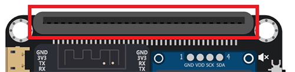

提供插座讓Micro:bit安裝到這擴展板上。需根據右方的圖案指示的方向安裝Micro:bit,方向不能夠反轉。

<H3>電源接口(USB, 鋰電池, DC接口)及電源開關</H3> 
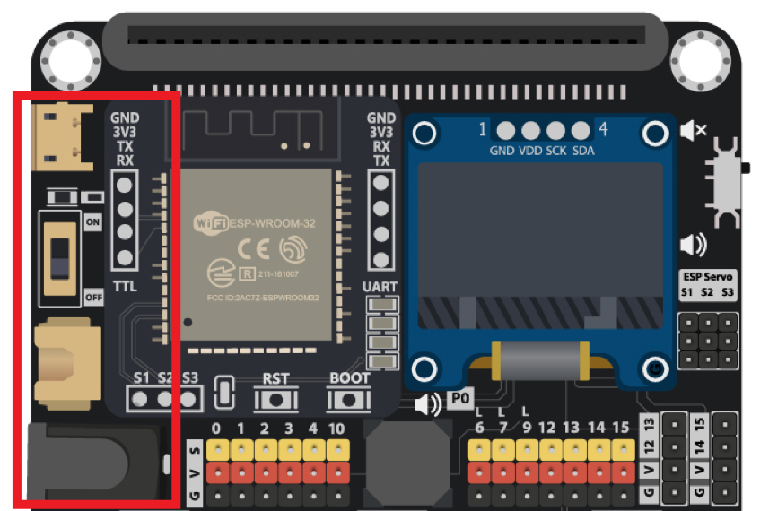

IoT:bit能採用三種不同的供電方式。使用者可以任意選擇[USB, 鋰電池, AA電]其中一種來對IoT:bit及Micro:bit供電。

<H3>無線Wi-Fi模組</H3> 
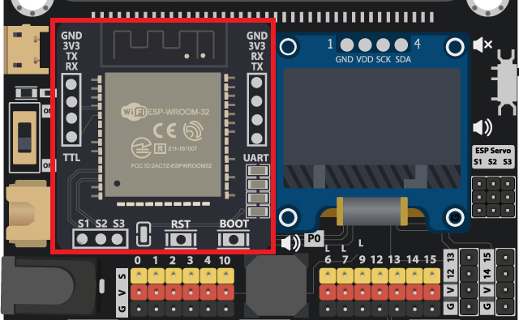

無線模組是整塊擴展板中的核心部份。這能夠安裝不同的無線模組，例如ESP32、 ESP8266、藍牙等等，讓使用者依照不同情況使用合適的模組，以配合不同的項目。

<H3>OLED顯示屏</H3>
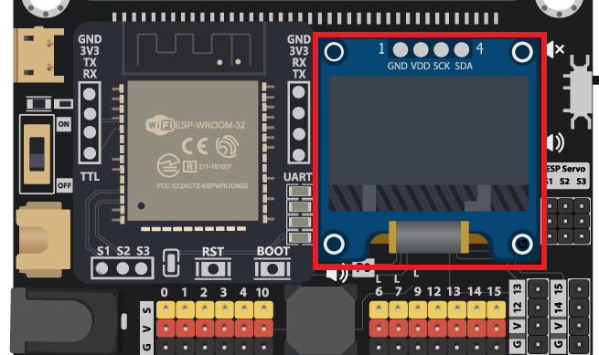

IoT:bit 擴展板已預留空間安裝SSD1306 0.96吋 OLED顯示屏。通過該位置的I2C接口，使用者能夠輕易控制並在顯示屏上輸出各種資料。

<H3>ESP舵機接口</H3> 
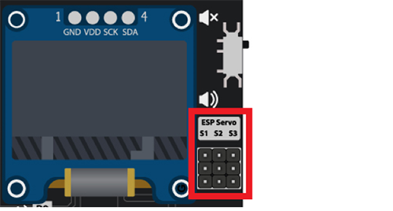

當使用ESP32無線模組時，可以提供額外3個舵機控制接口。適用於180度及360度的SG90/SG90S舵機。

<H3>蜂鳴器及開關</H3> 
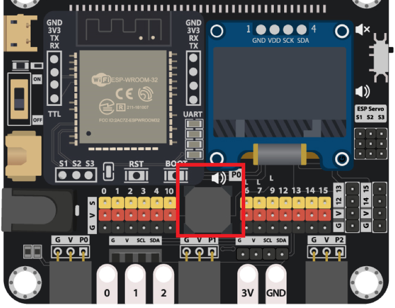

IoT:bit 內建了一個被動式蜂鳴器，能夠讓Micro:bit透過這蜂鳴器發出音樂。蜂鳴器線路連接Micro:bit的P0引腳，為了不干擾其他傳感器使用P0接口，提供了一個開關用以切換連接狀態。

<H3>Micro:bit GPIO接口</H3> 
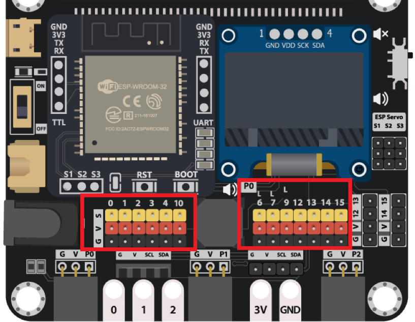

IoT:bit從Micro:bit中引出了一共13個I/O引腳，提供了良好的擴展性，讓使用者能同時使用大量的傳感器及驅動器。每一個引腳都提供了獨立GVS插座，方便進行連接。

<H3>4針接口</H3> 
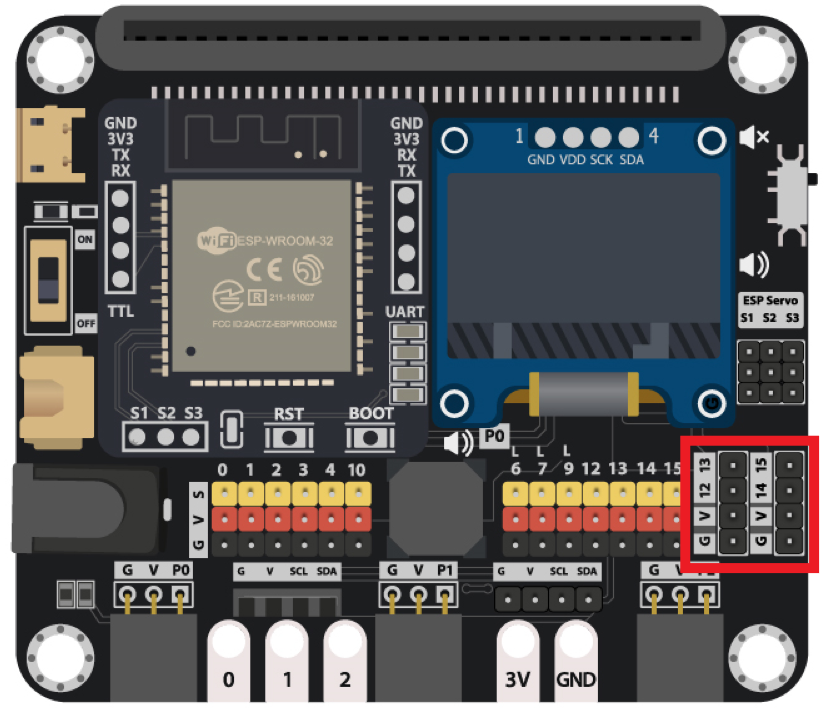

因有些模組運行時需要同時使用兩個I/O針腳，IoT:bit上保留有兩個接口供4針模組使用，例如超音波距離傳感器。故此，有4個I/O針腳是連接到這4針接口的，分別是P12、P13、P14、P15。

<H3>I2C接口</H3> 
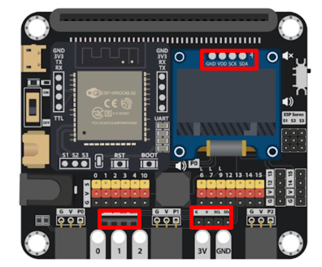

Micro:bit能夠支援I2C通訊協議,因此IoT:bit上提供了共3個I2C接口(其中1個用於連接OLED顯示屏),方便同時連接不同的傳感器。

<H3>快速接口</H3> 
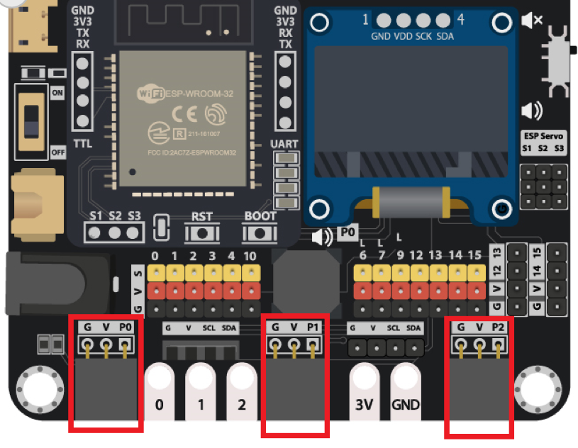

部分傳感器提供GVS快速插口，能夠免除連接線直接插入IoT:bit的快速接口，除了更加方便外，亦能簡化組裝後的複雜度。

<H3>鱷魚夾觸點</H3> 

對於需要使用鱷魚夾進行簡單項目連接的使用者，IoT:bit提供了5個接口，分別為3V、接地、P0、P1及P2。

## 軟件支援

<H3>MakeCode編程器</H3>

MakeCode編程器是由BBC Micro:bit官方所推出的多平台編程工具，能夠在多個不同平台例如網頁瀏覽器、電話、平板電腦等使用。其充滿色彩及簡單易用的積木程式設計，能夠讓熟悉Scratch等初學者更快上手，即使是從未接觸編程的初學者，亦能輕鬆地用這學習及進行編程課程。 
除了直觀的積木設計外，亦提供傳統編程所使用的文字模式，能夠使用Javascript或Typescript等程式語言。 
[MakeCode](https://makecode.microbit.org/#editor)

<H3>Python編程器</H3>

Python是其中一種最受歡迎的程式語言，無論在學習或是商業應用，都能夠廣泛地發現它的存在。Micro:bit 提供了一個Python編程器，令使用者可以把python程式透過Micro:bit執行。只需要利用USB連接線把Micro:bit連接上電腦，就可以輕鬆把程式上傳到Micro:bit上。  
[Python editor](https://python.microbit.org/v/2.0)

## 快速入門

<H4>1.把已經上載好程式的Micro:bit插入在連接器上</H4>

>

<H4>連接電源及開啟</H4>

方法一:

>利用USB連接線接上電源後打開電源開關

>

方法二:

>把4粒AA電池(1.5V)放進電池盒後，把電池盒插頭插入DC接口，然後打開電源開關

>

方法三:

>把18650鋰電池放進電池盒後，把電池盒插頭插入XH2.54鋰電池接口，然後打開電源開關

>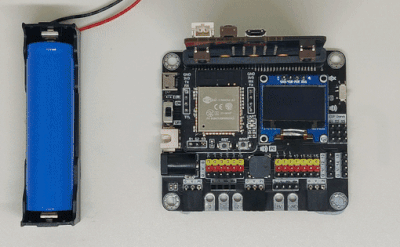

>\*本套裝內不包含18650電池及18650電池盒

## 完整操作

1. Micro:bit 單獨連接到電腦,下載程式 (不要安裝在IoT:bit上)
2. 下載完成後,拔除USB線
3. 安裝Micro:bit到IoT:bit上
4. IoT:bit接上電源線後,打開開關