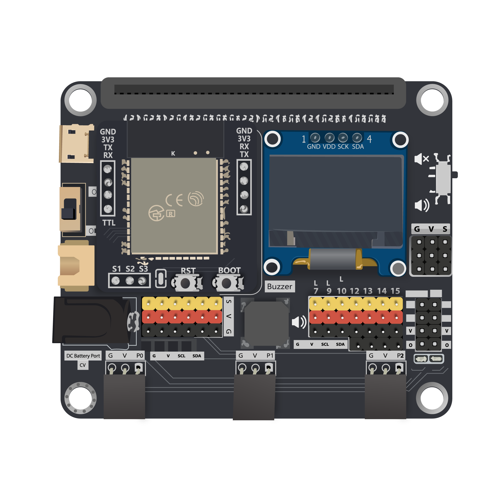
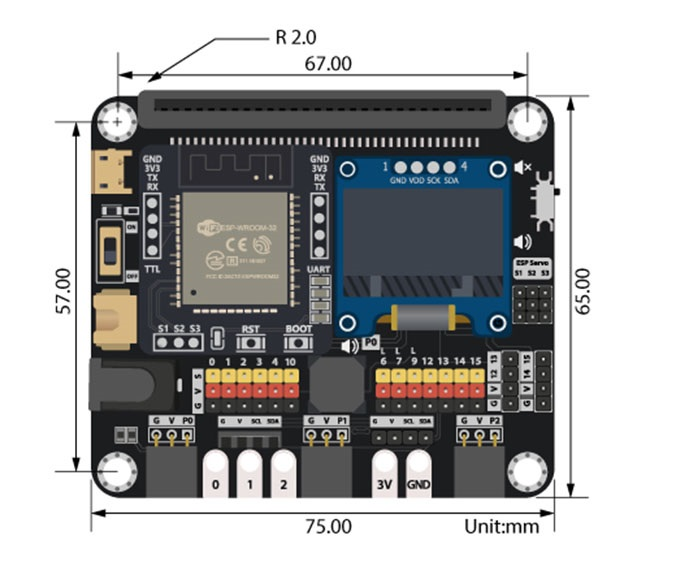

# IoT:bit Introduction

## Introduction
Smarthon IoT Bit is an IoT orientated expansion board for Micro:bit. With the help of this, Micro:bit able to connect to different sensors or actuators without welding and start to use the internet services. 

It provides 13 regular GVS socket, allow user to connect batch of sensors at the same time to receive group of data. For some special purpose sensors/actuator, such distance sensor, motor and OLED display, an independent socket are offered, so not only the digital and analog I/O device can use in project, but also I2C device become an option to the Micro:bit from now on. Last but not least, a buzzer is built-in on the board to provide sound generation.

Several of wireless modules are compatible with the Smarthon IoT Bit, such Bluetooth and Wi-Fi modules. Beside of the commonly used Wi-Fi module ESP8266, the advanced version ESP32 is available to use on the IoT Bit too. After connect to internet, user able to enjoy the abundant internet resource to create the IoT project.

## Feature 

* Exchangeable wireless modular design (ESP8266, ESP32, BLE)
* Extended I/O pin from Mirco:bit with GVS socket
* Independent socket for OLED screen,I2C and 4-pin Modules(Distance sensor/Motor/etc)
* Separate Servo pin from ESP module
* On board Buzzer with on/off switch
* Various types of power supply (USB, XH2.54 battery port, DC jack) 
* Crocodile Port for crocodile clip

## Hardware Size

Product size: 75mm X 65mm X 20mm 
PCB thinkness: 1.5mm 
Hole diameter: 4mm 

## Specification

|Item|Parameters|Remarks|
|--|--|--|
|Size|75mm X 65mm X 20mm| Without Packing|
|Power supply| USB:5V 0.5A   XH2.54 Battery port:3.7~6V 1A  DC 5.5mm:3.7~6V 1A|Maximun current limit  of whole board: 1A |
|Operation Temperature|-25 to 80℃||
|Buzzer|Passive Buzzer(Musical)||
|Wireless Module|ESP8266 ESP32 Bluetooth|Operate under UART protocol|
|OLED Module|128*64 resolution OLED  Screen SSD1306|Operate under I2C protocol|
|Mirco:bit lead out|13 I/O Pins (13 Digital & AnalogOut Pins) (6 AnalogIn Pins)|<B>Reserved Pins:</B> Wireless module:P8,P16 Distance Sensor:P14,P15 Motor:P12,P13|
|I2C Pins|P19,P20|3 available ports, 1 port reserved for OLED|
|ESP lead out|3 Pins for servo control(S1,S2,S3)|Control by ESP chip|
|Net weight|||

## Pinout Information
<H3>Pinout Diagram:</H3> 

<H3>Port Diagram:</H3> 

| |Mirco:bit || IoT:bit | Extra Port ||
--|--|--|--|--|--|
|P0||~|Buzzer|Crocodile Pin|Quick Access Port|
|P1||~||Crocodile Pin|Quick Access Port|
|P2||~||Crocodile Pin|Quick Access Port|
|P3|LED|~||||
|P4|LED|~||||
|P5|LED|||||
|P6|LED|||||
|P7|LED|||||
|P8|UART (TX)||ESP32(RX)|||
|P9|LED|||||
|P10|LED|~||||
|P12||||4Pin Module||
|P13|SPI (SCK)|||4Pin Module||
|P14|SPI (MISO)|||4Pin Module||
|P15|SPI (MOSI)|||4Pin Module||
|P16|UART (RX)||ESP32 (TX)|||
|P19|I2C(SCL)||OLED|||
|P20|I2C(SDA)||OLED|||

Please open the image in the new tab for full size

## Detail Hardware Description

<H3>Mirco:bit edge connecter</H3> 

Provide the socket for the Micro:bit to install. Follow the instruction icon right about that to install the Micro:bit to the expansion board.

<H3>Power port(USB, Battery, DC) & Switch</H3> 

Provide three different type of methods to power on the expansion board and Mirco:bit. User can either choose common 5V USB power, or two different port which connect to 3.7V ~ 6V battery box. 

<H3>OLED Module</H3>

The expansion board have the reserved space to place a SSD1306 0.96 inch OLED screen. User can use the I2C connection port to output the visual element on that module.

<H3>Wireless Module</H3> 

The Wireless Module provide the Core function of the expansion board. Though different modules install on the socket, Mirco:bit gain the correspond connectivity ability. User may install ESP32, ESP8266, Bluetooth to implement various application project, make use of the IoT resource.

<H3>ESP Servo port</H3> 

When installed the ESP32 module, it provide extra 3 servo control port to connect the Servo motor. Compatible with general GVS 180/360 Servo motor (SG90/SG90S)

<H3>Micro:bit lead out Pins</H3> 

The Lead Out from the Mirco:bit I/O pins, provide great expansion feature for the Mirco:bit , user can connect up to 13 different sensor/actuator at the same time. Each independent GVS socket make the connection become more connivance. 

<H3>Buzzer & Switch</H3> 

The IoT Bit built-in a Passive Buzzer on the board, which connected to P0. Using the program can generate different tone of sound. With the switch, it can have manual control to the audio.

<H3>QuickAccess GVS connecter</H3> 

To some GVS sensor which provide the Quick Insert Pin, it can use on the QuickAccess GVS connecter. It do not need to use the cable to connect the sensor, simplify the product in the application.

<H3>4 Pins Module port</H3> 

On the IoT Bit, two ports are reserved for the 4 Pins Module. Each port can connect to some sensors or actuators which required use two I/O Pins at the same time, such Distance Sesnor and Motor. In total, there are 4 I/O Pins being used, they are P12, P13, P14, P15 respectively.

## Software Support

<H3>MakeCode editor</H3>

The MakeCode editor is the official cross-platform editor designed for BBC Mirco:bit, it is available on Web Browser, Mobile and tablets Apps. The Colorful coding block is familiar to who previously used Scratch, providing a simple and clear way to programming on the Micro:bit.

The editor offer a text-based mode for user to programming using JavaScript rather than drag the blocks 
[MakeCode](https://makecode.microbit.org/#editor)

<H3>Python editor</H3>

Python is one of the most famous programming language, widely used in school and industry. Micro:bit provided an online python editor for user to study and exercise python on Micro:bit. User just need to connect Mirco:bit with USB and click the Flash button, the compile and upload progress will be finish automatically.  
[Python editor](https://python.microbit.org/v/2.0)

