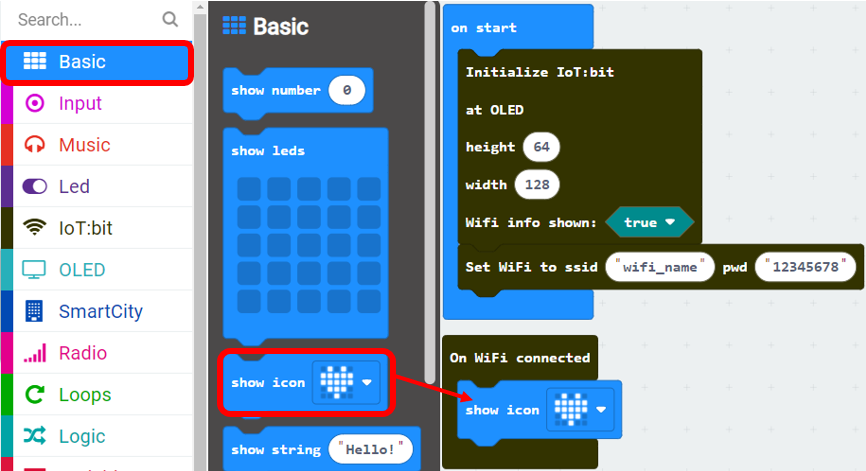

# First step: Connect the micro:bit to the Wi-Fi

Connecting Wi-Fi is the very first step to access internet services, including ThingSpeak, IFTTT, email, etc. Before you start, make sure your micro:bit device is connected to the Internet. 

## Open the Home Router or Mobile Phone Hotspot

Please sure there is a Wi-Fi signal (with 2.4GHz) available in your area.  

You can either setup a home router or a Wi-Fi hotspot from your mobile phone. 

a) Setup your home/office Wi-Fi 

b) Setup your mobile phone Hotspot  

* make sure your phone has internet service. 

For android: 

For iPhone: 

## Programming (Makecode)

Step 1: Initialize the IoT:bit 

Before you start, you need to initialize the IoT:bit, go to IoT:bit tab. 

* Snap “Initialize IoT:bit at OLED height: 64, width:128 Wifi info shown: true” to “on start”

Step 2: Connect to the Wi-Fi 

After initializing, you can connect to the Wi-Fi 

* Snap “Set Wi-Fi to ssid pwd” to “on start”
* Enter your Wi-Fi name and password. Here we set “wifi_name” as SSID and “12345678” as password.

Step 3: Show the Heart if it is connected 

On WiFi connected” is an event handler. It will be triggered once after connected with WiFi. 

* Snap “On WiFi connected” to the stage
* On “Basic” tab, snap “show icon heart inside “On WiFi connected”

## Result

Step 1 

Load the program to the micro:bit and turn on the IoT:bit by using USB 
.

Step 2 

Wi-Fi IoT:bit will start to connect to internet, when the connection is successful, the IP Address would be shown. AND the heart icon will be shown. 

