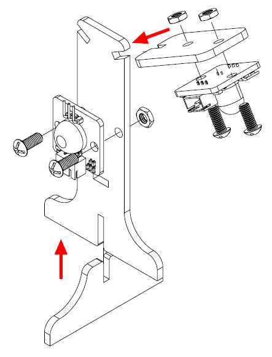
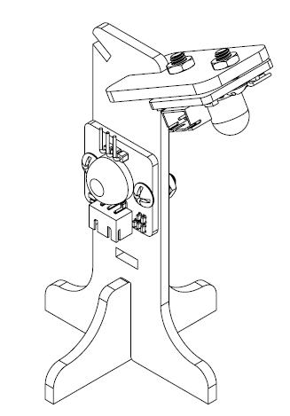
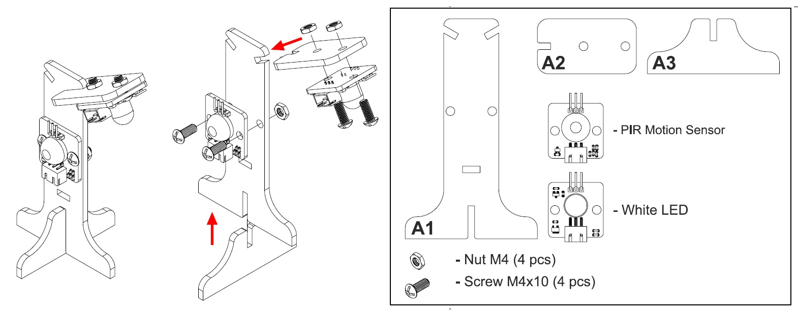
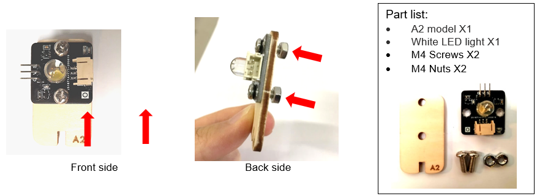

# Case 01: Automated Smart Playground Lamp

Level: 

## Goal

Make a smart playground lamp by detecting the motion nearby.

## Background

What is smart playground lamp?

Smart playground lamp is a lamp which can open automatically when someone passes by. Installing an
auto-light can help the earth save electricity. When no one passes by, the light will automatically turn off.

Smart playground lamp operation

Motion sensor should be able to detect if there are people moving in the playground. 
If there are people moving in the playground, the LED light should turn on, vice versa. 

## Part List: 

<table><tr><td>
Electronics:
<ul display='inline-block'>
<li>micro:bit X1</li>
<li>Smarthon IoT:bit X1</li>
<li>USB Wire/Battery Holder X1</li>
&nbsp;&nbsp;1. White LED Light X1(With 3-pin module wire) 
&nbsp;&nbsp;2. Motion Sensor X1 (With 3-pin module wire)
</ul>
</td></tr>
<tr>
<td>Model:
<ul>
<li>Playground Lamp Cardboard Model A1-A3 X1</li>
<li>M4 Screw X2</li>
<li>M4 Nuts X2</li>
</ul>
</td></tr>
<tr><td>Equipment:
<ul><li>ScrewDriver X1</li></ul></td></tr></table>

## Practical Operation 1

Assembly Instructions Document 

Automated Smart Playground Lamp: [Download](https://raw.githubusercontent.com/SMARTHON/smarthon-docs-en/master/docs/smartcity/files/Case1e.jpg)

Assembly Instructions (Model A1-A3) 

Part list: 

Steps:  
1. Attach motion sensor to A1 model with M4 screws and nuts. 

2. Attach the white LED light to A2 model with M4 screws and nuts. 

3. Assembly complete! 

## Practical Operation 2

Steps 

1. Attach motion sensor to A1 model with M4 screws and nuts. 

2. Attach the white LED light to A2 model with M4 screws and nuts. 

3. Put together all the cardboard parts (A1-A3) 

## Practical Operation 3

Step 1 

Attach motion sensor to A1 model with M4 screws and nuts. 

Step 2 

Attach the white LED light to A2 model with M4 screws and nuts. 

Step 3 

Put together all the cardboard parts (A1-A3) 

## Hardware connect

Connect Motion sensor to the P0 port of Smarthon IoT:bit 

Connect LED light to the P1 port of Smarthon IoT:bit 

 

## Programming (MakeCode)

Step 1 

Drag forever block from Basic. Snap if statement into forever, set get motion (triggered or not) at P0=true, that's say motion is triggered, someone passes by. 

Step 2 

Turn white LED to 1023 at P1 as turning on white LED and pause 10 seconds.

Step 3 

Else, turn white LED to 0 at P1 as turing off white LED.

Full Solution 

MakeCode: [https://makecode.microbit.org/_P36fA38jVih2](https://makecode.microbit.org/#pub:_P36fA38jVih2) 

You could also download the program from the following website: 
<iframe src="https://makecode.microbit.org/#pub:_P36fA38jVih2" width="100%" height="500" frameborder="0"></iframe>

## Result

Motion sensor is used to detect if there are people moving in the playground. If there are, the LED light will be turned on; otherwise, it will be turned off. 

## Think

 

Q1. How can you use motion sensors, other than turning  on the light automatically? 

Q2. How should we reset the programming if we connect the white LED light to P3? 

Tips: As P3 is used by micro:bit LED. 
(Refer to [https://makecode.microbit.org/device/pins](https://makecode.microbit.org/device/pins)) 
If we connect white LED light to P3, we need to disable micrbo:bit LED. 

	
Q3. Show motion sensor value on OLED

